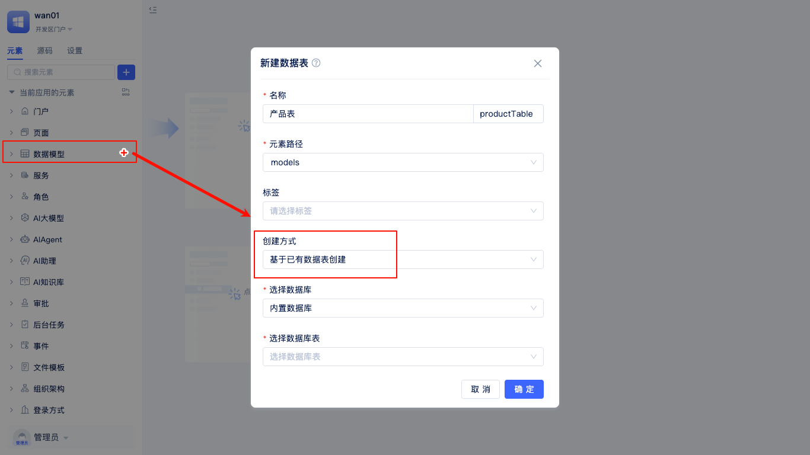
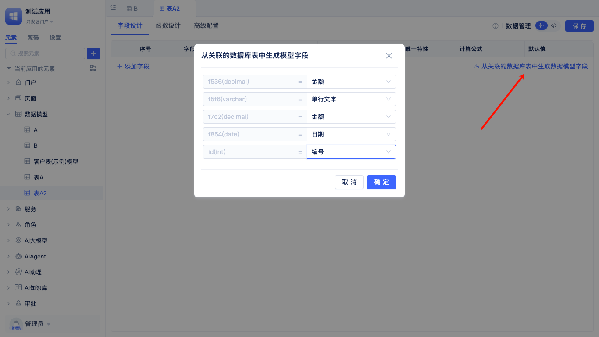

# 从已有数据表中创建数据表

适用于数据库中已有数据表，需要在JitAi应用中快速创建对应模型的场景。

开发者在`新建模型`弹窗中填写模型名称，创建方式选择`基于已有表创建模型`，选择已有数据库，数据库默认为内置数据库。

点击`选择数据库表`的输入框即可弹出该数据库所有表。

选择一个数据库表后，点击`确定`，进入到字段配置页面，点击`从关联的数据库表中生成数据模型字段`，然后将数据库字段映射成对应数据类型。
