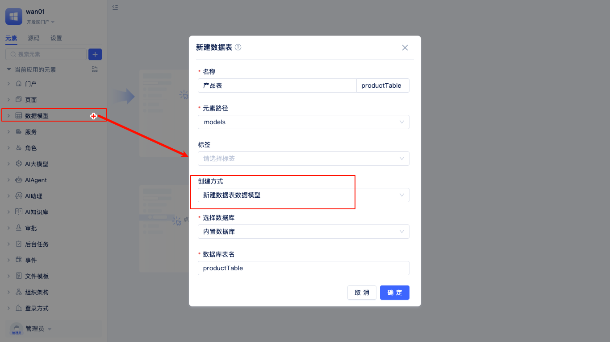
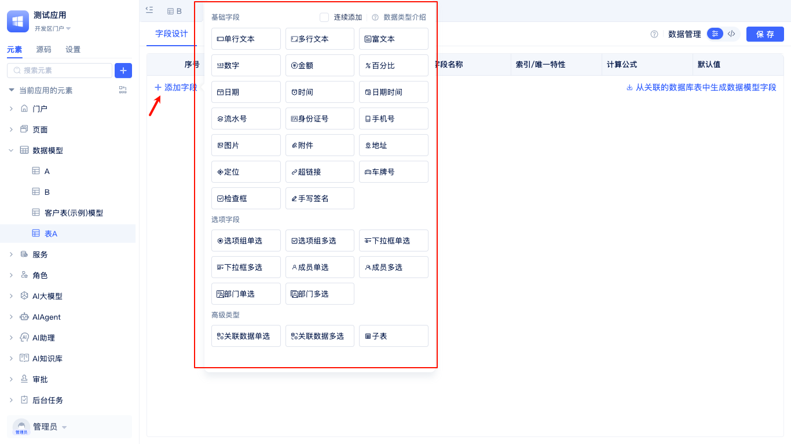
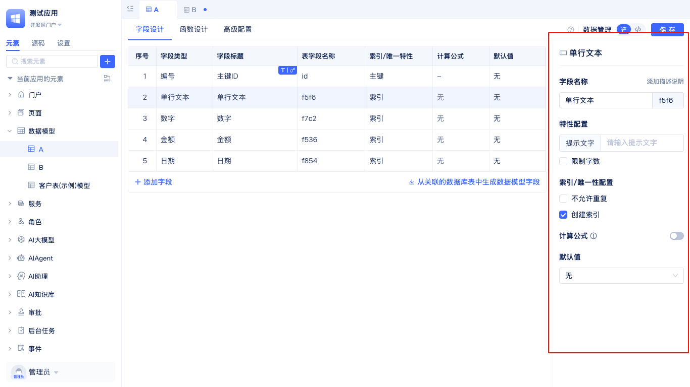
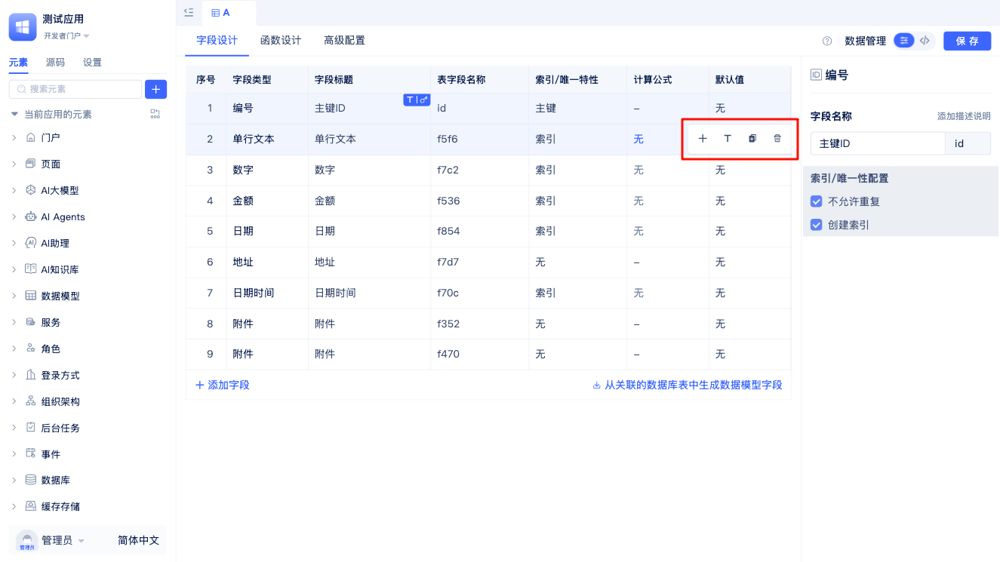
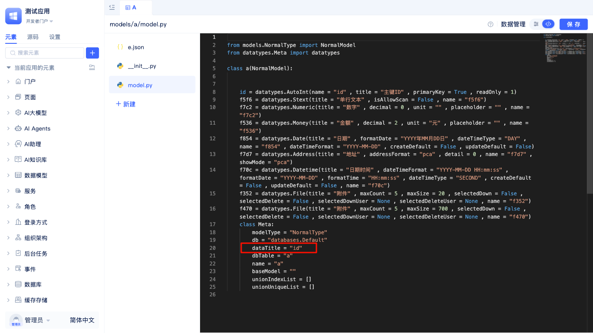
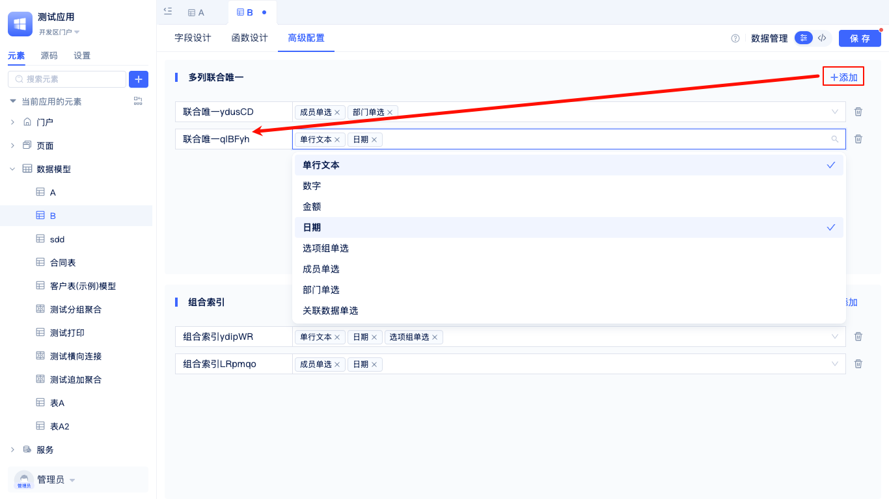
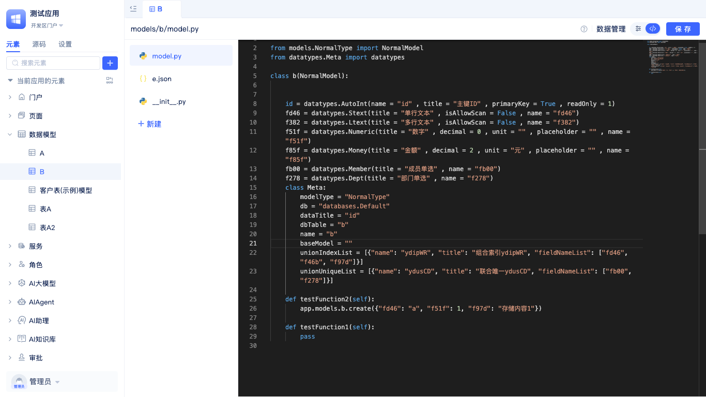

# 创建数据表
数据表模型是JitAI应用的数据基础，一个数据表模型就对应着数据库里面的一张表，用于定义业务数据的结构、类型和约束规则。在JitAI中，你可以通过两种方式创建数据表模型：一是全新创建数据表模型，适用于从零设计业务数据结构的场景；二是基于已有数据库表快速生成模型，便于对现有数据表进行管理和扩展。

## 数据表创建入口 {#data-table-create-entry}

在开发区的元素树中找到`数据模型`，点击右侧的 `+`，选择`数据表`，即可弹出`新建模型`弹窗。

开发者在`新建模型`弹窗中填写模型名称，创建方式选择`新建数据表数据模型`，数据库和数据表名会自动生成，也可以选择已有数据库元素，编辑数据库表名。

:::tip 
基于已有表创建模型参考 [从已有数据表中创建数据表元素](./create-data-table-from-existing-tables.md)
:::
 

## 设计表字段与数据类型 {#design-table-fields-and-data-types}
JitAI应用中有`单行文本`、`多行文本`、`富文本`、`数字`、`金额`等多种数据类型可以用作数据库表字段。

在创建数据表时，应根据具体业务需求选择合适的字段类型。

每种数据类型都有各自的配置选项，以**单行文本**为例：

单行文本数据类型应用广泛，是数据建模中最基础、最常用的字段类型之一。主要特点包括：仅支持单行文本内容且不允许换行，系统会自动生成字段名称（如 `f5f6`）方便数据库操作，默认最大可存储255个字符。该类型字段支持多种个性化设置和约束条件，可以设置提示文字，限制最大文本长度，还可通过唯一性控制确保字段值不重复，并支持创建数据库索引以优化查询性能。此外，单行文本字段还支持设置计算公式实现动态计算，以及预设默认值等高级功能，满足不同业务场景下的灵活需求。

单行文本字段适用于存储如下类型的数据：姓名、用户名、标题、简短描述及其他不需要换行的简短文本信息。

## 字段操作按钮 {#field-operation-buttons}

在数据表字段配置界面中，当鼠标移动到某个字段行时，该字段右侧会显示一组快捷操作按钮，方便开发者快速管理字段。

这些操作按钮包括：

- **添加字段** (`+`) - 在当前字段的下方快速添加新字段
- **设置数据标题** (`T`) - 将当前字段设置为该数据表的数据标题字段
- **复制字段** - 创建当前字段的副本，包括字段类型和配置信息
- **删除字段** - 删除当前字段（系统会提示确认，避免误删）

:::note 注意
只有符合条件的字段类型才能设置为数据标题，详见下方的"设置数据标题"章节。
:::

### 设置数据标题 {#set-data-title}

在数据模型中,将字段设置为数据标题可以让数据行在界面上更具可读性和辨识度。数据标题字段的值会作为数据记录的主要显示信息,帮助用户快速识别和区分不同的数据行。系统支持将以下字段类型设置为数据标题:
- **单行文本（Single-line Text）** - 适合存储名称、标题等简短文本信息
- **多行文本（Multi-line Text）** - 适合存储较长的描述性内容
- **流水号（Serial Number）** - 系统自动生成的唯一编号
- **身份证（ID Number）** - 标准的身份证号码格式
- **手机号（Phone Number）** - 手机号码信息
- **车牌号（License Plate Number）** - 车牌号码信息
- **单选（Single Choice）** - 单选选项的文本内容
- **下拉单选（Single Select）** - 下拉选择的文本内容

通常建议使用具有唯一性和描述性的字段作为数据标题,例如名称、标题、编号等字段,这些字段的值具备较好的可读性,能够直观地描述数据行的内容。

在数据模型设计时,可以通过界面操作或代码方式将某个字段设置为数据标题。也可通过全代码调整,在模型定义Meta中指定 `dataTitle` 属性来设置数据标题字段。

:::tip 提示
每个数据表模型只能设置一个字段作为数据标题。如果您需要组合多个字段来表示数据标题,可以考虑使用计算字段来实现。
:::

## 配置表索引优化查询 {#configure-table-index-optimization}
在高级配置中，可以为数据表添加`多列联合唯一`和`组合索引`来优化查询性能和保证数据完整性。

### 多列联合唯一约束 {#multi-column-composite-unique}
通过选择多个字段创建联合唯一约束，确保这些字段的组合值在整个表中唯一。例如，可以将`产品名称`和`规格`字段设置为联合唯一，防止相同规格的产品出现重复。

### 组合索引 {#composite-index}
选择多个字段创建组合索引，根据这些字段同时筛选可显著提升查询性能。

:::warning 警告
合理配置索引能有效提升查询速度，但过多的索引会影响数据写入性能，需要根据实际业务场景平衡。
:::

## 源码模式  {#source-code-mode}
除了可视化配置外，还支持在代码模式下直接修改模型源码，为高级开发者提供更大的灵活性。

切换到源码模式下，可以看到模型定义，模型函数等整个模型的源代码。
