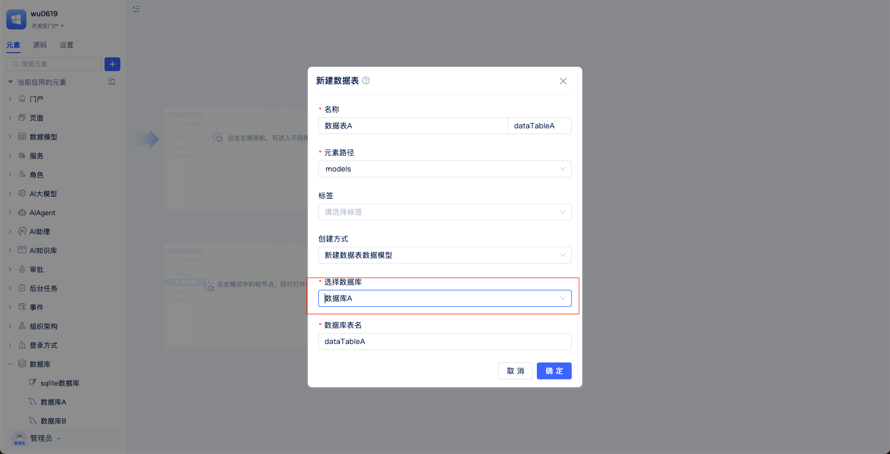
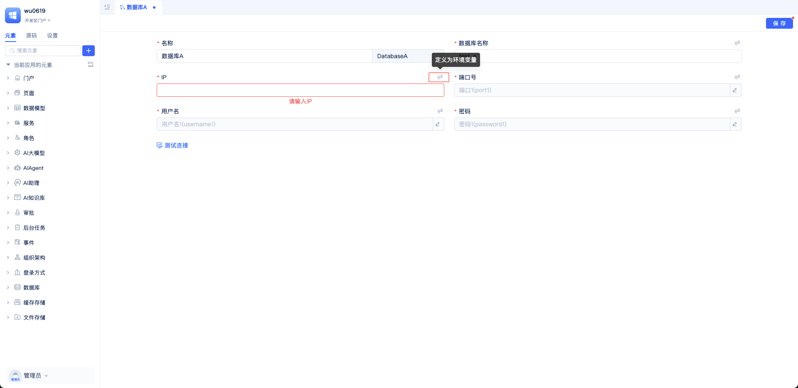
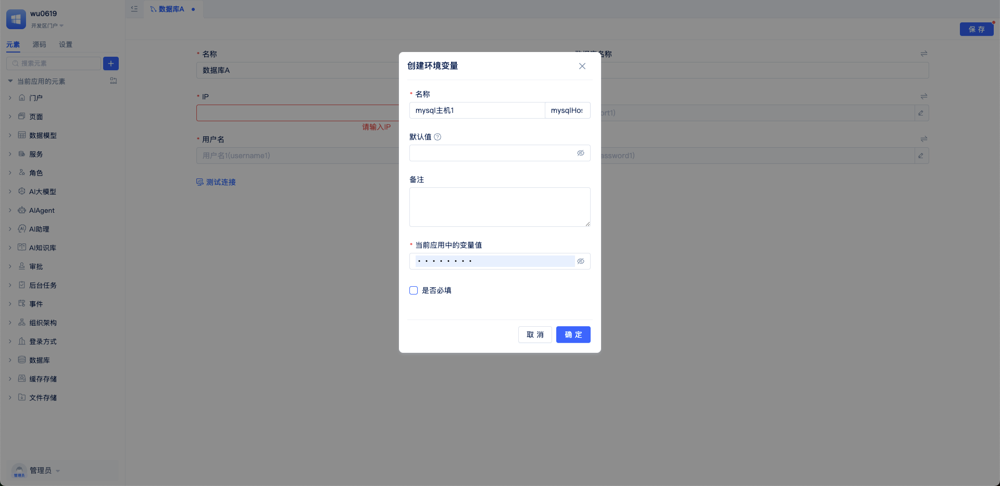
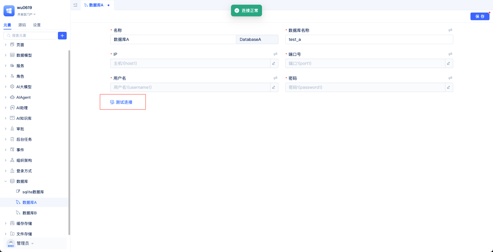

# 管理数据库连接
在极态云中，数据库通过“数据库”元素统一管理。你可以在同一应用里创建多个数据库实例，并且分别配置、切换和使用，满足开发、测试、生产或多系统对接等不同场景。

## 创建数据库连接 {#create-database-connection}
在目标应用打开“开发者门户”，打开左侧“元素目录树”面板，选择“数据库”元素。接着选择要接入的数据库（如 MySQL、PostgreSQL、Oracle、SQL Server、达梦、SQLite 等），系统会弹出连接配置窗口，你只需要把主机、端口、库名、账号、密码等信息按提示填写完整即可。生产环境建议把账号和密码等敏感信息放到环境变量里，部署时再注入，既安全也方便跨环境迁移，参考：[数据库连接安全配置](#database-connection-security-configuration)。

下面以创建mysql数据库为例，演示操作步骤：

## 多数据库连接管理 {#multi-database-connection-management}
一个应用支持同时接入多个数据库实例，这在“归档库”“日志库”“报表库”或者“对接外部系统”的场景里很常见。创建好不同的数据库元素后，你可以在数据模型里指定要使用的那个实例。

在新建数据表参数面板中的“选择数据库”选择数据库元素。

## 数据库连接安全配置 {#database-connection-security-configuration}
连接信息不要直接写进源码仓库，尤其是账号和密码。更推荐的方式是，在运行环境里维护环境变量，然后在部署时注入到应用中。

点击连接参数右上方切换图标按钮，切换为环境变量，弹出环境变量配置面板。在环境配置面板中“名称”为显示名、“默认值”在未设置值时使用、“备注”为当前变量描述、"当前应用中的变量值"是该变量的初始值，以便在开发过程中能正常连接数据库、“是否必填”被勾选时，则应用部署时必须先设置环境变量值，否则无法访问。

数据库侧也尽量使用“最小权限原则”，只给到需要的库、表和操作权限。生产与测试严格分离，并优先使用内网或 VPC 专线进行访问，避免对公网暴露服务端口。

## 连接测试与故障排查 {#connection-test-and-troubleshooting}
创建数据库元素后，确保连接可用。

在数据库元素配置页面，点击`测试连接`按钮。如果连接失败排查，主机和端口是否正确、防火墙和白名单是否放行、账号密码是否匹配、目标库是否存在。偶发超时或连接不稳定，通常与网络质量或数据库负载有关，可以适当调小或调大连接池相关参数来观察。

