# 创建文件模板
文件模板是一种文档生成工具，通过预设变量实现动态内容填充，可用于动态生成销售合同、生产工单、发票单据。
JitAI支持Word模板和Excel模板。

## Word模板 {#word-template}
采销人员为不同客户准备合同时，合同格式固定但客户信息和订单内容不同。通过Word模板设置客户姓名、产品名称、数量、金额等变量，快速生成个性化合同文档。

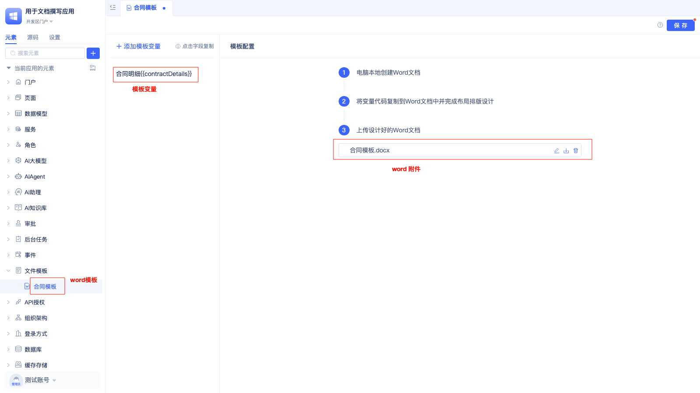
 
创建好的Word模板包括以下2个组成部分：
1. 模板变量，在变量中设定变量名称，[数据类型](../../reference/framework/JitORM/data-types)和[数据表模型](../data-modeling/data-table-model)。
2. Word文档，在Word文档中使用模板变量，在调用打印服务时，根据Word文档中的模板变量名称进行数据替换。

本文档中使用的原始数据：

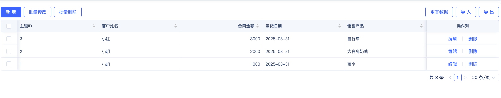

配置好模板变量的Word文档：

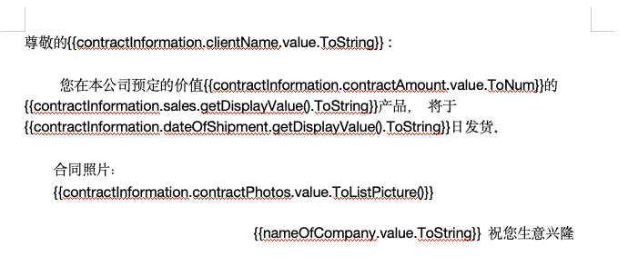

打印效果展示：

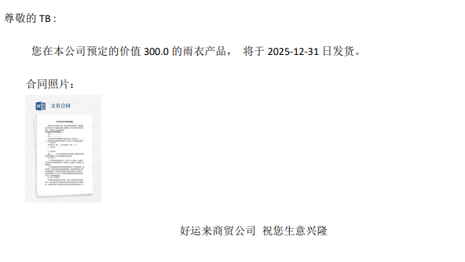

### 创建Word模板 {#create-word-template}
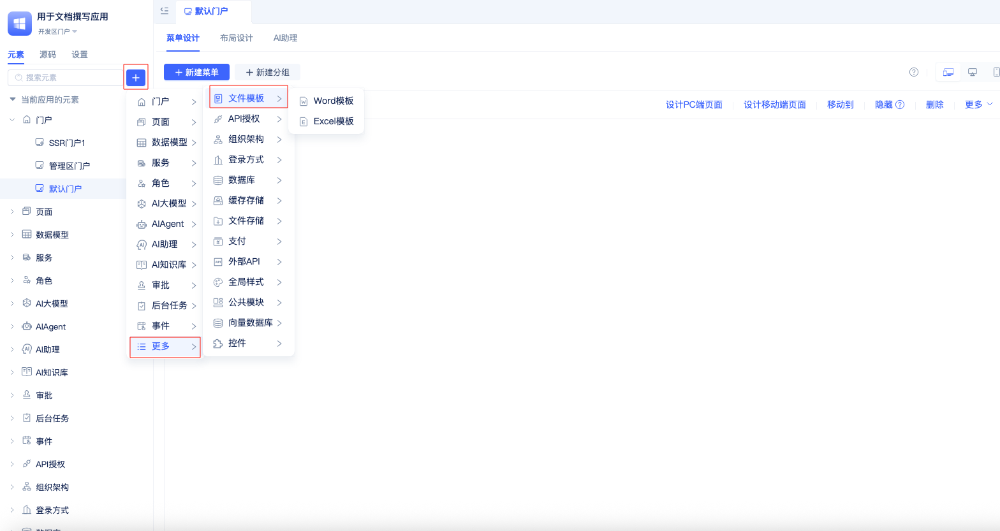

鼠标放到`+`按钮上，在“更多”选项，“文件模板”子选项中选中Word模板。

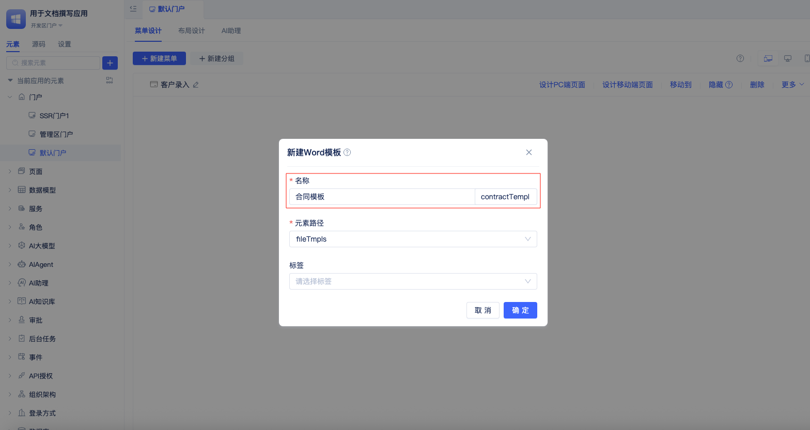

在新建Word模板对话框填写模板名称后，点击`确定`。

### 创建Word模板变量 {#create-word-template-variables}
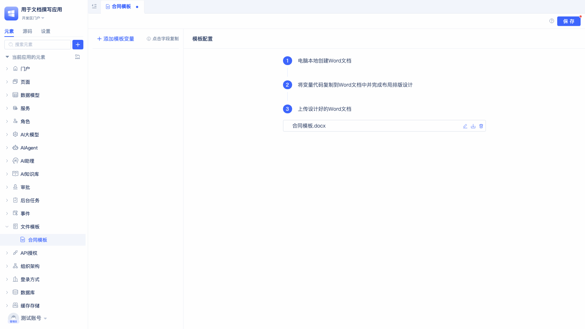

点击`+ 添加模板变量`按钮，在弹出的对话框中填写变量名称和 [数据类型](../../reference/framework/JitORM/data-types)。

:::tip
    高级数据类型，如单行数据，多行数据，需要配置目标数据模型
:::

配置好后的模板变量如下：

### 在Word文档中使用模板变量 {#use-template-variables-in-word}
在Word文档中使用模板变量，需要以下三步：

在本地电脑上创建Word文档（目前JitAI仅支持.docx格式文件），将变量代码复制到Word文档中并完成布局排版设计，将设计好的Word文档上传到平台。

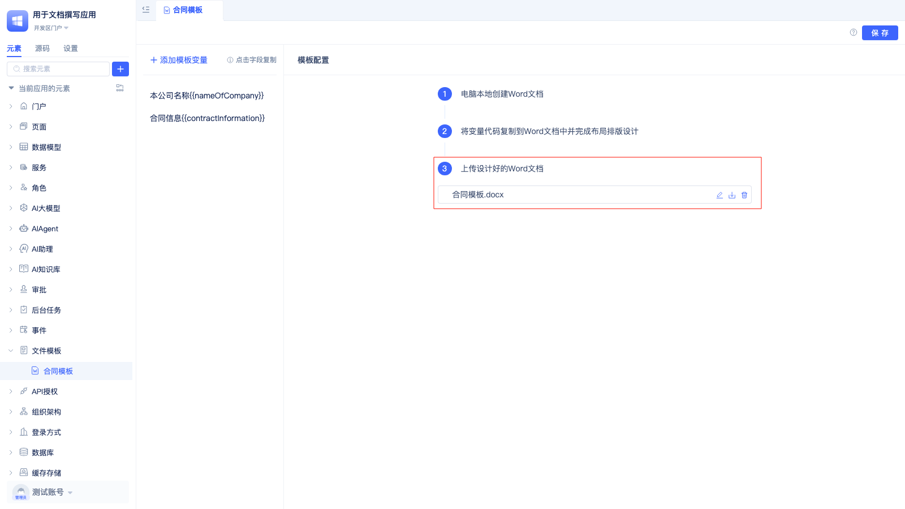

#### 从JitAI平台复制模板变量 {#copy-template-variables-in-word}

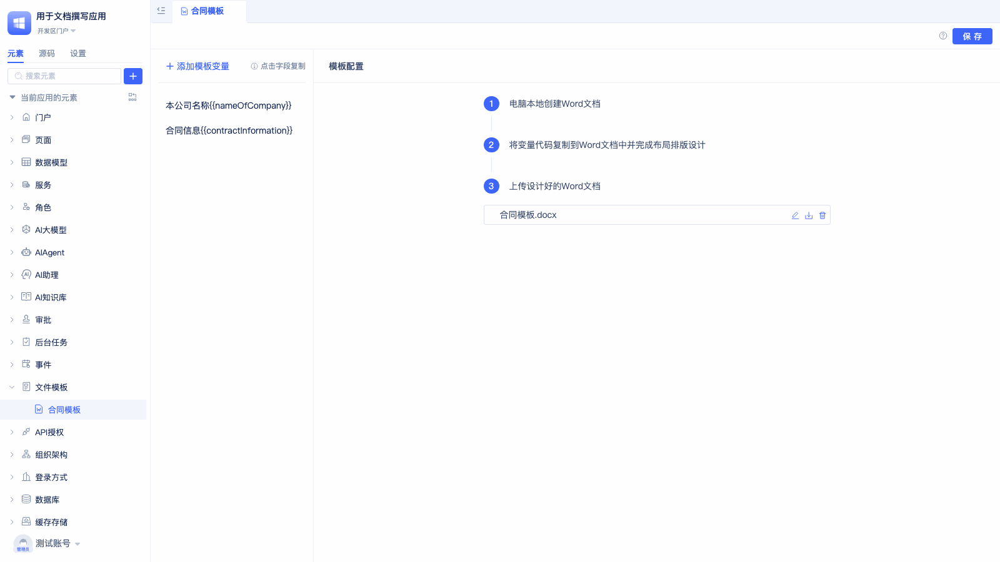

鼠标放到变量名称上，点击复制复制变量代码，在下拉面板中选择“值”选项的”展示单行文本”。

:::tip
 1. “展示单行文本”是模板变量的一种常用展示样式，变量的值在文档中以单行文本形式展示。

 2. JitAI支持**30+种模板变量样式**，包括文本处理、数值计算、日期格式化、列表操作等，帮助你实现各种复杂的数据展示需求。详细用法请参考：[模板变量样式说明](#template-variable-style-description)。
:::

#### 在Word文档中使用变量：{#using-variables-in-word}
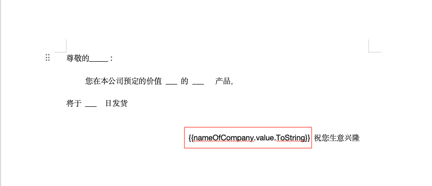

复制、粘贴其他变量：

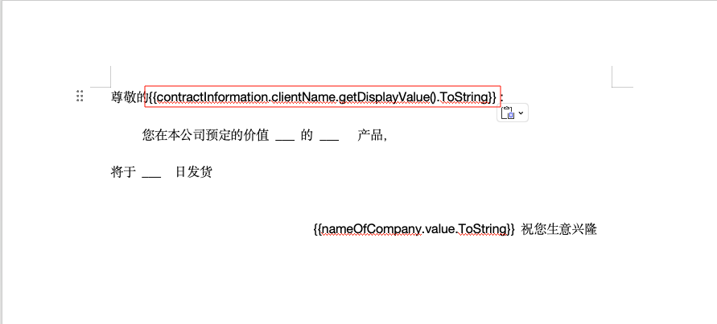

复制图片变量:
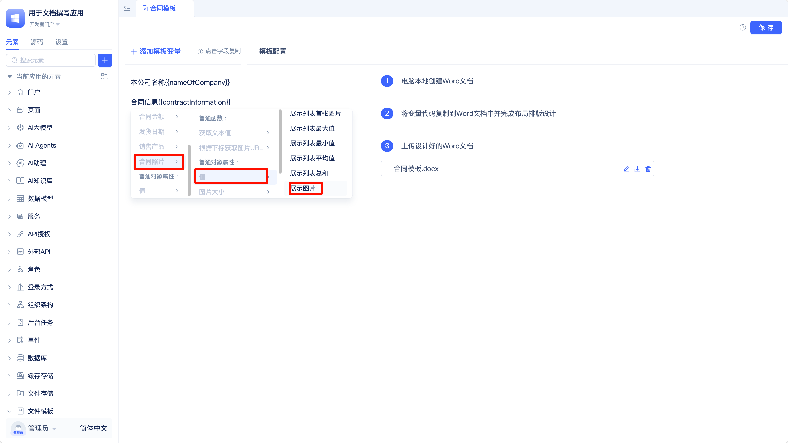

:::tip
    在Word模板中使用`展示图片`样式，图片应该和文字分开，并独处一行。
:::

最终Word文档内容：

#### 上传配置好的Word文档。{#uploading-configured-word-document}

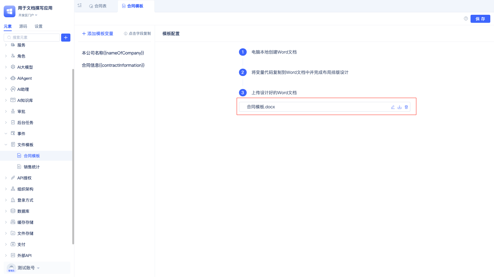

:::info 生成和打印文件
模板创建完成后，关于如何生成和打印文件的详细说明，请参考：[用文件模板生成和打印文件](./generating-and-printing-files-using-file-templates)
:::

## Excel模板 {#excel-template}
财务部门制作月度销售报表时，报表格式固定但数据需要动态填充。通过Excel模板设置销售人员、产品类别、销售数量、金额等变量，快速生成标准化销售分析报表。

本文档中使用的原始数据：

配置好模板变量的Excel文档

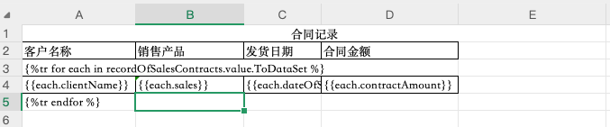

:::info 生成和打印文件
模板创建完成后，关于如何生成和打印文件的详细说明，请参考：[用文件模板生成和打印文件](./generating-and-printing-files-using-file-templates)
:::

### 创建Excel模板 {#create-excel-template}
Excel模板的创建方式和Word模板创建方式一样。

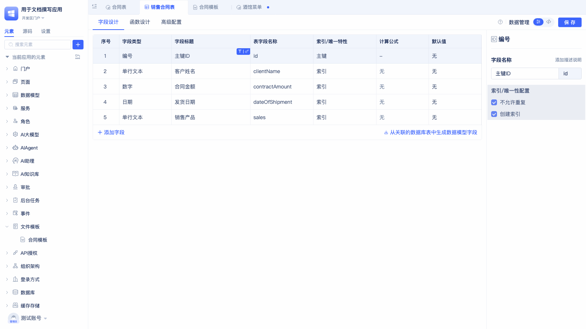

鼠标放到`+`按钮上，在"更多"选项，"文件模板"子选项中选中Excel模板。

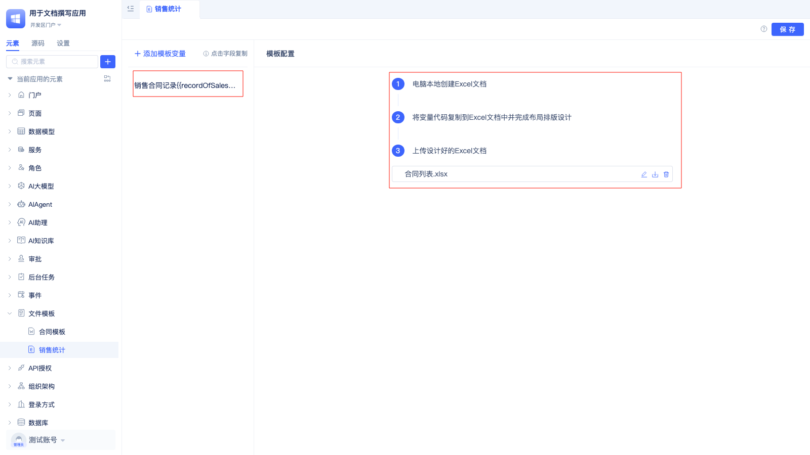

创建好的Excel模板包括以下2个组成部分：
1. 模板变量，在变量中设定变量名称，[数据类型](../../reference/framework/JitORM/data-types)和[数据表模型](../data-modeling/data-table-model)。
2. Excel文档，在Excel文档中使用模板变量，在调用打印服务时，根据Excel文档中的模板变量名称进行数据替换。

### 创建Excel模板变量 {#create-excel-template-variables}

点击`+ 添加模板变量`按钮，在弹出的对话框中填写变量名称和 [数据类型](../../reference/framework/JitORM/data-types)。

配置好的变量如下图：

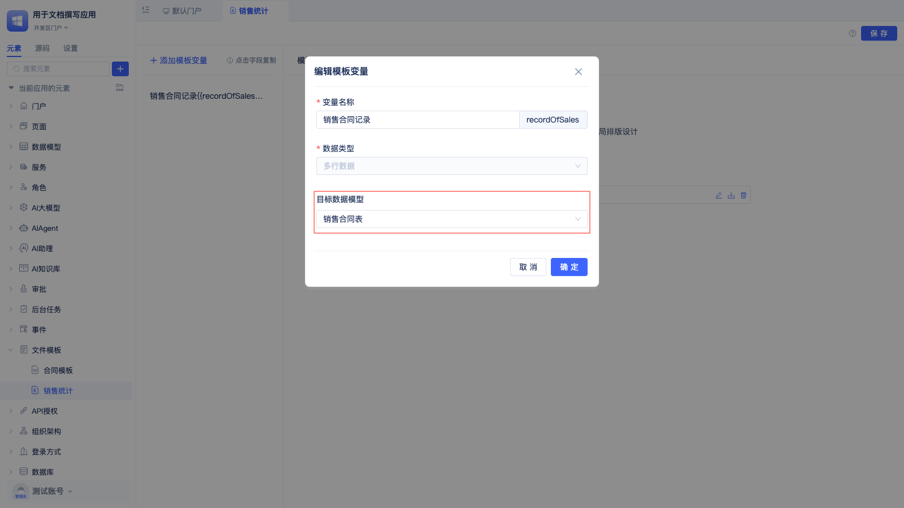

### 在Excel文档中使用模板变量 {#use-template-variables-in-excel}
在Excel文档中使用模板变量，需要以下三步：
在本地电脑上创建Excel文档（目前JitAI仅支持.xlsx格式文件），将变量代码复制到Excel文档中并完成布局排版设计，将设计好的Excel文档上传到平台。

#### 从JitAI平台复制模板变量 {#copy-template-variables-in-excel}
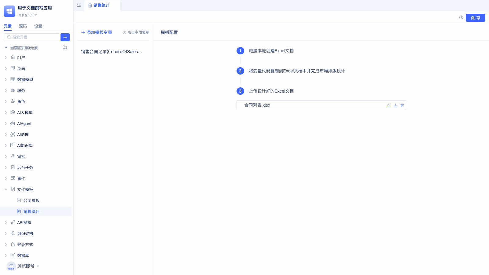

鼠标放到变量名称上，点击复制复制变量代码，在下拉面板中选择“值”选项的“展示多行数据”。

:::tip
“展示多行数据”，是将值在文档中通过循环语句展示成多行多列。

JitAI支持**30+种模板变量样式**，包括文本处理、数值计算、日期格式化、列表操作等，帮助你实现各种复杂的数据展示需求。详细用法请参考：[模板变量样式说明](#template-variable-style-description)。
:::

 
#### 在Excel文档中粘贴变量 {#paste-variables-in-excel}

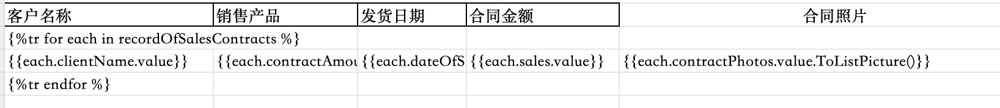

在Excel文件中粘贴刚才复制的变量，调整第二行的变量顺序与表头对应。第二行的变量名跟目标表模型中的表字段名称对应。

:::tip
1. 如果需要横向打印，在Excel文件中直接调整纸张方向。设置好变量后可以先使用打印预览功能预览最终打印效果。
2. 针对部分特定样式，如展示图片/超链接/多行数据，要注意检查对应的变量输出能否满足数据要求。
3. 在进行模板代码布局排版时，要结合预计输出的数据预留足够的单元格大小，如多行文本/图片。
4. 如果需要打印图片而不是图片的链接，需要在图片字段后面加上 `.ToListPicture()`
:::

目标表模型变量名称：

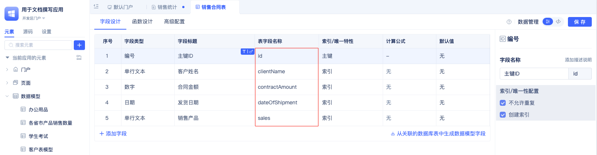

打印效果：

#### 上传调整好的Excel文档 {#upload-configured-excel-document}
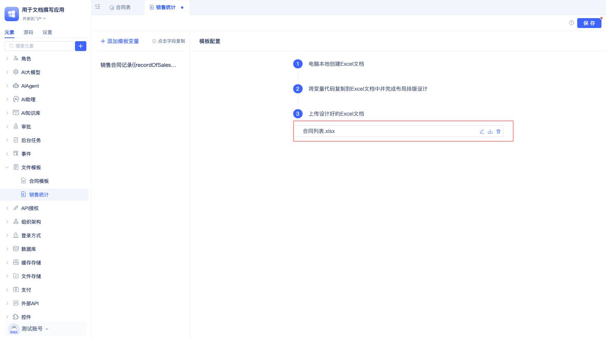

 

## 模板变量样式说明 {#template-variable-style-description}
### 文本样式 {#text-style}
| 类型 | 标题 | 函数名 | 备注 | 模板代码 |
|------|------|--------|------|----------|
| 文本类 | 展示单行文本 | ToString | 将对应输入以单行文本形式展示 | `{{a.value.ToString}}` |
| 文本类 | 展示多行文本 | ToLine | 依据输入中的回车转换为多行文本展示 | `{{a.value.ToLine}}` |
| 文本类 | 展示图片 | ToPicture | 将对应输入转换为图片展示； | `{{a.value.ToPicture}}` |
| 文本类 | 展示超链接 | ToLink | 将对应输入转换为超链接展示； | `{{a.value.ToLink}}` |
| 文本类 | 展示下拉值 | ToSelect | 将对应输入转换为下拉框展示； | `{{a.value.ToSelect}}` |
| 文本类 | 等宽换行 | ToEquallyLine(int) | 将对应输入按照指定长度切换行，默认不换行 | `{{a.value.ToEquallyLine(int)}}` |
| 文本类 | 左截断指定长度 | ToTrimLeft(int) | 将对应输入截断指定长度展示，默认不截断 | `{{a.value.ToTrimLeft(int)}}` |
| 文本类 | 右截断指定长度 | ToTrimRight(int) | 将对应输入截断指定长度展示，默认不截断 | `{{a.value.ToTrimRight(int)}}` |
| 文本类 | 生成二维码 | genQrCode() | 基于文本内容生成二维码。 | `{{a.value.genQrCode()}}` |
| 文本类 | 生成条形码 | genBarcode() | 基于文本内容生成条形码，需传入二维码类型(codeType) | `{{a.value.genBarcode(codeType="EAN13")}}` |

### 数值类样式 {#numeric-style}
| 类型 | 标题 | 函数名 | 备注 | 模板代码 |
|------|------|--------|------|----------|
| 数值类 | 展示数值 | ToNum | 将输入的数值直接展示 | `{{a.value.ToNum}}` |
| 数值类 | 保留指定小数位 | ToRound(int) | 将输入的数值保留指定位数（四舍五入），默认不保留表示都保留 | `{{a.value.ToRound(int)}}` |
| 数值类 | 截断指定位数 | ToTruncate(int) | 将输入的数值保留指定位数（截断），默认不保留表示不截断 | `{{a.value.ToTruncate(int)}}` |
| 数值类 | 取绝对值 | ToAbs | 将输入的数值取绝对值 | `{{a.value.ToAbs}}` |

### 日期时间类样式 {#date-time-style}
| 类型 | 标题 | 函数名 | 备注 | 模板代码 |
|------|------|--------|------|----------|
| 日期时间类 | 展示日期时间格式 | ToDatetime | 获取年月日时分秒YYYMMDDthhmmss形式展示 | `{{a.value.ToDatetime}}` |
| 日期时间类 | 展示日期格式 | ToDate | 获取年月日YYYYMMDD形式展示； | `{{a.value.ToDate}}` |
| 日期时间类 | 展示时间格式 | ToTime | 获取时分秒thhmmss形式展示； | `{{a.value.ToTime}}` |

### 多值类样式（复杂类型） {#multi-value-complex-types}
| 类型 | 标题 | 函数名 | 备注 | 模板代码 |
|------|------|--------|------|----------|
| 列表 | 展示多行数据 | ToDataSet | 获取对应输入以数据集合展示（多行模板，字典不区分横向/纵向，多行多列展示） | ` {{each.name}} {{each.age}} ` |
| 列表 | 横向展示列表 | ToList | 获取数据集横向展示（对应多格适应）（默认获取文本值展示） | ` {{each}} ` |
| 列表 | 纵向展示列表 | ToList | 获取数据集纵向展示（对应多格适应）（默认获取文本值展示） | ` {{each}} ` |
| 列表 | 横向展示图片列表 | ToListPicture | 获取图片数据集横向展示 | `{{a.value.ToListPicture}}` |
| 列表 | 纵向展示图片列表 | ToListColumnPicture | 获取图片数据集纵向展示 | `{{a.value.ToListColumnPicture}}` |
| 列表 | 展示列表首个数据 | ToFirst | 获取对应输入集合中第一个对象展示；(默认获取文本值展示) | `{{a.value.ToFirst}}` |
| 列表 | 展示列表首张图片 | ToFirstPicture | 获取对应输入集合中第一个对象展示；(使用图片渲染) | `{{a.value.ToFirstPicture}}` |
| 列表 | 展示列表最大值 | ToMax | 获取对应输入集合最大值 | `{{a.value.ToMax}}` |
| 列表 | 展示列表最小值 | ToMin | 获取对应输入集合最小值 | `{{a.value.ToMin}}` |
| 列表 | 展示列表平均值 | ToAvg | 获取对应输入集合平均值 | `{{a.value.ToAvg}}` |
| 列表 | 展示列表总和 | ToSum | 获取对应输入集合之和 | `{{a.value.ToSum}}` |
| 列表 | 展示列表个数 | ToCount | 获取对应输入集合个数 | `{{a.value.ToCount}}` |
| 字典 | 横向展示字典 | ToDictionary | 获取字典数据横向展示 | `{{a.value.ToDictionary.key}}` |
| 字典 | 纵向展示字典 | ToDictionary | 获取字典数据纵向展示 | `{{a.value.ToDictionary.key}}` |

### 图片类型  {#images-types}
| 类型 | 标题 | 函数名 | 备注 | 模板代码 |
|------|------|--------|------|----------|
| 图片 | 展示图片 | ToListPicture | 单行数据中使用`单行数据.{图片字段}.value.ToListPicture()` | `rowData.pictures.value.ToListPicture()` |
| 图片 | 展示图片 | ToListPicture | 多行数据中使用`each.{图片字段}.value.ToListPicture()` | `  {{each.imageField.value.ToListPicture()}} ` |