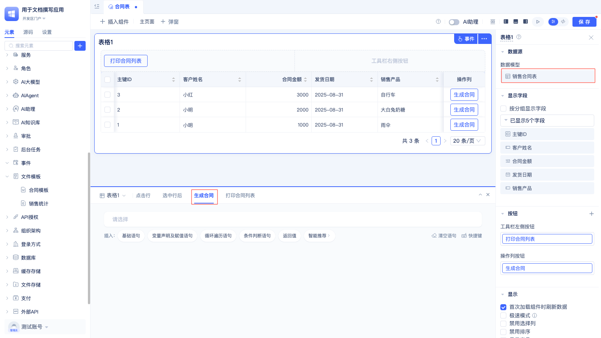
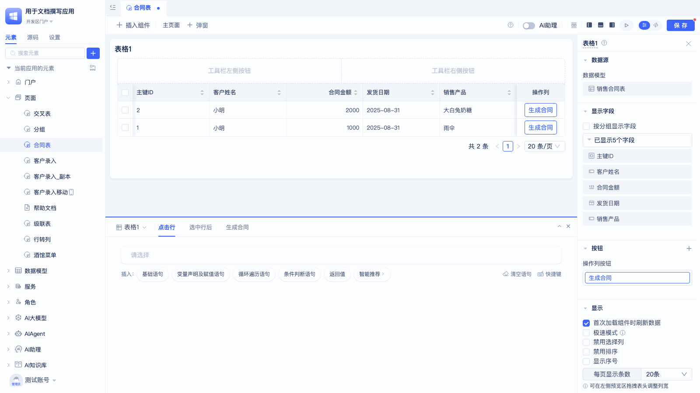
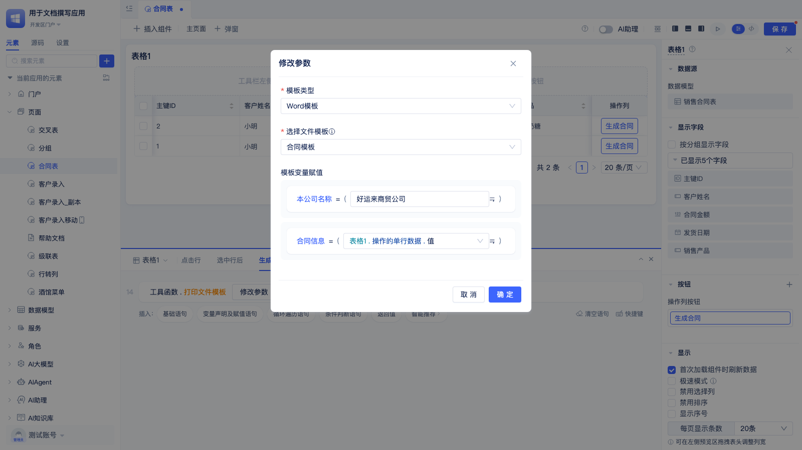
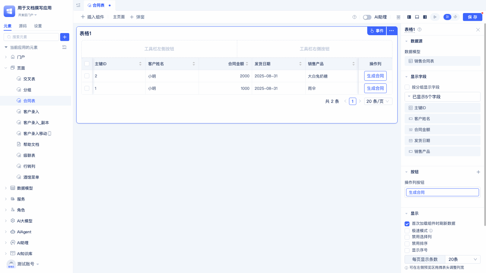
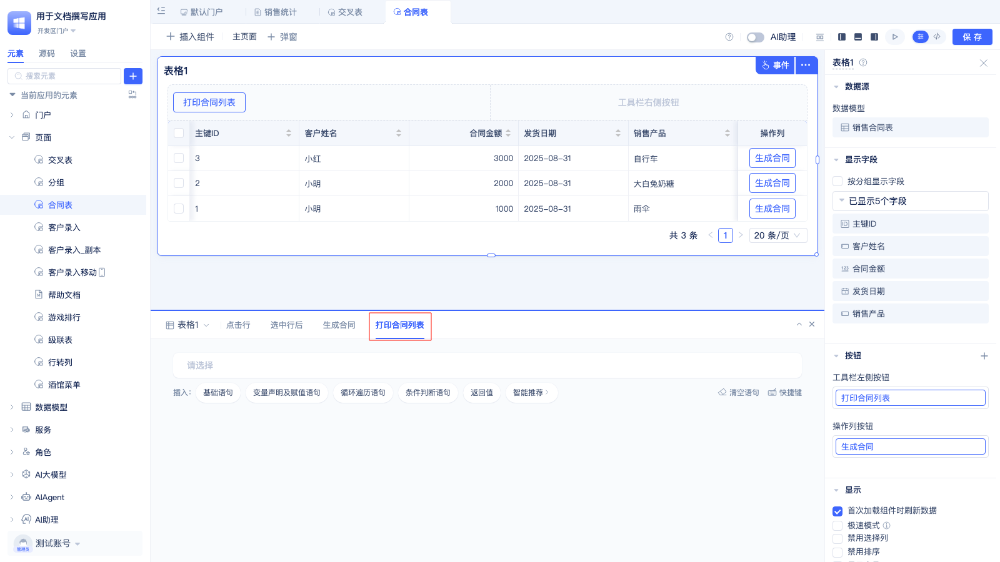
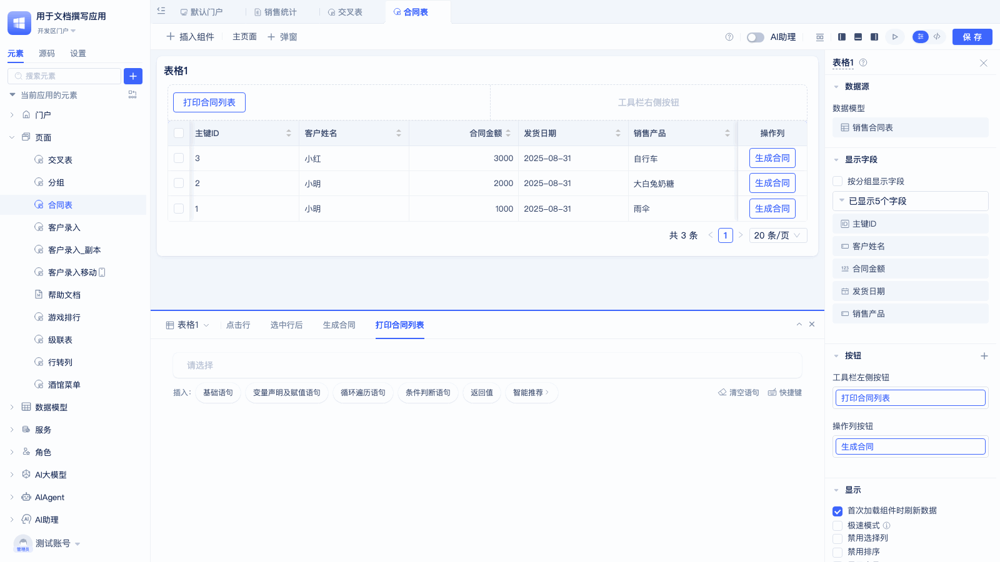
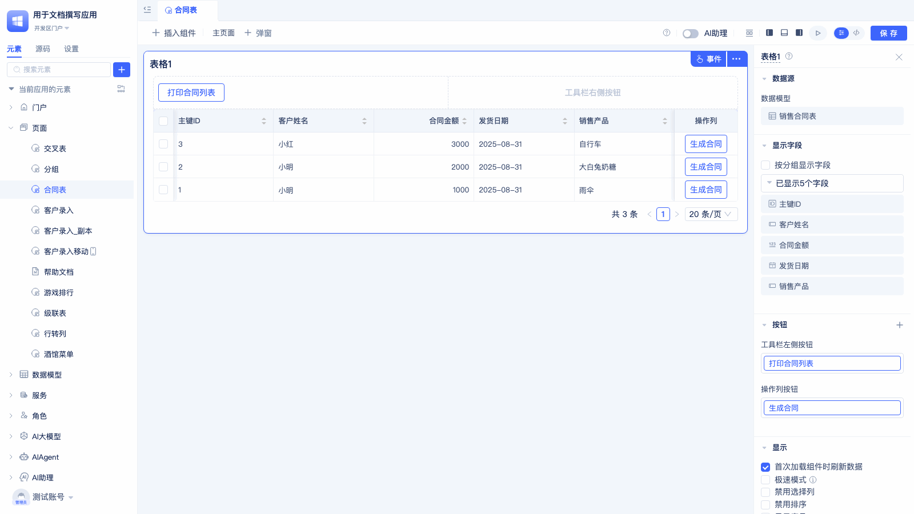
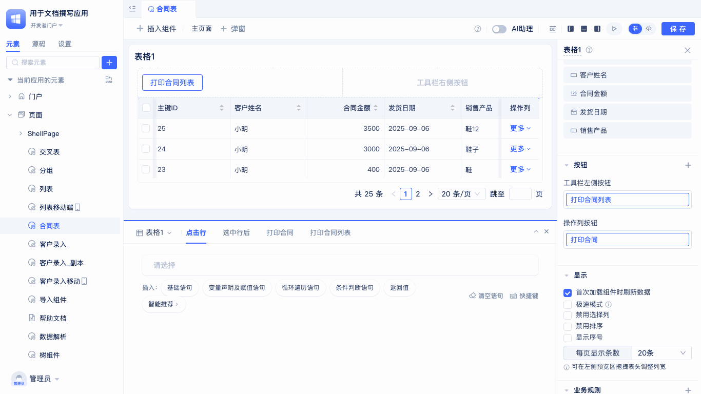

# 用文件模板生成和打印文件 {#generating-and-printing-files-using-file-templates}

文件模板创建完成后，可以通过调用打印服务来生成和打印文件。本文档介绍如何使用已创建的文件模板来生成和打印Word文档和Excel文档。

## 打印Word模板 {#print-word-template}

调用打印服务函数的**数据模型**需要与模板变量的**目标数据表**保持一致。

一般在**按钮**事件中调用打印服务：

1. 在事件编辑区，点击语句中的"请选择"，在弹出窗中选择"工具函数"下的"打印文件模板"选项，会生成工具函数.打印文件模板。
2. 点击工具函数.打印文件模板的`设置参数`按钮，在弹出的对话框中设置模板类型、文件模板，并给模板变量赋值。

配置好的参数如下图：

使用效果如下图：

## 打印Excel模板 {#print-excel-template}

在需要调用模板打印的组件中创建按钮。

配置按钮事件：

1. 在事件编辑区，点击语句中的"请选择"，在弹出窗中选择"工具函数"下的"打印文件模板"选项，会生成工具函数.打印文件模板。
2. 点击工具函数.打印文件模板的`设置参数`按钮，在弹出框中设置模板类型、文件模板，并给模板变量赋值。

最后，检验模板打印效果：

## 生成附件 {#generate-attachments}

在需要调用生成附件的组件中添加按钮。

1. 在事件编辑区，点击语句中的"请选择"，在弹出窗中选择"服务" - "工具服务" - "生成附件"，会生成`服务.工具服务.生成附件`。
2. 点击`服务.工具服务.生成附件`的`设置参数`按钮，在弹出框中设置模板类型、选择文件模板、设置生成附件的名称、选择输出方式并给模板变量赋值。

