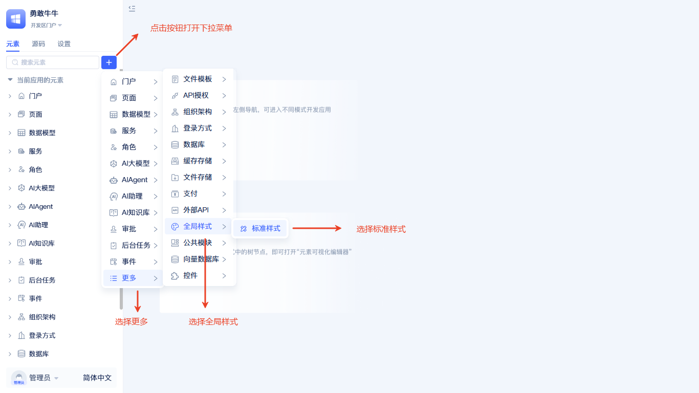
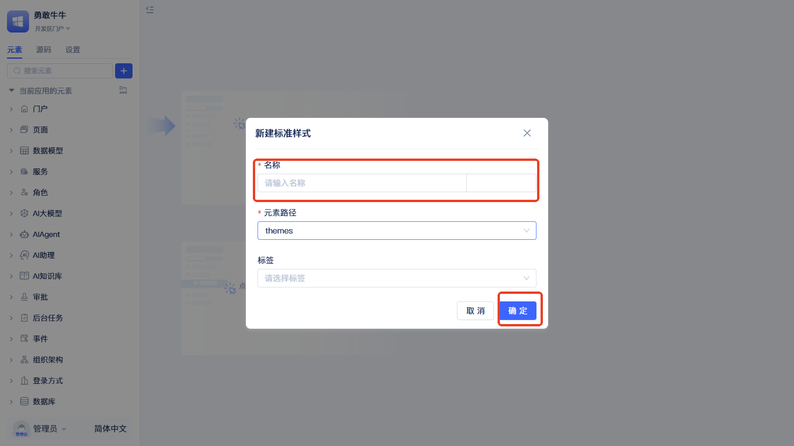
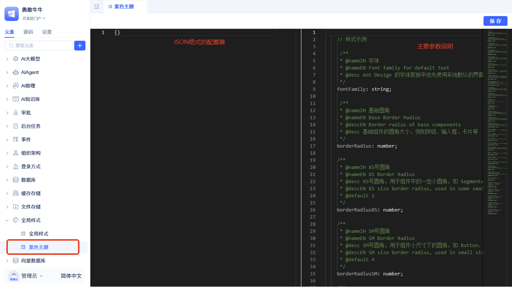
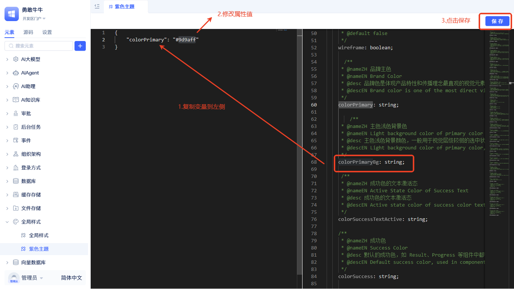
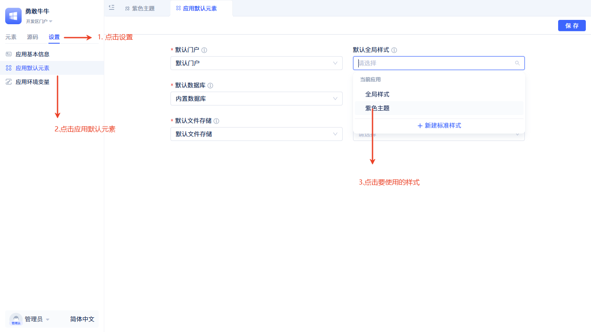
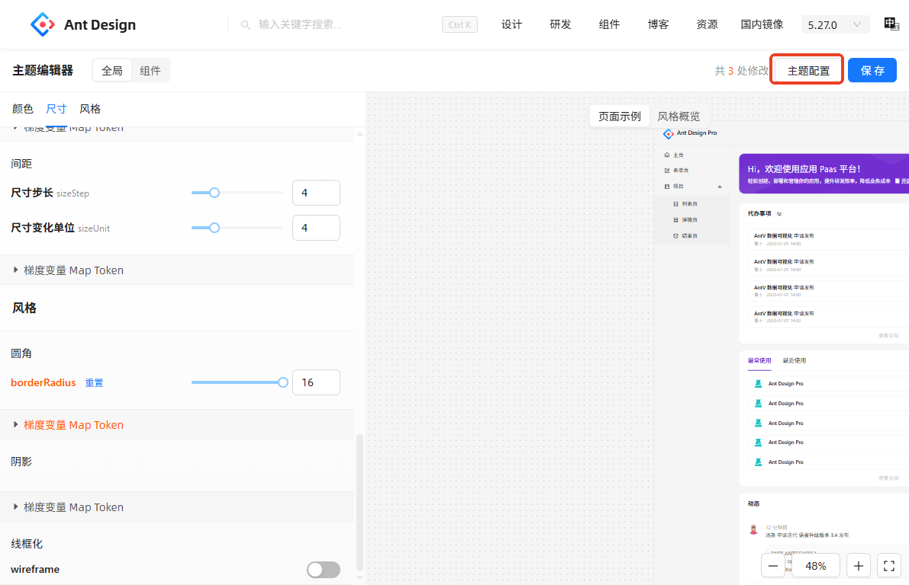
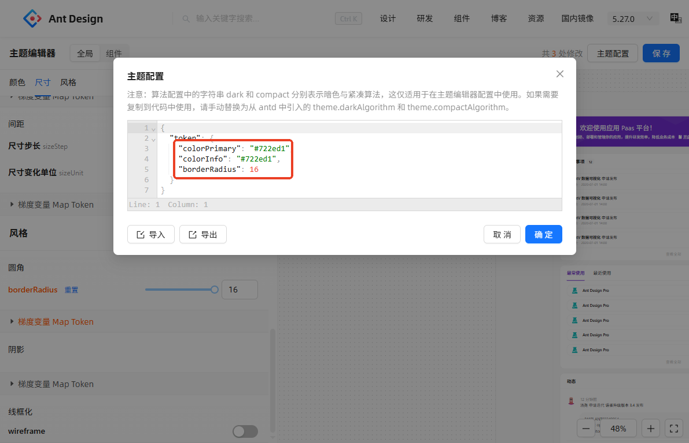

# 全局样式
在传统的应用开发中，各个页面和组件的样式往往各自独立定义，导致同一个应用中出现样式不一致的问题。当需要调整品牌色或整体风格时，开发者需要逐个修改各处样式代码，维护成本极高。`全局样式`功能提供了一个集中化的样式配置中心，通过统一的配置面板，开发者可以定义应用的整体视觉风格。这些配置会应用到所有基于Ant Design的UI组件上，确保整个应用的视觉一致性。

## 创建全局样式元素 {#create-global-style-element}

在元素目录树点击搜索框右侧的`+`按钮，选择`更多`-`全局样式`-`标准样式`，随后弹出创建全局样式元素的弹窗。

创建弹窗中只需填写`名称`即可，点击`确定`完成创建。

## 修改全局样式 {#modify-global-style}
创建完成后会在左侧元素树中显示。

编辑器分为左侧编辑区和右侧参考区，左侧编辑格式为`JSON`，右侧为常用的样式变量说明，开发者可以从参考区复制样式，并粘贴到左侧编辑区后修改。以修改主题色为例，如下图：

复制右侧主题色对应的变量`colorPrimary`到左侧编辑区，并修改颜色值，最后点击`保存`按钮保存。此时主题色还不能应用，需按下图设置：

点击`设置`标签，再点击`应用默认元素`进入默认元素编辑器，点击`默认全局样式`下拉框，选择刚创建的`全局样式元素`，点击`保存`按钮后刷新页面，即可看到主题色已应用。

## 更多样式变量 {#more-style-variables}
样式变量可参考[样式变量](https://ant.design/docs/react/customize-theme-cn#seedtoken)。

## 调试主题 {#debug-theme}
开发者可以使用Ant Design官方[样式编辑器](https://ant.design/theme-editor-cn)来生成自定义主题。

在样式编辑器中调整好样式之后，点击`主题配置`。

复制主题配置弹窗中的配置。

将配置粘贴到全局样式编辑区即可。

