import Tabs from '@theme/Tabs';
import TabItem from '@theme/TabItem';

# 页面定制

:::info 前置步骤
如果您还没有创建全代码页面，请先参考 [创建全代码页面](../shell-and-page/full-code-page-development) 了解如何创建React和Vue全代码页面。
:::

本文档介绍全代码页面的具体开发技术和使用方法，包括样式处理、组件使用、资源管理、数据操作等。

## 创建 React 全代码页面 {#create-react-full-code-page}

### 使用样式 {#use-style}
在全代码页面中，你可以按需选择样式方案：内联样式（CSS inline）、CSS‑in‑JS、CSS 开箱即用，无需额外的打包配置；而采用原生 LESS 或 SCSS 时，需要在项目中启用对应的打包配置后方可生效。

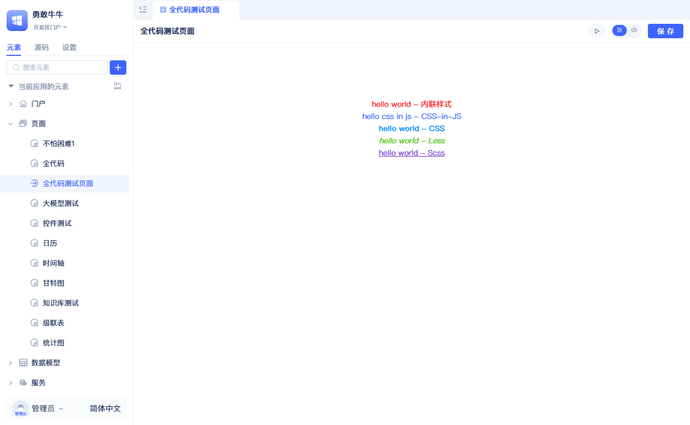

LESS 和 SCSS 的样式文件需要配置解析插件，参考[引入打包插件](#引入打包插件)

<Tabs>
  <TabItem value="inline" label="内联样式" default>

```jsx
// 内联样式示例 - 直接在JSX中定义样式
<div style={{color: "red"}}>hello world - 内联样式</div>
```

  </TabItem>
  <TabItem value="css-in-js" label="CSS-in-JS">

**styles.ts 文件：**
```typescript
import type { GlobalToken } from 'antd';
import { css } from '@emotion/react';

export const cssInJs = (token: GlobalToken) => css`
    color: ${token.colorPrimary};
`;
```

**index.tsx 中使用：**
```jsx
import {cssInJs} from './styles';
import { theme } from 'antd';

const { token } = theme.useToken();

// CSS-in-JS 示例 - 使用 @emotion/react
<div css={cssInJs(token)}>hello css in js - CSS-in-JS</div>
```

  </TabItem>
  <TabItem value="css" label="CSS">

**styles.css 文件：**
```css
.css-styled {
  color: #1890ff;
  font-weight: bold;
}
```

**index.tsx 中使用：**
```jsx
// CSS 导入方式
import './styles.css';

// CSS 样式示例
<div className="css-styled">hello world - CSS</div>
```

  </TabItem>
  <TabItem value="less" label="Less">

**styles.less 文件：**
```less
.less-styled {
  color: #52c41a;
  font-style: italic;
}
```

**index.tsx 中使用：**
```jsx
// Less 导入方式
import './styles.less';

// Less 样式示例
<div className="less-styled">hello world - Less</div>
```

  </TabItem>
  <TabItem value="scss" label="Scss">

**styles.scss 文件：**
```scss
.scss-styled {
  color: #722ed1;
  text-decoration: underline;
}
```

**index.tsx 中使用：**
```jsx
// scss 导入方式
import './styles.scss';

// scss 样式示例
<div className="scss-styled">hello world - Scss</div>
```

  </TabItem>
</Tabs>

:::tip
使用 CSS‑in‑JS 时，可直接消费 antd 的主题 token，与平台默认样式自然对齐；同时也能读取并复用你在平台的"全局样式"中定义的自定义变量，实现品牌色、圆角、阴影等统一管理与一处生效。参考《[全局样式](./global-styles)》。
:::

### 使用本地资源 {#use-local-resources}
平台提供了常用资源的解析能力，全代码中可以直接使用`import`语句将资源引入，以图片为例。

```typescript
import logo from './logo.png';

export const Render = () =>{
 return 
}
```

更多资源的解析能力，请查看[默认loader映射](#默认loader映射)，你也可以通过[打包配置的使用](#use-packaging-configuration)来扩展loader映射。

### 使用 Ant Design 的组件 {#use-ant-design-components}
平台基于 React 框架，内置了 Ant Design UI 组件库，可以直接使用所有 Ant Design 组件；移动端可使用 Ant Design Mobile 组件库。

```typescript
import { Button } from 'antd';

export const Render = () =>{
 return <Button>按钮</Button />
}
```

更多内置包，请查看[系统内置包一览表](#系统内置包一览表)。

### 内嵌已有常规页面 {#embed-existing-regular-page}
在全代码页面中复用已有的常规页面，可以减少重复开发，提高代码复用性。下图展示了全代码页面与内嵌常规页面的交互示例。

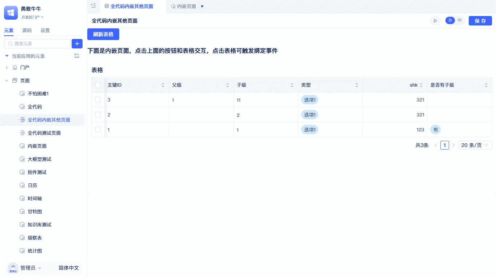

示例演示了跨页面组件交互：全代码页面的按钮控制内嵌页面表格的数据刷新，同时监听表格行点击事件，获取并显示当前行的ID信息。

实现如下：

```typescript
import { useRef } from "react";
import { Button, message } from "antd";
import { Jit } from "jit";
import { ElementRender } from "jit-widgets";

// 全代码的实现包括：渲染器和逻辑处理类
// Render是页面的渲染器，UI部分在这里实现，它是一个React组件
const Render = (props) => {
  const embeddedPageRef = useRef(null);

  // 刷新内嵌页面的表格
  const handleRefreshTable = () => {
    if (embeddedPageRef.current?.Table1) {
      embeddedPageRef.current.Table1.call();
    }
  };

  // 绑定内嵌页面实例和事件
  const handlePageInit = (pageInstance) => {
    embeddedPageRef.current = pageInstance;

    // 绑定表格行点击事件
    pageInstance.Table1?.subscribeEvent("clickRow", () => {
      const activeRowId = pageInstance.Table1.activeRow?.id?.value;
      message.info(`表格行被点击，ID：${activeRowId}`);
    });
  };

  return (
    <div>
      <Button type="primary" onClick={handleRefreshTable}>
        刷新表格
      </Button>
      <h3>下面是内嵌页面；点击上面的按钮与表格交互，点击表格可触发绑定事件。</h3>
      <ElementRender
        elementPath="pages.embeddedPages"
        onInitAfter={handlePageInit}
      />
    </div>
  );
};
// 这是全代码页面逻辑处理类，逻辑部分在这里实现，它是一个 JavaScript 的 class
class PageCls extends Jit.BasePage {
  // 可以在这里添加页面特有的方法
}

export { Render, PageCls };
```

ElementRender 除了渲染常规页面元素，还可以渲染其他全代码页面，只需将对应元素的 `fullName` 配置到 `elementPath` 属性。若需要与内嵌页面交互，可配置 `onInitAfter` 属性；初始化完成后会将内嵌页面的 page 实例作为参数传递。内嵌页面的 page 实例示例如下：

```typescript
import type { ComponentPageScheme } from "jit";
import { Jit } from "jit";
import schemeJson from "./scheme.json";
type BaseComponent = InstanceType<typeof Jit.BaseComponent>;

class PageCls extends Jit.GridPage {
    Table1!: BaseComponent;
    scheme: ComponentPageScheme = schemeJson;
    bindEvent() {}
}

export default PageCls;
```

内嵌页面包含一个名为 Table1 的表格实例，全代码页面可以通过该页面的实例对其进行操作。

### 使用标准组件 {#use-standard-component}
在全代码页面中复用已有的标准组件，可以减少重复开发，提高代码复用性。下图展示了全代码页面与标准组件的交互示例。

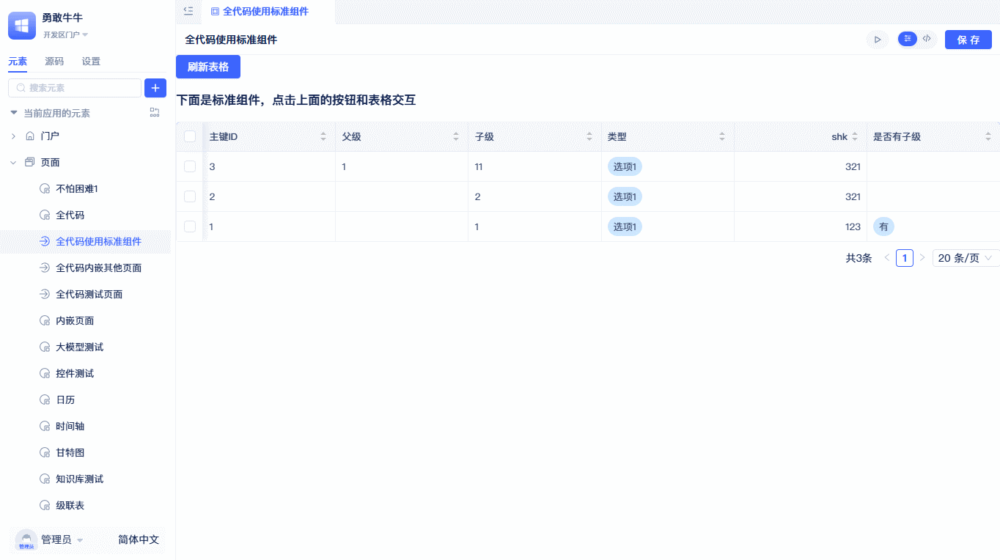

示例演示了跨页面组件交互：全代码页面的按钮控制表格组件的数据刷新，同时监听表格行点击事件，获取并显示当前行的ID信息。

所有标准组件都是由配置驱动渲染，组件的渲染器接受一个组件实例，实例通过配置进行构造。因为组件的配置复杂，在全代码中使用标准组件时，建议开发者先创建常规页面，在常规页面添加标准组件，并配置好组件，再复制组件的配置到全代码页面中。

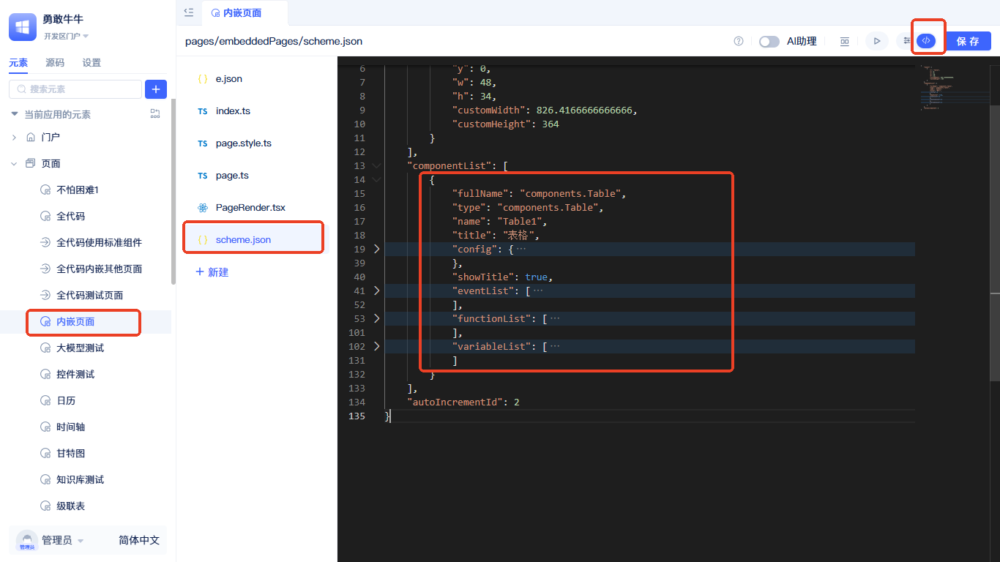

点击要复制组件的页面，切换到源码模式，打开`scheme.json`找到componentList配置项，将要使用的组件配置复制到全代码页面即可。

示例代码如下：

<Tabs>
  <TabItem value="index" label="index.tsx" default>

```typescript
import { Button, message } from 'antd';
import { Jit } from 'jit';

import ComponentRender from './ComponentRender';
import tableConfig from './tableConfig.json';

// 全代码的实现包括：渲染器和逻辑处理类
// Render是页面的渲染器，UI部分在这里实现，它是一个React组件
const Render = (props) => {
    // 页面渲染器接收一个page参数，page是页面逻辑处理类的示例对象
    const page = props.page;

    // 刷新内嵌页面的表格
    const handleRefreshTable = () => {
        if (page[tableConfig.name]) {
            page[tableConfig.name].call();
        }
    };

    const handleComponentReady = (compIns: any) => {
        compIns.subscribeEvent('clickRow', () => {
            const activeRowId = compIns.activeRow?.id?.value;
            message.info(`表格行被点击，ID：${activeRowId}`);
        });
    };

    return (
        <div>
            <Button type="primary" onClick={handleRefreshTable}>
                刷新表格
            </Button>
            <h3>下面是标准组件，点击上面的按钮和表格交互</h3>
            <ComponentRender config={tableConfig} page={page} onReady={handleComponentReady} />
        </div>
    );
};

// 这是全代码页面逻辑处理类，逻辑部分在这里实现，它是一个 JavaScript 的 class
class PageCls extends Jit.BasePage {}

export { Render, PageCls };
```

  </TabItem>
  <TabItem value="componentRender" label="ComponentRender.tsx">

```typescript
import { useState, useEffect } from 'react';
import { Jit, getRuntimeApp } from 'jit';
import { ElementRender } from 'jit-widgets';

const ComponentRender = (props: {
    config: Record<string, any>;
    page: InstanceType<typeof Jit.BasePage>;
    onReady: (compIns: any) => void;
}) => {
    const app = getRuntimeApp();
    const { config, page } = props;

    const [loading, setLoading] = useState(true);
    const [compIns, setCompIns] = useState(null);

    useEffect(() => {
        setLoading(true);

        app.getElement(config.type).then(({ ComponentCls }) => {
            let compIns = new ComponentCls({
                ...config,
            });

            page[config.name] = compIns;

            setCompIns(compIns);
            setLoading(false);
            props.onReady(compIns);
        });
    }, []);

    if (loading) {
        return <div>Loading...</div>;
    }

    return <ElementRender elementPath={config.type} compIns={compIns} />;
};

export default ComponentRender;
```
  </TabItem>
  <TabItem value="tableConfig" label="tableConfig.json">

```json
{
    "fullName": "components.Table",
    "type": "components.Table",
    "name": "Table1",
    "title": "表格",
    "config": {
        "requireElements": [
            {
                "title": "表格数据模型",
                "type": "models.Meta",
                "name": "models.cascadeTableData",
                "filter": "",
                "orderBy": ""
            }
        ],
        "fieldIdList": [
            "id",
            "pname",
            "sublevel",
            "type",
            "shk",
            "shiFouYou"
        ],
        "defaultRender": true,
        "level": 2
    },
    "showTitle": true,
    "eventList": [
        {
            "title": "点击行",
            "name": "clickRow",
            "data": "activeRow"
        },
        {
            "title": "选中行后",
            "name": "selectedChange",
            "data": "selectedRowList"
        }
    ],
    "functionList": [
        {
            "async": true,
            "name": "prevPage",
            "title": "翻到上一页"
        },
        {
            "async": true,
            "name": "nextPage",
            "title": "翻到下一页"
        },
        {
            "args": [
                {
                    "dataType": "Numeric",
                    "name": "pageNumber",
                    "title": "页码",
                    "acceptDataTypes": [
                        "Numeric",
                        "Money",
                        "Percent",
                        "AutoInt"
                    ]
                }
            ],
            "async": true,
            "name": "goPage",
            "title": "翻到指定页"
        },
        {
            "title": "刷新",
            "name": "call",
            "async": true,
            "args": [
                {
                    "name": "qFilter",
                    "title": "筛选条件",
                    "dataType": "QFilter",
                    "generic": "models.cascadeTableData"
                }
            ]
        },
        {
            "title": "刷新当前页",
            "name": "refresh",
            "async": true,
            "args": []
        }
    ],
    "variableList": [
        {
            "name": "displayRowList",
            "title": "当前页数据",
            "dataType": "RowList",
            "readonly": true,
            "generic": "models.cascadeTableData"
        },
        {
            "name": "selectedRowList",
            "title": "选中的多行数据",
            "dataType": "RowList",
            "readonly": true,
            "generic": "models.cascadeTableData"
        },
        {
            "name": "activeRow",
            "title": "操作的单行数据",
            "dataType": "RowData",
            "readonly": true,
            "generic": "models.cascadeTableData"
        },
        {
            "name": "filter",
            "title": "筛选条件",
            "dataType": "QFilter",
            "generic": "models.cascadeTableData",
            "readonly": true
        }
    ]
}
```
  </TabItem>
  <TabItem value="ejson" label="e.json">

```json
{
  "title": "全代码使用标准组件",
  "type": "pages.NormalType",
  "frontBundleEntry": "./index.tsx",
  "outputName": "index",
  "tag": ""
}
```

  </TabItem>
</Tabs>

**index.tsx** - 主页面组件，实现 UI 渲染和事件交互逻辑。

**ComponentRender.tsx** - 可复用的标准组件渲染器，负责动态加载和实例化标准组件。

**tableConfig.json** - 表格组件配置示例，包含数据模型引用 `models.cascadeTableData`，实际使用需替换为项目中的真实数据模型。

**e.json** - 页面元素定义文件，type 为 "pages.NormalType"，指定 React 全代码页面类型；frontBundleEntry 指向入口文件。

### 调用数据模型函数 {#call-data-model-function}
在全代码页面中，可以非常方便地调用数据模型函数，这里建议使用可视化页面将函数参数配置好后，直接复制函数代码到全代码页面中。具体如何获取函数代码，请参考[数据模型的增删改查](#crud-operations-for-data-models)。

详细的数据模型函数调用方法和语法说明，请参考：[在页面中调用数据模型函数](../calling-business-elements-in-pages/calling-data-model-functions-in-pages)

以获取模型中一条数据为例：

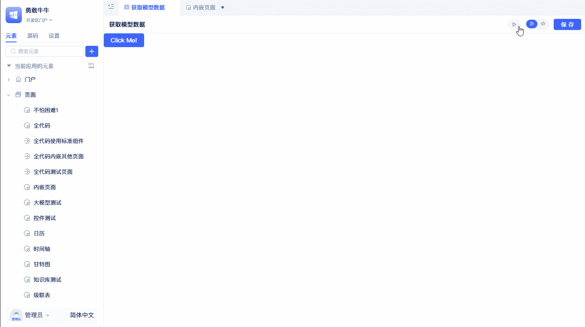

点击按钮，调用模型的获取一条数据函数，并弹出显示。示例代码如下：

```typescript
import { Button, message } from 'antd';
import { Jit } from 'jit';

const Render = ({ page }) => {
    const handleClick = async () => {
        message.success(await page.getData());
    };

    return (
        <div>
            <Button type="primary" onClick={handleClick}>
                Click Me!
            </Button>
        </div>
    );
};

class PageCls extends Jit.BasePage {
    /**
     * 获取数据，页面的方法
     */
    async getData() {
        return JSON.stringify(
            await this.app.models.cascadeTableData.get(
                Q(Q('id', '=', 1)),
                null,
                2
            )
        );
    }
}

export { Render, PageCls };

```
调用模型函数的方法类似： this.app.models.[模型名称].[方法名称]([参数1], [参数2], ...)

### 调用服务函数 {#call-service-function}
服务函数的调用方式与[数据模型函数](#call-data-model-function)完全相同，调用语法为：`this.app.services.[服务名称].[方法名称]([参数1], [参数2], ...)`。

详细的服务函数调用方法和示例，请参考：[在页面中调用服务函数](../calling-business-elements-in-pages/calling-service-functions-in-pages)

## 创建Vue全代码页面 {#vue-full-code-page}

### 基本结构
Vue全代码页面由四个核心文件组成：

<Tabs>
  <TabItem value="app" label="App.vue" default>

```html
<script setup>
import { ref } from 'vue'

const message = ref('Hello JIT!');
const dialogVisible = ref(false);
const props = defineProps({
  page: Object
});

const callPageMethod = () => {
  alert(props.page.getData());
}
</script>

<template>
  <div class="demo">
    <h1>{{ message }}</h1>
    <h2>当前页面的名称是: {{props.page.title}}</h2>
    <el-button plain @click="dialogVisible = true">
        element-plus 组件使用
    </el-button>
    <hr/>
    <el-button type="info" @click="callPageMethod">
        调用当前 page 实例方法
    </el-button>
    <hr/>
    <el-button type="danger" @click="props.page.closePage">
        关闭当前页
    </el-button>
  </div>

  <el-dialog
    v-model="dialogVisible"
    title="Tips"
    width="500"
  >
    <span>hello World!</span>
    <template #footer>
      <div class="dialog-footer">
        <el-button @click="dialogVisible = false">关闭</el-button>
        <el-button type="primary" @click="dialogVisible = false">
          确认
        </el-button>
      </div>
    </template>
  </el-dialog>
</template>

<style scoped>
.demo{
    display: flex;
    align-items: center;
    flex-direction: column;
}
</style>
```

  </TabItem>
  <TabItem value="index" label="index.ts">

```typescript
import type { Jit } from 'jit';
import { createApp } from "vue";
import ElementPlus from "element-plus";
import {PageCls} from './page';
import App from "./App.vue";

const Render = (dom: HTMLDivElement, page: InstanceType<typeof Jit.BasePage>) => {
    createApp(App, { page }).use(ElementPlus).mount(dom)
};

export { Render, PageCls };
```

  </TabItem>
  <TabItem value="page" label="page.ts">

```typescript
import { Jit } from 'jit';
// 这是全代码页面逻辑处理类，逻辑部分在这里实现，它是一个 JavaScript 的 class
class PageCls extends Jit.BasePage {
    /**
     * 获取数据，页面的方法
     */
    getData() {
        // 这里可以做更多的事情，比如请求后端接口
        return 'so cool !!!';
    }

    closePage = () => {
        const shell = Jit.BaseShell.getRuntimeShell();
        const menuName = Jit.BaseShell.getRuntimeMenuName();
        shell.publishEvent('REMOVE_PAGE', {
            pageUrl: `/${menuName}`,
        });
    }
}

export { PageCls };
```

  </TabItem>
  <TabItem value="ejson" label="e.json">

```json
{
  "title": "Vue 全代码",
  "type": "pages.VueType",
  "frontBundleEntry": "./index.ts",
  "outputName": "index"
}
```

  </TabItem>
</Tabs>

**App.vue** - Vue 组件，使用 Composition API 语法，通过 props 接收 page 实例。

**index.ts** - 渲染入口，创建 Vue 应用并使用 Element Plus，将 page 实例作为 props 传递给 App 组件。

**page.ts** - 页面逻辑处理类，继承自 Jit.BasePage，可添加自定义方法供 Vue 组件调用。

**e.json** - 元素定义文件，type 为 "pages.VueType"，指定 Vue 页面类型。

### 使用 Element Plus 组件
Vue 全代码页面内置了 Element Plus UI 组件库，可以直接使用所有 Element Plus 组件：

```html
<template>
  <el-button type="primary">主要按钮</el-button>
  <el-dialog v-model="visible">对话框内容</el-dialog>
  <el-table :data="tableData">表格组件</el-table>
</template>
```

### 与 page 实例交互
Vue 组件通过 props 接收 page 实例，可以调用 page 上的方法和访问属性：

```typescript
<script setup>
const props = defineProps({
  page: Object
});

// 调用page方法
const handleClick = () => {
  props.page.getData();
  props.page.closePage();
};

// 访问page属性
const pageTitle = props.page.title;
</script>
```

:::tip
Vue全代码页面专注于原生Vue开发体验，完整支持[数据模型函数](#call-data-model-function)、[服务函数](#call-service-function)调用以及[本地资源](#use-local-resources)引用等核心功能，让你充分发挥Vue生态优势的同时享受平台提供的能力。
:::

# 相关资料
## 数据模型的增删改查 {#crud-operations-for-data-models}
后端数据模型提供了完善的增删改查功能，[API文档](/docs/reference/framework/JitORM/data-models#basic-data-operations)。

但是后端的函数只能在后端运行时（服务函数、定时任务函数、事件函数）中才能调用。考虑到这一点，前端环境平台也提供了数据模型的操作接口，如下图：

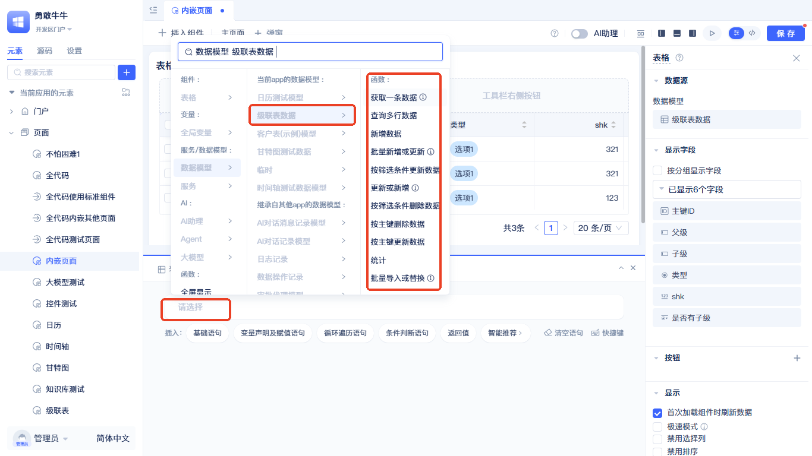

在常规页面的事件面板中，点击函数面板中空白语句上的`请选择`文案，在面板中选择`数据模型`-`【模型名称】`，可看到多个模型操作函数，以查询接口为例，选择`获取一条数据`。

### 全代码使用模型函数 {#full-code-using-model-functions}
模型函数的参数较多。考虑到参数的复杂度，开发者可以按以下方式可视化配置参数，并迅速定位到函数代码，直接拷贝到全代码页面中即可。

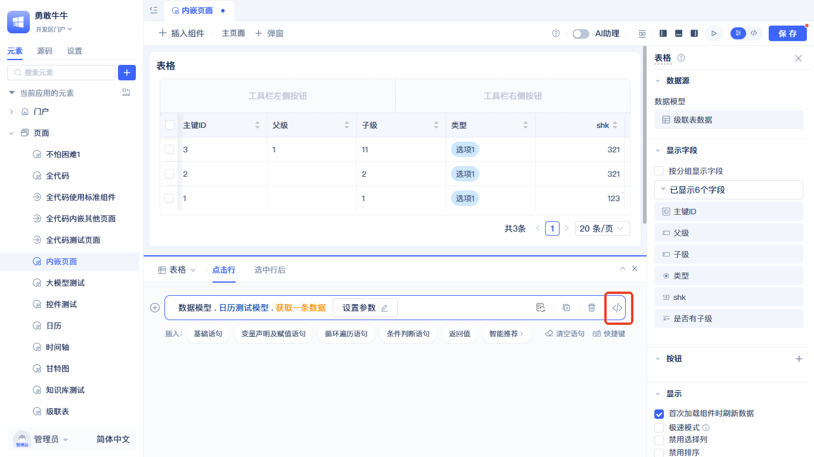

点击`参数设置`，配置好函数参数，在生成的函数语句最后，点击`</>`按钮，会跳转到源码区并定位到当前函数语句，复制函数语句`await this.app.models.CalendarTestModel.get(Q(Q("id", "=", 1)), null, 2);`到全代码中，即可。

:::warning
注意：页面中的数据模型函数都是以 `this.app` 开始，如果在使用的地方没有 `this.app`，请自行添加。
```typescript
import { getRuntimeApp } from 'jit';
const app = getRuntimeApp();
// app.models.xxx;
```
:::

## 服务函数的使用
参考[数据模型的增删改查](#crud-operations-for-data-models)

### 全代码调用服务函数
参考[全代码使用模型函数](#full-code-using-model-functions)

## 使用第三方包 {#use-third-party-packages}
在full-code-page-development中，你可以灵活引入第三方 npm 包来扩展功能。在编辑器的源码模式中修改 `package.json` 文件，添加所需的依赖包到 `dependencies` 字段，然后点击“保存”按钮。系统会自动在后端运行 `pnpm install` 来安装新添加的依赖包，安装完成后即可在代码中正常导入使用。

以rxjs为例，在`package.json`中添加依赖包：

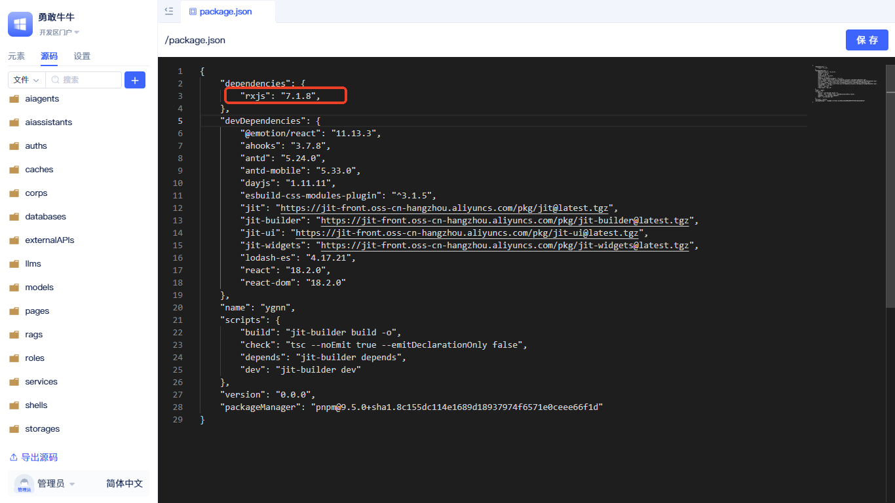

在 `package.json` 的 `dependencies` 字段添加 `rxjs` 依赖包，点击“保存”按钮，即可安装依赖。

### 使用网络资源
系统的打包器集成了从网络导包的能力，但要求网络包是 ES Module 格式，否则会报错。推荐使用 `https://esm.sh`。如果同样要使用 rxjs，可以在页面中直接引入 `import { Observable } from 'https://esm.sh/rxjs'`；

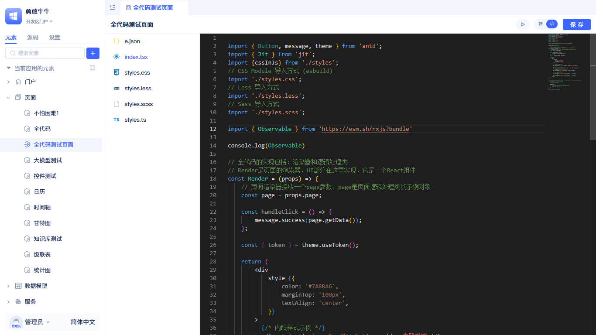

在前端文件中引入 `import { Observable } from 'https://esm.sh/rxjs?bundle'` 后，即可直接使用第三方包。

:::tip
esm.sh 还提供了一些优化参数，比如使用 `?bundle` 可以将多个 ES Module 压缩成一个文件，从而减少请求次数、提高性能。esm.sh 是一个开源项目，如果用于生产环境，建议自行部署，以提高可用性和安全性。
:::

## 打包配置的使用 {#use-packaging-configuration}
平台的前端打包器基于esbuild封装，配置项与esbuild保持一致。在应用根目录下的`jit.config.ts`文件中，你可以自定义打包参数来满足特定的构建需求。

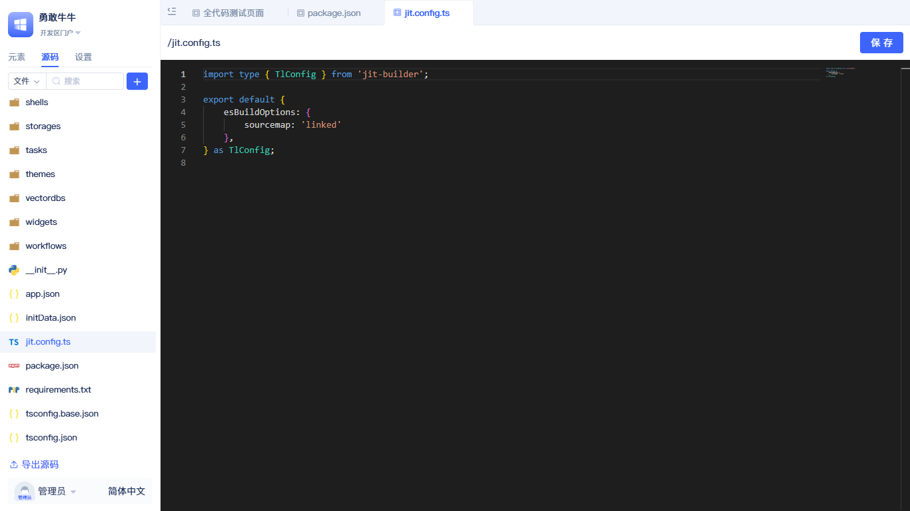

其中 esBuildOptions 的配置和 esbuild 一致，具体可参考 [esbuild 文档](https://esbuild.github.io)。

:::tip 使用源码调试
开发环境可开启 `jit.config.ts` 的 `sourcemap` 选项；生产环境建议设置为 `false`，以显著减少产物体积。
:::

### 引入打包插件
以引入 Less、SCSS 解析插件为例，这两个插件已经集成在平台的打包器 `jit-builder` 中。可按照[使用第三方包](#use-third-party-packages)的方式在 package.json 中引入 `jit-builder`。

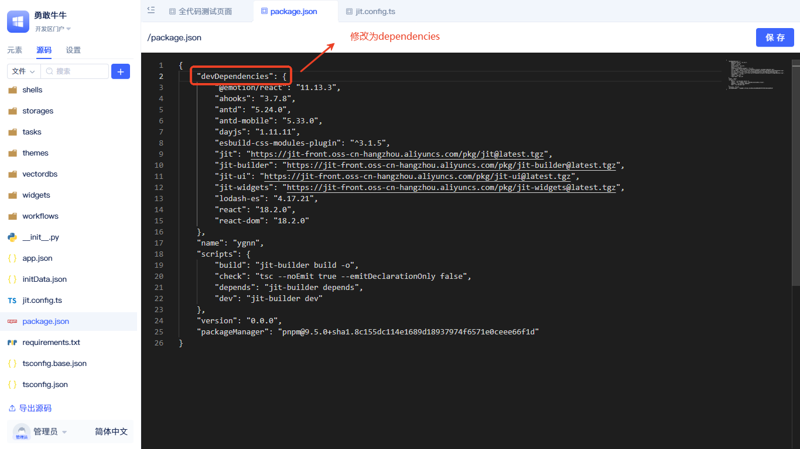

因为系统默认 package.json 中已经引入了 `jit-builder`，所以只需将 devDependencies 修改为 dependencies，然后保存。接下来修改打包配置文件 `jit.config.ts`。

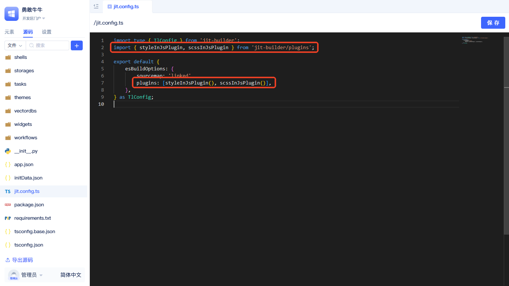

在 `jit.config.ts` 中引入 `styleInJsPlugin`、`scssInJsPlugin`，然后在 `plugins` 中添加即可。

:::tip 更多插件
上述方法适用于所有 esbuild 插件。如何找到对应的插件，参考 [esbuild 插件](https://esbuild.github.io/plugins/)
:::

## 系统内置包一览表
平台预置了常用的第三方库，可以直接在代码中导入使用，无需在 package.json 中声明：

| 包名 | 版本 | 全局变量名 | 说明 |
|------|------|-----------|------|
| **React生态** | | | |
| `react` | 18.2.0 | `React` | React核心库 |
| `react-dom` | 18.2.0 | `ReactDom` | React DOM 操作库 |
| `react-dom/client` | 18.2.0 | `ReactDomClient` | React 18 客户端 API |
| `react-dom/server` | 18.2.0 | `ReactDomServer` | React 服务端渲染 API |
| `react-router` | 6.18.0 | `ReactRouter` | React 路由核心 |
| `react-router-dom` | 6.18.0 | `ReactRouterDom` | React 路由 DOM 绑定 |
| `react-dnd` | 16.0.1 | `ReactDnd` | React拖拽库 |
| `react-dnd-html5-backend` | 16.0.1 | `ReactDndHtml5Backend` | HTML5拖拽后端 |
| **Vue生态** | | | |
| `vue` | 3.5.13 | `Vue` | Vue.js框架 |
| `element-plus` | 2.8.8 | `ElementPlus` | Vue3 UI组件库 |
| **UI组件库** | | | |
| `antd` | 5.24.0 | `JitAntd` | Ant Design 组件库 |
| `antd-mobile` | 5.33.0 | `antdMobile` | Ant Design 移动端组件 |
| `@ant-design/cssinjs` | 1.17.5 | `antCssInJs` | Ant Design CSS-in-JS |
| **样式处理** | | | |
| `@emotion/react` | 11.13.3 | `EmotionReact` | CSS‑in‑JS 库 |
| `@emotion/styled` | 11.13.0 | `EmotionStyled` | Emotion 样式组件 |
| `@emotion/cache` | 11.13.1 | `EmotionCache` | Emotion 缓存 |
| **工具库** | | | |
| `lodash` | 4.17.21 | `lodash` | JavaScript工具库 |
| `lodash-es` | 4.17.21 | `lodash` | Lodash ES 模块版本 |
| `dayjs` | 1.11.11 | `dayjs` | 轻量级日期库 |
| `axios` | 1.6.1 | `axios` | HTTP 客户端 |
| `ahooks` | 3.7.8 | `ahooks` | React Hooks 库 |
| `localforage` | 1.10.0 | `localforage` | 本地存储库 |
| `recast` | 0.23.4 | `recast` | JavaScript AST 工具 |
| **平台专用** | | | |
| `jit` | - | `JitCore` | JitAi 核心库 |
| `jit-utils` | - | `JitUtils` | JitAi 工具库 |
| `jit-ui` | - | `JitUi` | JitAi UI 组件库 |
| `jit-widgets` | - | `JitWidgets` | JitAi控件库 |

:::tip 直接使用
这些库无需安装即可直接导入使用，例如：`import { useState } from 'react'`、`import { Button } from 'antd'` 等。
:::

## 默认loader映射
平台基于 esbuild 构建，以下是系统默认的文件类型处理器配置：

| 文件类型 | Loader | 说明 |
|---------|--------|------|
| `.png` | `dataurl` | PNG图片文件，转为base64内嵌 |
| `.jpe` | `dataurl` | JPEG图片文件，转为base64内嵌 |
| `.jpeg` | `dataurl` | JPEG图片文件，转为base64内嵌 |
| `.gif` | `dataurl` | GIF动图文件，转为base64内嵌 |
| `.svg` | `dataurl` | SVG矢量图文件，转为base64内嵌 |
| `.css` | `dataurl` | CSS样式文件，转为base64内嵌 |
| `.py` | `text` | Python脚本文件，作为文本处理 |
| `.webp` | `dataurl` | WebP图片文件，转为base64内嵌 |

:::tip 自定义 loader
如需自定义其他文件类型的处理方式，可在 `jit.config.ts` 的 `esBuildOptions.loader` 中进行配置。
:::

## 相关阅读
### 创建全代码页面
了解如何创建React和Vue全代码页面，参考：[创建全代码页面](../shell-and-page/full-code-page-development)

### 全代码组件
了解在页面中使用全代码组件开发，参考：[全代码组件](../fullcode-ui-components-in-pages/ui-component-interface-specifications)
