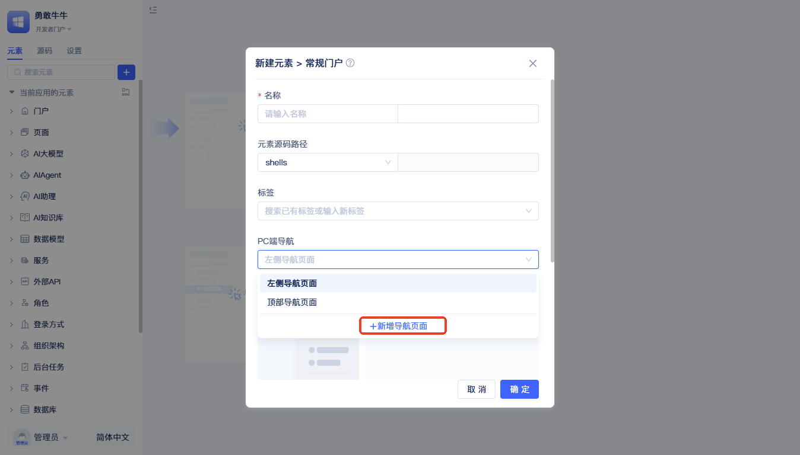

# 门户定制

当JitAi内置的常规门户、空白门户和SSR门户无法满足特定的界面需求时，全代码自定义门户提供了灵活的解决方案。自定义门户主要适用于以下场景：

- **导航布局调整**：需要改变导航菜单的位置、排列方式或层级结构
- **界面风格定制**：企业品牌要求或特殊设计规范下的界面样式调整
- **交互方式优化**：针对特定用户群体优化操作流程和交互体验
- **响应式适配**：针对特殊屏幕尺寸或设备类型进行界面适配
- **功能区域重组**：重新组织页面功能区域的布局和展示方式

自定义门户在保持JitAi平台数据模型、权限管理等核心功能的基础上，让开发者可以灵活调整门户的外观表现和用户交互方式。

## 创建自定义门户 {#creating-custom-portal}


在元素目录树点击搜索框右侧的+按钮，选择`门户`-`常规门户`。随后弹出创建常规门户元素的弹窗。



创建弹窗中填写`名称`，在PC端导航的下拉菜单中点击`新增导航页面`。随后会弹出创建导航页面的弹窗。


填写自定义门户的名称后，点击`确定`。返回到创建常规门户元素的弹窗，完成其他配置项，点击`确定`完成创建。


完成创建后，在元素目录树中选择`页面`-`ShellPage`-`自定义的门户名称`，可打开自定义门户页面编辑器，选择右上角的`<>`按钮，查看生成的代码实现。

## 核心文件结构 {#core-file-structure}

**根目录**
- `index.ts` - 模块入口，导出Render组件和PageCls类
- `PageRender.tsx` - 主页面渲染器，包含权限检查和布局逻辑
- `pageCls.ts` - 门户核心类，继承自Jit.BaseShell
- `context.ts` - React Context，用于组件间共享shell实例
- `e.json` - 元素配置文件

**components目录**
- `Nav.tsx` - 左侧导航容器组件
- `NavHeader.tsx` - 导航头部组件
- `MenuTree.tsx` - 菜单树组件，渲染可访问菜单
- `MultiTabsPage.tsx` - 多标签页面容器
- `PageTabs.tsx` - 标签页控件
- `*.style.ts` - 对应组件的样式文件

## 重要API和方法 {#important-apis-and-methods}

### 门户基础API {#portal-basic-apis}

**获取当前门户信息**
```typescript
import { getRuntimeApp } from 'jit';

// 获取门户定义和权限状态
const [shellDefine] = getRuntimeApp().getElementDefine(shell?.fullName);
```

**菜单管理API (ShellPage类)**
```typescript
// 获取有权限访问的菜单列表
get menus(): ShellMenu[]

// 根据菜单名称查找菜单配置
findMenu(menuName: string): ShellMenu | null

// 打开指定菜单页面
openMenu(menuName: string): void
```

### 页面渲染和导航 {#page-rendering-and-navigation}

**ElementRender组件**
```typescript
import { ElementRender } from 'jit-widgets';

// ElementRender是JitAi中最重要的页面渲染组件
// 用于渲染门户中的具体页面内容
<ElementRender
    elementPath={item.page}  // 页面元素路径
    {...params}              // 传递给页面的参数
/>
```

**页面打开事件**
```typescript
// 发布打开页面事件
this.publishEvent('OPEN_PAGE', {
    pageName: menuConfig.page,     // 页面名称
    pageUrl: `/${menuConfig.name}`, // 页面URL
    title: menuConfig.title,        // 页面标题
    icon: menuConfig.icon,          // 页面图标
    queryString: searchParams       // 查询参数
});
```

**监听页面事件**
```typescript
// 在组件中监听页面打开事件
useEffect(() => {
    const id = shell.subscribeEvent('OPEN_PAGE', (data) => {
        // 处理页面打开逻辑
        console.log('打开页面:', data);
    });

    return () => {
        shell?.unSubscribeEvent(id);
    };
}, []);
```

**获取当前路由信息**
```typescript
import { useLocation, useNavigate } from 'react-router-dom';

// 获取当前路由位置
const location = useLocation();

// 程序化导航
const navigate = useNavigate();
navigate('/menu-path');
```

### 权限验证 {#permission-verification}

**检查门户访问权限**
```typescript
// 在PageRender.tsx中的权限检查逻辑
{
    shellDefine.status ? (
        <div className="no-rights-wrapper">
            <div className="no-rights-text">
                对不起；你没有该门户的使用权限
            </div>
        </div>
    ) : (
        // 渲染正常门户内容
        <>
            <Nav />
            <MultiTabsPage />
        </>
    )
}
```

### 组件间通信 {#inter-component-communication}

**使用ShellContext**
```typescript
import { useShellContext } from '../context';

// 在任意组件中获取shell实例
const { shell } = useShellContext();

// 调用shell的方法
shell.openMenu('menuName');
```

**事件系统通信**
```typescript
// 发布事件
shell.publishEvent('CUSTOM_EVENT', eventData);

// 监听事件
const eventId = shell.subscribeEvent('CUSTOM_EVENT', (data) => {
    // 处理事件
});

// 取消监听
shell.unSubscribeEvent(eventId);
```
