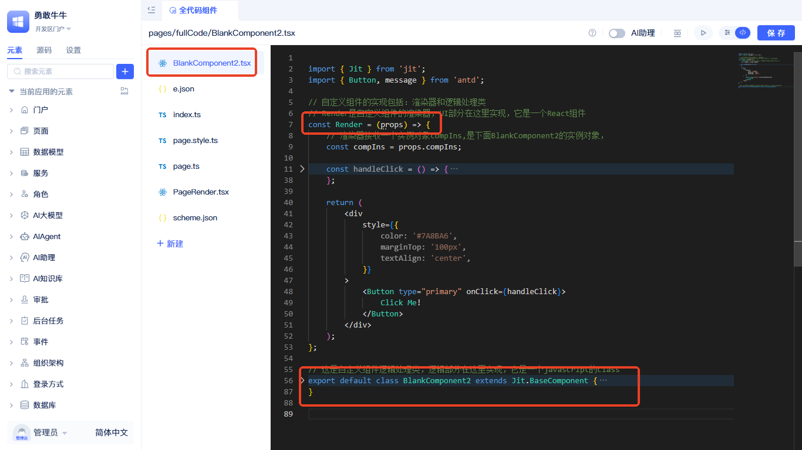
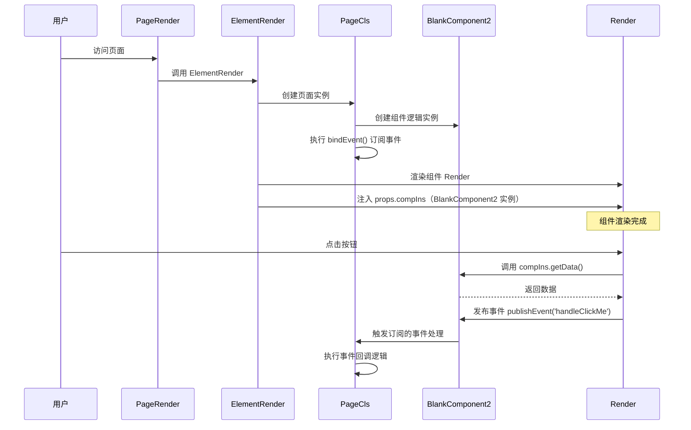

import Tabs from '@theme/Tabs';
import TabItem from '@theme/TabItem';

# 全代码组件接口规范

全代码组件基于 React 开发，需要遵循特定的接口规范和代码结构。本文档详细说明全代码组件的核心接口、文件结构和开发规范。

:::tip
与自定义组件类型不同的是，全代码组件的适用范围是当前页面，而自定义组件类型可以在多个页面中重复使用。全代码组件适合一些快速验证，需求灵活多变的场景。

如需了解如何创建全代码组件，请参考：[全代码组件创建指南](../using-functional-components-in-pages/full-code-components)
:::

## 组件接口架构 {#component-interface-architecture}



全代码组件遵循标准的三层架构：**页面渲染器**、**页面逻辑类** 和 **组件接口**。平台将页面装配过程封装为黑盒，开发者只需理解三个核心接口：

### 核心接口定义 {#core-interface-definitions}

- **页面渲染器（`PageRender.tsx`）**：调用平台 `ElementRender` 接口渲染整页
- **页面类（`page.ts`）**：实现 `Jit.GridPage` 接口，管理组件实例和事件订阅
- **组件类（`BlankComponent2.tsx`）**：继承 `Jit.BaseComponent` 接口，包含 `Render` 和逻辑方法

### 接口交互机制 {#interface-interaction-mechanism}

平台通过 `props.compIns` 将组件逻辑实例注入到渲染器中，实现界面与逻辑的分离。`ElementRender` 负责组件的生命周期管理和数据流控制。

### 接口实现规范 {#interface-implementation-specifications}

全代码组件必须遵循以下接口实现规范：

<Tabs>
  <TabItem value="index" label="index.ts" default>

```ts
import PageCls from "./page";
import Render from "./PageRender";

export { PageCls, Render };
```

  </TabItem>
  <TabItem value="pageRender" label="PageRender.tsx">

```tsx
import { ElementRender } from 'jit-widgets';
import { pageStyle, pageGlobalStyle } from './page.style';

export default (props) => (
  <ElementRender
    pageStyle={pageStyle}
    pageGlobalStyle={pageGlobalStyle}
    {...props}
    elementPath="pages.GridPageType"
  />
);
```

  </TabItem>
  <TabItem value="page" label="page.ts">

```ts
import type { ComponentPageScheme } from "jit";
import { Jit } from "jit";
import schemeJson from "./scheme.json";
import BlankComponent2 from "./BlankComponent2";
type BaseComponent = InstanceType<typeof Jit.BaseComponent>;

class PageCls extends Jit.GridPage {
  // 名称需与 scheme.json 中组件 name 一致："BlankComponent2"
  BlankComponent2!: BaseComponent = new BlankComponent2();
  scheme: ComponentPageScheme = schemeJson;

  // 页面级事件订阅
  bindEvent() {
    // 订阅组件渲染器中通过 compIns.publishEvent 发布的事件
    this.BlankComponent2.subscribeEvent('handleClickMe', async () => {
      // 这里可调用服务、更新页面变量、提示信息等
      // console.log('收到事件 handleClickMe');
    });
  }
}

export default PageCls;
```

  </TabItem>
  <TabItem value="component" label="BlankComponent2.tsx">

```tsx
import { Jit } from 'jit';
import { Button, message } from 'antd';

// 组件渲染器：接收 compIns（逻辑实例），负责 UI 与交互
const Render = (props) => {
  const compIns = props.compIns;
  const handleClick = () => {
    // 1) 调用逻辑方法
    message.success(compIns.getData());
    // 2) 发布事件，供页面或其他组件订阅
    compIns.publishEvent('handleClickMe');
  };
  return (
    <div style={{ color:'#7A8BA6', marginTop:'100px', textAlign:'center' }}>
      <Button type="primary" onClick={handleClick}>Click Me!</Button>
    </div>
  );
};

// 逻辑处理类：对外暴露方法、事件等
export default class BlankComponent2 extends Jit.BaseComponent {
  // 将渲染器挂到逻辑对象上
  Render = Render;

  // 对外提供的方法，可被页面/其他组件调用
  getData() {
    return 'so cool !!!';
  }
}
```

  </TabItem>
  <TabItem value="scheme" label="scheme.json">

```json
{
  "layout": [
    {
      "i": "BlankComponent2",
      "x": 0,
      "y": 0,
      "w": 48,
      "h": 30
    }
  ],
  "componentList": [
    {
      "fullName": "components.BlankComponent",
      "type": "components.BlankComponent",
      "name": "BlankComponent2",
      "title": "全代码组件2",
      "config": {
        "requireElements": []
      },
      "showTitle": true,
      "eventList": [],
      "functionList": [],
      "variableList": []
    }
  ],
  "autoIncrementId": 4,
  "variableList": [],
  "functionList": [],
  "matchUarParamsVariableNameList": []
}
```

  </TabItem>
</Tabs>

### 接口运行时序 {#interface-runtime-sequence}



### 接口调用说明 {#interface-invocation-explanation}

全代码组件接口的核心调用机制：

- **页面接口**：`PageRender` 调用 `ElementRender` 接口，平台根据 `scheme.json` 配置生成组件树
- **组件接口**：平台创建组件逻辑实例，通过 `props.compIns` 接口传入渲染器
- **事件接口**：`Render` 通过 `compIns` 接口调用逻辑方法、发布事件；`page.ts` 通过 `bindEvent()` 接口订阅事件

## 相关文档 {#related-documentation}

- [在全代码组件中调用页面和组件函数](./calling-page-and-component-functions-in-fullcode-components) - 了解如何在全代码组件中调用其他组件和页面的方法
- [发布和订阅事件](./emitting-events) - 了解全代码组件的事件机制
- [在页面代码中调用全代码组件函数](./calling-fullcode-component-functions-in-page-code) - 了解如何从页面代码中调用全代码组件的方法
