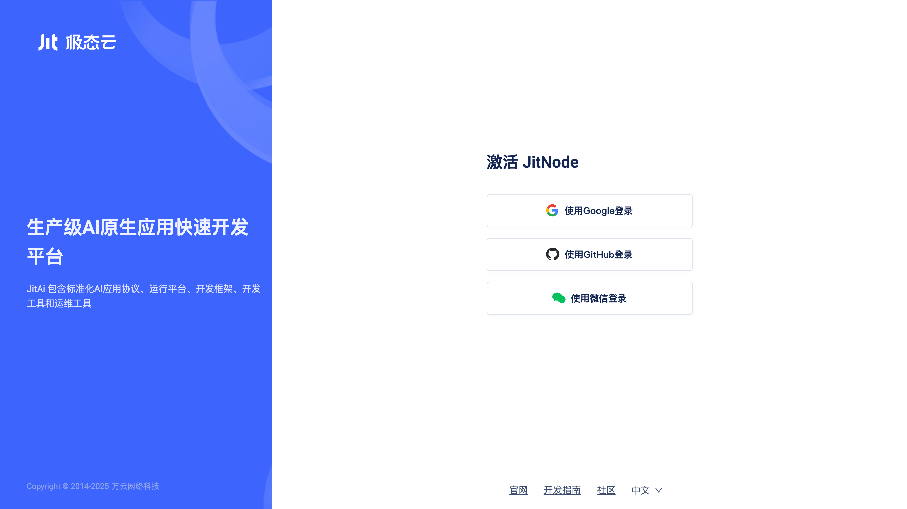
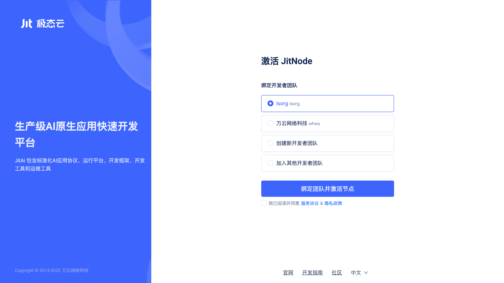
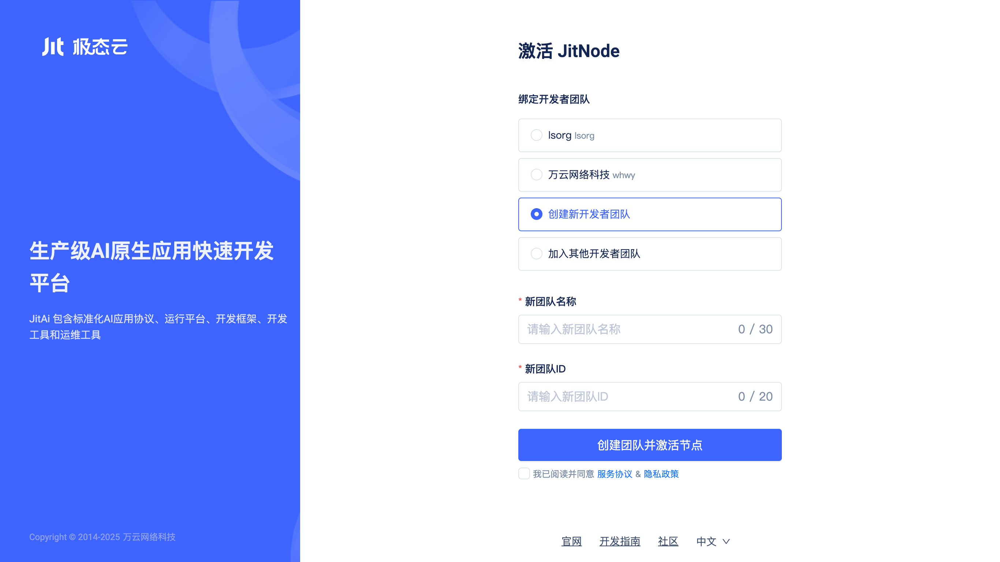
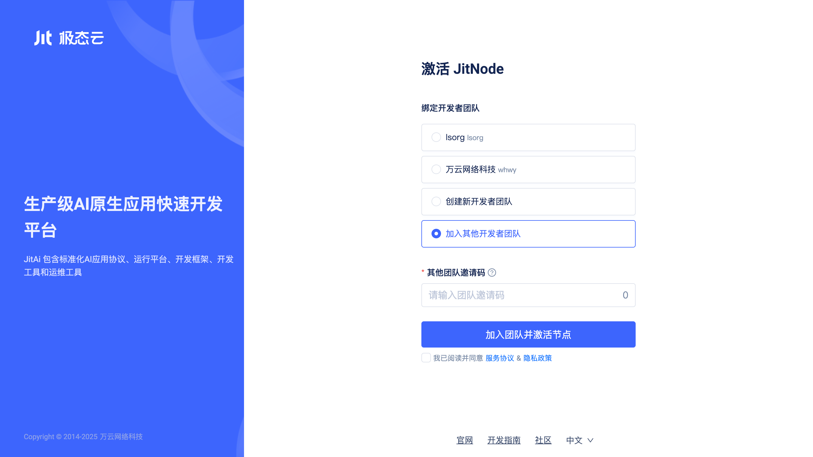
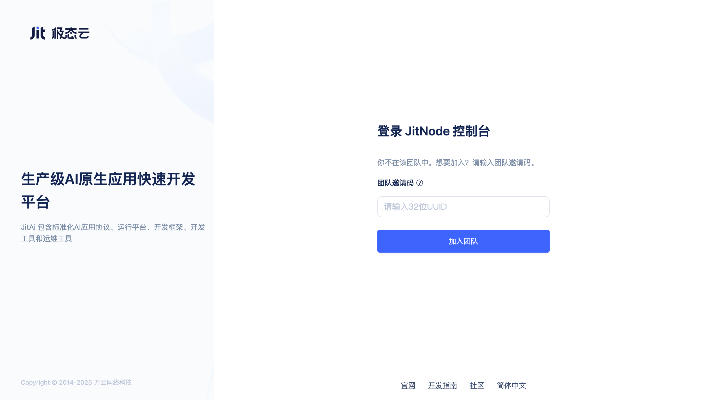
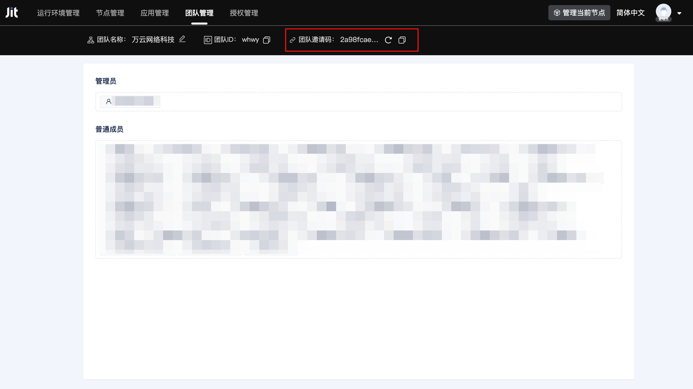

# 节点激活与开发者团队

## 什么是节点 {#what-is-jitnode}
Jit节点（即JitNode）是运行在操作系统上的一个应用程序（支持桌面版安装以及Docker镜像安装），它作为运行引擎提供JitAi应用的虚拟运行环境并对JitAi应用进行解释运行。Jit节点是JitAi技术架构中的底层基础设设施。

## 什么是开发者团队 {#what-is-developer-team}
开发者团队是管理应用的基本单位，团队成员在同一个团队下能够协作开发应用，共享资源。不同团队在软硬件资源、数据、应用等方面是隔离的。每个开发者团队可以绑定多个Jit节点，每个节点只能绑定到一个团队，每个开发者可以加入多个开发者团队。

## 在激活节点时创建新的开发者团队 {#create-new-dev-team-when-activating-node}
用户完成节点安装后，首次访问会进入节点激活页面。系统支持多种激活方式：Google、Github、微信。

用户选择激活方式后进入到团队绑定方式的选择界面。

用户选择`创建新开发者团队`后输入团队名称、团队ID，勾选`我已阅读并同意`后点击`创建团队并激活节点`按钮，即可创建新团队。当前节点自动激活并绑定到该团队，当前用户会自动作为管理员加入团队。

## 在激活节点时将节点绑定到自己已加入的团队 {#bind-node-to-joined-team-when-activating}
如果用户已经加入过团队，绑定方式选择界面中会显示已加入的团队列表。

用户可直接点击选择，当前节点会完成激活并绑定到选择的团队。

## 在激活节点时使用团队邀请码加入团队并绑定 {#use-team-bind-code-to-join-and-bind-when-activating-node}

用户选择`加入其他开发者团队`后输入`团队邀请码`，点击`加入团队并激活节点`即可完成节点的激活绑定，用户自动成为该团队普通成员。

## 在登录已有节点时通过团队邀请码加入团队 {#join-team-via-bind-code-when-logging-into-existing-node}
当用户首次登录一个已激活绑定的节点时，需要输入团队邀请码加入团队。

用户输入团队邀请码后点击`加入团队`即可，用户自动成为该团队普通成员。

## 查看和刷新团队邀请码 {#view-and-refresh-team-bind-code}
任意团队成员都可以在团队管理页面中查看和刷新团队邀请码。

用户点击`刷新`按钮后，会生成一个新的团队邀请码，并显示在页面中，原有邀请码立即失效。

:::warning 注意

为防止团队邀请码泄露，每次邀请成员加入团队后应立即刷新团队邀请码。

:::

## 移除团队成员 {#remove-team-member}
仅管理员可以在团队管理页面移除其他成员。