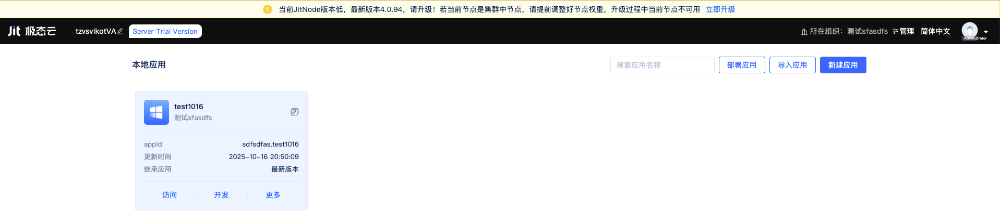
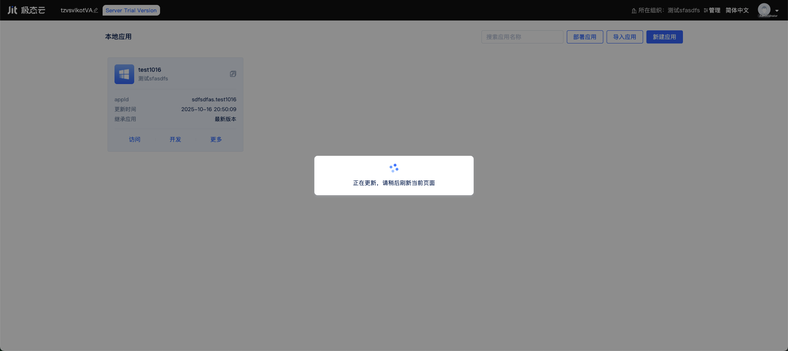

# 平台节点的更新升级

当平台节点有新版本可用时，[节点控制台](../creating-and-publishing-applications/runtime-environment-management) 首页顶部会出现更新提示横幅，提醒当前 JitNode 版本较低并给出最新版本号，例如“当前 JitNode 版本低，最新版本 4.0.94，请升级！若当前节点是集群中节点，请提前调整好节点权重，升级过程中当前节点不可用 立即升级”。

## 升级提示与入口 {#upgrade-entry}

当检测到可用更新时，页面顶部会显示如下提示横幅，点击`立即升级`进入一键升级流程：

## 一键升级流程 {#one-click-upgrade}

1. 点击横幅中的`立即升级`。
2. 页面将显示“正在更新，请稍后刷新当前页面”的进度提示：

   

3. 升级过程中平台服务会执行重启，节点将短暂不可用。请耐心等待升级完成。
4. 升级完成后，顶部提示会自动消失。

## 集群环境中的升级建议 {#cluster-recommendations}

为确保业务连续性，[集群环境](../advanced-guide/application-layer-stability-guarantee)建议按以下方式进行滚动升级：

- 将待升级节点的权重临时调低至 0，或从流量入口移除该节点。
- 确认其他节点健康承载流量后，执行该节点的一键升级。
- 升级完成并验证正常后，再恢复节点权重，将其重新纳入流量分配。
- 按节点逐一滚动完成升级。
