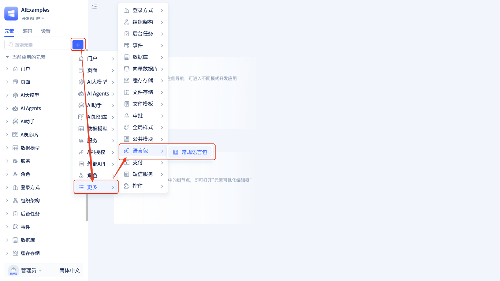
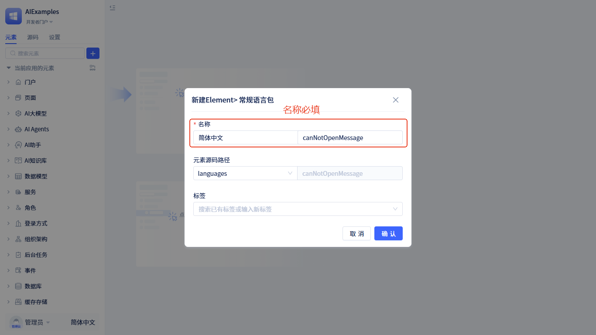
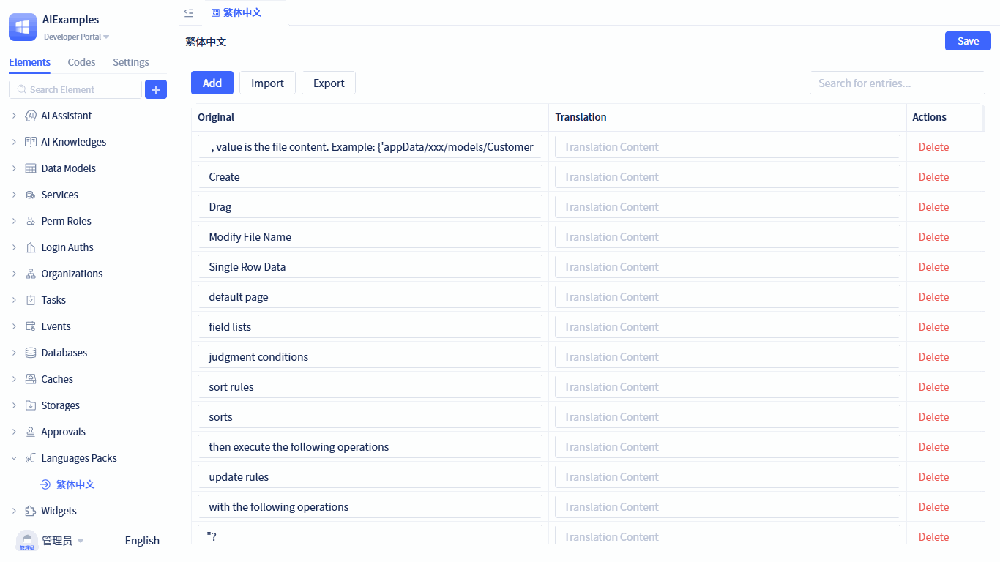
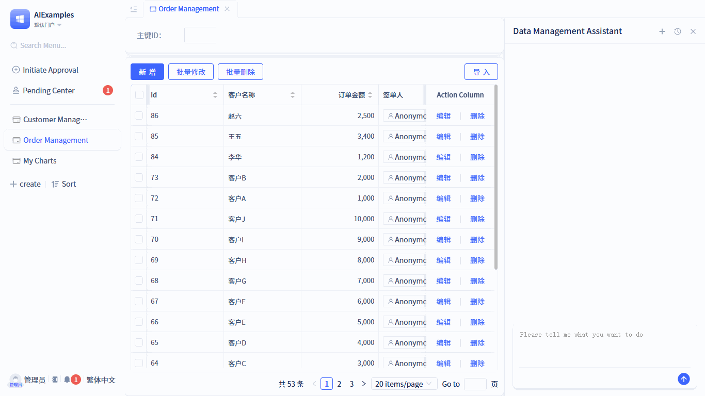

JitAi平台内置简体中文和English两种语言包。应用运行时，系统会根据浏览器的语言设置自动选择对应的语言包。如果浏览器语言不在支持范围内，则默认使用English。你可以根据需要灵活创建自定义语言包。

## 创建语言包 {#creating-language-packages}

语言包创建步骤如下：



点击 <span style={{ background:"#3d65fd", display: "inline-block", borderRadius: "8px", textAlign: "center", lineHeight: "100%", color: "#ffffff", fontSize: "24px", padding: "0px 10px 5px" }}>+</span>  → **更多** → **语言包** → **常规语言包**，打开创建表单，填写名称后，点击 `确认` 按钮完成创建。



语言包创建完成后会自动打开可视化编辑器，你可以在该编辑器中对已有词条进行翻译，也可以添加新的词条。

## 翻译内置词条 {#translating-built-in-terms}

可视化编辑器中会列出当前开发框架及可视化开发工具中的所有词条，你只需要输入每个词条对应的语种内容即可。保存后立即生效。


## 添加新的词条 {#adding-new-terms}

你可以将应用中的任意文本内容添加为词条，并翻译成目标语言。添加后系统会立即生效，无需重启应用。



**示例说明：** 默认门户中存在一个名为 `Order Management` 的菜单项，但缺少繁体中文翻译。当我们在繁体中文语言包中添加词条映射 `Order Management` → `訂單管理` 后，刷新门户页面，该菜单项将自动显示为 `訂單管理`。

## 导入词条 {#importing-terms}
通过导入JSON文件，可以批量翻译词条。JSON中每个key对应应用代码中原始显示的内容，value为翻译成对应语种的内容。示例如下：
```json
{
    "Add": "創建",
    "Order Management": "​訂單管理",
    ...
}
```

你可以通过导出功能获取所有需要翻译的词条。导出的也是一个JSON文件，key是应用代码中原始显示的内容，你只需要补充对应语种的内容即可。

