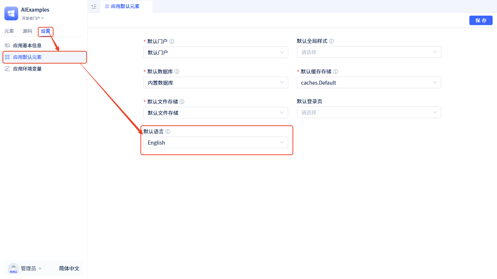

# 默认语言
默认语言决定了应用在没有用户明确选择语言时的显示语言。合理配置默认语言可以提升用户体验，确保应用在首次访问时就能以用户熟悉的语言显示。

## 默认语言配置 {#default-language-configuration}

**配置步骤：**

1. 进入开发者门户
2. 左侧导航栏切换到**设置**
3. 打开**应用默认元素**
4. 选择**默认语言**

## 语言选择策略 {#language-selection-strategy}

系统按以下优先级选择显示语言：

1. **用户手动选择的语言**：如果用户已明确选择过语言，优先使用用户选择
2. **应用默认语言**：如果配置了默认语言，使用配置的默认语言
3. **浏览器语言**：根据浏览器自身的语言设置自动选择，比如浏览器设置为英语，系统就使用英语语言包
4. **系统默认**：如果以上都无法匹配，默认使用 English

## 配置建议 {#configuration-recommendations}

- **目标用户群体**：根据主要用户群体的语言习惯设置默认语言
- **市场覆盖**：如果应用面向多个地区，建议选择使用最广泛的语言
- **内容完整性**：确保选择的默认语言有完整的翻译内容
- **测试验证**：配置后在不同语言环境下测试应用显示效果

**注意事项：**
- 默认语言配置会影响所有未登录用户和首次访问用户
- 已登录用户的语言偏好会覆盖默认语言设置
- 建议在配置前确保对应语言包内容完整

