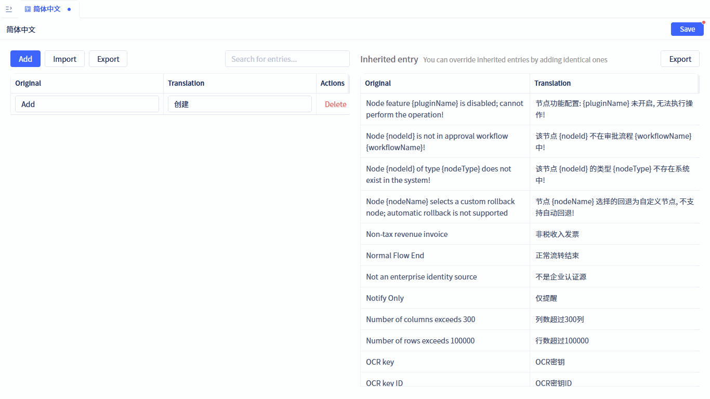
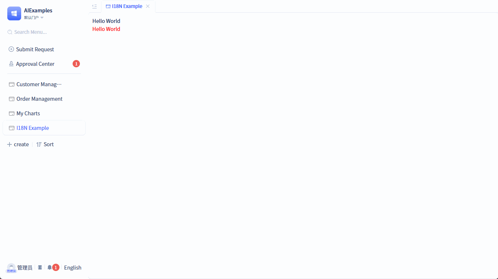
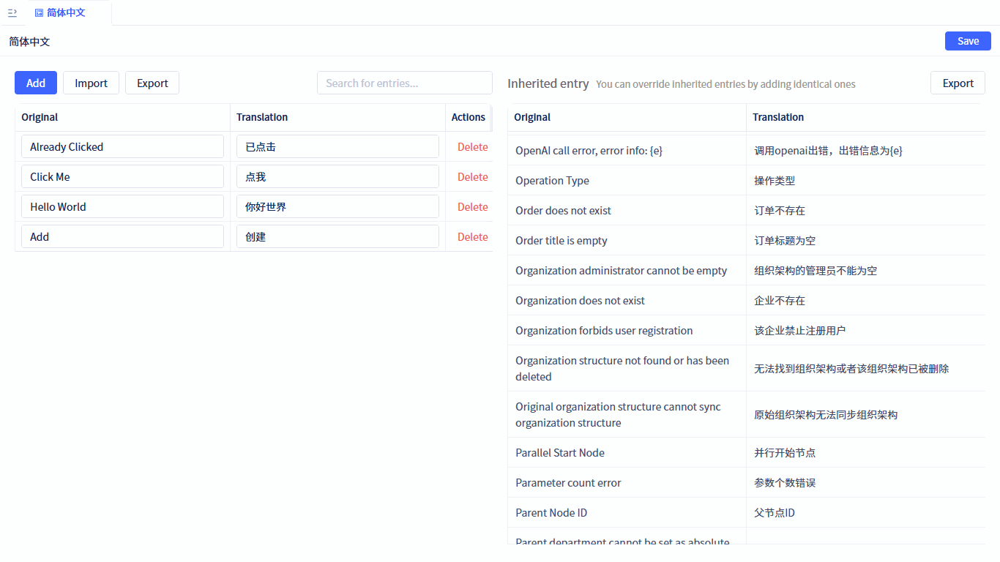
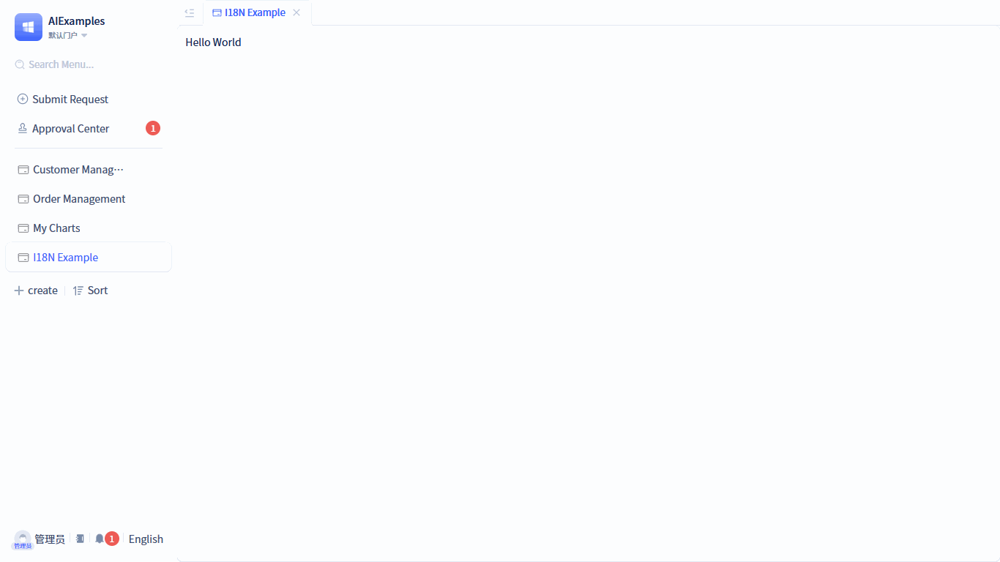
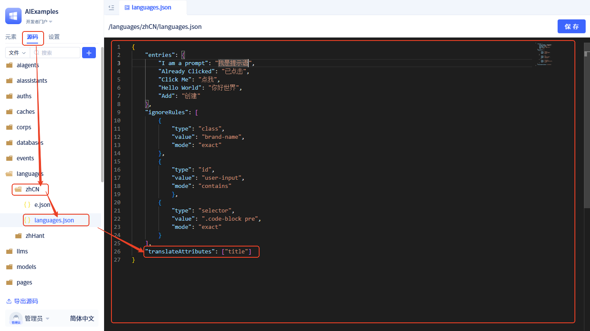
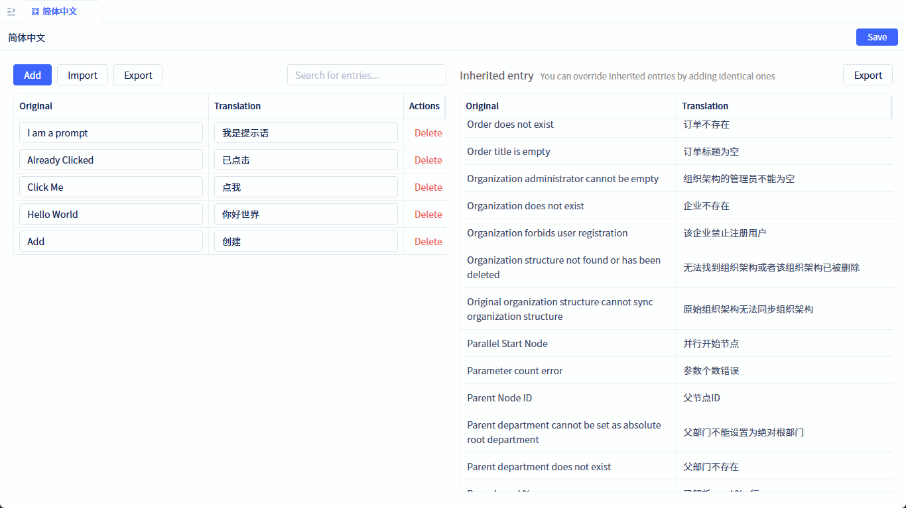

# 如何翻译页面术语

## 自动文本翻译 {#automatic-text-translation}

默认情况下，DOM节点中的文本会自动进行翻译处理。以下是一个简单的示例：

```typescript
const TestI18N = () => {
    return <span>Hello World</span>
}
```

当在简体中文词条中添加 `Hello World` → `你好世界` 的翻译映射后，运行时切换到简体中文时，页面会自动显示为 `你好世界`，无需额外处理。



如果需要在特定语言环境下保持部分内容不被翻译，可以在DOM节点上添加 `translate-ignore` 类名：

```typescript
const TestI18N = () => {
    return (
        <>
            <div>Hello World</div>
            <div
                style={{color: "red"}}
                className="translate-ignore"
            >
                Hello World
            </div>
        </>
    )
}
```



此外，还可以通过自定义[忽略翻译规则](./translate-ignore-rules)进行更精细的控制。

## 响应式文本翻译 {#dynamic-text-translation}

JitAi的国际化方案支持DOM变化监听机制，能够自动检测页面中动态添加或修改的DOM节点，并对其中的文本内容进行实时翻译。这确保了即使是通过JavaScript动态生成的内容，也能自动应用国际化处理。

**工作原理**
- **自动监听**：系统会自动监听DOM树的变化，包括节点添加、删除、修改等操作
- **智能识别**：只对包含文本内容的节点进行翻译处理，避免不必要的性能开销
- **实时响应**：检测到变化后立即进行翻译，无需手动触发
- **性能优化**：采用高效的监听算法，确保不影响页面性能

以下示例展示了动态内容的翻译：

```typescript
import { Button, message } from 'antd';

const TestI18N = () => {
    const handleClick = () => {
        message.success("Already Clicked");
    };

    return (
        <Button type="primary" onClick={handleClick}>Click Me</Button>
    );
}
```

在简体中文词条中添加 `Click Me` → `点我`，`Already Clicked` → `已点击` 的翻译映射后，查看演示效果：



## DOM节点属性翻译 {#dom-node-attribute-translation}

除了DOM节点的文本内容，HTML标签中的属性值也经常需要翻译。
JitAi的国际化方案默认会自动翻译以下HTML属性：

- **placeholder**: 输入框占位符文本
- **title**: 元素标题提示文本
- **alt**: 图片替代文本
- **value**: 只读输入框的值（仅限 `readonly` 状态的 input 元素）

**使用示例**

```typescript
const TestI18N = () => {
    return (
        <span title="Hello World">Hello World</span>
    )
}
```


**自定义翻译属性**

如果需要翻译其他HTML属性，可以通过代码配置方式添加：



**配置步骤：**

1. 进入开发者门户
2. 左侧导航栏切换到源码导航
3. 找到对应语言包的 `languages.json` 文件
4. 在配置对象中添加 `translateAttributes` 字段

**配置示例：**
```json
{
  "translateAttributes": [
    "placeholder",
    "title", 
    "alt",
    "value",
    "aria-label",
    "data-tooltip"
  ]
}
```
**注意事项：**
- 配置的属性名区分大小写
- 建议只添加确实需要翻译的属性
- 避免配置功能性属性（如 `id`、`class` 等）


## 使用API翻译 {#using-api-translation}

页面中除了DOM元素外，还存在非DOM内容（如alert提示语等），这些内容无法通过DOM节点自动翻译机制处理，需要手动调用翻译API。JitAi的国际化方案提供了编程式翻译接口：`runtimeApp.i18n.translate('xxxx')`。

使用方法如下：

```typescript
import { Button } from antd;
import { getRuntimeApp } from jit;

const TestI18N = () => {
    const handleClick = () => {
        const app = getRuntimeApp();
        alert(app.i18n.translate('I am a prompt'));
    }

    return (
        <Button type="primary" onClick={handleClick}>Click Me</Button>
    )
}
```


