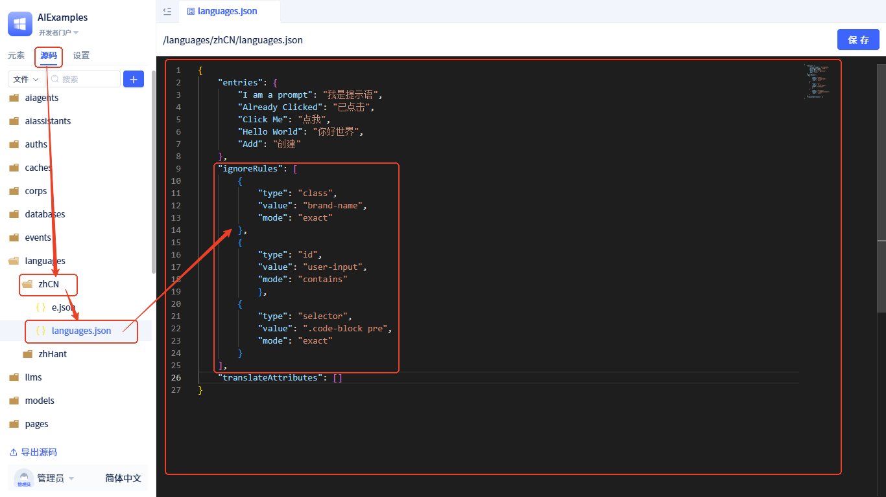

# 忽略翻译规则

在JitAi平台中，默认情况下所有DOM节点中的文本内容都会自动进行翻译处理。但在某些场景下，您可能需要阻止特定文本被翻译，比如：

- 品牌名称、产品名称等专有名词
- 技术术语、代码片段
- 用户自定义的固定文本内容
- 不需要本地化的界面元素

## 基础用法 {#basic-usage}

### 使用 translate-ignore 类名

最简单的方式是在需要忽略翻译的DOM节点上添加 `translate-ignore` 类名：

```html
<span className="translate-ignore">Hello World</span>
<div className="translate-ignore">
  <p>这段文本不会被翻译</p>
  <p>包括子元素也不会被翻译</p>
</div>
```

**注意事项：**
- `translate-ignore` 类名会应用到整个元素及其所有子元素
- 确保类名拼写正确，区分大小写
- 建议在语义上确实不需要翻译的元素上使用

## 高级配置 {#advanced-configuration}

除了使用默认的 `translate-ignore` 类名，您还可以通过配置自定义规则来更精确地控制哪些内容需要忽略翻译。

#### 规则接口定义

```typescript
export interface IgnoreRule {
    type: 'class' | 'id' | 'attribute' | 'selector'; // 规则类型
    value: string; // 匹配值
    mode?: 'exact' | 'contains' | 'startsWith' | 'endsWith' | 'regex'; // 匹配模式，默认为exact
}
```

#### 规则类型说明

- **class**: 基于CSS类名匹配
- **id**: 基于元素ID匹配  
- **attribute**: 基于HTML属性匹配
- **selector**: 基于CSS选择器匹配

#### 匹配模式说明

- **exact**: 精确匹配（默认）
- **contains**: 包含匹配
- **startsWith**: 前缀匹配
- **endsWith**: 后缀匹配
- **regex**: 正则表达式匹配

#### 配置示例

```json
{
  "ignoreRules": [
    {
      "type": "class",
      "value": "brand-name",
      "mode": "exact"
    },
    {
      "type": "id", 
      "value": "user-input",
      "mode": "contains"
    },
    {
      "type": "selector",
      "value": ".code-block pre",
      "mode": "exact"
    }
  ]
}
```

## 配置方法 {#configuration-method}

目前暂不支持通过可视化界面配置忽略规则，需要通过全代码方式进行配置：



**配置步骤：**

1. 进入开发者门户
2. 左侧导航栏切换到源码导航
3. 找到对应语言包的 `languages.json` 文件
4. 在配置对象中添加 `ignoreRules` 字段
5. 按照上述接口定义配置具体的忽略规则

