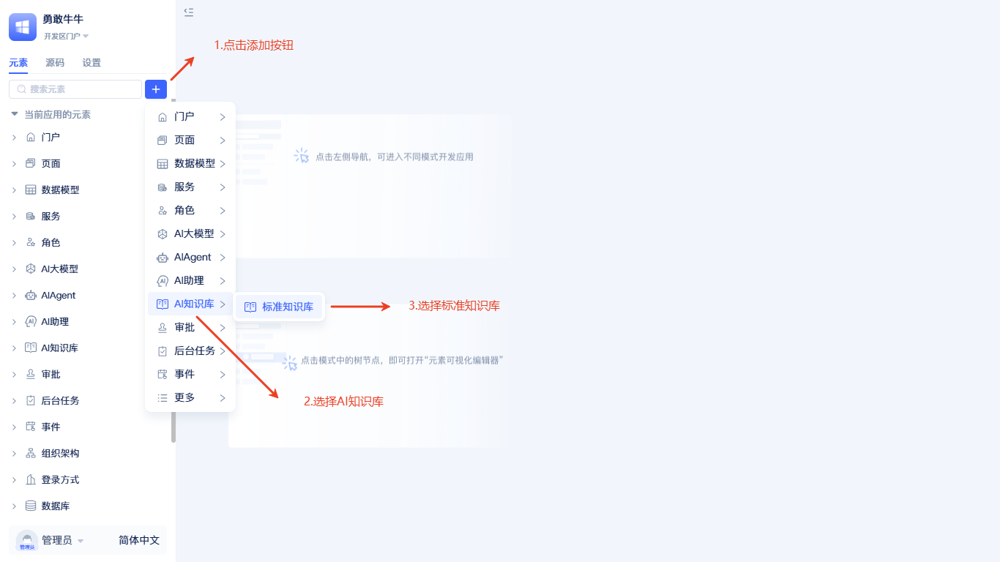
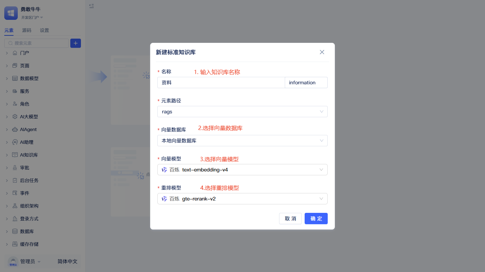
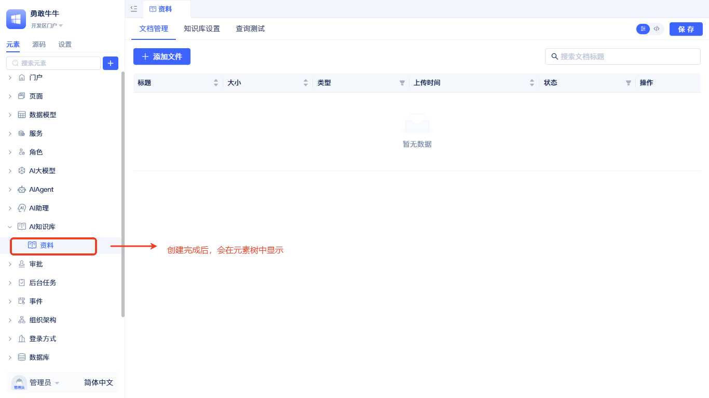
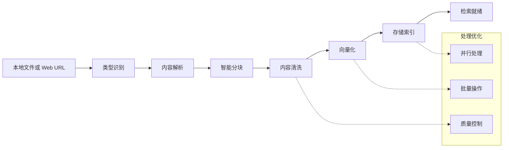
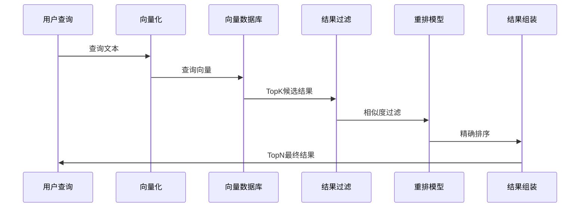

# 创建可被 Agent 检索的 AI 知识库
AI 知识库用于沉淀产品手册、制度文件、FAQ、操作说明、网页资料等事实性内容。平台会将这些资料处理成可检索的知识片段，供 [AI Agent](../ai-agent/agent-knowledge-base) 在回答问题时查阅，也可在后端可视化编程中通过知识库方法进行语义检索、关键词检索、文档新增和文档删除。

知识库适合解决“根据哪些资料回答”的问题。如果要规范 Agent 的处理步骤、输出格式或业务规则，应结合 [AI技能](../skills/overview) 或 Agent 系统提示词一起使用。

## 创建用于产品文档问答的 AI 知识库元素 {#create-ai-knowledge-base-element}
:::tip
建议先完成[大模型厂商](../ai-llm/create-ai-llm#creating-llm-vendor-elements)和[向量数据库](./vector-database-standalone-deployment)的创建，再创建 AI 知识库，以便在创建流程中直接选择对应元素。大模型厂商推荐`阿里百炼`和`硅基流动`，它们提供较丰富的向量模型和重排模型。
:::

在元素目录树点击搜索框右侧的`+`按钮，选择`AI知识库`-`标准知识库`。随后弹出创建 AI 知识库元素的弹窗。

创建弹窗中填写`名称`，选择`向量数据库`和`向量模型`。`重排模型`为可选项：配置后可对向量召回结果进行二次排序；不配置时，知识库会直接使用向量检索结果。点击`确定`完成创建。

:::tip
向量模型对检索效果影响较大，创建后不能直接修改。若后续需要更换向量模型或向量数据库，应规划文档重新向量化和数据迁移。
:::

创建完成后会在左侧元素树中显示。

## 知识库如何把资料变成可检索内容 {#principle-description}

开发者通常只需要关注三类配置：

- **向量数据库**：保存文档片段的语义索引。开发测试可使用本地化配置，生产环境建议使用独立部署的向量数据库。
- **向量模型**：决定文档和用户问题如何转成语义向量，是知识库检索效果的基础。
- **重排模型**：可选。用于对召回片段重新排序，适合资料量较大、候选结果相近、需要提高前几条命中质量的场景。

创建知识库后，继续在[知识库文档管理](./knowledge-base-document-management)中添加本地文件或 Web URL，并通过查询测试验证检索效果。

### 文档处理流程 {#data-processing-flow}

```mermaid
flowchart LR
    A[本地文件或 Web URL] --> B[类型识别]
    B --> C[内容解析]
    C --> D[智能分块]
    D --> E[内容清洗]
    E --> F[向量化]
    F --> G[存储索引]
    G --> H[检索就绪]

    subgraph "处理优化"
        I[批量操作]
        J[并行处理]
        K[质量控制]
    end

    F -.-> I
    G -.-> J
    E -.-> K
```

上传资料后，平台会解析内容、按配置拆分片段、清洗文本并向量化。处理完成的文档状态会显示为`OK`，此后即可被查询测试、Agent 或后端函数检索。

### 检索机制 {#retrieval-mechanism}

```mermaid
sequenceDiagram
    participant U as 用户查询
    participant V as 向量化
    participant D as 向量数据库
    participant F as 结果过滤
    participant R as 重排模型
    participant A as 结果组装

    U->>V: 查询文本
    V->>D: 查询向量
    D->>F: TopK候选结果
    F->>R: 相似度过滤
    R->>A: 精确排序
    A->>U: TopN最终结果
```

用户查询经过向量化后，系统会先召回 TopK 个语义相近的候选片段，并按向量相似度阈值过滤低质量结果。若配置了重排模型，系统会继续重排并按重排分数阈值过滤；若未配置重排模型，则直接返回向量检索结果中的前 TopN 个片段。

> 关于检索参数配置和在后端可视化编程中的具体使用方法，请参见[使用知识库进行语义检索和关键词检索](./keyword-and-semantic-search)。
