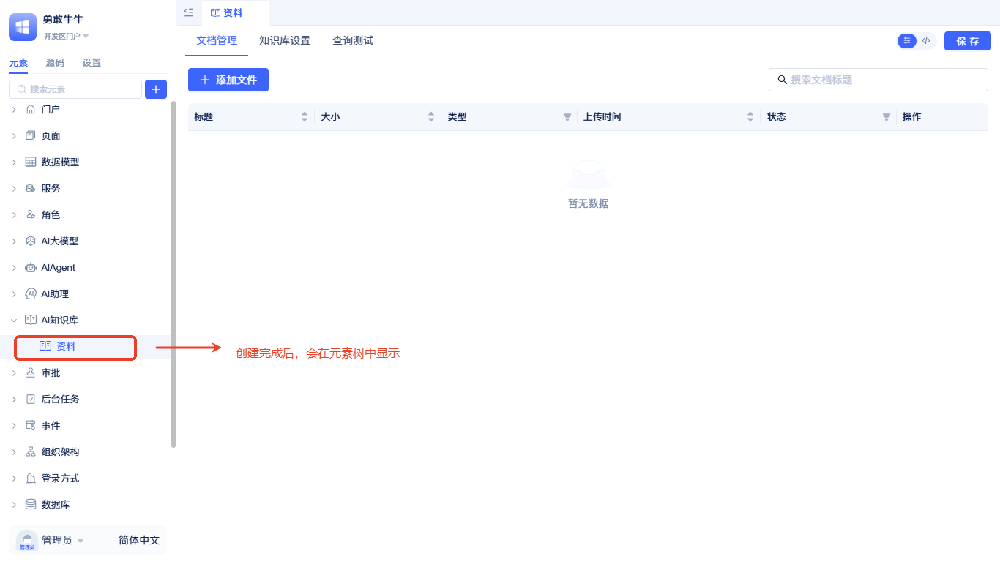

# AI知识库
在传统应用系统中，经常面临用户手册散落在各个文档，常见问题答案需要反复查找的问题。

AI知识库元素正是为了解决这些痛点而生。它不仅是文档的存储容器，还具备语义理解的检索能力。它将各类文档转化为可被“理解”的结构化知识，当用户提出问题时，知识库会理解语义意图，返回知识库中匹配的答案。

## 创建AI知识库元素 {#create-ai-knowledge-base-element}
:::tip
建议先完成[大模型厂商](../ai-llm/create-ai-llm#create-llm-vendor-element)和[向量数据库](./vector-database-standalone-deployment)的创建，再创建AI知识库，以便在创建流程中直接选择对应元素。大模型厂商推荐`阿里百炼`和`硅基流动`，他们有比较丰富的向量和重排模型供开发者选择。
:::

在元素目录树点击搜索框右侧的`+`按钮，选择`AI知识库`-`标准知识库`。随后弹出创建AI知识库元素的弹窗。

创建弹窗中需依次完成`名称`,`向量数据库`，`向量模型`和`重排模型`的选择。点击`确定`完成创建。

:::tip
向量模型对搜索的结果有较大的影响，请根据实际情况选择，创建完成后不允许再次修改。
:::

创建完成后会在左侧元素树中显示。

## 原理说明 {#principle-description}

文档上传后，系统会自动解析文档内容，将长文本切分成合适的片段，清洗掉无用信息，然后通过向量模型转换为数学向量，最终存储到向量数据库中供语义检索使用。

> 更多关于检索流程、参数说明与测试方法，请参见[使用知识库进行全文与语义检索](./full-text-and-semantic-search)。
