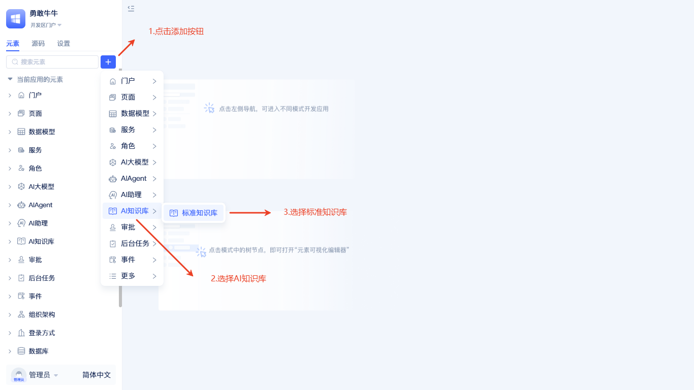

# 创建知识库元素
AI知识库是智能知识检索系统，它将非结构化文档转化为可被语义理解的结构化知识。作为实现RAG（检索增强生成）的核心组件，知识库为[AI Agent](../ai-agent/agent-knowledge-base)提供准确、及时的领域知识检索能力。

知识库由向量模型、重排模型、向量数据库、文档处理器和关系数据库五个核心组件协同工作。支持PDF、DOCX、TXT、MD等文档格式，提供语义检索和关键词检索两种检索方式。通过两阶段检索机制（向量检索+重排序），系统能够理解查询的语义意图，返回最相关的知识片段。

## 创建AI知识库元素 {#create-ai-knowledge-base-element}
:::tip
建议先完成[大模型厂商](../ai-llm/create-ai-llm#creating-llm-vendor-elements)和[向量数据库](./vector-database-standalone-deployment)的创建，再创建AI知识库，以便在创建流程中直接选择对应元素。大模型厂商推荐`阿里百炼`和`硅基流动`，他们有比较丰富的向量和重排模型供开发者选择。
:::

在元素目录树点击搜索框右侧的`+`按钮，选择`AI知识库`-`标准知识库`。随后弹出创建AI知识库元素的弹窗。

创建弹窗中需依次完成`名称`,`向量数据库`，`向量模型`和`重排模型`的选择。点击`确定`完成创建。

:::tip
向量模型对搜索的结果有较大的影响，请根据实际情况选择，创建完成后不允许再次修改。
:::

创建完成后会在左侧元素树中显示。

## 原理说明 {#principle-description}

### 核心构成要素 {#core-components}

AI知识库基于先进的RAG（检索增强生成）架构，由五个核心组件协同工作：

- **向量模型**：将文档和查询转换为高维向量表示，实现语义理解
- **重排模型**：对初步检索结果进行精确排序，提升匹配准确度
- **向量数据库**：高效存储和检索向量数据，支持大规模相似度计算
- **文档处理器**：智能解析、分块、清洗文档内容，优化向量化效果
- **关系数据库**：存储文档元数据和文本块，确保数据一致性

### 系统架构 {#system-architecture}

### 技术原理 {#technical-principles}

**语义理解技术**：采用先进的文本向量化模型，将自然语言转换为数学向量空间中的点，使计算机能够理解文本的语义关系，而不仅仅是关键词匹配。

**两阶段检索机制**：
1. **向量检索阶段**：在向量空间中快速定位语义相似的候选文档
2. **重排序阶段**：基于查询上下文对候选结果进行精确排序

**混合存储策略**：向量数据库专门处理高维向量的相似度计算，关系数据库管理结构化的元数据，两者协同确保检索的高效性和准确性。

### 数据处理流程 {#data-processing-flow}

### 检索机制 {#retrieval-mechanism}

用户查询经过向量化后，系统在向量空间中检索出TopK个语义相似的候选文档，通过相似度阈值过滤低质量结果，最后使用重排模型基于查询上下文进行精确排序，返回TopN个最相关的知识片段。

> 关于检索参数配置和在后端可视化编程中的具体使用方法，请参见[使用知识库进行全文与语义检索](./keyword-and-semantic-search)。
