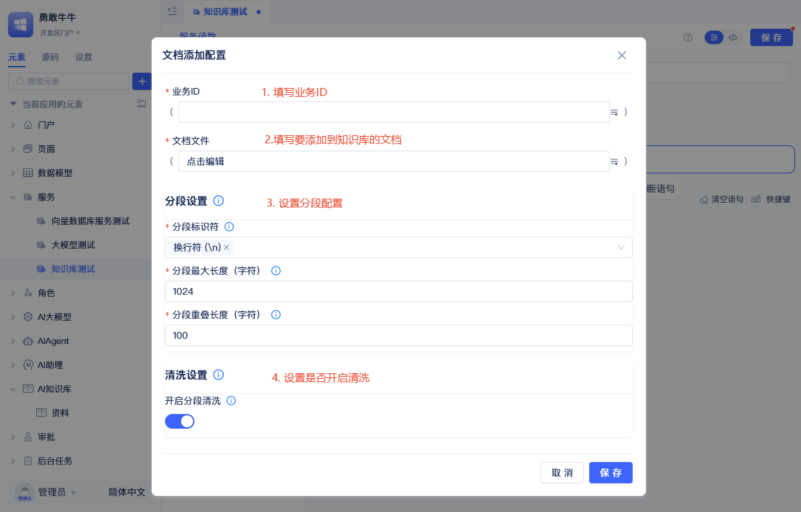
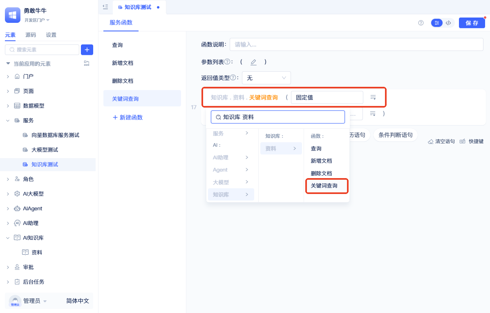

# 使用知识库进行全文与语义检索

## AI 知识库设置如何参与查询流程 {#how-ai-knowledge-base-settings-participate-in-query-flow}
AI 知识库的配置参数直接影响知识检索的质量和效果。

```mermaid
flowchart LR
    A[发起查询] --> B[向量数据库取TopK个文档]
    B --> C[向量相似度阈值过滤]
    C --> D[从重排模型取出TopN个结果]
    D --> E[重排分数阈值过滤]
    E --> F[显示给用户]
```

用户查询时，系统先从向量数据库中检索 TopK 个相似文档，通过向量相似度阈值过滤掉不相关的内容，然后用重排模型精确排序并取出 TopN 个最相关的结果，最后通过重排分数阈值做最终筛选，确保返回给用户的都是高质量答案。

## 在后端可视化编程中调用 AI 知识库 {#call-ai-knowledge-base-in-backend-visual-programming}
在后端可视化编程函数（服务函数/模型函数/任务函数/事件函数）中，知识库元素提供了“查询”“新增文档”“删除文档”“关键词查询”4 个方法。

### 查询

在函数面板的空白语句处点击“请选择”，选择“知识库 - 【知识库名称】 - 查询”，生成 AI 知识库查询函数；可在查询函数的输入框中设置查询条件。

### 新增文档

在函数面板选择“知识库 - 【知识库名称】 - 新增文档”，生成新增文档函数；点击函数中的“文档添加配置”打开新增文档的详细配置。

填入“业务ID”“文档文件”及其它向量化配置后点击保存。其中“业务ID”为当前添加文档的标识（后续删除可据此定位）；“文档文件”支持附件字段中的多个文件。

:::tip
其它配置参考[向量化配置说明](./knowledge-base-document-management#vectorization-configuration-description)。
:::

### 删除文档

在函数面板选择“知识库 - 【知识库名称】 - 删除文档”，生成删除文档函数；填入业务ID，运行后会删除该业务ID下的所有文档。

### 关键词查询

在函数面板选择“知识库 - 【知识库名称】 - 关键词查询”，生成关键词查询函数；配置关键词列表与查询数量后，返回对应的查询结果。

:::tip
可先用大模型从问题中提取关键词，再进行关键词查询。
:::
