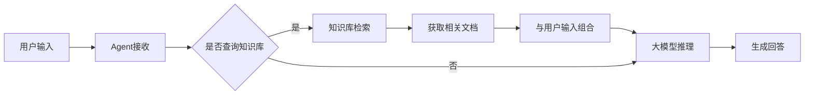

# 把知识库集成到agent

知识库作为AI Agent的核心知识支撑，通过检索增强生成（RAG）技术为Agent提供准确、及时的领域知识，显著提升Agent的专业能力和回答质量。

## 知识库与Agent的关系 {#relationship-between-knowledge-base-and-agent}

在JitAi平台中，知识库元素与AI Agent形成了紧密的协作关系：

- **知识供给者**：知识库将各类文档转化为可被"理解"的结构化知识，为Agent提供丰富的知识来源
- **智能检索**：通过向量相似度和重排模型，知识库能够理解Agent查询的语义意图，返回最相关的知识片段
- **动态增强**：Agent可以实时查询知识库，获取最新的业务信息，而无需重新训练模型

## 技术集成原理 {#technical-integration-principles}

Agent集成知识库后，能够在推理过程中动态获取相关知识，实现：
- **上下文增强**：将检索到的知识作为上下文补充，提升回答的准确性
- **知识时效性**：获取最新的文档内容，避免模型训练数据的时效性限制
- **专业领域支持**：通过领域特定的知识库，使Agent具备专业领域的深度知识

## 集成模式 {#integration-modes}

知识库支持两种集成模式：
- **强制模式**：Agent在处理用户请求前必须先查询知识库，确保每次回答都基于最新知识
- **决策模式**：由大模型智能判断是否需要查询知识库，平衡回答速度与知识准确性

## 在Agent中使用知识库 {#using-knowledge-base-in-agent}

详细的集成配置和使用方法，请参考[集成知识库实现检索增强生成（RAG）](../ai-agent/agent-knowledge-base#integrate-knowledge-base-rag)。

