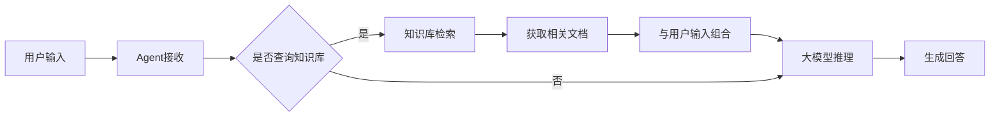

# 让 Agent 按场景查阅知识库

知识库为 AI Agent 提供产品资料、制度条款、FAQ、历史文档、操作说明等事实性依据。为 Agent 添加知识库后，Agent 可以在回答前或推理过程中检索相关片段，把资料内容作为上下文使用。

如果要先创建知识库，请参考[创建可被 Agent 检索的 AI 知识库](./create-knowledge-elements#create-ai-knowledge-base-element)。如果要在 Agent 编辑器中配置知识库，请参考[让 Agent 查阅知识库](../ai-agent/agent-knowledge-base)。

## 知识库与 Agent 的关系 {#relationship-between-knowledge-base-and-agent}

在 JitAI 平台中，知识库和 Agent 的职责边界如下：

- **知识库负责资料依据**：把文档和网页资料沉淀成可检索片段，回答“根据哪些资料回答”。
- **Agent 负责理解任务并组织回答**：根据用户问题、系统提示词、AI技能、工具和知识库检索结果生成最终回复。
- **AI技能负责处理方法和输出规范**：当问题不仅需要资料，还需要固定步骤、审核口径或输出模板时，应结合 [AI技能](../skills/overview)。

## Agent 使用知识库的运行过程 {#technical-integration-principles}

```mermaid
flowchart LR
    A[用户输入] --> B[Agent接收]
    B --> C{是否查询知识库}
    C -->|是| D[知识库检索]
    D --> E[获取相关文档]
    E --> F[与用户输入组合]
    F --> G[大模型推理]
    C -->|否| G
    G --> H[生成回答]
```

Agent 集成知识库后，平台会把可用知识库清单注入到 Agent 上下文，并向 Agent 暴露统一的知识库查询工具。Agent 可根据知识库标题、描述和用户问题选择合适的知识库进行查询；如果配置为预检索，平台会在本轮请求前先检索指定知识库，并把结果注入上下文。

## 根据 Agent 任务范围选择知识库模式 {#integration-modes}

在 Agent 编辑器的`知识库`页签中，支持三种模式：

- **智能模式**：平台自动收集应用中的可用知识库，并把知识库清单提供给 Agent。适合通用助手、探索型问答、资料范围不固定的场景。
- **自定义**：开发者手动搜索并勾选当前 Agent 可用的知识库。适合客服助手、制度问答、产品支持等边界清晰的生产场景。
- **禁用**：当前 Agent 不加载知识库能力，也不会暴露查询知识库工具。适合只处理流程、数据操作或调试主提示词的场景。

## 自定义模式下控制是否预检索 {#using-knowledge-base-in-agent}

在自定义模式下，每个已勾选的知识库都有`允许 Agent 自主决定查询`选项：

- **勾选**：Agent 拥有查询工具，自行判断是否需要查询该知识库。适合问题并不总是依赖资料的场景。
- **取消勾选**：平台会在每次对话前基于用户问题预检索该知识库，并将结果注入上下文；同时 Agent 仍可在后续推理中继续调用查询工具。适合必须依赖指定资料的场景，例如合规条款、产品手册、标准作业流程。

这不是权限控制。它只影响知识库是否被加载、是否预检索、是否让 Agent 主动调用查询工具。真正的访问控制应在角色权限中配置，详见[为 Agent 配置运行时权限边界](../ai-agent/agent-permissions)。

## 为 DeepAgent 的不同子 Agent 准备不同资料范围 {#configure-knowledge-base-for-deepagent-subagents}

在多角色协作场景中，知识库应跟随角色职责拆分。DeepAgent 负责识别任务和委派子 Agent；真正执行任务的子 Agent 会按自己对应 ReActAgent 实例中的知识库配置查阅资料。

建议让不同角色只接触自己需要的资料。例如：

- `政策解读 Agent`：自定义选择制度、合规、流程类知识库，并关闭`允许 Agent 自主决定查询`，确保每轮先预检索。
- `产品支持 Agent`：自定义选择产品手册、FAQ、故障排查知识库，允许 Agent 按问题自主查询。
- `数据分析 Agent`：禁用知识库，专注使用数据模型和服务函数完成统计分析。

父 Agent 和子 Agent 的知识库配置彼此独立。具体配置入口请参考[为 DeepAgent 的子 Agent 配置专属知识库](../ai-agent/agent-knowledge-base#为-deepagent-的子-agent-配置专属知识库)。

## 让知识库更容易被 Agent 正确使用 {#make-knowledge-base-easier-for-agent-to-use}

- 知识库名称要体现业务对象，例如`售后政策知识库`、`设备维护手册知识库`。
- 描述要说明资料范围、适用问题和不适用问题，便于 Agent 在智能模式或自定义模式中选择。
- 对于必须引用资料的问题，在 Agent 系统提示词中明确要求“涉及产品、制度、流程问题时先检索知识库”。
- 配置后先在[查询测试](./knowledge-base-document-management#query-testing)中验证命中效果，再到 Agent 调试区测试完整回答。
