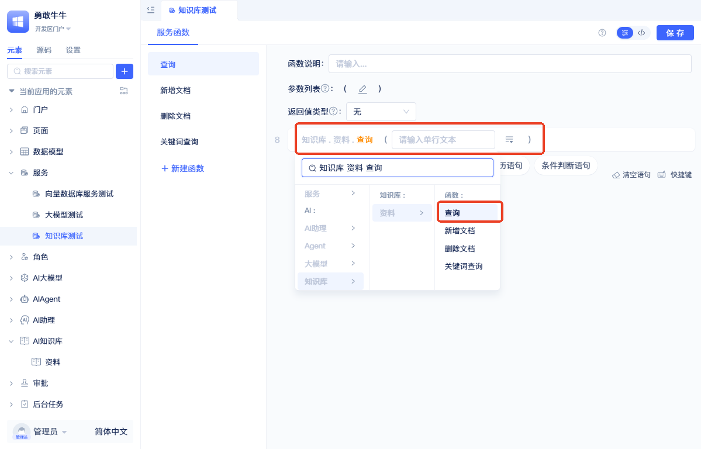
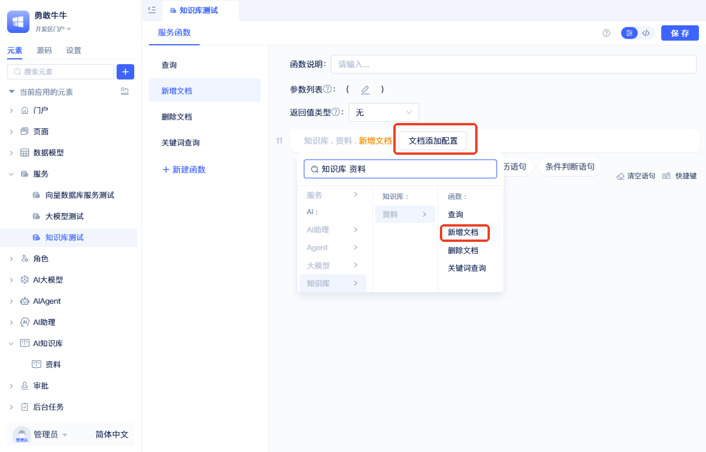
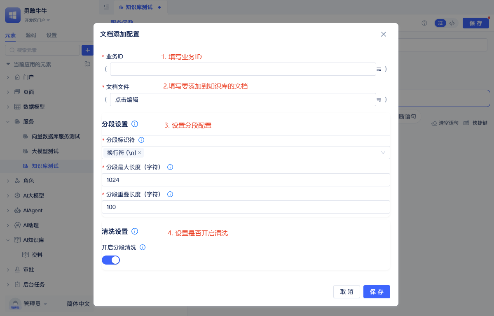
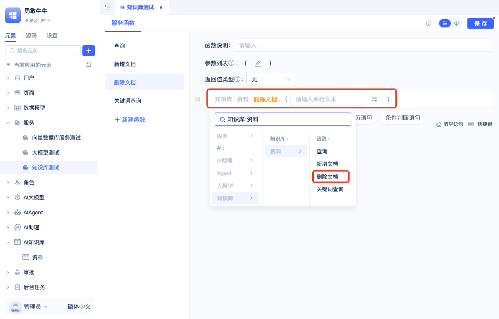
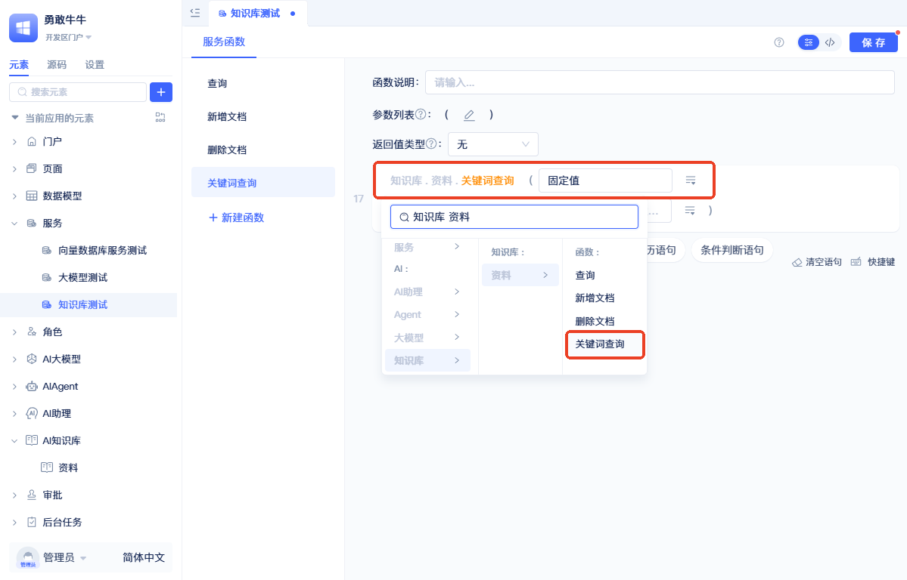

# 在业务函数中调用 AI 知识库检索和维护资料

AI 知识库不仅可以被 Agent 查询，也可以在后端可视化编程函数中直接调用。开发者可以在服务函数、模型函数、任务函数或事件函数中使用知识库完成语义检索、关键词检索、按业务 ID 新增文档和按业务 ID 删除文档。

语义检索适合用户自然语言提问，例如“退货超过 7 天还能处理吗”；关键词检索适合已经明确关键词的场景，例如先由大模型提取`退货`、`7天`、`售后政策`，再用关键词查询缩小范围。

## 在后端可视化编程中调用 AI 知识库 {#call-ai-knowledge-base-in-backend-visual-programming}
在后端可视化编程函数（服务函数/模型函数/任务函数/事件函数）中，知识库元素提供了“查询”“新增文档”“删除文档”“关键词查询”4 个方法。

### 语义检索 {#semantic-search}

在函数面板的空白语句处点击`请选择`，选择`知识库 - 【知识库名称】 - 查询`，生成 AI 知识库查询函数；可在查询函数的输入框中设置查询内容。

### 新增文档 {#adding-document}

在函数面板选择`知识库 - 【知识库名称】 - 新增文档`，生成新增文档函数；点击函数中的`文档添加配置`打开新增文档的详细配置。

填入`业务ID`、`文档文件`及其它向量化配置后点击保存。其中`业务ID`是当前添加文档的业务标识，后续可据此删除同一业务对象关联的文档；`文档文件`支持附件字段中的多个文件。

:::tip
其它配置参考[向量化配置](./knowledge-base-document-management#vectorization-configuration)。
:::

### 删除文档 {#deleting-document}

在函数面板选择`知识库 - 【知识库名称】 - 删除文档`，生成删除文档函数；填入业务 ID，运行后会删除该业务 ID 下的所有文档。

### 关键词检索 {#searching-by-keywords}

在函数面板选择`知识库 - 【知识库名称】 - 关键词查询`，生成关键词查询函数；配置关键词列表与查询数量后，返回对应的查询结果。

:::tip
可先用大模型从问题中提取关键词，再进行关键词查询。
:::

## AI 知识库设置如何参与查询流程 {#how-ai-knowledge-base-settings-participate-in-query-flow}

关于知识库查询流程的详细说明，包括向量检索、可选重排和参数配置，请参见[创建可被 Agent 检索的 AI 知识库 - 检索机制](./create-knowledge-elements#retrieval-mechanism)。
