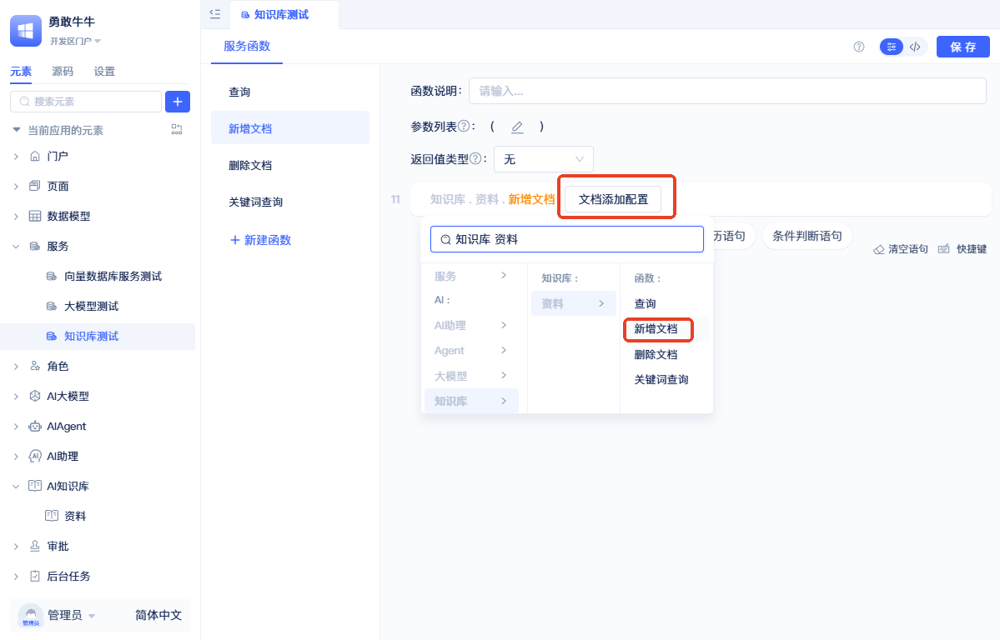

# 使用知识库元素实现关键词检索和语义检索

知识库支持两种检索方式：**关键词检索**基于关键词精确匹配，**语义检索**基于向量相似度理解语义含义。JitAi知识库融合了两种技术优势，既支持精确的关键词查询，也能进行智能的语义理解检索。

## 在后端可视化编程中调用 AI 知识库 {#call-ai-knowledge-base-in-backend-visual-programming}
在后端可视化编程函数（服务函数/模型函数/任务函数/事件函数）中，知识库元素提供了“查询”“新增文档”“删除文档”“关键词查询”4 个方法。

### 语义检索 {#semantic-search}

在函数面板的空白语句处点击“请选择”，选择“知识库 - 【知识库名称】 - 查询”，生成 AI 知识库查询函数；可在查询函数的输入框中设置查询条件。

### 新增文档 {#adding-document}

在函数面板选择“知识库 - 【知识库名称】 - 新增文档”，生成新增文档函数；点击函数中的“文档添加配置”打开新增文档的详细配置。

填入“业务ID”“文档文件”及其它向量化配置后点击保存。其中“业务ID”为当前添加文档的标识（后续删除可据此定位）；“文档文件”支持附件字段中的多个文件。

:::tip
其它配置参考[向量化配置](./knowledge-base-document-management#vectorization-configuration)。
:::

### 删除文档 {#deleting-document}

在函数面板选择“知识库 - 【知识库名称】 - 删除文档”，生成删除文档函数；填入业务ID，运行后会删除该业务ID下的所有文档。

### 关键词检索 {#searching-by-keywords}

在函数面板选择“知识库 - 【知识库名称】 - 关键词查询”，生成关键词查询函数；配置关键词列表与查询数量后，返回对应的查询结果。

:::tip
可先用大模型从问题中提取关键词，再进行关键词查询。
:::

## AI 知识库设置如何参与查询流程 {#how-ai-knowledge-base-settings-participate-in-query-flow}

关于知识库查询流程的详细说明，包括向量检索、重排序机制和参数配置，请参见[创建知识库元素 - 检索机制](./create-knowledge-elements#retrieval-mechanism)。
