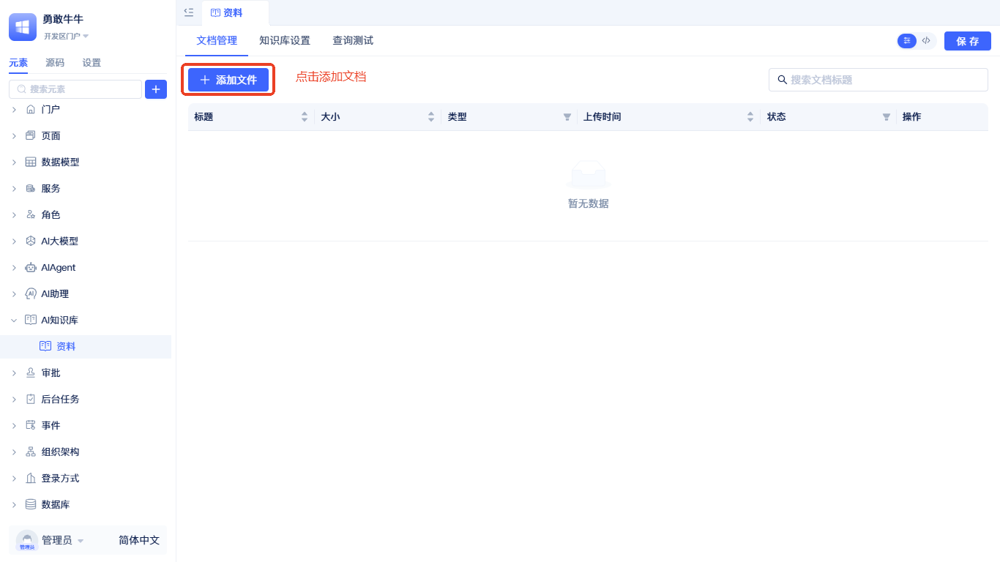
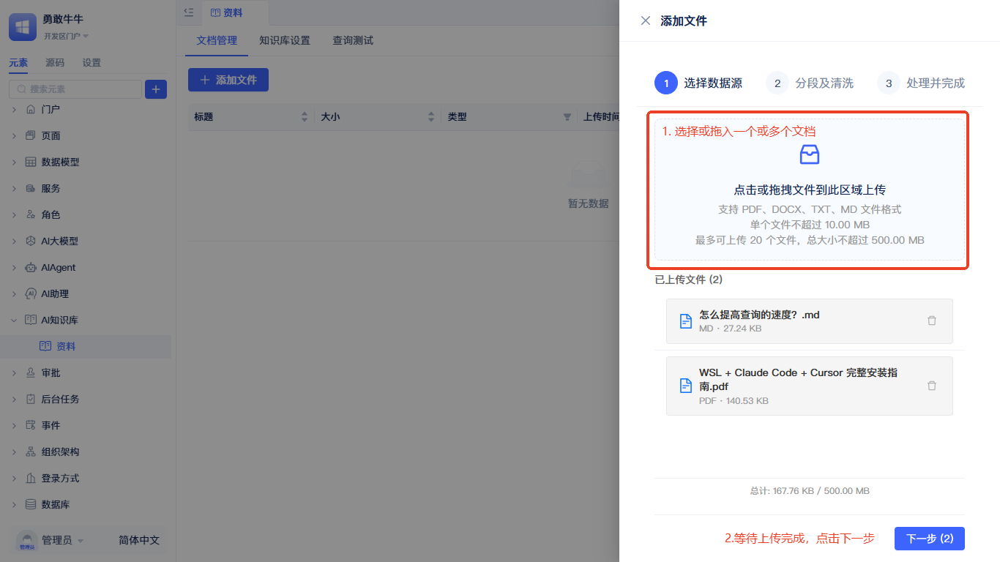
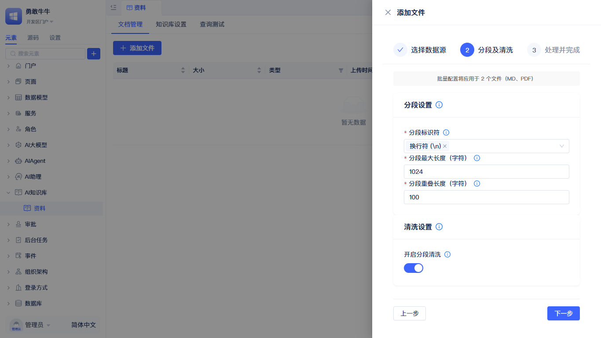
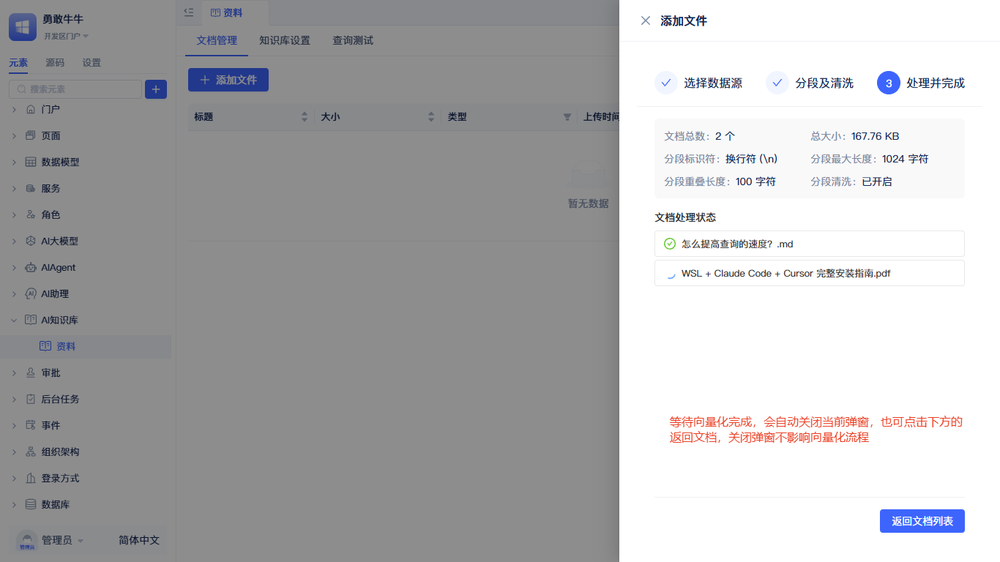
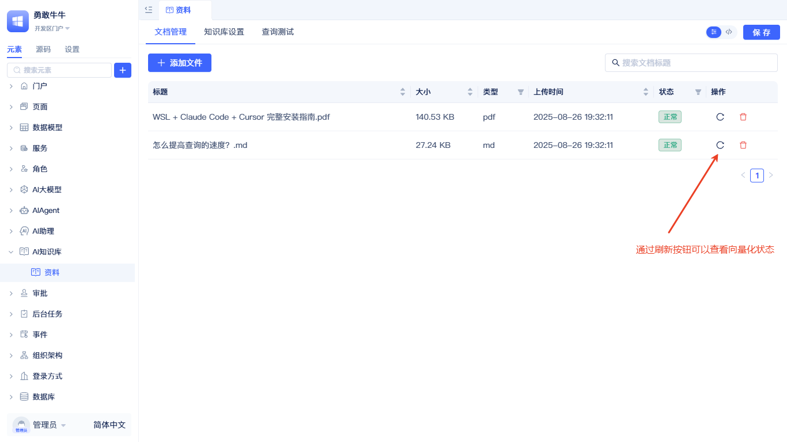
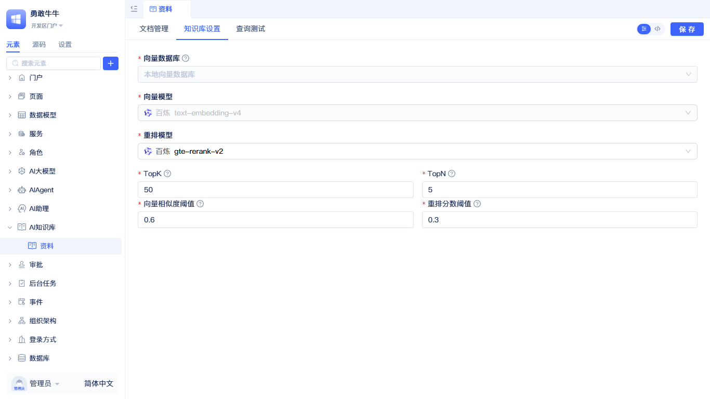
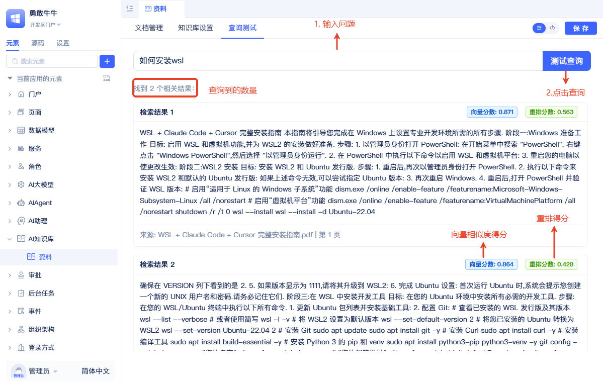

# 管理知识库资料并验证检索效果

AI 知识库创建完成后，需要在知识库编辑器中添加资料并等待处理完成。知识库编辑器包含`Document Management`、`Knowledge Settings`和`Query Test`三个页签，分别用于维护资料、调整检索参数和验证查询效果。

## 添加本地文档或网页资料 {#add-local-documents-or-web-pages}

在`Document Management`页添加与维护 AI 知识库文档：

点击`Add File`，弹出添加文件滑窗。

在`选择数据源`步骤中，可以选择两类资料来源：

- **Local Files**：点击虚线框选择文件，或将文件拖入虚线框，等待上传完成后点击`Next`。
- **Web URL**：输入起始 URL，点击`Add URL Task`添加网页抓取任务，可配置抓取深度、最大抓取时长、最大文档数、智能正文提取，以及 URL 白名单/黑名单规则。

:::tip
本地文档支持 PDF、DOCX、TXT、MD。单个文件大小不超过 10MB，单次最多上传 20 个文件，批量总大小不超过 500MB。
:::

进入`分段及清洗`步骤后，根据资料内容配置`分段标识符`、`分段最大长度`、`分段重叠长度`和`清洗设置`，配置完成后点击`Next`。参数说明参考[向量化配置](#vectorization-configuration)。

进入`处理并完成`步骤后，系统会在后台处理每一个文档。可等待所有文档向量化完成，也可点击`返回文档列表`直接关闭滑窗，后台处理流程不会中断。

在文档列表中可以搜索文档标题、刷新处理状态、重新向量化文档或删除文档。Web URL 类型的文档还可以查看网页抓取信息。

## 根据查询效果调整知识库设置 {#knowledge-base-settings}
`Knowledge Settings`中的配置项会影响搜索结果准确性和最终返回内容的大小。

`向量数据库`和`向量模型`创建后不可直接修改。开发者可以根据[查询测试](#query-testing)的反馈，动态调整`重排模型`、`TopK`、`TopN`、`向量相似度阈值`、`重排分数阈值`等参数。

重排模型为可选项。不配置重排模型时，知识库直接返回向量检索结果，`TopN`和`重排分数阈值`不参与重排过滤；配置重排模型后，可以用它提升候选片段排序质量。

:::tip
提高准确性需要先了解[设置如何参与查询流程](./keyword-and-semantic-search#how-ai-knowledge-base-settings-participate-in-query-flow)。修改配置项后需点击保存，才能在[查询测试](#query-testing)中生效。
:::

## 用查询测试检查资料是否命中 {#query-testing}
`Query Test`用于调试 AI 知识库的检索效果。

输入问题后点击`Test Query`，系统会理解查询语义并返回结果；同时显示命中的文档片段数量、每个片段的向量相似度评分与重排分数评分。可据此不断调整[知识库设置](#knowledge-base-settings)以提升检索效果。

建议至少测试三类问题：

- **资料内问题**：应能命中正确文档片段。
- **相似但不同的问题**：检查是否误命中无关资料。
- **资料外问题**：确认没有资料依据时不会返回误导性内容。

## 向量化配置说明 {#vectorization-configuration}
- 分段标识符：用于拆分文档的分隔符，可选择多个。系统按所有选择的分隔符进行分段。
- 分段最大长度：每个文本块的最大字符数，建议 500–2000。小块更精确但可能丢失上下文；大块保留更多上下文但可能不够精确。
- 分段重叠长度：相邻文本块的重叠字符数，建议为块大小的 10%–20%。
- 开启分段清洗：提升文本质量与检索精度的清洗功能，如空白清理、全角转半角、断行修复等。

## 知识库配置参数说明 {#knowledge-base-configuration-parameters}
| 参数名称 | 默认值 | 建议范围 | 说明 |
|---------|--------|----------|------|
| 向量模型 | - | - | 决定文档与查询的语义理解能力，创建后不可修改 |
| 重排模型 | - | - | 可选。对召回结果进行精细排序，可随时更换以优化效果 |
| TopK | 50 | 1-100 | 向量召回条数，控制初步检索的文档数量 |
| TopN | 5 | 1-10 | 最终返回给用户的文档片段数量；配置重排模型后表示重排后返回条数 |
| 向量相似度阈值 (vectorScore) | 0.6 | 0.1-1.0 | 过滤召回结果，值越高要求越严格 |
| 重排分数阈值 (reRankScore) | 0.3 | 0.1-1.0 | 配置重排模型后生效，过滤重排结果，值越高要求越精确 |

:::tip 参数建议
一般建议先增大 TopK 扩大召回覆盖，再通过 vectorScore 过滤明显无关内容。若配置了重排模型，再用 reRankScore 做精细过滤。
:::
