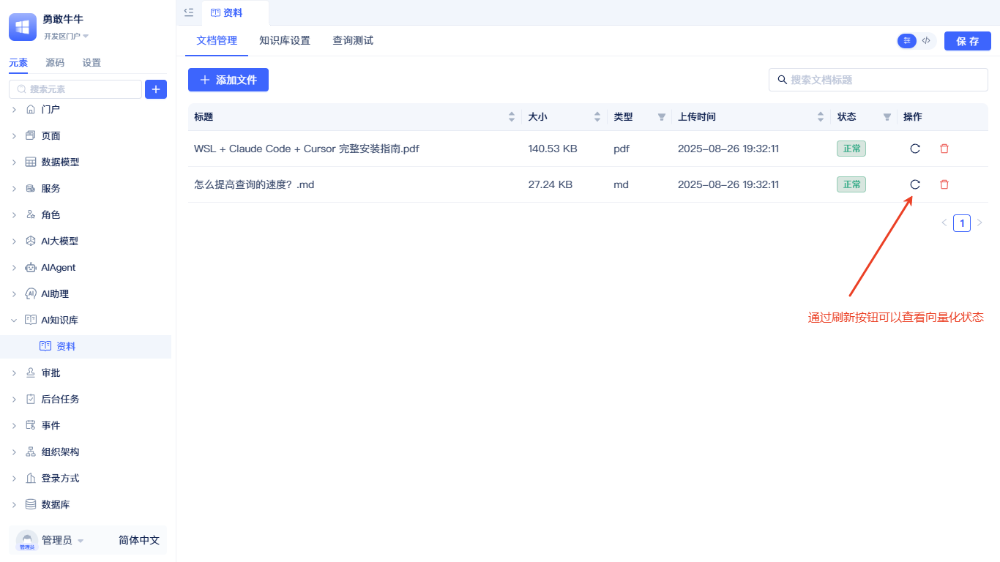
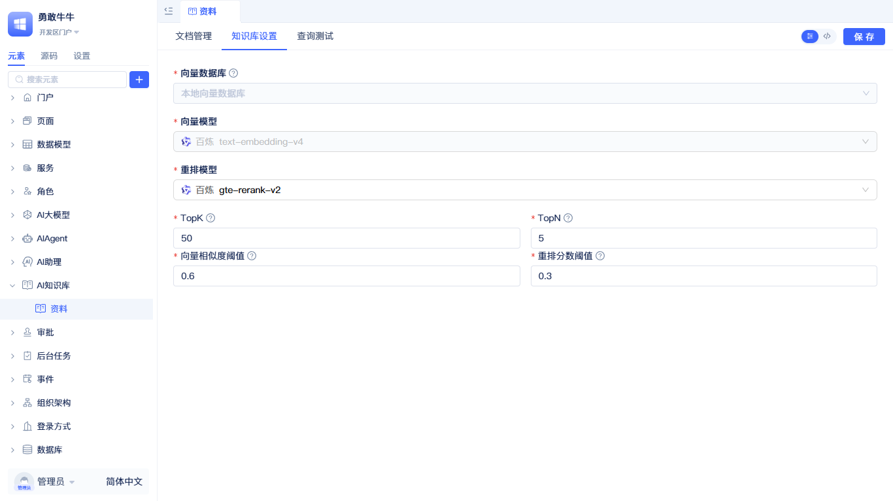

# 知识库文档管理

在“文档管理”页添加与维护 AI 知识库文档：

点击“+ 添加文件”，弹出添加文件滑窗。

在“选择数据源”的分步引导页中，点击虚线框选择文档或将文档拖入虚线框，等待上传完成后点击“下一步”。

:::tip
文档格式支持 PDF、DOCX、TXT、MD，单个文档大小不超过 10M。
:::

进入"分段及清洗"步骤后，根据上传文档的实际情况，依次配置"分段标识符""分段最大长度""分段重叠长度"和"清洗设置"，配置完成后点击"下一步"。参数说明参考[向量化配置说明](#vectorization-configuration-description)。

进入“处理并完成”步骤后，系统会在后台处理每一个文档。可等待所有文档向量化完成，也可点击“返回文档列表”直接关闭滑窗（不影响后台处理流程）。

在文档列表中点击刷新按钮，可查看当前文档向量化状态。

## 知识库设置 {#knowledge-base-settings}
"知识库设置"中的配置项会影响搜索结果准确性和最终返回内容的大小。

"向量数据库"和"向量模型"的设置不允许修改。开发者可以根据[查询测试](#query-testing)的反馈，动态调整"重排模型""TopK""TopN""向量相似度阈值""重排分数阈值"等参数。

:::tip
提高准确性需要先了解[设置如何参与查询流程](./full-text-and-semantic-search#how-ai-knowledge-base-settings-participate-in-query-flow)。另外，修改配置项后需点击保存，才能在[查询测试](#query-testing)中生效。
:::

## 查询测试 {#query-testing}
为方便调试 AI 知识库的效果，提供了查询测试功能。

输入问题后点击"测试查询"，系统会理解查询语义并返回结果；同时显示符合条件的文档数量、每个文档的向量相似度评分与重排分数评分。可据此不断调整[知识库设置](#knowledge-base-settings)以提升检索效果。

## 向量化配置说明 {#vectorization-configuration}
- 分段标识符：用于拆分文档的分隔符，可选择多个。系统按所有选择的分隔符进行分段，默认使用段落分隔符（`\\n\\n`）。
- 分段最大长度：每个文本块的最大字符数，建议 500–2000。小块更精确但可能丢失上下文；大块保留更多上下文但可能不够精确。
- 分段重叠长度：相邻文本块的重叠字符数，建议为块大小的 10%–20%。
- 开启分段清洗：提升文本质量与检索精度的清洗功能，如空白清理、全角转半角、断行修复等。

## 知识库配置参数说明 {#knowledge-base-configuration-parameters}
| 参数名称 | 默认值 | 建议范围 | 说明 |
|---------|--------|----------|------|
| 向量模型 | - | - | 决定文档与查询的语义理解能力，创建后不可修改 |
| 重排模型 | - | - | 对召回结果进行精细排序，可随时更换以优化效果 |
| TopK | 50 | 1-100 | 向量召回条数，控制初步检索的文档数量 |
| TopN | 5 | 1-10 | 重排后返回条数，最终返回给用户的文档数量 |
| 向量相似度阈值 (vectorScore) | 0.6 | 0.1-1.0 | 过滤召回结果，值越高要求越严格 |
| 重排分数阈值 (reRankScore) | 0.3 | 0.1-1.0 | 过滤重排结果，值越高要求越精确 |

:::tip 参数建议
一般建议先增大 TopK（扩大召回覆盖），再用较合适的 reRankScore 做精细过滤。若召回噪声较多，可适当调高 vectorScore。
:::

