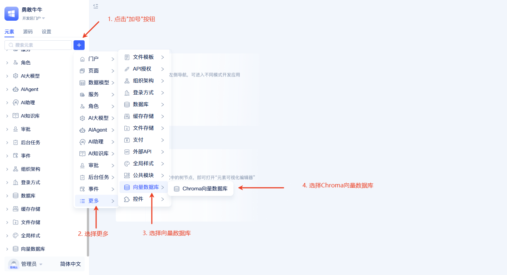
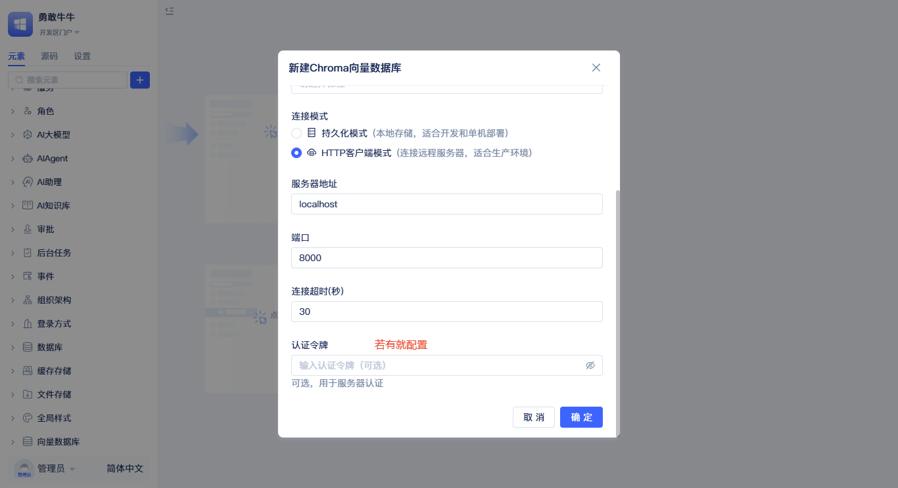
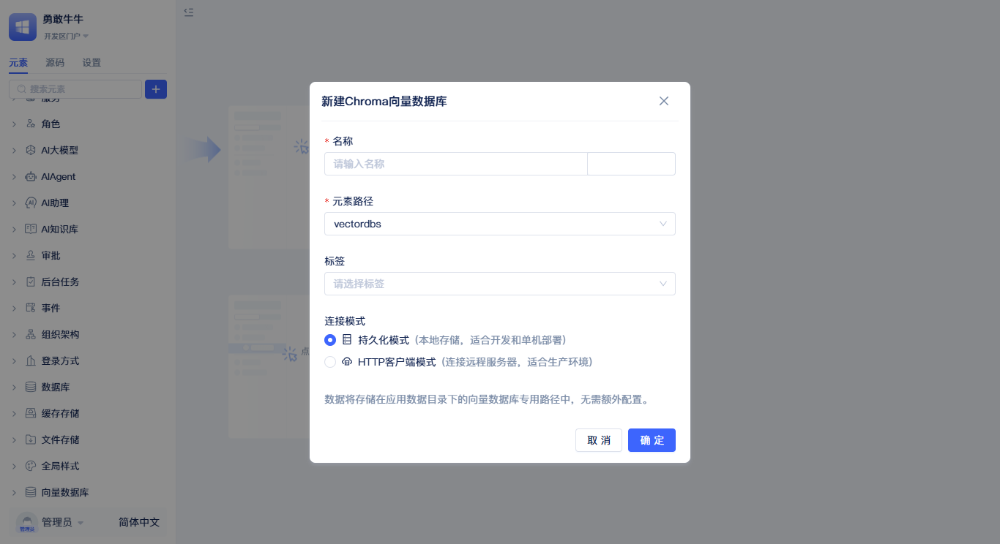

# 向量数据库的独立部署

在生产环境和企业级应用中，**独立部署向量数据库**是确保性能、稳定性和可扩展性的关键策略。独立部署将向量数据库从应用服务中分离出来，作为专门的数据服务运行，具备更强的并发处理能力、更好的资源隔离以及更灵活的运维管理。

向量数据库是[AI 知识库](./create-knowledge-elements)元素的底层存储引擎，负责将文档内容转换为向量数据进行存储和检索。通过独立部署，可以为多个知识库应用提供统一的向量存储服务，实现资源共享和集中管理，同时支持水平扩展以应对大规模数据和高并发访问需求。

:::tip
向量数据库默认使用`余弦相似度`作为距离度量算法，该算法特别适用于文本语义相似性计算。
:::

## 独立部署方案：Chroma 向量数据库 {#chroma-standalone-deployment}

Chroma 是JitAI平台推荐的向量数据库解决方案，支持独立服务部署，具有轻量级、高性能、易维护等特点。独立部署的Chroma数据库可以为多个JitAI应用实例提供统一的向量存储服务，实现企业级的数据管理和服务治理。

### 独立部署的优势 {#advantages-of-standalone-deployment}

- **性能隔离**：独立的计算和存储资源，避免与应用服务竞争系统资源
- **横向扩展**：支持集群部署，轻松应对大规模数据和高并发访问
- **数据安全**：独立的网络配置和访问控制，提供更强的安全保障
- **运维便利**：统一的数据备份、监控和维护策略

### Chroma 独立部署安装 {#chroma-installation}

官方提供了多种部署方式，可根据实际需求选择：

- **Docker部署**：[Chroma Docker官方文档](https://docs.trychroma.com/deployment/docker)
- **云服务部署**：[Chroma云服务部署指南](https://docs.trychroma.com/deployment/aws)

### 连接独立部署的Chroma数据库 {#connect-to-standalone-chroma}

在JitAI平台中连接已独立部署的Chroma向量数据库：

配置参数说明：
- **名称**：向量数据库元素的标识名称
- **数据库地址**：独立部署的Chroma服务器IP或域名
- **端口**：Chroma服务监听端口（默认8000）
- **超时时间**：连接和查询的超时设置
- **认证令牌**：如启用了认证机制，需提供访问令牌

## 开发测试环境：本地化配置 {#local-development-config}

对于开发测试场景，JitAI支持本地化的向量数据库配置，无需独立部署外部服务，开箱即用：

本地化配置采用内置存储方式，数据直接保存在JitAI平台的本地环境中。只需输入"名称"，选择"持久化模式"，即可快速创建本地向量数据库，适合原型开发和功能验证。

:::tip
生产环境建议使用独立部署方案，以获得更好的性能、可靠性和可维护性。
:::

## 向量数据库编程接口 {#vector-database-programming-interface}
### health_check {#health_check}
检查向量数据库的连接状态和运行健康情况，返回数据库基本信息。[API 文档](../../reference/framework/JitAi/vector-database#health_check)

### create_collection {#create_collection}
在向量数据库中创建新的集合，用于存储和管理相关的向量数据。[API 文档](../../reference/framework/JitAi/vector-database#create_collection)

### add_vectors {#add_vectors}
将向量数据及其元数据存储到指定的集合中。[API 文档](../../reference/framework/JitAi/vector-database#add_vectors)

### query_vectors {#query_vectors}
基于查询向量在集合中搜索最相似的向量数据。[API 文档](../../reference/framework/JitAi/vector-database#query_vectors)
