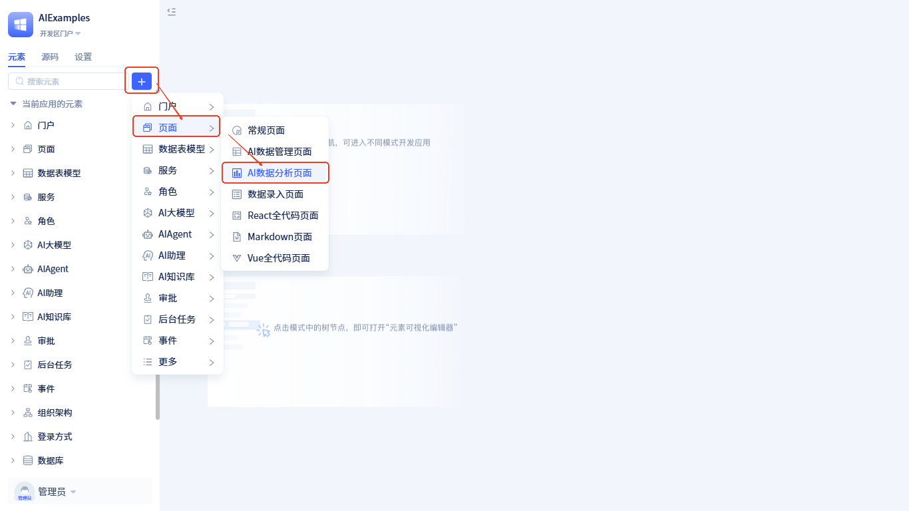
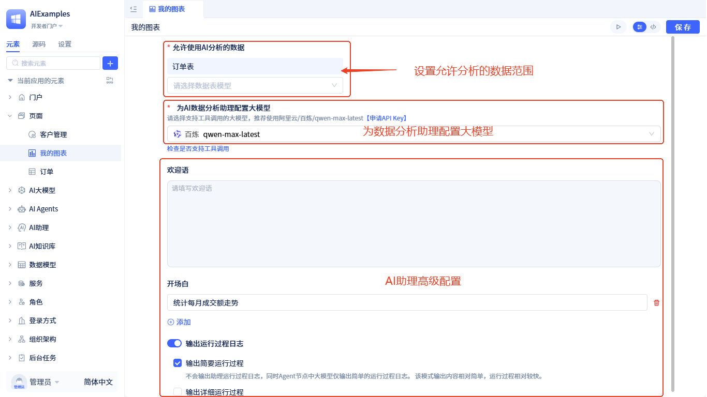
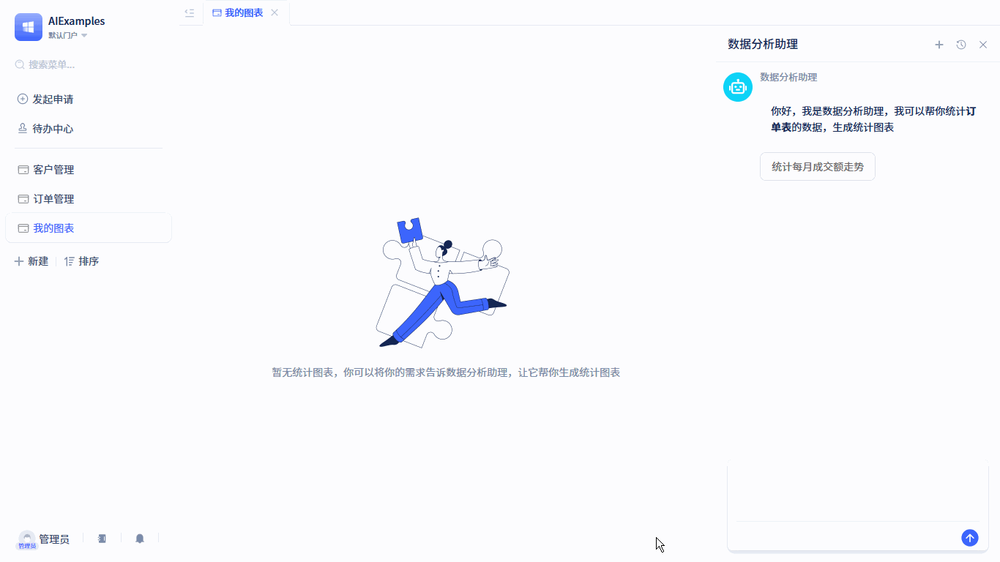
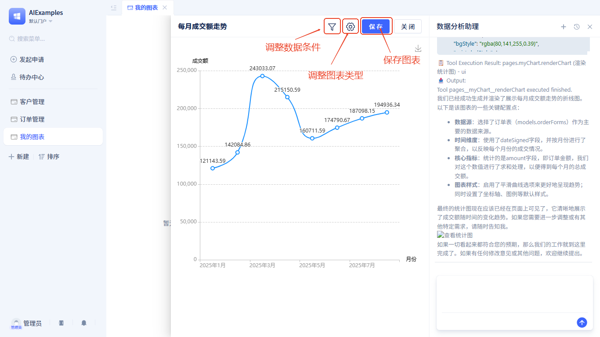
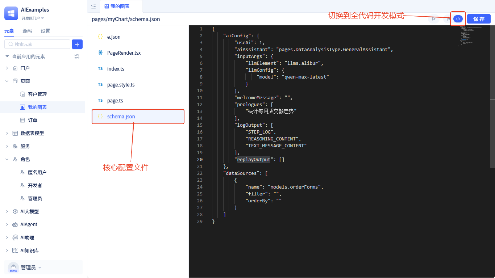
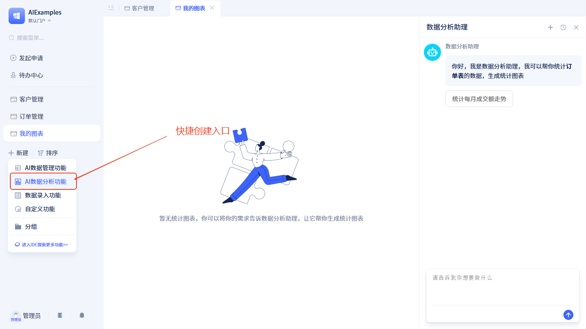

# AI数据分析页面 {#data-range-allowed-for-ai-analysis}
## 功能概述
传统开发模式下，统计图表由开发者预先设计，用户无法修改图表类型和统计方式。JitAI的AI数据分析页面让用户通过自然语言描述需求，AI自动生成对应的数据图表，并支持用户随时调整图表样式和统计维度。

## 创建AI数据分析页面 {#create-ai-data-analysis-page}
在开发者门户中按以下操作创建：

开发者可以在创建页面时选择页面类型为 `AI数据分析页面`，打开新建弹窗，输入名称即可。

## 页面配置 {#page-configuration}
我们提供了可视化开发工具，开发者只需要做一些简单的配置，即可得到一个AI数据分析页面。配置如下：

### 允许使用AI分析的数据范围 {#data-range-allowed-for-ai-analysis} 
指定可分析的数据表及数据条件，通过该配置项控制在该页面允许分析的数据，以此来控制用户可统计的数据范围。

### 配置大模型
我们在该页面中内置了一个专门用于数据分析的[AI助理](/docs/devguide/ai-assistant/create-ai-assistant)，该助理在运行时需要访问系统数据库及调用页面上的函数绘制图表。我们需要为其配置一个支持调用工具的[大模型](/docs/devguide/ai-llm/create-ai-llm)，推荐使用阿里云百炼平台的qwen-max-latest。<a href="https://bailian.console.aliyun.com/?tab=model#/api-key" target="_blank">申请API Key</a>

### AI助理高级配置
- 支持自定义[欢迎语与开场白](/docs/devguide/ai-assistant/welcome-message-and-opening)
- 支持自定义[输出运行过程日志](/docs/devguide/ai-assistant/ai-assistant-input-output#message-output)，默认会输出简要过程日志。

## 运行效果 {#run-effects}
输入`统计每月成交额走势`，这样一句简单的话指定了数据统计方式：统计每月成交额；也指定了统计图表类型：平滑曲线。
运行效果如下：

AI生成的图表，用户还可以做以下调整：

- **筛选**：设置统计数据的筛选条件，该条件会在[允许使用AI分析的数据范围](#data-range-allowed-for-ai-analysis)的条件上叠加。
- **设置图形**：修改图表类型
- **保存**：保存图表，下次打开页面直接可见。
## 全代码开发 {#full-code-development}
点击页面编辑器右上角`</>`按钮，切换到源码编辑模式。
源码模式下左侧展示源码文件，点击源码文件后右侧显示源码内容，核心源码是`schema.json`。

内容如下：
- **aiConfig**: AI相关配置项
  - **useAi**: 启用AI功能，固定值为 `1`
  - **aiAssistant**: 页面绑定的AI助理，当前固定为 `pages.DataAnalysisType.GeneralAssistant`，后续版本将支持开发者自定义AI助理
  - **inputArgs**: 助理运行时输入配置
  - **llmElement**: 大模型元素ID
  - **llmConfig**: 大模型参数配置
  - **welcomeMessage**: 欢迎语（可选，默认为空）
  - **prologues**: 开场白内容
  - **logContent**: 运行过程输出级别（可选，默认为 `LLM_CONCISE_LOG`）
    - `NOT_OUTPUT`: 不输出运行过程
    - `LLM_CONCISE_LOG`: 输出简要运行过程
    - `DETAIL_LOG`: 输出详细运行过程
- **dataSources**: 允许AI分析的数据表及数据条件

## 快捷创建 {#quick-create}
除了在开发者门户中创建，还可以在常规门户中快捷创建。创建方式如下：

该操作会新建一个AI数据分析页面，同时在门户中创建一个菜单并绑定新增的页面。

:::tip 提示
需要被授予[快捷创建权限](/docs/devguide/user-and-permission/role-portal-menu-permissions#specify-accessible-portals-and-menus)，才能看到快捷创建的入口。
:::
