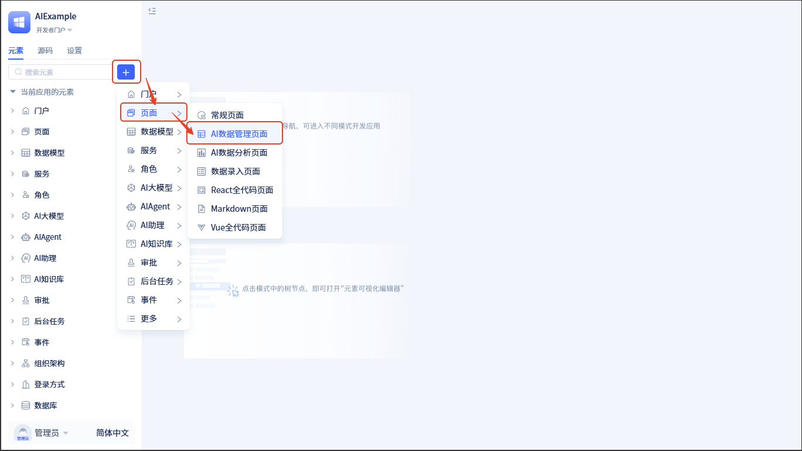
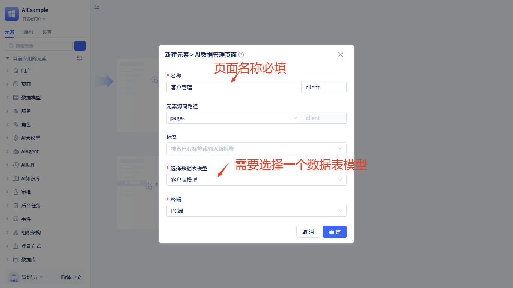
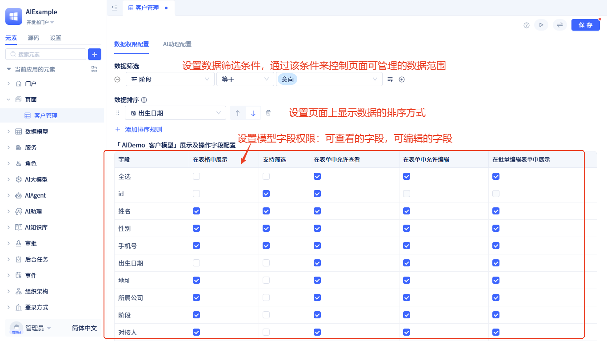
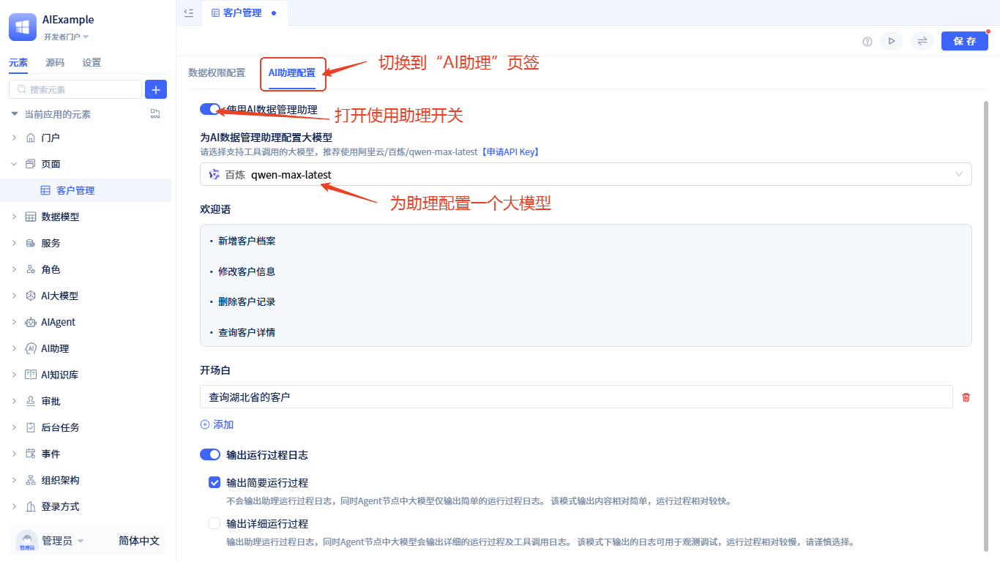
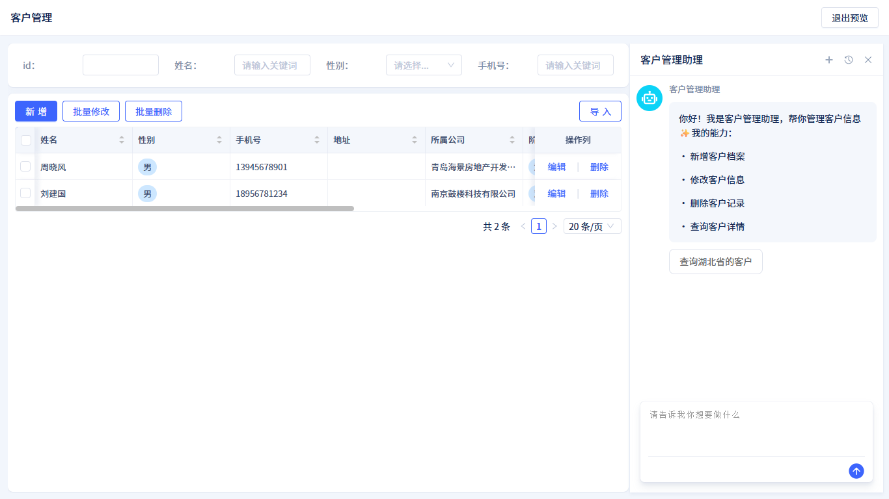

# AI数据管理页面

常见的数据管理页面中，通常都会提供数据增删改查的功能，包含筛选条件、排序、分页、工具栏按钮、操作列按钮等常见的界面元素和功能。JitAI 直接提供了 AI 数据管理页面，帮助开发者快速完成数据管理功能的开发，并且支持使用者使用 AI 进行数据管理工作。

## 创建AI数据管理页面 {#create-ai-data-management-page}
进入开发者门户，按以下操作创建：

点击 +  → **页面** → **AI数据管理页面**，打开页面信息填写表单，填完表单后点击 `确定` 按钮后即可创建页面。

页面创建完成后会自动进入可视化编辑器。

开发者通常不需要进行任何额外配置，页面即可直接使用。当然，开发者也可以根据实际需求进行配置修改。

## 可管理的数据范围 {#limit-page-table-query-data-through-default-filter-conditions}
在实际业务中，可能需要限制页面表格中能查询和展示的数据。例如，仅展示近一年的数据。通过设置数据筛选条件，可以有效保障数据安全，提升用户的使用效率，避免无关数据干扰业务操作。

通过默认筛选条件限制页面表格查询的数据。JitAI 的[筛选器](/docs/devguide/using-functional-components-in-pages/filter-components)支持对文本、数字、日期时间等各类型字段的多种筛选条件设置，能够满足几乎所有筛选需求。

开发者可以在页面编辑器中配置**数据筛选**，点击每个筛选条件右侧的加号按钮，可以添加多个条件。

:::tip 基于角色的数据权限控制
除了在页面中配置默认筛选条件，开发者还可以对不同用户在应用内的角色进行数据查询和操作的细粒度控制，这是一种更高级的配置方式，开发者可以参考角色权限的文档。

角色权限中的配置会和页面中配置的条件叠加生效，是`与`的关系。
:::

## 配置默认的数据排序规则 {#configure-default-data-sort-rules}
数据表格的展示顺序往往会影响用户的工作效率。例如，销售人员希望优先看到最新的订单，财务人员则可能更关注金额较大的交易。合理设置默认的数据排序规则，可以让用户在进入页面时第一时间看到最重要或最相关的数据，提升数据查找和处理的效率。

开发者可以在页面编辑器中配置**数据排序**，点击每个排序条件右侧的加号按钮，可以添加多个排序条件。

## 指定表格中展示的字段列 {#hide-some-fields-in-page-table}
在实际业务中，可能需要隐藏部分字段，例如，用户不需要看到`id`等字段。通过隐藏字段，可以减少无关数据对用户的干扰，提升页面整洁度和使用效率。

开发者可以在页面编辑器的`在表格中展示`中进行配置，勾选则展示对应字段，取消勾选则隐藏对应字段。

## 配置支持条件筛选的字段 {#configure-conditional-filter-fields}
并不是所有字段都需要支持条件筛选，例如，备注字段通常不需要支持条件筛选。

开发者可以在页面编辑器的`支持筛选`中进行配置，将不需要参与条件筛选的字段取消勾选，勾选则支持条件筛选。

## 配置表单中允许查看和编辑的字段 {#configure-viewable-editable-fields-in-form}
在用户新增或编辑数据时，主键 ID 通常不需要让用户在表单中看到，创建时间也不需要让用户在表单中编辑，而是由系统自动生成。以此类推，JitAI 支持对所有字段在表单中的查看和编辑权限进行配置。

开发者可以在页面编辑器的`在表单中允许查看`/`在表单中允许编辑`中进行配置，将不需要让用户在表单中看到或编辑的字段取消勾选，勾选则允许查看和编辑。

:::tip
在表单中不允许查看和编辑并不会对[批量编辑表单](#configure-fields-displayed-in-batch-edit-form)生效。
:::

## 配置批量编辑表单中展示的字段 {#configure-fields-displayed-in-batch-edit-form}
批量编辑通常用于在表格中选中多条数据后，对这些数据进行批量修改。但并不是所有字段都适合进行批量修改，例如：手机号、邮箱等极具区分度的字段通常不适合批量修改。

开发者可以在页面编辑器的`在批量编辑表单中展示`中进行配置，勾选则在批量编辑表单中展示对应字段，取消勾选则不展示对应字段。另外，批量表单要求至少配置一个展示字段。

## AI数据管理助理 {#enable-ai-data-management-assistant}

### 开启AI数据管理助理 {#enable-ai-data-management-assistant}
AI数据管理页面内置了一个通用的**AI数据管理助理**，用户可使用该助理通过自然语言对话即可完成对数据的增删改查操作，比如用户输入：录入5条随机测试数据；该AI助理会自动录入5条数据，并刷新表格。
页面中默认不会启用该助理，需要手动开启。开启方式如下： 
 
可视化编辑器顶部切换到`AI助理配置`，然后打开`使用AI数据管理助理`开关。

### 配置大模型 {#configure-large-language-model}
AI数据管理助理在运行时需要访问系统数据库及调用页面上的函数绘制图表。我们需要为其配置一个支持调用工具的[大模型](/docs/devguide/ai-llm/create-ai-llm)，推荐使用阿里云百炼平台的 qwen-max-latest。[申请API Key](https://bailian.console.aliyun.com/?tab=model#/api-key)

### 助理高级配置 {#assistant-advanced-configuration}
- 支持自定义[欢迎语与开场白](/docs/devguide/ai-assistant/welcome-message-and-opening)
- 支持自定义[输出运行过程日志](/docs/devguide/ai-assistant/ai-assistant-input-output#message-output)，默认会输出简要过程日志。

关于AI助理的更多信息，请阅读[AI助理](/docs/devguide/ai-assistant/create-ai-assistant)相关文档。

## 运行效果 {#runtime-effect}

点击可视化编辑器右上角的  按钮，看看效果吧！ 
用户在访问页面时将会看到一个功能完整的数据管理界面，包含数据表格、筛选条件、分页、工具栏中的新增/批量修改/批量删除/导入、操作列中的编辑/删除、点击列标题进行排序。开启AI数据管理助理后，会在页面右侧显示一个AI对话框，用户通过该对话框与助理对话，操作数据。

## 转换为常规页面进行修改 {#convert-to-regular-page-for-modification}
AI数据管理页面是 JitAI 提供的开箱即用的内置页面类型，开发者可以快速创建并使用。当开发者想要基于默认实现进行更精细化的定制修改时，可以将页面转换为常规页面进行无限制地修改。 
开发者可以在页面编辑器中点击右上角的  按钮，即可将页面转换为常规页面。关于常规页面的开发方法参考[组件化页面开发](/docs/devguide/shell-and-page/component-based-page-development)。

:::warning
转换为常规页面后无法再恢复为原来的`AI数据管理功能`类型。
:::
