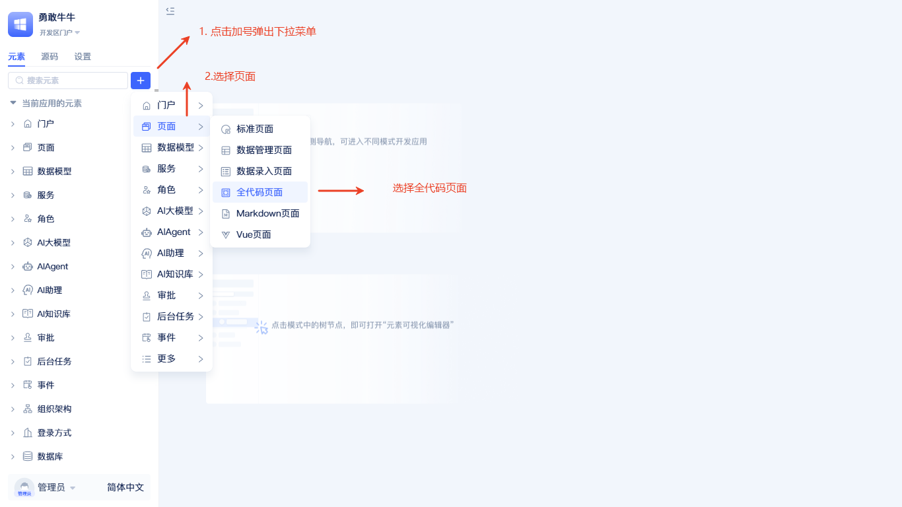
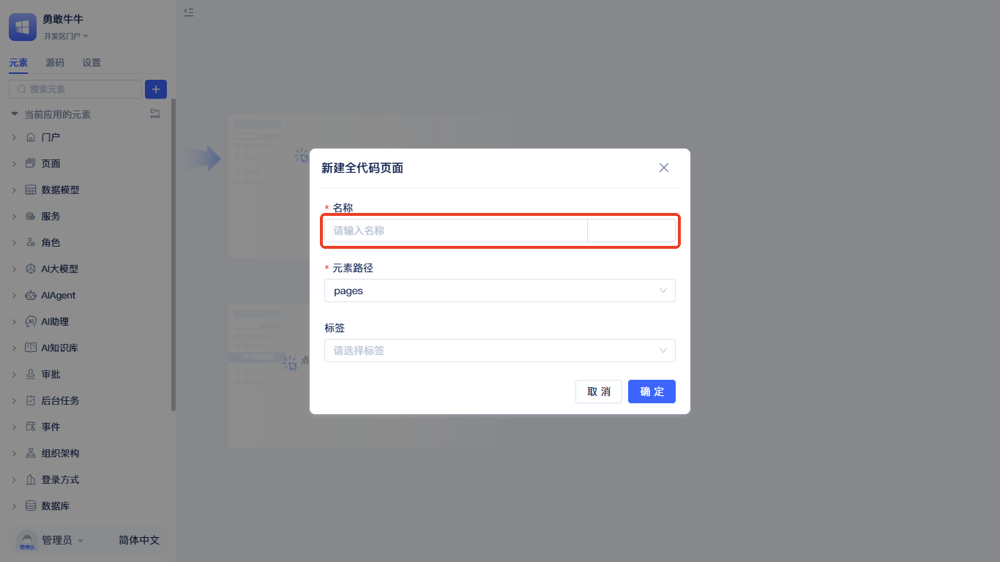
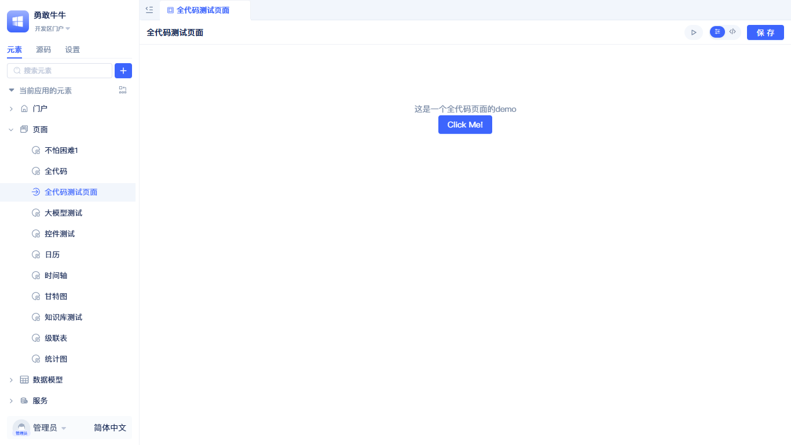
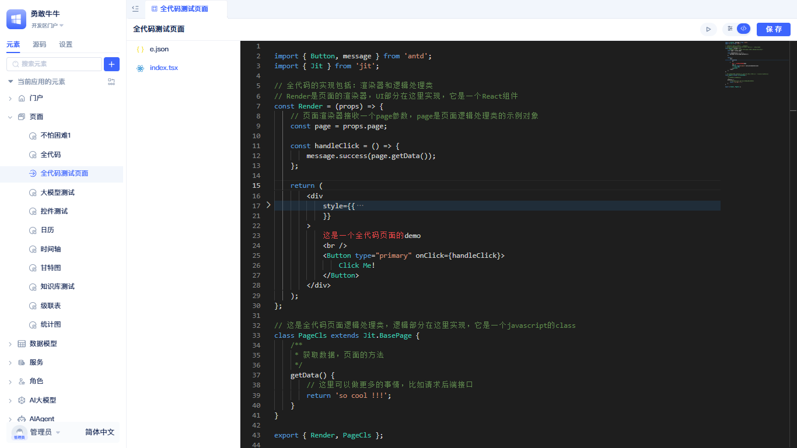
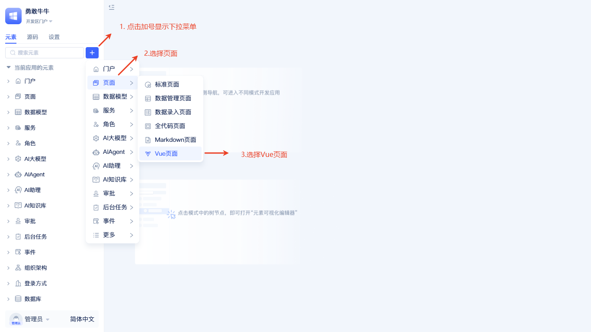
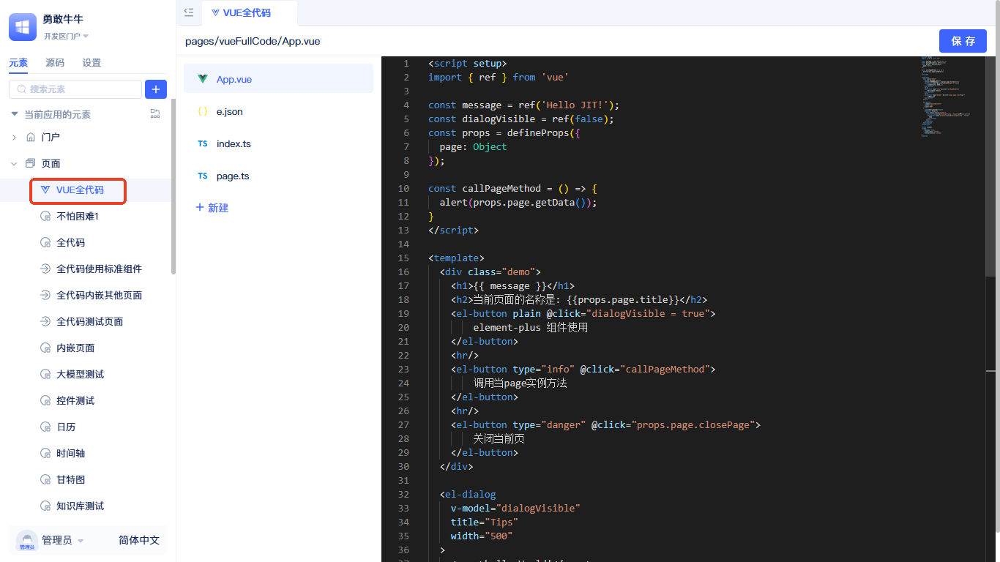

import Tabs from '@theme/Tabs';
import TabItem from '@theme/TabItem';

# 创建全代码页面
在真实业务交付中，会存在复杂交互与高度个性化的场景：组件行为难以完全自定义、依赖与版本受限、团队既有前端资产难以复用，调试与性能优化也常被框架边界所束缚。为解决这些痛点，我们推出全代码页面能力，让你以原生前端的方式开发页面，同时无缝对接平台能力，从而加速交付。你可以使用熟悉的React或Vue自由组织代码，通过网络导包或配置第三方依赖掌控技术栈，并直接使用平台提供的数据模型读写与后端服务调用。

:::tip 开发指南
本文档介绍全代码页面的创建流程。如需了解具体的开发技术和使用方法，请参考1 [页面定制](../../frontend-ui-customization/page-customization.md)。
:::

## 创建 React 全代码页面 {#create-react-full-code-page}
平台使用React构建，React全代码页面能最大程度与平台融合。

在元素目录树点击搜索框右侧的`+`按钮，选择`页面`-`全代码页面`。随后弹出创建全代码页面元素的弹窗。

创建弹窗中只需填写`名称`即可，点击`确定`完成创建。

创建完成后会在左侧元素树中显示。默认全代码页面有一个可点击的按钮，按钮点击后弹出`so cool!!!`，初始文件如下图：

默认生成两个文件：一个 `index.tsx`，一个 `e.json`。`e.json` 是页面元素的定义；重点关注 `index.tsx`。`index.tsx` 会导出两个核心模块：Render 函数（当前全代码页面的主渲染函数）和 PageCls（一个页面类，继承自 `BasePage`）。PageCls 会在页面渲染前由系统进行实例化，并传入到 Render 的 props 中。

## 创建Vue全代码页面 {#vue-full-code-page}
对于不熟悉React的开发者，平台也提供了Vue全代码页面。

在元素目录树点击搜索框右侧的`+`按钮，选择`页面`-`vue页面`。随后弹出创建vue页面元素的弹窗。

创建弹窗中只需填写`名称`即可，点击`确定`完成创建。

创建完成后会在左侧元素树中显示。默认Vue全代码页面展示了Element Plus UI组件的使用，包含三个功能按钮：打开对话框展示Element Plus组件、调用page实例方法、关闭当前页面，演示了Vue全代码页面的基本交互能力。

:::tip 建议
全代码页面创建完成后，查看 [页面定制](../../frontend-ui-customization/page-customization.md) 了解详细的开发方法，包括样式使用、组件调用、数据模型操作等
:::
