# 创建门户
在企业级应用中，通常不同应用角色的用户因权限或负责业务范围不同，看到的系统功能入口有所区分。JitAi使用门户实现这种区分，不同应用角色的用户能看到的门户列表不同，每个门户中的导航菜单也不同。

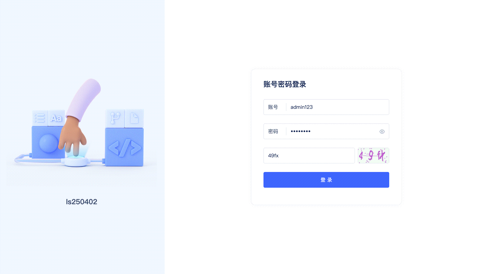

用户登录系统后即可在门户选择页面看到自己可以访问的门户列表，选择一个门户后即可进入该门户并访问门户中的功能。

## 应用内置3个门户 {#application-built-in-three-portals}
JitAi会为每个新创建的应用创建三个内置的门户：开发者门户、管理者门户、使用者门户。

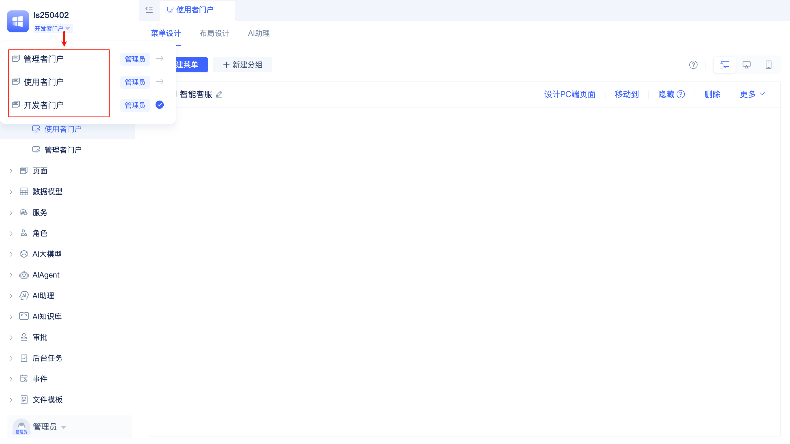

以开发者门户为例，用户在任意门户中的左上角都可以进行门户切换操作。

### 开发者门户 {#developer-portal} 
开发者门户是给应用开发者使用的，开发者进入开发者门户后即可使用[JitAi开发工具](../../development-tool-and-publish-service/jitai-visual-development-tools)进行应用开发工作，例如给不同应用角色配置可访问的门户列表、搭建系统功能、配置应用信息等。

除了开发者门户之外，其它所有门户的导航菜单都是由应用开发者在开发者门户中进行配置的。

### 管理者门户 {#admin-portal} 
拥有应用管理员角色的用户可以进入管理者门户对应用进行管理，比如管理组织架构、组织架构角色及其成员。开发者也可以对管理者门户进行修改。

每个应用在创建时会自动创建一个管理员账号，初始用户名：`admin123`，初始密码：`admin123`，建议开发者登录后在个人[基本信息](../../development-tool-and-publish-service/jitai-visual-development-tools#personal-center)中修改。

:::tip 组织架构角色与应用角色
组织架构角色与用户在企业组织架构中的岗位相对应，而JitAi应用中的的`应用角色`则代表用户在应用系统中的权限。组织架构角色与应用角色类似但并无严格对照关系，一个普通员工也可以被赋予应用管理员的角色，管理一个应用系统。
:::

### 使用者门户 {#user-portal}
开发者门户和管理者门户都是应用系统中必须的基础门户，前者用于应用开发，后者用于应用管理。

使用者门户是给普通用户使用的，他们既非管理者也非开发者，只是使用开发好的应用功能在自己权限范围内开展日常工作。

## 3种门户类型 {#three-portal-types}
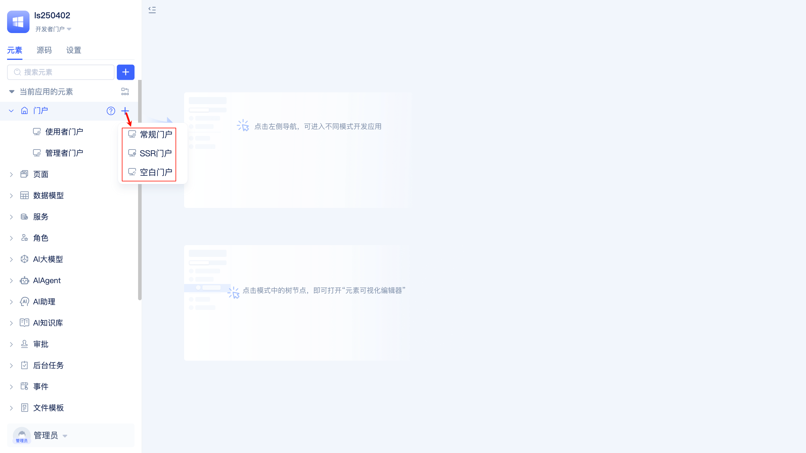

新建门户时，开发者需要选择门户类型。JitAi提供了三种门户类型：常规门户、SSR门户、空白门户。

### 常规门户 {#regular-portal}
常规门户是最为常用的门户类型，内置了左侧导航、顶部导航、用户信息展示等完整门户组件，同时支持PC端和移动端的响应式适配。

### 空白门户 {#blank-portal}
空白门户是最小化的门户实现，提供基础的页面容器和路由框架，不包含内置的导航体系，完全由开发者自定义界面结构，适用于高度定制化的应用界面和特殊展示需求。

### SSR门户 {#ssr-portal}
SSR(Server-Side Rendering，服务端渲染)门户用于提升首屏加载性能和SEO优化，目前支持Markdown文件渲染。

## 创建门户并配置菜单 {#create-portal-and-configure-menu}
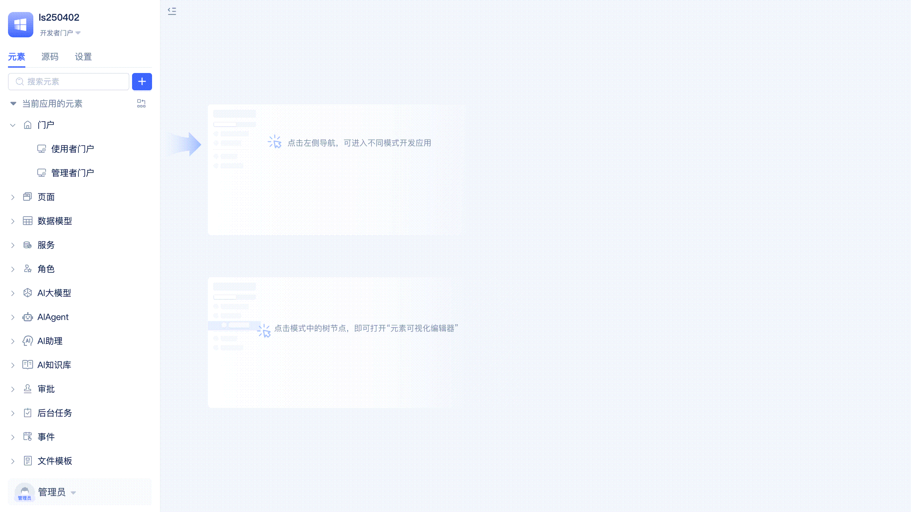

开发者在元素树中找到`门户`，点击右侧`+`按钮，选择`常规门户`打开`新建常规门户`弹窗表单。开发者输入门户名称后点击`确定`，即可新建一个常规门户，并进入可视化门户编辑器。

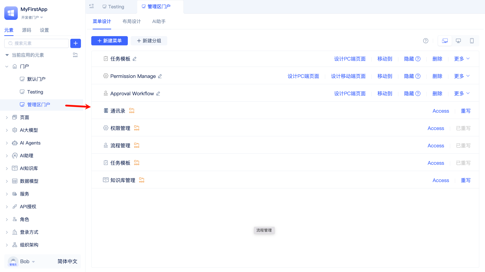

在常规门户编辑器中，开发者可以进行门户的菜单设计、布局设计、配置AI助理。

### 新建/删除/隐藏菜单 {#create-delete-hide-menu}
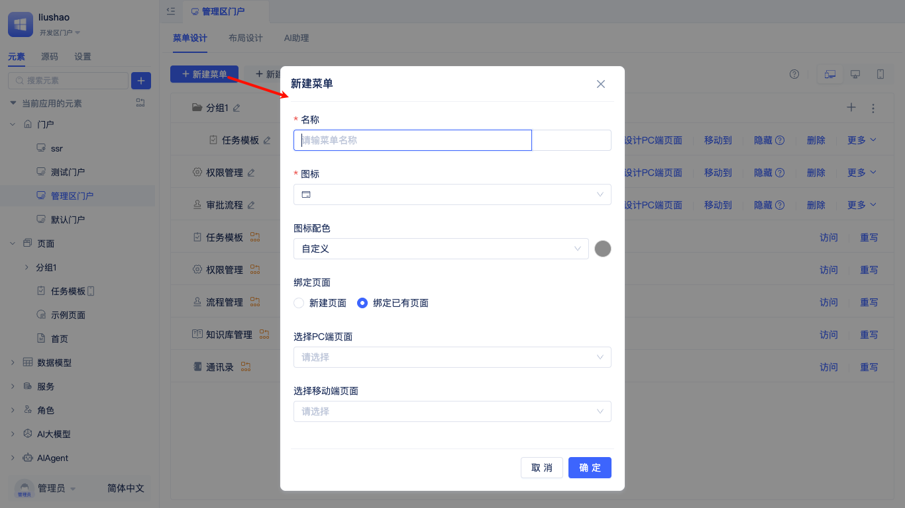

开发者按需在门户中新建若干菜单，每个菜单在创建时支持指定名称、图标、图标配色。菜单创建时可以绑定已有的PC以及移动端页面，也可以在创建菜单的同时自动新建页面（需要选择一种页面类型）。

如需删除菜单，可以点击菜单项右侧的`删除`按钮，在弹窗中选择是否连页面一起删除，点击`确定`后即可删除菜单。

在菜单项右侧还有`隐藏`按钮，当菜单被隐藏时，用户在访问门户时则看不到被隐藏的菜单入口。

### 拖拽菜单排序 {#drag-menu-sort}
开发者可以拖拽任意菜单项到目标位置，从而调整菜单项的顺序。

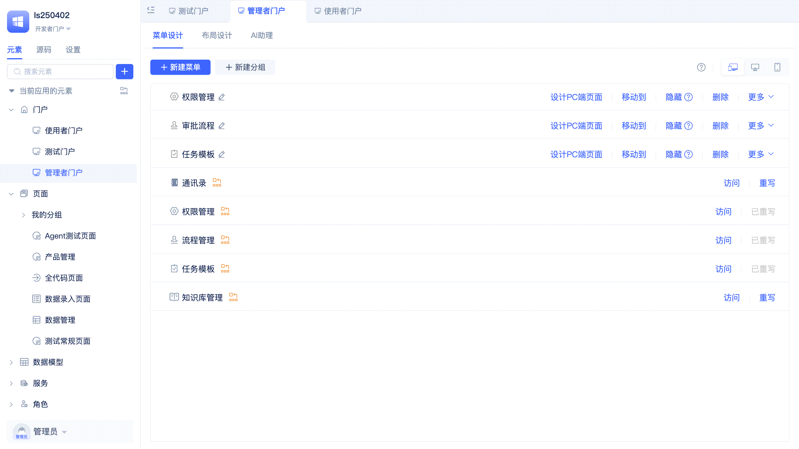

开发者将鼠标放在目标菜单项上，当鼠标变成小手图案时，按住鼠标左键上下拖拽菜单项，即可调整其所在行。

### 对菜单进行分组 {#menu-grouping}
当菜单项较多时，开发者可以创建分组，并将菜单项分类移动到分组中，从而使门户导航结构更加清晰。当然，也可以提前创建好分组，直接在分组下新建菜单。

如何新建门户菜单分组？

开发者点击`+ 新建分组`按钮，在`新建分组`弹窗中输入分组标题，点击`确定`后即可创建一个分组。开发者可以在创建分组的同时设置分组展开和收起图标以及图标配色，也可以在创建完成后点击分组标题右侧的`铅笔`按钮进行再次编辑。

如何将菜单移动到分组中？

在每个菜单的右侧有`移动到`按钮，点击该按钮后在弹窗中选择要移动到的目标分组，即可将菜单项移动到该分组中。想将菜单从分组中移出或移动到其它分组，再次使用`移动到`按钮并选择目标门户/分组即可。

门户菜单的分组支持嵌套，开发者点击分组标题右侧的`+`按钮，就可以在分组下创建子分组，实现嵌套结构。

和菜单类似，分组也支持移动操作。

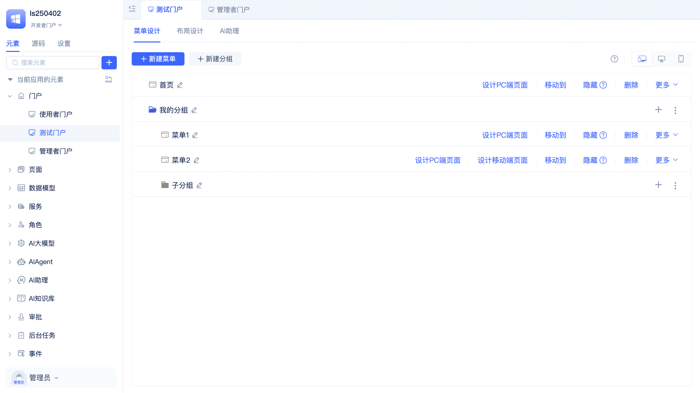

开发者点击分组标题右侧的`...`按钮，在弹出中选择目标位置后点击`确定`即可完成移动。

### PC端和移动端菜单页面 {#pc-mobile-menu-pages}
创建菜单时如果选择新建页面，平台会自动创建PC端和移动端两种页面并出现在元素目录树中，开发者需要在页面的可视化编辑器中进行页面开发。

创建菜单时如果选择绑定已有页面，开发者可以指定要绑定的PC端和移动端页面，二者选其一或全选都可以。

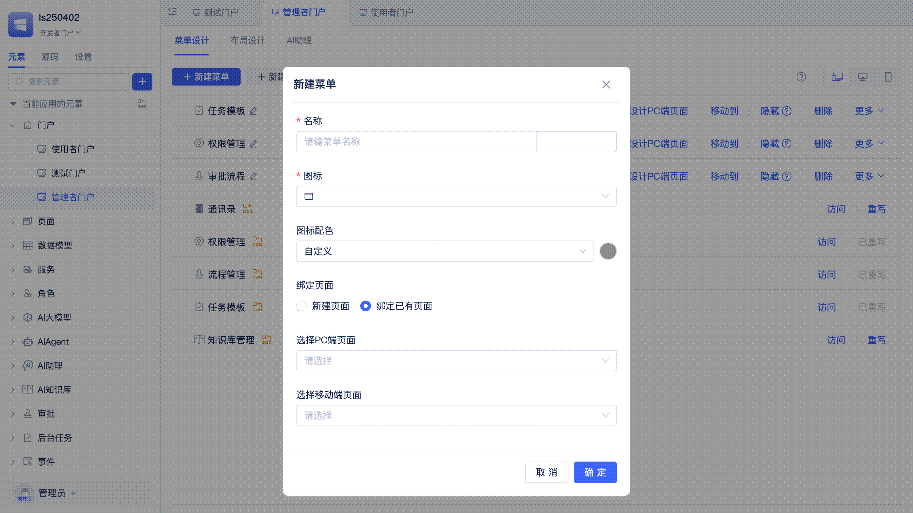

若菜单没有启用移动端页面，开发者可以一键启用，还可以进行PC端和移动端页面的同步、将页面从菜单中移除。

开发者点击菜单项右侧的`更多`按钮，在弹出的列表中点击`开启移动端页面`按钮即可快速启用移动端页面。PC端页面和移动端页面之间支持快速同步，点击`同步PC端页面`或`同步移动端页面`按钮即可完成设计同步。如果想把PC端或者移动端页面从菜单中移除，点击`移除`按钮即可。

### 使用页面变量赋值控制页面逻辑 {#page-variable-assignment}
同一个页面可能会被不同的门户菜单使用，从不同门户菜单访问时，页面需要展示不同的内容/执行不同的逻辑，此时可以利用页面变量赋值实现。

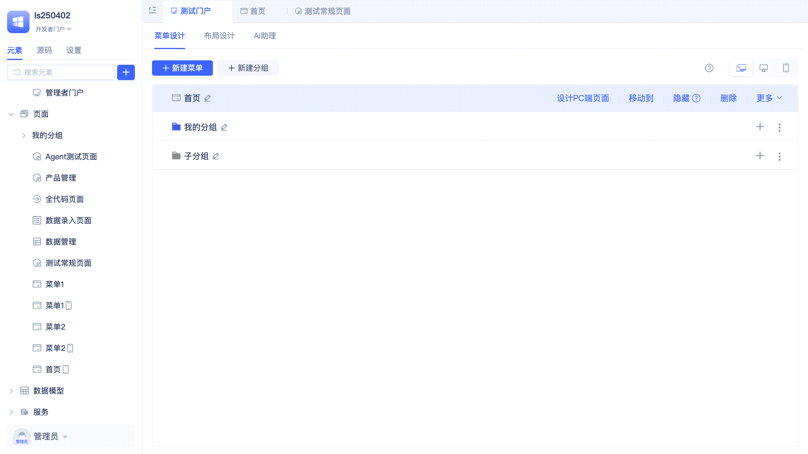

开发者可以展开菜单项右侧的`更多`按钮，点击`页面变量赋值`按钮，在弹窗中为页面变量赋值。

:::warning
开发者需要在页面中声明[页面变量](../component-based-page-development#page-variables)，页面没有声明变量时则无法在门户中设置页面变量赋值。
:::

### 重写菜单页面 {#rewrite-menu-page}
门户也可以从被继承应用中继承，但并不是门户中所有菜单的页面都符合当前应用需求，开发者可以重写门户中的菜单页面。

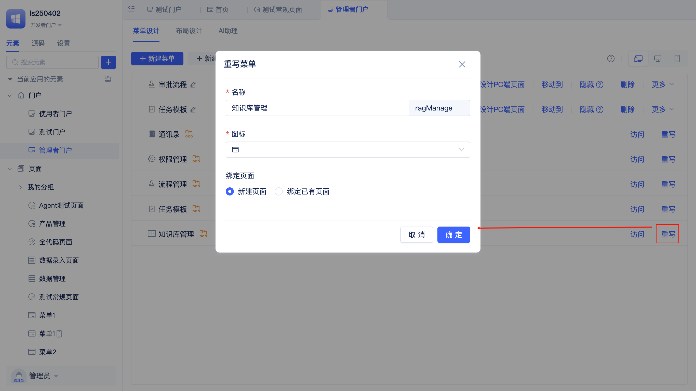

点击菜单项右侧的`重写`按钮，打开`重写菜单`的弹窗，开发者可以给页面重命名、可以选择新建页面或直接绑定已有页面。

## 门户布局设计 {#portal-layout-design}
### 设置左侧/顶部导航 {#set-left-top-navigation}
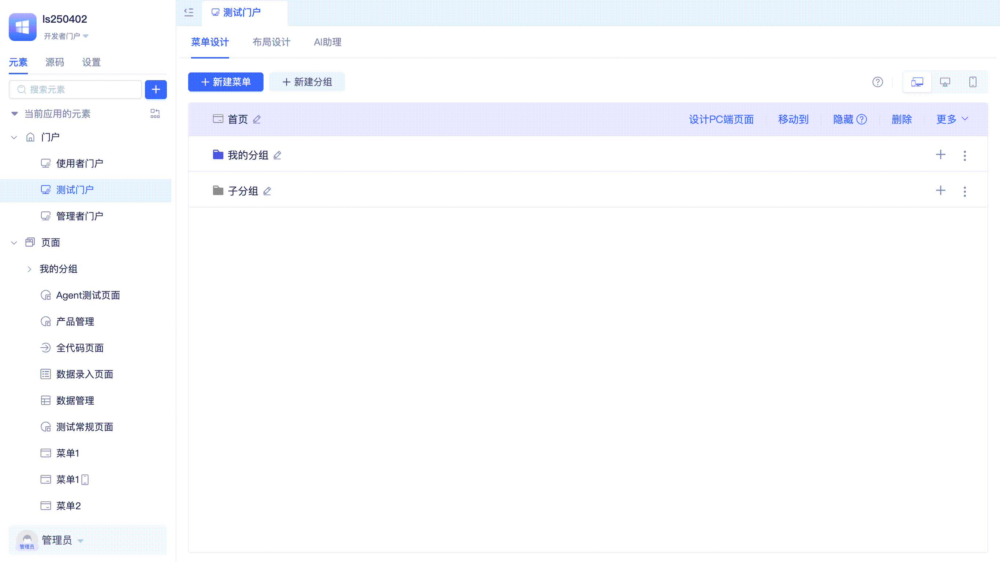

开发者可以修改导航栏的显示位置，支持左侧导航、顶部导航。

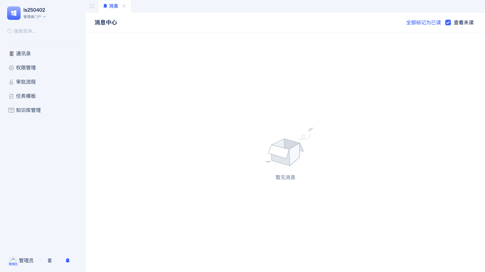

以上是设置为左侧导航后的效果，所有导航菜单显示在系统界面的左侧。

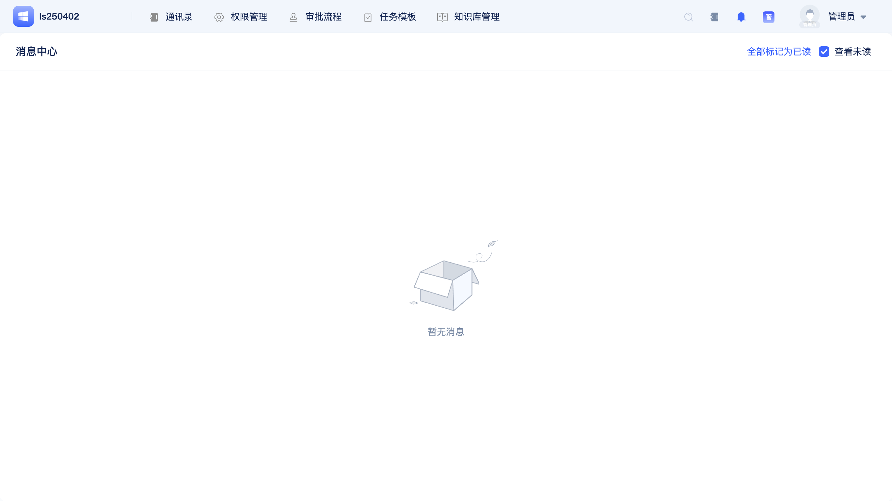

以上是设置为顶部导航后的效果，所有导航菜单显示在系统界面的顶部。

### 多标签页 {#multi-tabs}
开发者在门户的`布局设计`中启用或禁用`多标签页浏览`。

开启多标签页时，每一个被访问的菜单页面都会出现在标签页列表中，用户可以点击标签页切换页面。

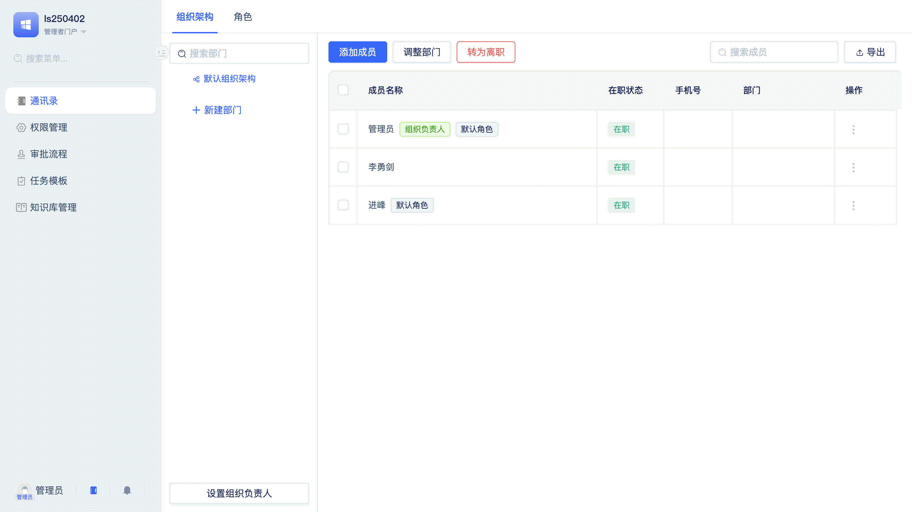

禁用多标签页时，页面不会显示标签页列表，用户只能在导航菜单中切换页面。

### 是否显示在门户切换列表中 {#show-in-portal-switch-list}
当开发者在`布局设计`中关闭了`在门户切换菜单中显示`开关时，用户在门户左上角的门户切换菜单中将看不到该门户。

### 设置在门户列表中的顺序 {#set-portal-list-order}
当应用包含多个门户时，开发者可以在`布局设计`中设置顺序值，从而调整每个门户在门户切换菜单中的显示顺序。

## 启用或关闭常用功能入口 {#enable-disable-common-function-entries}
每个新建的门户默认都会有一些常用功能入口：发起申请、待办中心、消息中心、个人中心、新建功能（支持简易模式下新建功能模块，开发能力弱于[可视化开发工具](../../development-tool-and-publish-service/jitai-visual-development-tools)）。以上入口支持在`布局设计`中启用或禁用。

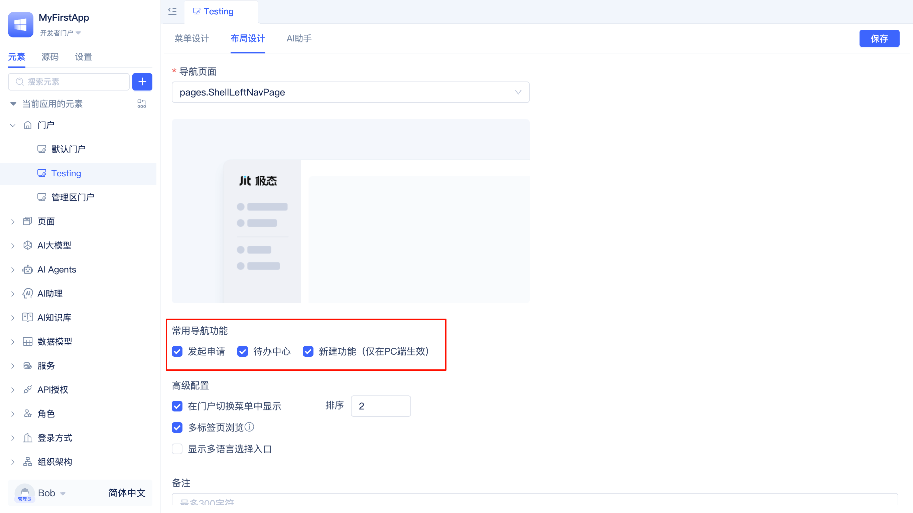

开发者在`布局设计`-`常用导航功能`区域勾选或取消勾选，即可将对应的功能入口启用或禁用。

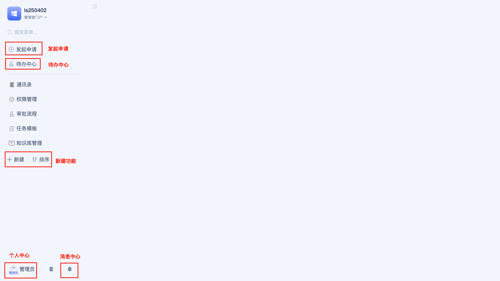

上图是启用所有常用功能入口后的效果。

### 发起申请/待办/消息中心入口 {#application-todo-message-entry}
当开发者开启`发起申请`+`待办中心`+`消息中心`入口时，用户可以在访问门户时发起审批流程、查看待办审批事项、查看消息通知。

### 个人中心入口 {#personal-center-entry}
当开发者开启`个人中心`入口时，用户在访问门户时可以查看个人基本信息以及修改昵称、密码，也可以切换[组织架构](../../user-and-permission/organizational-structure)、退出登录。

## 在门户中集成AI助理 {#using-ai-assistant-in-portal}
JitAi支持在门户中直接集成[AI助理](../../ai-assitant/create-ai-assistant)，用户在访问门户时可以与AI助理进行交互。这里做概括性介绍，详细内容请参考[在门户中集成AI助理](../../using-ai-in-portals-and-pages/using-ai-assistants-in-portals)。

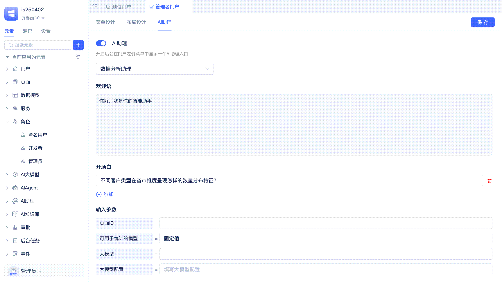

开发者在门户配置界面中点击`AI助理`页签，在配置界面中打开开关并选择一个[AI助理](../../ai-assitant/create-ai-assistant)，即可在门户中集成AI助理。

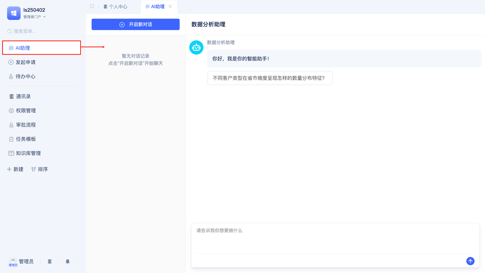

当用户访问开启了[AI助理](../../ai-assitant/create-ai-assistant)的门户时，可以看到”AI助理“导航菜单，点击即可打开AI助理对话框并与其对话。

