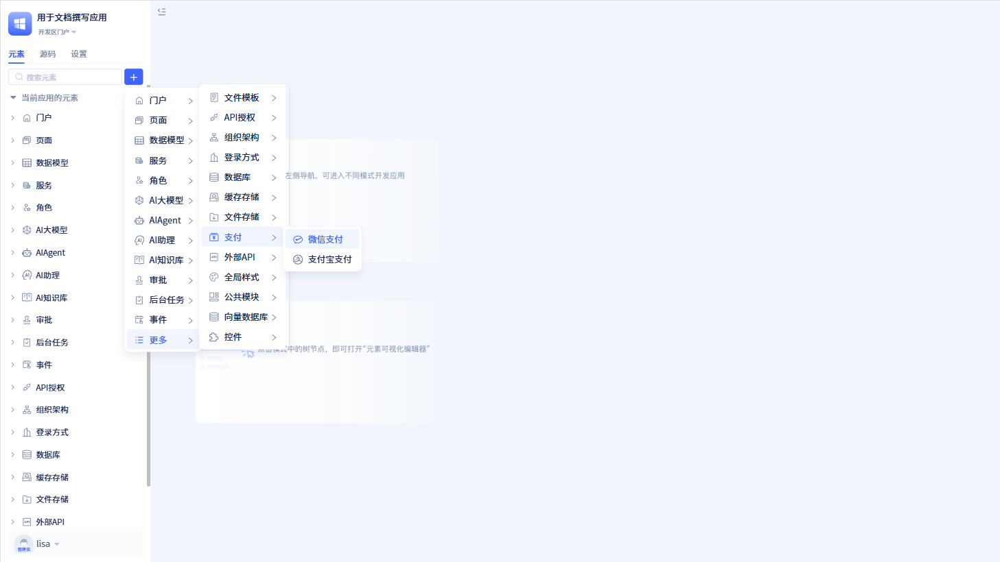
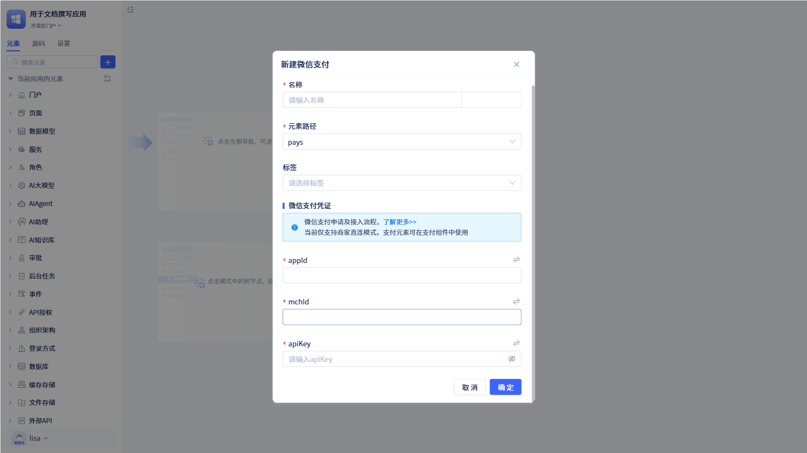
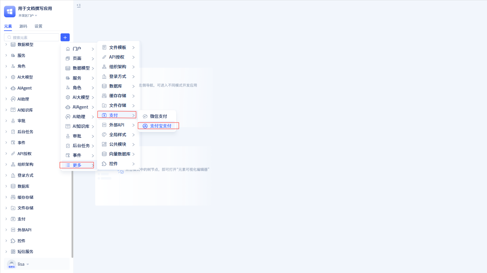
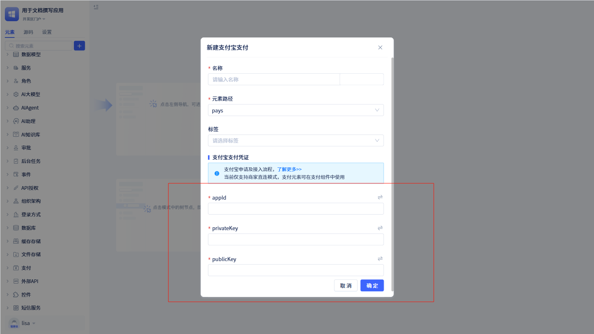
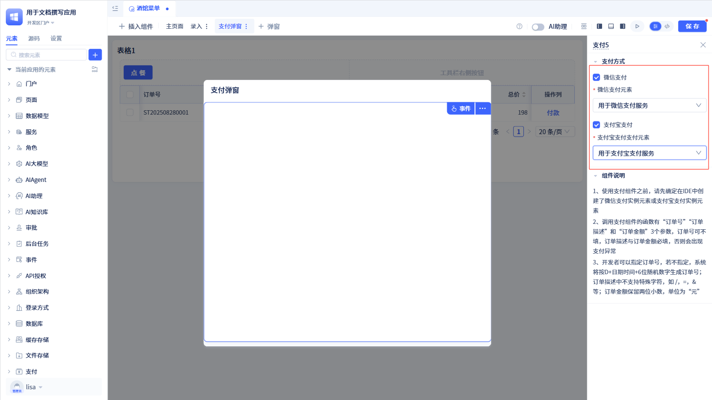

# 内置的支付服务
支付服务是 JitAi 基于微信支付和支付宝支付服务开发的支付服务模块，负责支付订单创建、支付链接获取、订单状态查询、支付确认和回调处理等功能。它提供了标准化的支付业务接口，封装了与第三方支付平台的复杂交互逻辑。

## 微信支付服务配置 {#wechat-payment-service-configuration}
微信支付是集成微信支付官方 API 的支付处理元素，基于微信支付 V2API 实现扫码支付、H5 支付、小程序支付等多种支付方式。它适用于微信小程序、公众号、APP 等微信生态应用场景，通过标准化 API 简化支付集成复杂度。

在左侧元素树上点击`+`会打开弹窗，将鼠标移动到"更多"中，会看到"支付服务"。点击"支付服务"里面的"微信支付"，即可创建一个微信支付元素。

:::warning 注意

一个完整的微信支付服务必须填写 appId、mchId 和 apiKey。

appId、mchId 和 apiKey 都是微信支付平台提供的参数，需要用户到[微信支付平台](https://pay.weixin.qq.com)申请。

:::

## 支付宝支付服务配置 {#alipay-payment-service-configuration}
支付宝支付是基于支付宝官方 API 实现多种支付方式的集成。它负责支付链接生成、订单状态查询和回调通知处理，支持扫码支付、手机网站支付等方式，适用于电商、O2O、生活服务等多种商业应用场景。

在左侧元素树上点击`+`会打开弹窗，将鼠标移动到"更多"中，会看到"支付服务"。点击"支付服务"里面的"支付宝支付"，即可创建一个支付宝支付元素。

:::warning 注意

一个完整的支付宝支付服务必须填写 appId、 privateKey 和 publicKey。

appId、 privateKey 和 publicKey 都是支付宝平台提供的参数，需要用户到[支付宝开放平台](https://open.alipay.com/)申请。

:::

## 支付服务使用 {#payment-service-usage}
创建好支付服务后，需要配合支付组件使用，具体使用方法请参考[支付组件使用](../using-functional-components-in-pages/payment-components)。

在创建支付组件后，选择对应的支付服务，即可完成支付服务配置。
