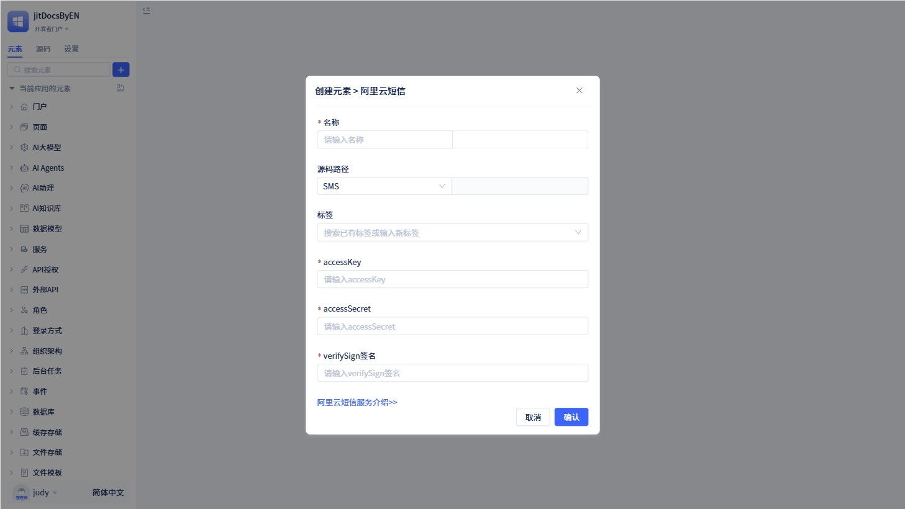

# 内置的短信服务
短信服务在业务中主要用于验证码、通知提醒、营销推广等，具备高可达性、低延迟和强可靠性等优势。

JitAi 接入短信服务，开发者在 IDE 门户配置短信服务参数，提供给其他模块（如手机号登录、审批通知发送短信等）使用。

当前 JitAi 暂时只支持阿里云短信服务。

## 阿里云短信 {#aliyun-sms}
阿里云短信是基于阿里云 SMS API 的企业级短信通知服务，通过标准的 sendMessage 接口实现验证码发送、通知提醒等短信业务场景。它集成阿里云 SMS API，支持 AccessKey 认证和签名验证机制，提供完整的错误处理和日志监控，确保消息发送的可靠性。

### 阿里云短信服务创建 {#aliyun-sms-service-creation}

在左侧元素树上点击`+`会打开弹窗，将鼠标移动到“更多”中，会看到“短信服务”。点击“短信服务”里面的“阿里云短信”，就会打开阿里云短信的新建弹窗页面。

在新建弹窗页面中，填写名称，再按照要求填写 accessKey、accessSecret 和 verifySign 签名后，点击`确定`就创建了一个阿里云短信元素。

:::warning 注意
accessKey、accessSecret 和 verifySign 签名都是创建阿里云短信服务时必须填写的参数。

这三个参数都是由阿里云提供，需要用户到[阿里云短信服务平台](https://help.aliyun.com/zh/sms/)进行申请。

## 在审批流程中使用短信服务 {#using-sms-service-in-approval-workflow}
短信服务可以集成到审批流程中，实现审批通知和提醒功能。
:::

进入阿里云短信服务配置页面。用户如果需要修改参数，直接修改后点击`保存`即可。注意填写内容的真实性，否则将无法使用。

### 手机登录方式中使用短信服务 {#use-sms-service-in-mobile-login}
开通手机登录方式后，用户注册账号或登录时，系统会要求用户填写手机号码，然后发送验证码到用户手机。这里就会使用到短信服务进行发送验证码功能。

在左侧元素树上找到“登录方式”，然后在“登录方式”中选择`手机号登录`后，会打开手机号登录新建弹窗页面。在新建弹窗页面中需要配置短信服务以及短信模板代码。

开发者可以选择已经创建好的短信服务，也可以创建一个新的短信服务。

:::tip 提示
短信模板代码是开发者在短信平台中配置的验证码信息模板，需要开发者去短信平台申请。

对已经创建好的手机登录方式，可以在手机登录方式的配置页面修改短信服务和模板代码。
:::

### 审批流程中使用短信服务 {#use-sms-service-in-approval-workflow}
审批节点/抄送节点支持配置短信服务，当开发者配置短信服务后，如果有对应的审批流转到该节点，系统就会发送短信给审批人/抄送人。

在审批节点/抄送节点的配置页面中，打开“”短信服务”开发即可配置短信服务。

:::tip 提示

开发者可以选择已经创建好的短信服务，也可以创建一个新的短信服务。

开发者需要在短信平台中配置审批短信模板，该模板必须接收两个参数：流程名称(processTitle)和发起人昵称(userNick)

开发者在短信平台配置好模板后，将模板代码填到这里即可。

:::

### 短信通知功能 {#sms-notification-function}
开发者可以在函数逻辑中配置短信通知功能，当执行这个函数时，系统就会发送短信给指定用户。

在函数逻辑中选择“服务 -> 消息服务 -> 短信通知”后，实现了一个短信通知功能的声明。

在`设置参数`弹窗中，填写短信接收方、短信服务、短信模板代码以及模板变量后，点击`确定`后，就可以实现短信通知功能了。

:::warning 注意
短信接收方可以是指定成员、指定部门或者系统中的应用角色。但是短信接收方必须是三者中的一个或多个。

短信服务可以是已经创建好的短信服务，也可以创建一个新的短信服务。

短信模板代码是开发者在短信平台中配置的短信模板，需要开发者去短信平台申请。模板变量是开发者在申请短信模板时所定义的变量。
:::
