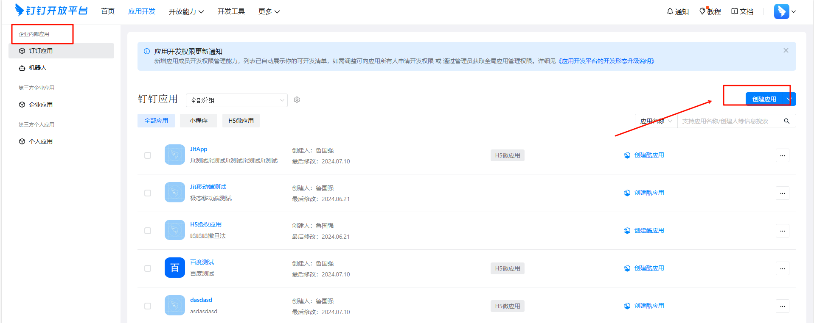
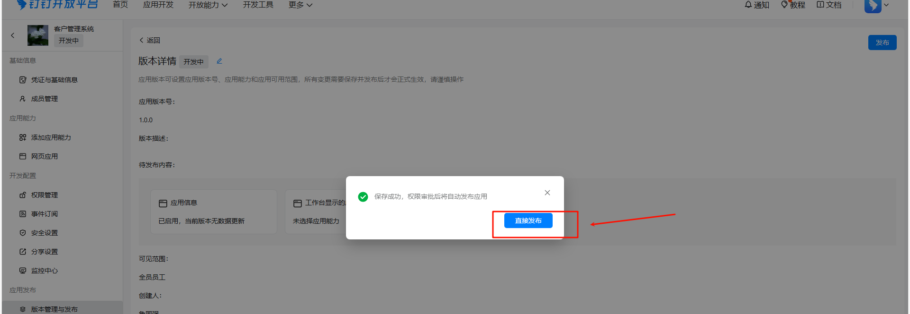
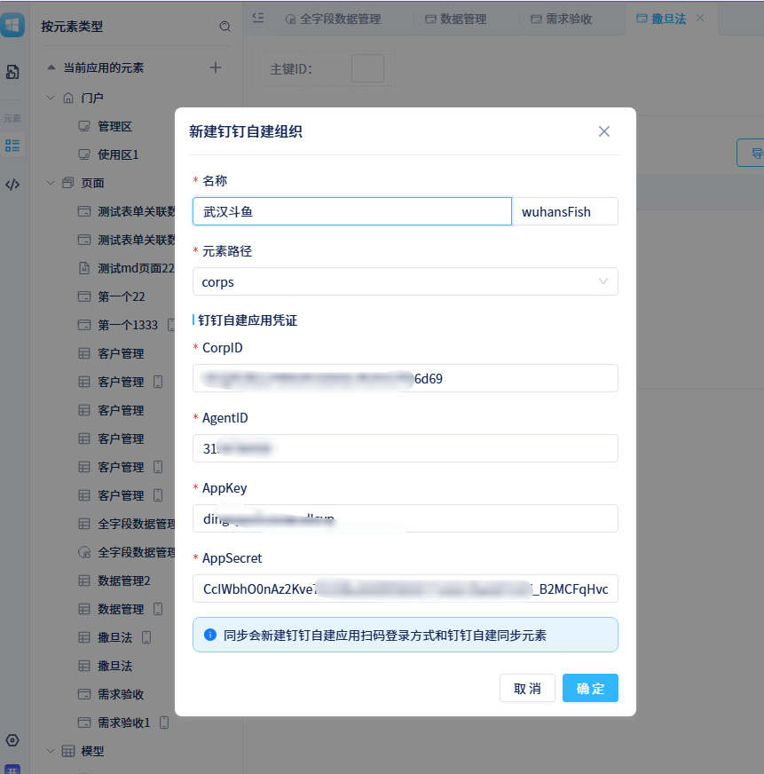
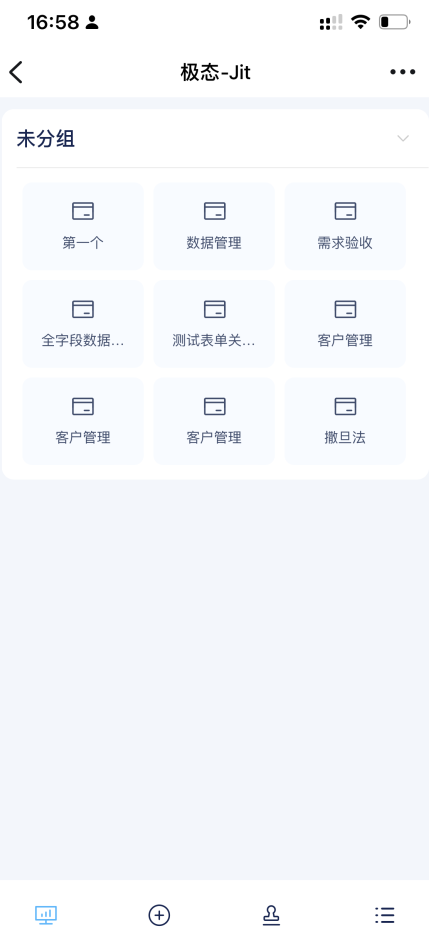

# 如何在钉钉工作台添加JitAI应用并实现免登及移动端体验

## 在钉钉后台添加一个企业内部自建应用

1.  进入钉钉开放平台后台[https://open-dev.dingtalk.com/fe/app?hash=%23%2Fcorp%2Fapp#/corp/app](https://open-dev.dingtalk.com/fe/app?hash=%23%2Fcorp%2Fapp#/corp/app) 进入应用开发-企业内部应用

    

2.  点击【创建应用】，配置应用的标题和应用的名称，在钉钉工作台会显示该名称和应用图标

    

3.  完成创建之后，会自动进入应用详情页面，此时需要添加【网页应用】功能，其他功能看情况加

    

4.  添加之后需要配置 ，应用首页地址、PC 端首页地址，管理后台地址都可以按以下规则填写同一个链接

    配置地址的规则：`https://domain/{orgid}/{appId}/login?corpId=$CORPID$``协议://域名/组织 id/应用 id/login?corpId=$CORPID$`

    比如我的应用：https://jit-dev.wanyunapp.com/whwy/yiguixue/login?corpId=$CORPID$ 

    

5.  在【版本管理与发布】中【创建新版本】

    

6.  填写版本描述，注意配置【应用可见范围】，默认是“仅我可见”，若无特殊要求，可以改成“全部员工”、保存后直接发布

    

    

7.  此时在 PC 端和移动端的工作台已经可以看到这个应用，看不到的话可以【设置】里面搜索应用，将应用添加到全员常用的分栏里面

**可是。。。别高兴太早，此时虽然已经在工作台添加了应用，但是并没有实现免登，哪怕配置了免登链接，点击这个应用，还是会进入到登录页面**

**此时需要在 JitAI 创建一个钉钉自建组织架构**

## 在 JitAI 应用中创建一个钉钉自建组织架构

1.  获取钉钉自建应用的配置信息，进入上面创建好的应用，进入【凭证与基础信息】可以看到这么多字符串

    

2.  还有一个重要信息，企业 CorpID，在这呢，点击即可复制

    

3.  此时在 JIt 应用中新建一个钉钉自建组织架构，入口如下

    

4.  把上面拿到的凭证信息，一一对应填入输入框，别填错了，填错了可就填错了

    

    

5.  哦对了，如果同组织架构时拿不到成员部门信息，可以顺手把这个权限都授权一下，反正也不要钱

    

6.  创建好了之后，需要给新组织架构中的成员授权，要不然可以免登也会没有权限，是吧

    

7.  一切都搞好之后，在钉钉工作台就可以免登进入应用，PC 端与移动端都是一样的。大功告成！！！！！！！！！

**注意： 如果在网页端使用钉钉扫码登录时没有钉钉二维码，在钉钉的后台中配置一下接入域名。服务器的域名就可以，不需要完整的应用的地址**

