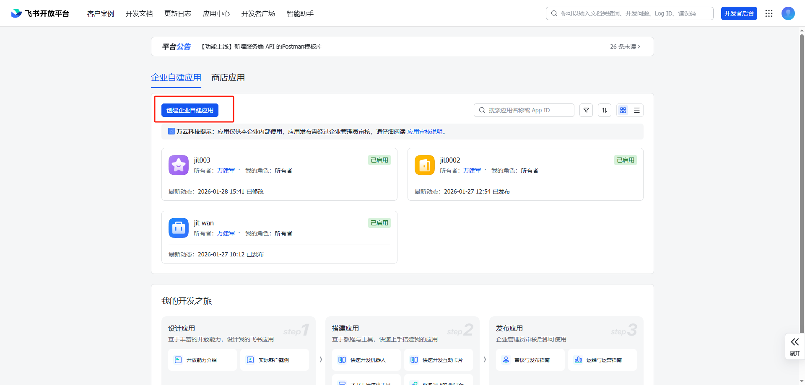
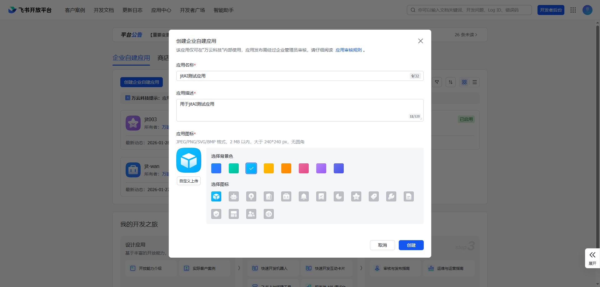
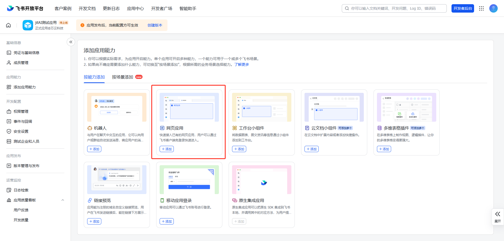
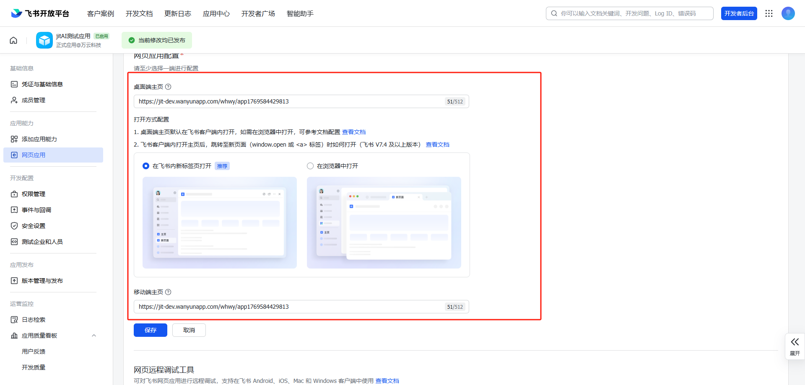
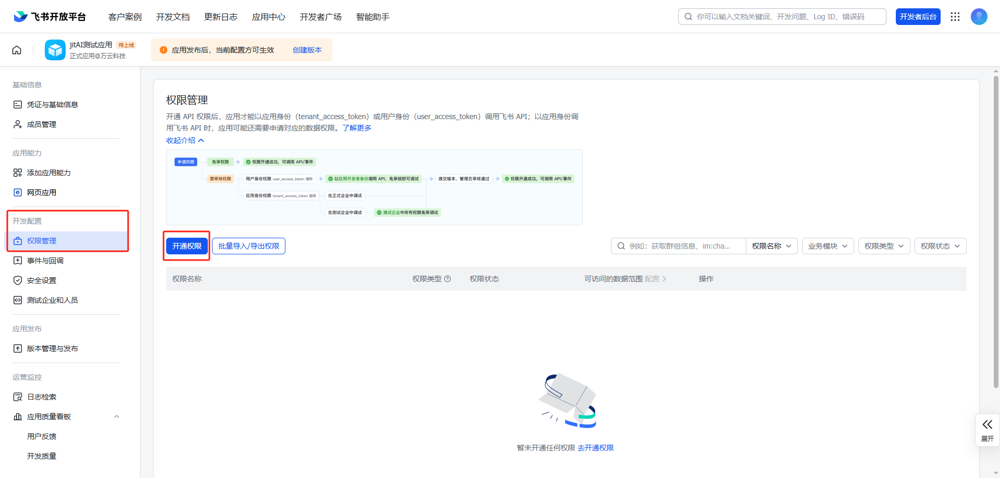
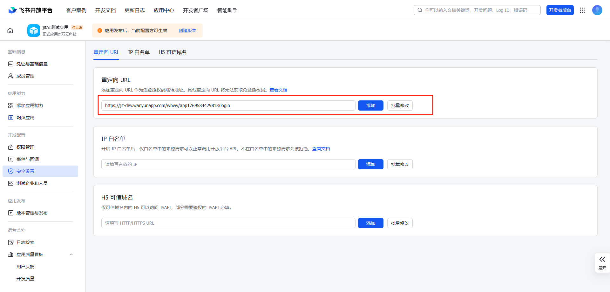
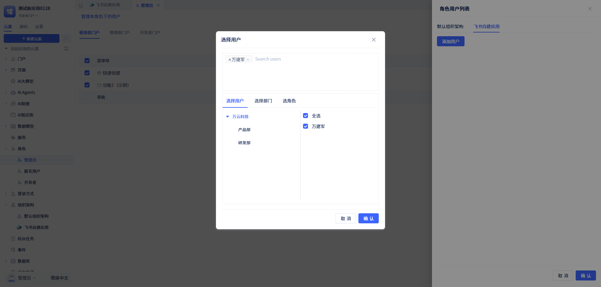

# 如何在飞书工作台添加Jit应用并实现免登及移动端体验

## 在飞书后台添加一个企业内部自建应用

1.  进入飞书开放平台后台[https://open.feishu.cn/app](https://open.feishu.cn/app) 进入应用开发-企业内部应用

2.  点击【创建企业自建应用】，配置应用的标题和应用的名称，在飞书工作台会显示该名称和应用图标

3.  完成创建之后，会自动进入应用详情页面，此时需要添加【网页应用】能力，其他功能看情况加

4.  添加之后需要配置 ，桌面端主页、移动端主页配置相关链接，这两个可以配置同一个链接。同时打开方式配置选择在飞书内新标签页打开。

配置地址的规则：`https://domain/{orgid}/{appId}/login` `协议://域名/组织 id/应用 id/login`

比如我的应用：https://jit-dev.wanyunapp.com/whwy/app1769584429813/login

5. 点击【开发配置】下的【权限管理】后，打开权限管理页面，点击【开通权限】给应用开通相关权限。

6. 在【开通权限】弹窗中选择【应用身份权限】标签下的【通讯录】、【组织架构】所有权限以及【企业信息】下的【获取企业信息】权限，还有【用户身份权限】标签下的【通讯录】所有权限。

7. 点击【确认开通】后会自动跳转到【“应用身份权限”可访问的数据范围】页面，点击【配置】选择【全部】后保存即可。

8. 点击【开发配置】下的【安全设置】后，打开安全设置页面，在重定向 URL下配置跳转地址，**注意跳转地址必须是应用的登录地址**。

9. 点击【应用发布】下的【版本管理与发布】，点击【创建版本】后，填写应用版本号（如：1.0.0）和更新说明。配置可用范围，若无特殊要求，可以改成“全部成员”、保存后直接发布。

10. 此时在 PC 端和移动端的工作台已经可以看到这个应用，看不到的话可以在客户端的【工作台】里面点击【添加常用】添加应用到工作台。

**虽然已经在工作台添加了应用，但是并没有实现免登，哪怕配置了免登链接，点击这个应用，还是会进入到登录页面，此时需要在Jit应用中创建一个飞书自建组织架构**

## 在Jit应用中创建一个飞书自建组织架构

1.  获取飞书自建应用的配置信息，进入上面创建好的应用，进入【凭证与基础信息】可以看到APP ID和APP Secret信息。

2.  此时在JIt应用中新建一个飞书自建组织架构，入口如下

3. 把上面拿到的凭证信息，一一对应填入输入框

4. 创建好组织架构后，点击页面右上角的【同步组织架构】进行同步成员信息到当前应用。

5.  创建好了之后，需要给新组织架构中的成员授权，要不然可以免登也会没有权限。

6.  一切都搞好之后，在飞书工作台就可以免登进入应用，并且在应用的登录页也可以使用飞书进行扫码登录。
