# 组织架构 {#organizational-structure}
JitAi平台提供灵活多样的组织架构能力，支持标准组织、钉钉自建组织、企业微信自建组织及 Microsoft Teams 四种类型。用户可根据实际管理需求和系统基础，灵活选择合适的组织架构，实现高效的成员与部门管理。平台不仅支持成员和部门的灵活配置，还可无缝集成第三方平台，全面满足企业多元化的组织管理场景。

## 默认组织架构 {#default-organizational-structure}
在创建应用时，JitAi会自动为你生成一个默认的组织架构。

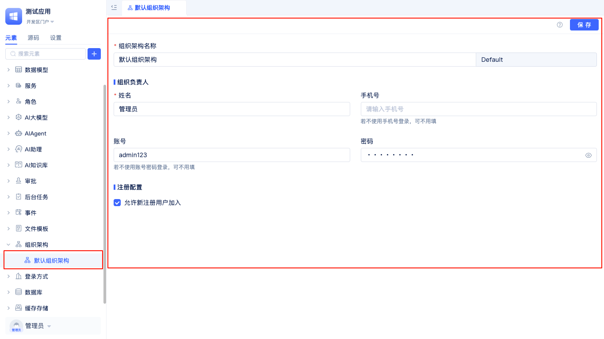

在开发区的元素树中，找到并展开`组织架构`，即可看到系统自动生成的`默认组织架构`。点击该项后，右侧会显示详细的配置信息，支持编辑组织架构名称、设置组织负责人，以及配置是否允许新用户注册加入组织。应用创建人会自动成为组织的负责人并拥有管理员角色。关于角色权限，参考[角色与门户菜单权限指南](./role-portal-menu-permissions)。

## 组织架构创建 {#organizational-structure-creation}
JitAi 支持在同一个应用中创建和管理多个组织架构，满足企业多业务线、跨部门或多子公司的复杂管理需求。开发者可以根据实际场景，灵活选择标准组织、钉钉自建组织或企业微信自建组织等类型，分别配置不同的组织结构、成员、部门及权限体系。每个组织架构相互独立，支持单独的成员管理、部门设置和权限分配，便于实现多租户或多团队协作。通过多组织架构能力，企业可以高效应对组织扩展、业务调整和多平台集成等挑战，提升整体管理效率和系统灵活性。

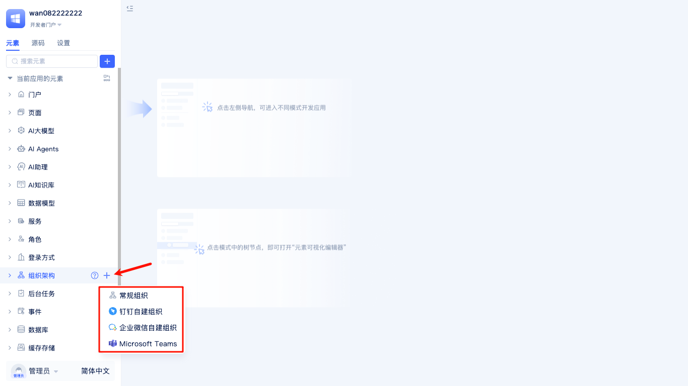

在开发区的元素树中，点击`组织架构`右侧的 `+` 按钮，选择创建标准组织、钉钉自建组织或企业微信自建组织，并填写相关配置信息，完成组织架构的创建。

## 标准组织 {#standard-organization}
标准组织是组织架构元素中最基础的一种，用户可在JitAi中自行维护通讯录信息，不依赖第三方，适用于没有使用第三方通讯办公平台的企业。

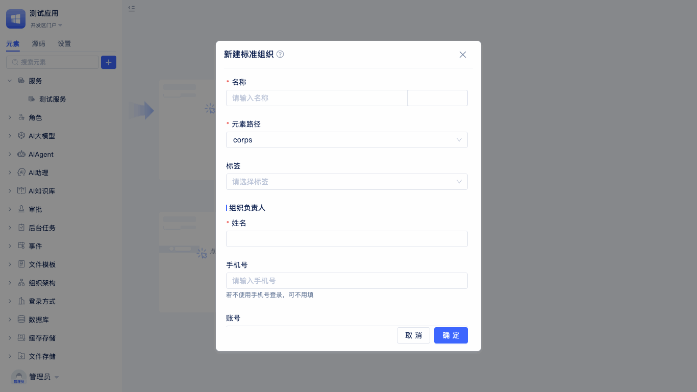

在创建组织架构时，选择标准组织架构，即可出现`新建标准组织`弹窗，输入组织名称(英文名会自动生成)，输入组织负责人姓名，手机号（非必填），账号密码（默认**admin123**），是否允许新注册用户加入。

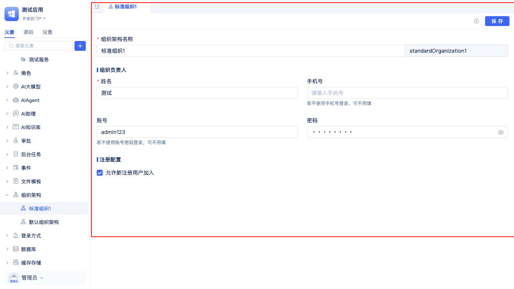

填完配置信息后，点击`确定`即可进入到可视化编辑器中查看。

### 允许新注册用户加入 {#allowing-new-registered-users-to-join}
在创建标准组织架构时，系统会显示`允许新注册用户加入`勾选框，且默认已勾选。勾选后，新的注册用户可直接加入该组织架构，便于成员快速扩展和管理。

## 钉钉自建组织 {#dingtalk-custom-organization}
钉钉自建组织是专门为使用钉钉办公平台的企业设计的组织架构元素。通过该类型，可以实现与钉钉平台的深度集成，自动同步钉钉中的部门结构、成员信息等数据，避免重复维护通讯录的工作负担。

在创建组织架构时，选择钉钉自建组织，即可出现`新建钉钉自建组织`弹窗。需要填写组织名称（英文名会自动生成）、企业ID（CorpID）、AgentID、AppKey、AppSecret等钉钉应用配置信息。这些配置信息用于建立与钉钉平台的安全连接，确保数据同步的准确性和安全性。

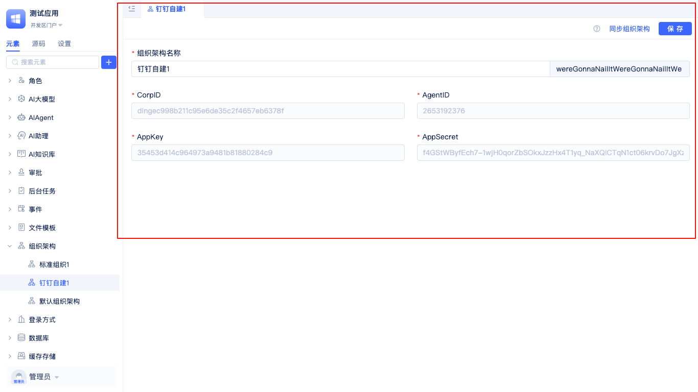

配置完成后，系统将自动从钉钉平台同步组织架构、部门信息和成员数据，实现统一的身份认证和权限管理。

**钉钉配置信息获取指引：可参考[钉钉开放平台文档](https://open-dev.dingtalk.com)**

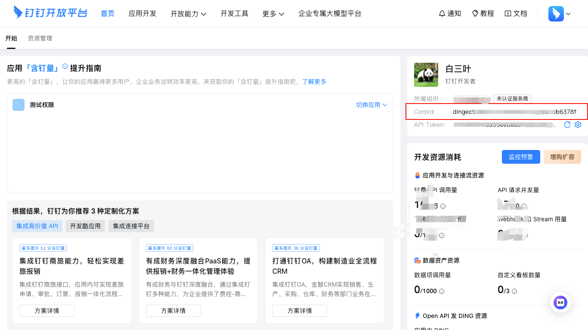

企业ID（CorpID）可在钉钉开放平台的企业信息页面中获取。

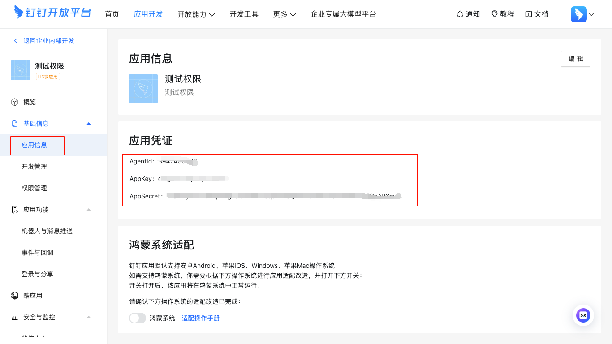

AgentID、AppKey、AppSecret等应用参数需在钉钉开放平台的自建应用详情页中获取。

组织架构创建完成后，JitAi将自动为该组织配置[钉钉自建扫码登录方式](./login-authentication#dingtalk-custom-qr-login)，无需手动设置，便于成员通过钉钉扫码快捷登录系统。

:::tip 注意
进行钉钉组织同步前，请确保已在应用基础信息的权限管理中开启以下权限：`通讯录部门信息读权限`、`成员信息读权限`、`通讯录部门成员读权限`，以保障数据同步的顺利进行。
:::

## 企业微信自建组织 {#wechat-work-custom-organization}
企业微信自建组织是为使用企业微信办公平台的企业量身定制的组织架构元素。该类型可以与企业微信无缝对接，实现组织架构、通讯录信息的自动同步，充分利用企业微信的成熟生态，为企业提供一体化的办公解决方案。

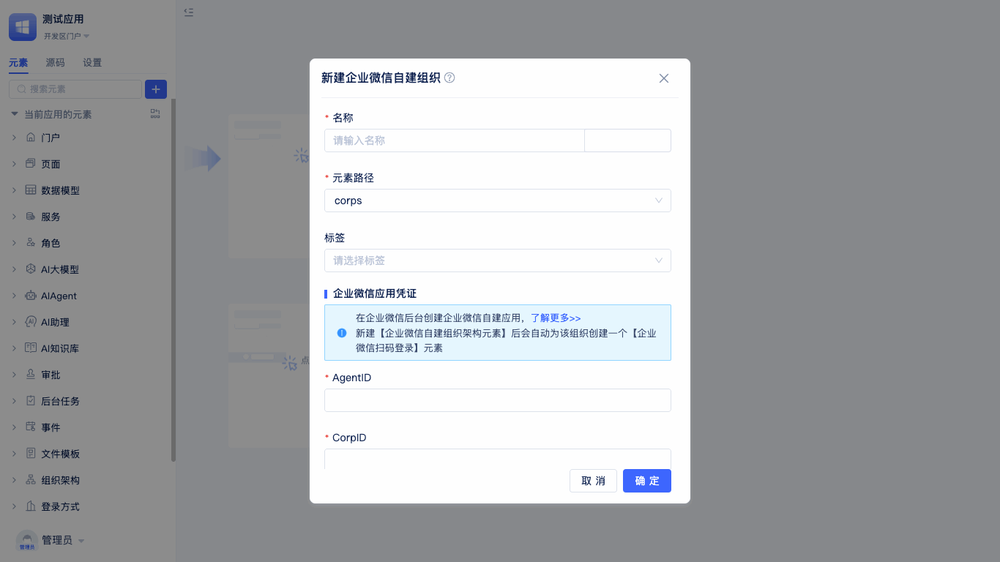

在创建组织架构时，选择企业微信自建组织，系统将显示`新建企业微信自建组织`配置弹窗。需要输入组织名称（英文名自动生成）、企业ID（CorpId）、AgentID、应用Secret等企业微信应用凭证信息。这些参数确保了与企业微信API的正确对接和数据传输的安全性。

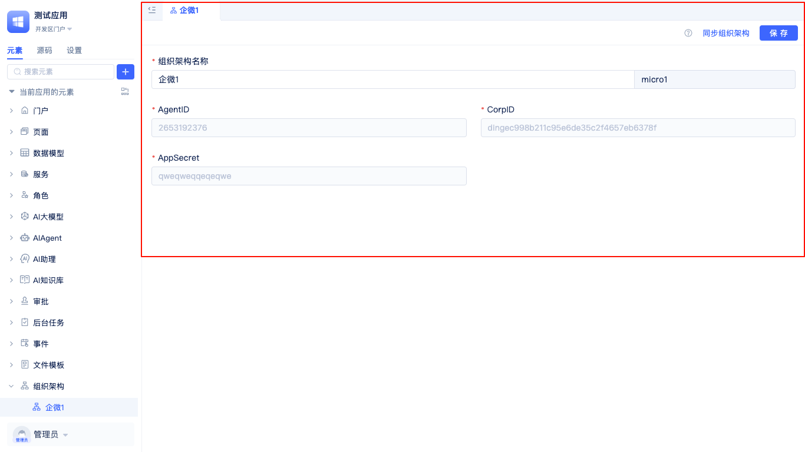

完成配置后，系统会自动拉取企业微信中的组织架构数据，包括部门层级、成员信息、职位信息等，实现与企业微信生态的深度融合和统一管理。

**企业微信配置信息获取指引：可参考[企业微信官方文档](https://work.weixin.qq.com)**

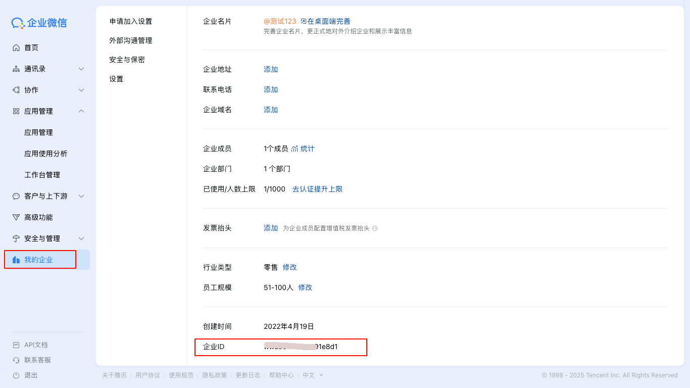
企业ID（CorpId）可在企业微信管理后台的企业信息页面中获取。

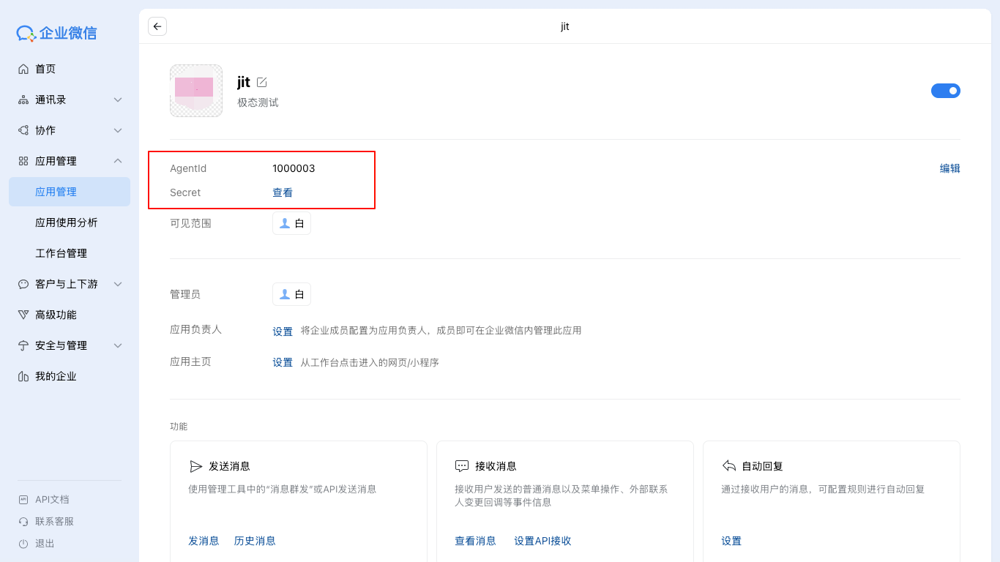
应用的相关配置信息可在企业微信自建应用的详情页面中查看。

组织架构创建完成后，JitAi将自动为该组织配置[企业微信自建扫码登录方式](./login-authentication#wechat-work-custom-qr-login)，无需手动设置，便于成员通过企业微信扫码快捷登录系统。

:::tip 注意
进行企业微信组织同步前，请确保已在企业微信管理后台为自建应用分配了通讯录相关的权限（如`读取成员`、`读取部门`等），以保障数据同步的顺利进行。
:::

## Microsoft Teams {#microsoft-teams}

Microsoft Teams 组织架构集成是为使用 Microsoft Teams 作为企业协作平台的企业提供的组织架构对接能力。通过集成，企业可以实现与 Teams 平台的组织架构、成员信息的自动同步，便于在 JitAi 平台内统一管理部门、成员及权限，提升跨平台协作效率。

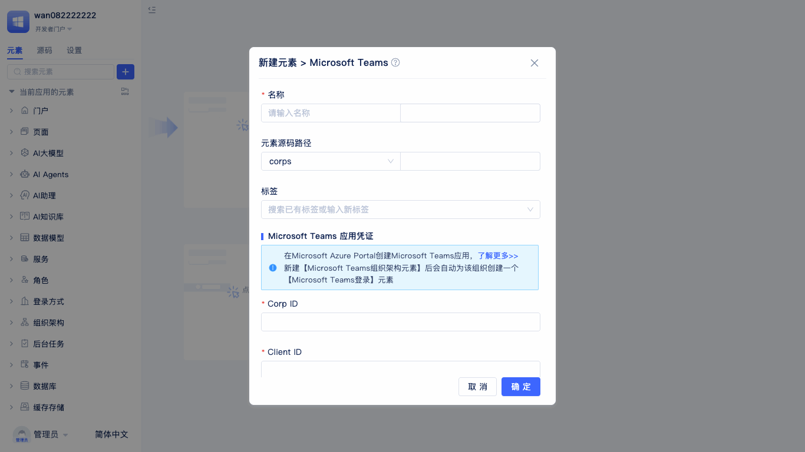

创建组织架构时，选择 Microsoft Teams 作为组织类型，系统会自动弹出配置窗口。请依次填写组织名称（英文名会自动生成）、租户ID（Tenant ID）、客户端ID（Client ID）、客户端密钥（Client Secret）等 Microsoft Teams 应用相关凭证信息。完成配置后，系统将自动同步 Microsoft Teams 平台中的组织架构、部门及成员信息，实现统一的身份认证和权限管理，提升企业跨平台协作效率。

**Microsoft Teams 配置信息获取指引：可参考 [Microsoft Teams 官方文档](https://learn.microsoft.com/zh-cn/microsoftteams/platform/)**

:::tip 注意
进行 Microsoft Teams 组织同步前，请确保已在 Azure 管理后台为应用分配了读取组织架构和成员信息的相关权限，以保障数据同步的顺利进行。
:::

## 通讯录管理入口 {#contact-management-entry}
JitAi提供了通讯录管理页面，可以实时查看部门、成员及角色信息。

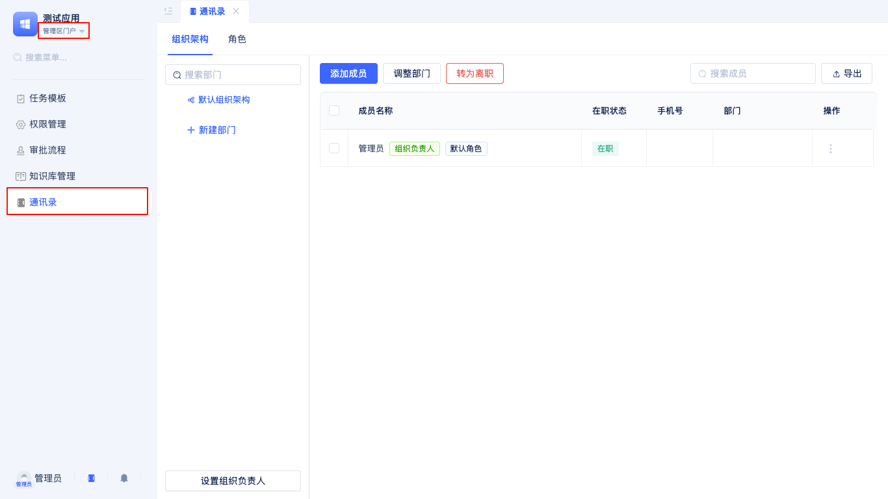

开发者进入管理区，在左侧列表中点击`通讯录`即可在右侧看到组织架构管理面板。

### 设置组织负责人 {#setting-organization-leader}
在组织架构管理中，您可以为每个组织设置负责人，明确管理职责。设置负责人有助于在通讯录、审批等场景中快速定位主要联系人，提升组织管理效率。

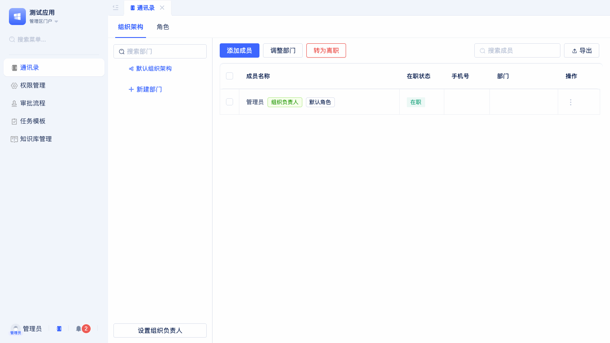

每个组织架构均支持设置负责人。点击`设置组织负责人`按钮后，将弹出`选择用户`窗口。您可以从全部成员中筛选，也可按部门、角色进行选择，或直接快捷选择自己作为负责人。

### 部门成员搜索 {#department-member-search}
为了便于高效管理和定位成员，系统支持在组织架构中快速搜索指定的部门或成员。无论成员数量多少，都能迅速查找目标对象。

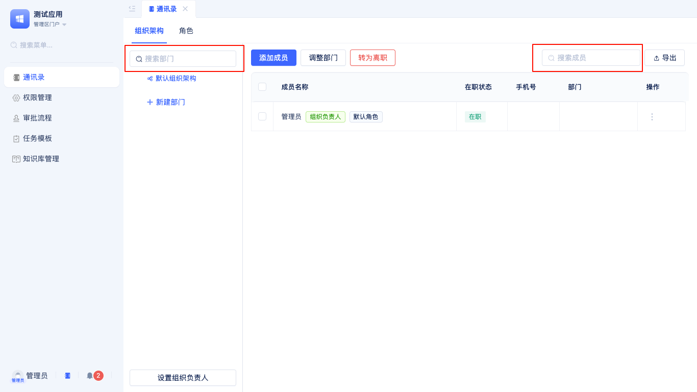

在组织架构页面顶部的搜索框输入部门名称或成员姓名，系统会自动筛选并高亮显示匹配结果。点击搜索结果可跳转至对应详情页面。

## 标准组织通讯录 {#standard-organization-contacts}
标准组织通讯录用于集中展示和管理企业的部门、成员、角色等信息，方便开发者进行组织架构调整、成员维护和权限分配。

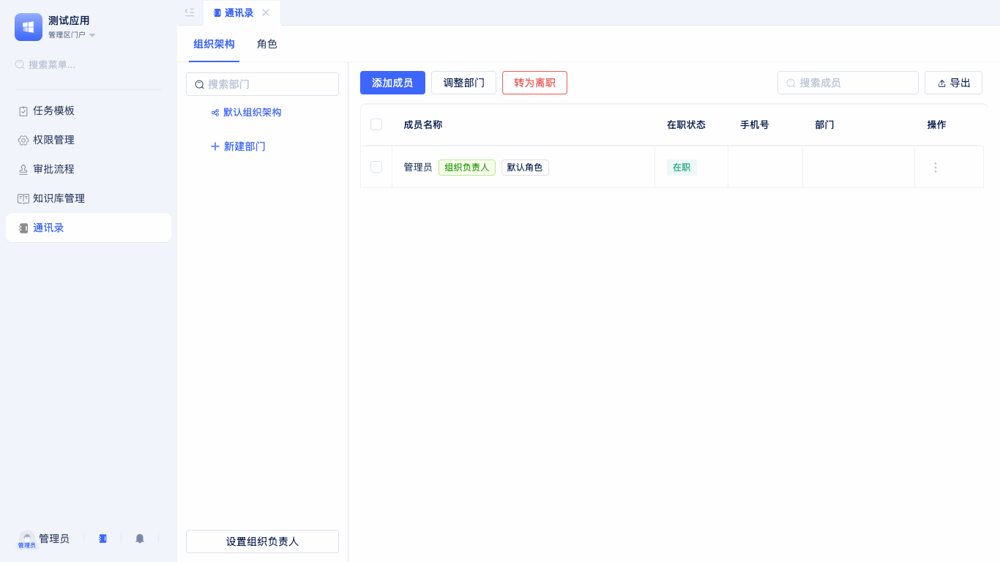

### 新建部门 {#creating-department}
在标准组织的`组织架构`标签页中，开发者可以根据实际业务需求新建部门，灵活搭建企业的多级组织层级结构。支持为每个部门设置名称、上级部门等信息，便于后续的管理和调整。

### 添加成员 {#adding-member}
支持在指定部门下添加新成员。添加时可填写成员的姓名、工号、联系方式、职位等详细信息，方便企业对成员进行统一管理和后续维护。

### 导入成员 {#importing-members}
支持通过批量导入功能一次性录入大量成员信息。可下载模板文件，按要求填写后上传，系统会自动校验并导入数据，大幅提升成员录入效率，适合企业初次搭建或大规模成员变动场景。

### 导出成员 {#exporting-members}
支持将当前部门或全组织的成员信息导出为Excel等文件格式，便于数据备份、分析统计或对接第三方系统。可按需选择导出全部成员或部分成员。

### 调整部门 {#adjusting-department}
支持对部门进行多种调整操作，包括部门重命名、移动到其他上级部门、合并多个部门等，满足企业组织架构动态变化的需求。所有调整操作均会实时同步到通讯录，保障数据一致性。

### 成员转为离职 {#member-resignation}
可将成员状态设置为离职，离职成员将自动从通讯录和相关权限中移除，保障组织成员信息的准确性和系统安全性。支持批量操作，便于企业集中处理离职成员。

### 新建角色 {#creating-role}
在角色管理面板中，开发者可以根据企业组织架构部门岗位划分创建新的角色，用于细分成员的职责。比如研发主管、采购专员等。

### 新建角色组 {#creating-role-group}
支持新建角色组，将多个相关角色进行分组管理，统一管理同类角色。

### 管理角色成员 {#managing-role-members}
可在角色中灵活添加或移除成员，支持批量操作，便于企业根据岗位变动及时调整成员的角色。

## 钉钉自建组织通讯录 {#dingtalk-organization-contacts}
在企业日常管理中，许多公司会选择在钉钉平台维护和管理自己的组织架构。为了方便开发者在JitAi平台中统一查看和管理企业通讯录，系统提供了钉钉自建组织通讯录的同步与展示页面。该页面旨在帮助企业实现组织架构的实时同步，确保成员、部门等信息的准确性和一致性。

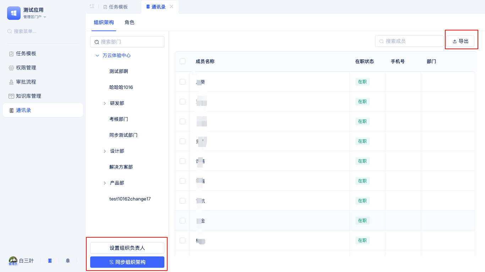

在管理者门户的通讯录面板中，切换到`组织架构`标签后，开发者可以进行以下操作：

### 同步钉钉组织架构 {#syncing-dingtalk-organization-structure}
点击`同步`按钮，可将钉钉后台的最新部门、成员等组织信息一键同步到JitAi平台，确保平台上的组织架构与钉钉保持一致。同步过程中，系统会自动校验并更新已有数据，避免重复和遗漏，保障数据的实时性和准确性。

### 导出成员 {#exporting-members-dingtalk}
支持将当前组织成员信息导出为Excel等常用文件格式，便于数据备份、分析统计或对接第三方系统。可按需选择导出全部成员或部分成员，满足不同场景下的数据处理需求。

:::tip
部门及成员信息不可在JitAi平台直接编辑，需在钉钉后台完成编辑后，再通过同步功能实时更新到平台。
:::

## 企业微信自建组织通讯录 {#wechat-work-organization-contacts}
许多企业也会选择在企业微信平台维护组织架构。JitAi同样提供了企业微信自建组织通讯录的同步与管理页面，帮助企业实现跨平台的组织信息统一管理。

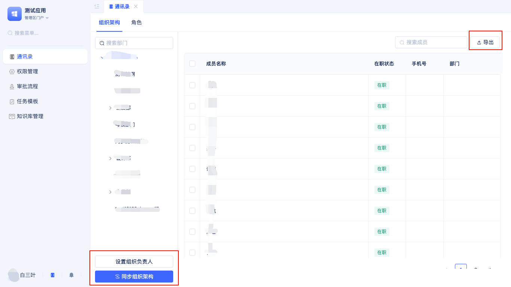

在管理者门户的通讯录面板中，切换到`组织架构`标签后，开发者可以进行以下操作：

### 同步企业微信组织架构 {#syncing-wechat-work-organization-structure}
点击`同步`按钮，可将企业微信后台的最新部门、成员等组织信息一键同步到JitAi平台，确保平台上的组织架构与企业微信保持一致。同步过程中，系统会自动校验并更新已有数据，避免重复和遗漏，保障数据的实时性和准确性。 

### 导出成员 {#exporting-members-wechat-work}
支持将当前组织成员信息导出为Excel等常用文件格式，便于数据备份、分析统计或对接第三方系统。可按需选择导出全部成员或部分成员，满足不同场景下的数据处理需求。若勾选了成员，则仅导出所选成员；未勾选时则导出全部成员信息。 

:::tip 
部门及成员信息同样不可在JitAi平台直接编辑，需在企业微信后台完成编辑后，通过同步功能实时更新到平台。 
::: 
