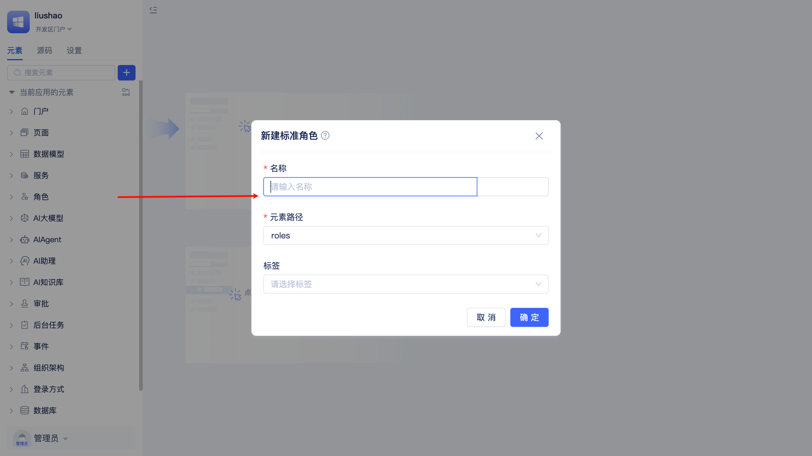
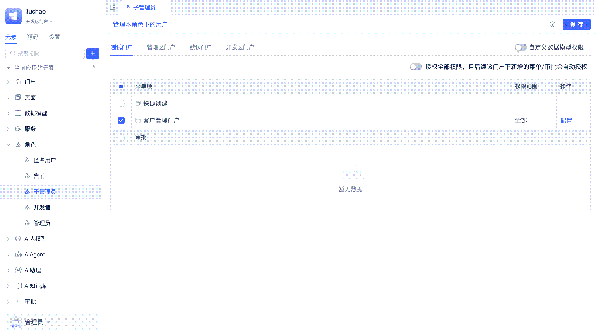
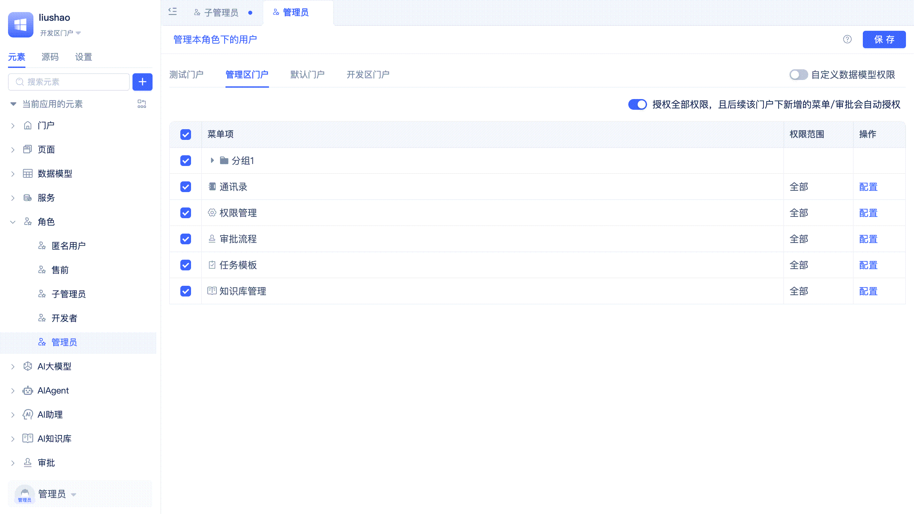
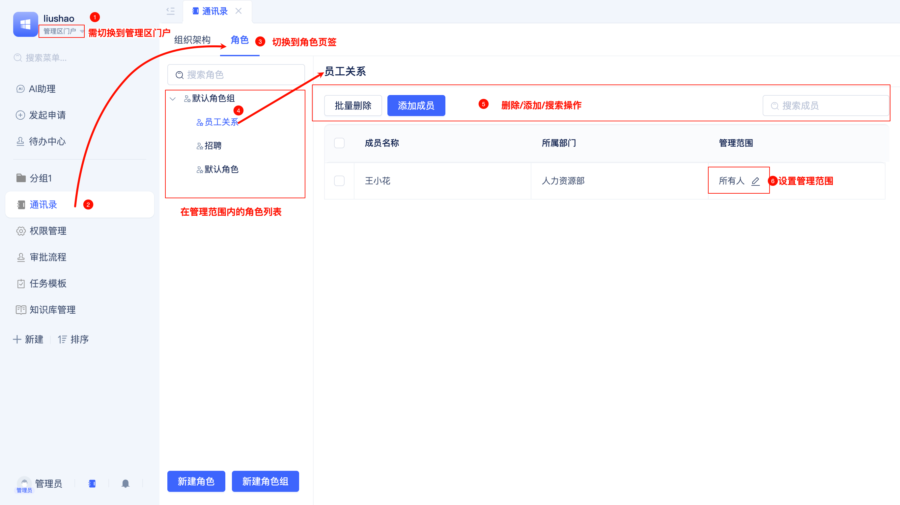
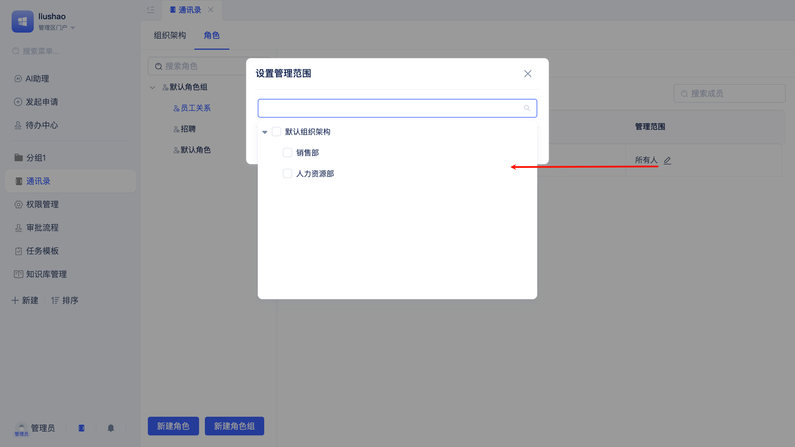

# 角色与门户菜单权限

RBAC（基于角色的访问控制）是一种常用的权限管理机制，通过为用户分配角色，并为角色授予相应的权限，实现对系统资源的访问控制。

根据业务流程设计配套的角色权限体系是企业级应用设计的重要一环。JitAI提供多层级立体化地操作权限以及数据权限管控方案。对于`应用角色+门户+页面+组件+数据模型+模型函数`排列组合中的任意一种组合，都可以进行有区分的权限配置，最大限度地保障应用使用期间的数据安全，防止越权访问。

## 内置的应用角色 {#built-in-three-application-roles}

对于每一个新创建的应用，都会自动创建匿名用户、开发者、管理员三种基本的应用角色。

:::tip 组织角色与应用角色的区分
组织角色与用户在企业组织架构中的岗位相对应，而`应用角色`则代表用户在应用系统中的权限。组织角色与应用角色类似但并无严格对应关系。一个普通员工也可以被赋予应用管理员的角色，管理一个应用系统中的部分功能板块。
:::

### 匿名用户 {#anonymous-user}

匿名用户即未注册用户，通常应用会为匿名用户配置一些可公开访问页面以及数据。JitAI默认没有授予匿名用户任何门户权限，需要开发者进行配置。

### 开发者 {#developer}

应用的创建者默认被授予开发者角色，拥有[开发者门户](../shell-and-page/portal-navigation-design#developer-portal)的完整权限，可以进行应用开发工作（包括角色创建以及对角色权限的配置）。

### 管理员 {#administrator}

应用的创建者默认被授予管理员角色，拥有应用的完全控制权限，可以对应用进行任意的修改和配置。管理员日常使用功能主要集中在[管理者门户](../shell-and-page/portal-navigation-design#manager-portal)。

:::tip
**只能**由开发者在开发者门户进行应用角色的创建以及授予门户菜单权限。

关于日常对应用角色成员的管理，建议由管理员在管理者门户中操作。另外，管理员可以查看但无法修改应用角色的数据权限以及功能权限配置。
:::

## 创建应用角色 {#create-application-role}

可以根据不同岗位（如销售、财务、客服等）或业务流程的需要，定义不同的应用角色。

开发者在元素目录树中找到`角色`，点击右侧的`+`按钮，选择`常规角色`，在表单弹窗中填写角色名称，点击`确定`按钮即可完成新角色的创建。

## 应用角色的权限配置 {#application-role-permission-configuration}

### 指定可访问的门户及菜单 {#specify-accessible-portals-and-menus}

人力资源部门需要访问员工信息，销售部门需要访问客户信息，财务部门需要访问财务报表。通过为角色指定可访问的门户及菜单，可以确保用户只能访问其工作所需功能。

在应用角色的可视化编辑器中会展示所有的门户列表，开发者可以为当前角色勾选在每个门户下允许访问的菜单。

当开发者选择授予门户下所有菜单权限时，该门户后续添加的菜单也会自动被授予，不需要再手动勾选。

### 在开发者门户中管理应用角色成员 {#manage-application-role-members-in-developer-portal}

通常在应用系统交付客户之前，开发者可以先行分配好各个应用角色的初始成员，以便客户在应用系统上线后直接开展日常工作。

在应用角色的可视化编辑器中，开发者点击左上角的`管理本角色下的用户`，即可为当前应用角色添加/删除成员。添加成员时支持直接选择用户，也可以直接选择组织角色或者部门。拥有管理角色的用户后续也可以在管理者门户中配置应用角色下的成员。

开发者也可以点击`配置`按钮，设置应用角色成员在组织架构中的管理范围。但在系统日常使用中，更适合由管理员在管理者门户中进行[成员在组织架构中的管辖范围设置](#member-management-scope-settings-in-org)。

### 组件的按钮权限控制 {#component-button-permission-control}

不同角色的用户访问同一个页面时，看到的操作按钮可能是不同的。例如，在客户管理页面，销售人员可以看到"新增""编辑"按钮，而财务人员则只能查询数据。

开发者可以在应用角色的可视化编辑器中，点击门户菜单右侧的`配置`按钮，在弹出权限配置界面中可以看到菜单页面中的所有组件列表以及每个组件的按钮列表。将不需要展示的按钮取消勾选即可。

后续新增加的按钮会被默认勾选，如需取消需要开发者手动操作。

### 组件的数据字段读/写/统计权限控制 {#component-data-field-access-control}

大多数组件都需要绑定数据模型，开发者不仅可以进行[门户级的数据操作类型和操作范围控制](./roles-and-business-element-permissions#portal-level-data-operation-type-and-scope-control)，也可以在组件上进行更进一步的数据范围/字段读写/统计权限控制，优先级高于组件在页面中的现有配置。

在门户菜单的权限配置界面中，点击某个组件后，再点击`数据源`右侧的`配置`按钮，就可以配置筛选条件。

开发者取消勾选字段的`可见`复选框后，该字段将不再显示在组件中，取消勾选`可编辑`后，用户在组件中将无法编辑该字段，取消勾选`可统计`后，用户无法在组件中对字段进行统计计算。如果字段`不可见`，会自动取消勾选`可编辑`和`可统计`。

## 多应用角色的分级管理 {#hierarchical-management-of-multiple-application-roles}

多个应用角色之间可以存在管理层级和范围，拥有管辖权的角色可以在管理者门户的通讯录中对被管辖的角色进行[成员管理](#application-role-member-management)。例如，研发总监可以管理后端开发经理，但不能管理财务总监。

管理者门户默认启用了内置的`权限管理`菜单，开发者点击`权限管理`右侧操作列中的`配置`按钮，在弹窗中指定`管理角色范围`为`全部角色`或`指定角色`。

## 应用角色成员的管理 {#application-role-member-management}

拥有管理者门户权限的角色，可以在管理者门户的通讯录中对应用角色进行成员管理。

### 成员的添加/删除 {#member-addition-and-removal}

用户点击左侧菜单中的`通讯录`，在通讯录页面中切换到`角色`标签页，即可看到自己拥有管辖权的应用角色列表。点击某个角色，在右侧的表格中进行成员添加、批量删除、搜索以及管理范围修改。

### 成员在组织架构中的管理范围设置 {#member-management-scope-settings-in-org}

以报销单审批场景为例：企业通常由多个部门，其中财务部的两名员工负责报销审批，他们拥有`报销专员`应用角色，但两人分别负责审批不同部门的报销单，即两人的管理范围不同。

管理员用户在成员列表的`管理范围`列中点击修改按钮，即可在弹窗中设置对应成员的管理范围。当报销单审批流程流转到`报销专员`审批节点时，会根据发起人所在部门自动匹配到对应的报销专员，平台提醒报销专员进行审批。
