# 使用企业微信自建应用及在工作台添加Jit应用

## 简介

Jit 是利用企业微信自建组织元素借助于企业微信自建应用来实现同步企业微信组织架构、企业微信扫码登录Jit 应用并在企业微信工作实现免登、企业微信消息通知、企业微信审批等功能

下面分步骤说明如何实现以上功能

## 首先创建企业+微信自建应用

1.   使用管理员账号[登录企业微信后台](https://work.weixin.qq.com/wework_admin/loginpage_wx?from=myhome)，进入【应用管理】-【企业应用】-【应用】，滑到最下面，找到“自建应用分类”，点击“创建应用”可以新建一个自建应用
    
    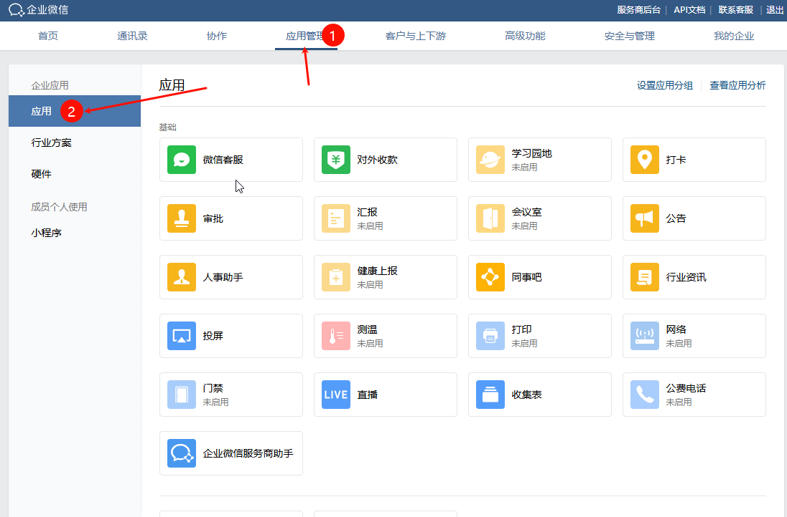
    
    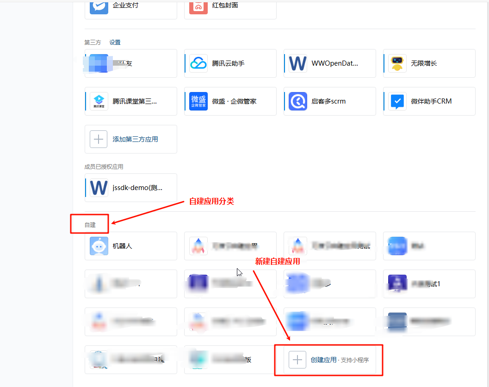
    
2.   进入创建自建应用的页面，完善应用的基本信息及应用的可见范围，可见范围决定同步到 Jit 应用组织架构数据范围
    
    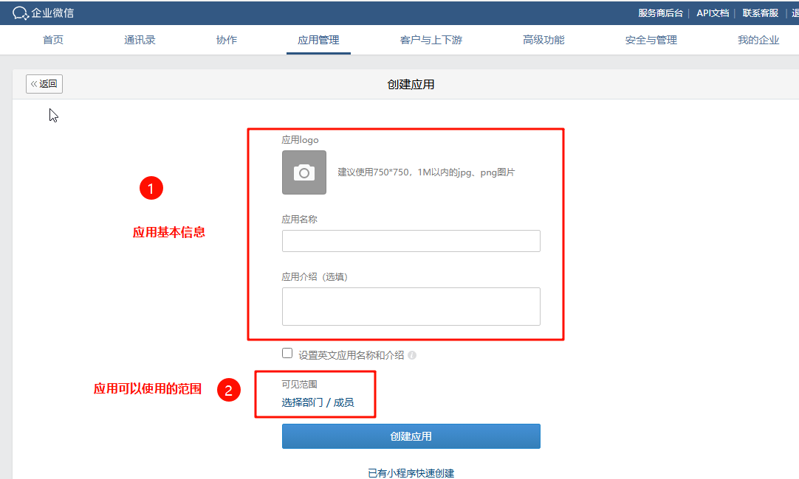
    
3.   创建完成之后，可以在列表查看到刚刚创建的自建应用，点击进入详细的配置页面
    
    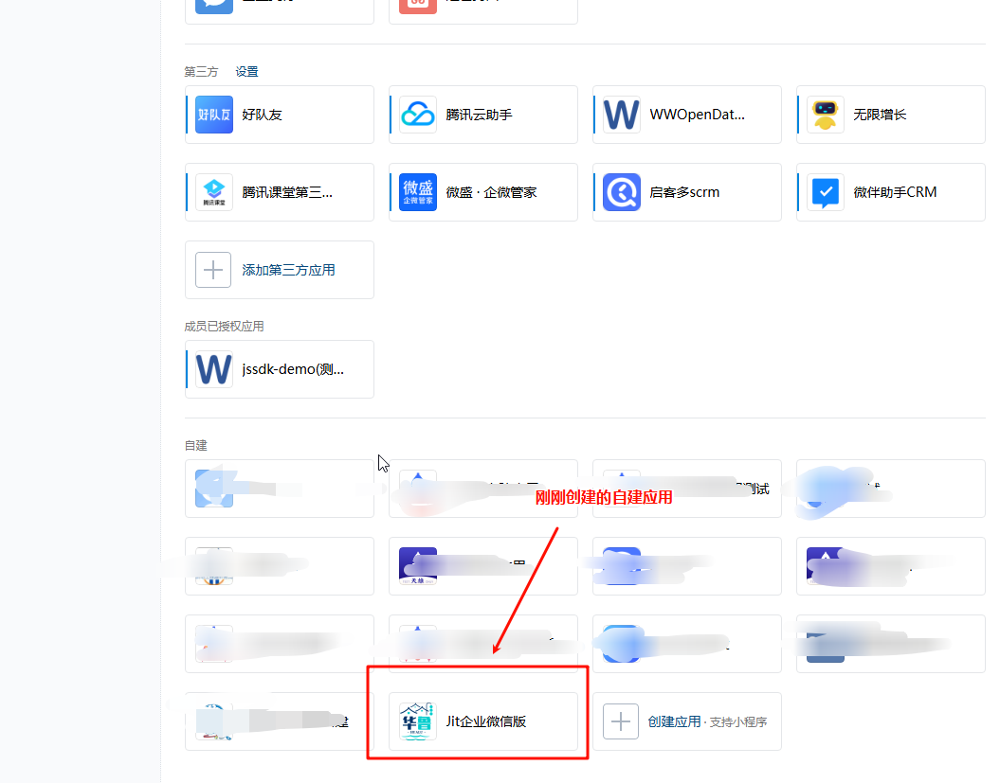
    
4.   在自建企业的详细页面中，需要配置应用主页，即从工作台进入 Jit 应用的链接，完成这个步骤后就可以在企业微信工作台进入应用了，但是还需要手动登录并没有实现免登
    
    
    
5.  选择网页并设置网页网址，详情网址的规则可[查看文档](https://developer.work.weixin.qq.com/document/path/91022)：
    

`https://open.weixin.qq.com/connect/oauth2/authorize?appid=ww21c67da6767865c2&redirect_uri=https%3A%2F%2Fjit-dev.wanyunapp.com%2Fwhwy%2Fyiguixue&response_type=code&scope=snsapi_base&state=ww21c67da6767865c2&agentid=1000073#wechat_redirect` 

网址的主体格式与上面一致，每个人需要替换一下上面颜色标注的内容：

*   红色部分：Jit 应用的访问地址，**urlencode对链接进行处理**，可以用借用这个网站对链接转义：[https://www.w3cschool.cn/tools/index?name=urlencode\_decode](https://www.w3cschool.cn/tools/index?name=urlencode_decode)
    
*   蓝色部分：企业的 CorpID，下面有说明怎么查询这个信息
    

*   橙色部分：企业微信自建应用的1000073，下面有说明这查询这个信息
    

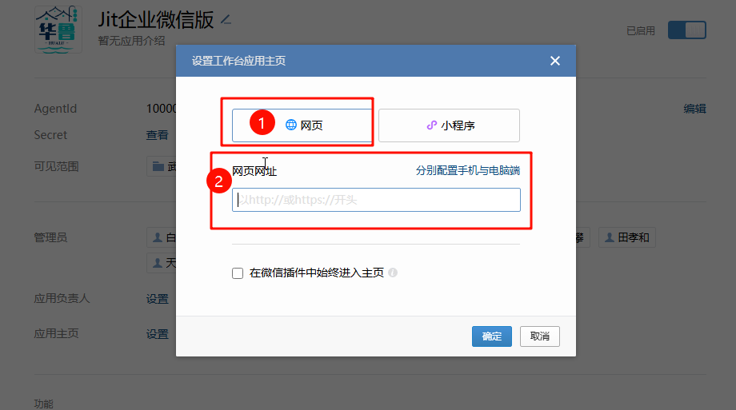

1.  配置网页授权域名等相关信息：
    

*    网页授权及 JS-SDK，注意 ：Jit 应用部署的域名备案主体需要与当前企业主体相同。服务器首次配置需要做域名归属认证，可以查看[企业微信自建-域名归属认证流程](https://alidocs.dingtalk.com/i/nodes/dQPGYqjpJYgm3NbDTrOO0YxnWakx1Z5N?utm_scene=team_space)
    

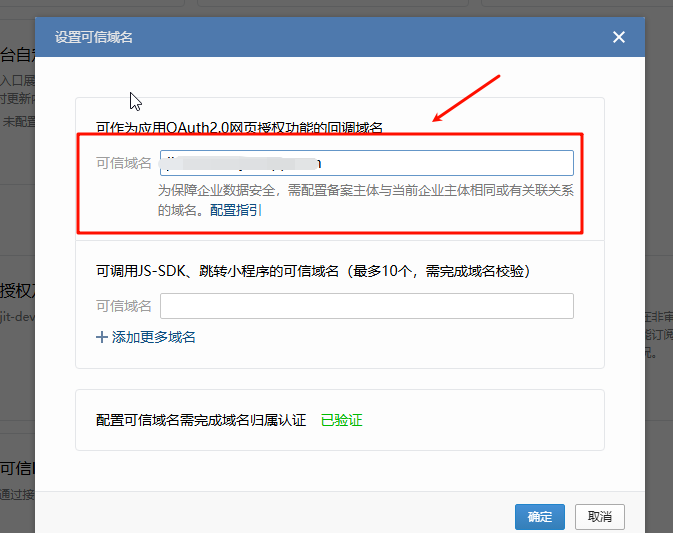

*   企业微信授权登录，若只使用网页浏览器登录就可以只配置 Web 网页
    
    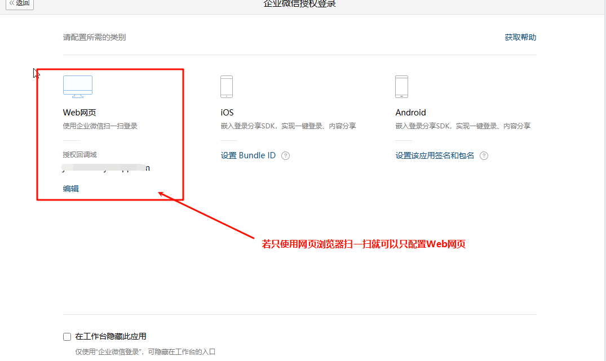
    
*   企业可信 IP，填写部署服务器的 IP 地址，可以通过 cmd 命令 ping 一下域名获取 IP 地址
    

1.   配置完成后在企业微信工作台可以看到添加的自建应用，但是此时并没有实现免登及同步企业微信的组织架构
    

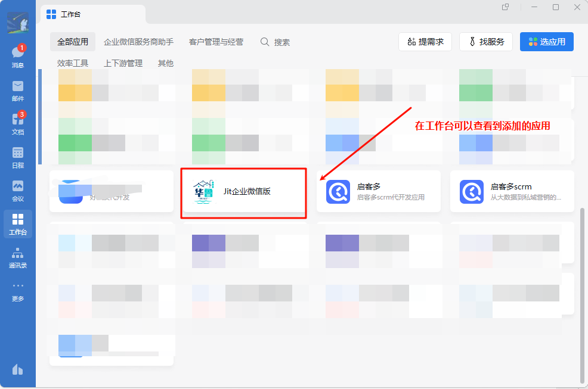

## 在 Jit 应用中创建企业微信自建组织架构元素

1.   找到新建的入口
    
    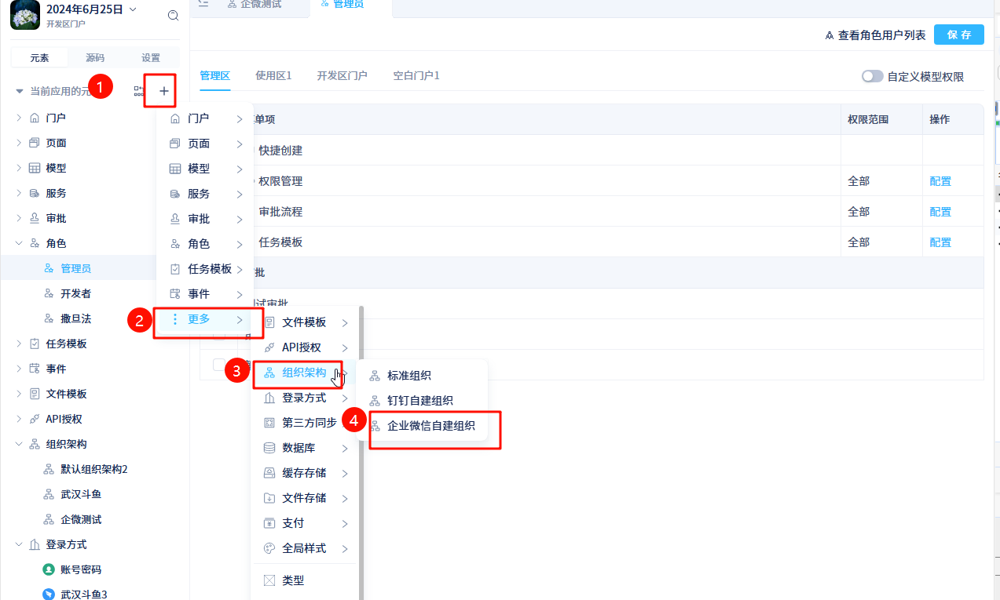
    
2.  完成企业微信自建组织陪配置信息
    

*   AgentID，在企业微信自建应用的详情页面中
    

*   AppSecret，在企业微信自建应用的详情页面中
    

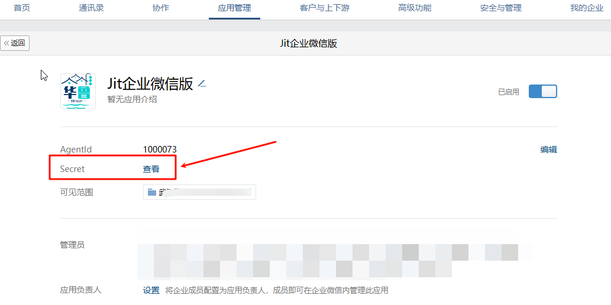

*   CorpID，在【我的企业】-【企业信息】-企业 ID 中
    

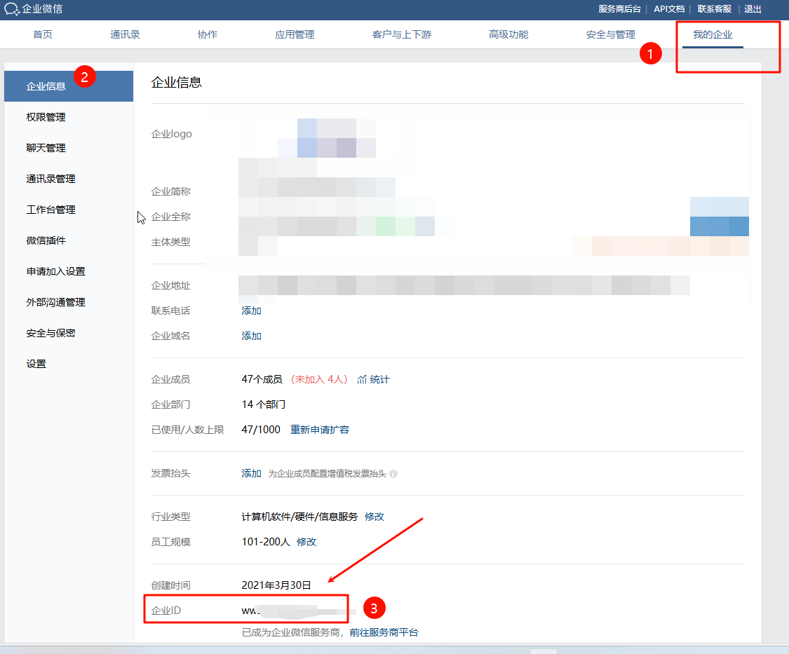

1.   创建完企业微信自建组织架构后，可以同步企业微信的通讯录信息（就是刚才设置的自建应用可见范围中的成员和部门）
    
    
    
2.   给企业微信组织架构中的成员配置应用角色，要不然登录应用也会没有权限
    

## 在浏览器使用企业微信扫码登录进入应用

完成以上配置之后，就可以在浏览器中使用企业微信扫码登录进入应用

## 在企业微信工作台免登进入 Jit 应用

在企业微信工作台可以免登进入应用

移动端也可以正常使用

## 说明

企业微信消息通知，审批待办当前暂未实现，后续会逐步实现。