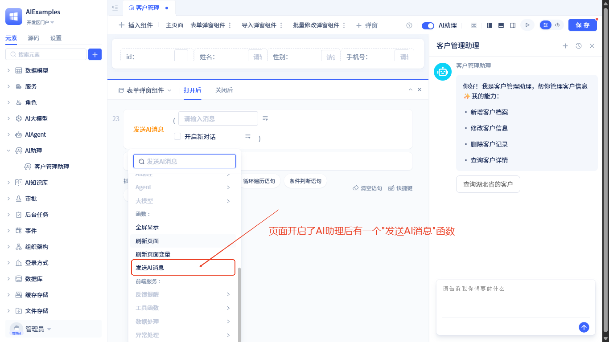

# 在组件化页面中使用AI助理
在组件化页面中使用[AI助理](../ai-assistant)后，页面右侧会显示AI对话框。页面还可以订阅[AI助理事件](../ai-assistant/ai-assistant-event)，实现页面与AI的交互，以及用户与AI的协作。

## 启用AI助理 {#enable-ai-assistant}
按照以下步骤操作：


在页面编辑器顶部打开 `AI助理` 开关并选择一个AI助理。

## AI助理配置 {#ai-assistant-configuration}

启用AI助理后，页面编辑器右侧会显示AI助理配置面板，包含以下配置选项：
- **AI助理**：切换页面中使用的AI助理
- **欢迎语与开场白**：设置个性化的[欢迎语与开场白](../ai-assistant/welcome-message-and-opening)
- **输入参数**：如果使用的助手配置了[自定义输入参数](../ai-assistant/ai-assistant-input-output#input-args)，需要为这些参数赋值
- **输出运行时日志**：自定义助手运行时输出的[运行时日志](../ai-assistant/ai-assistant-input-output#message-output)内容


## AI助理事件订阅 {#ai-assistant-event-subscription}

### 订阅节点运行事件 {#subscribe-node-running-events}
在助手中为节点启用[可触发的工作区事件](../ai-assistant/ai-assistant-event#node-running-events)后，会有两个事件：**到达节点时** 和 **节点完成后**。页面订阅方法如下：


在事件处理逻辑中，可以使用事件输出的参数：


### 订阅工具调用事件 {#subscribe-call-tool-events}

在助手中为AI Agent节点启用[工具调用事件](../ai-assistant/ai-assistant-event#agent-call-tool-events)后，会有两个事件：**工具调用前** 和 **工具调用后**。页面订阅方法如下：


目前，[工具调用事件的输出参数](../ai-assistant/ai-assistant-event#agent-call-tool-events)无法在可视化工具中使用，需要开发者通过源码模式编写代码使用。使用方法如下：
```javascript
this.subscribeEvent("AI:aiagents.ClientManagementagent.callTool.preEvent", async ({ data}) => {
    // AI: AI助理事件的固定前缀; aiagents.ClientManagementagent: 助手中的节点ID; callTool.preEvent: 工具调用前事件, callTool.postEvent: 工具调用后事件
    // data: 此工具事件携带的参数
    if(data.toolName.value === "services.ASvc.func1"){
        //TODO: 如果工具名称是xxxx，执行某些操作 
    }
});
```

### 订阅聊天区域人机交互节点事件 {#subscribe-action-in-conversation-events}
页面可以订阅[聊天区域人机交互节点事件](../ai-assistant/ai-assistant-event#action-in-conversation-events)。
订阅方法如下：


### 订阅工作区人机交互节点事件 {#subscribe-action-in-page-events}
页面可以订阅[工作区人机交互节点事件](../ai-assistant/ai-assistant-event#action-in-page-events)。
订阅方法如下：


## 在页面中发送AI消息 {#send-ai-message}

在页面中使用AI助理后，页面上会有一个 **发送AI消息** 功能。调用方法如下：



功能参数请参见[发送AI消息功能](../ai-assistant/ai-assistant-api-exposure#send-ai-message)


## 直接调用AI助理 {#call-ai-assistant}

此外，页面支持在不启用AI助理的情况下直接调用AI助理。AI助理提供了一个 **运行** 方法，可以直接调用。调用方法如下：


此方法也可以在服务/模型函数逻辑中调用。