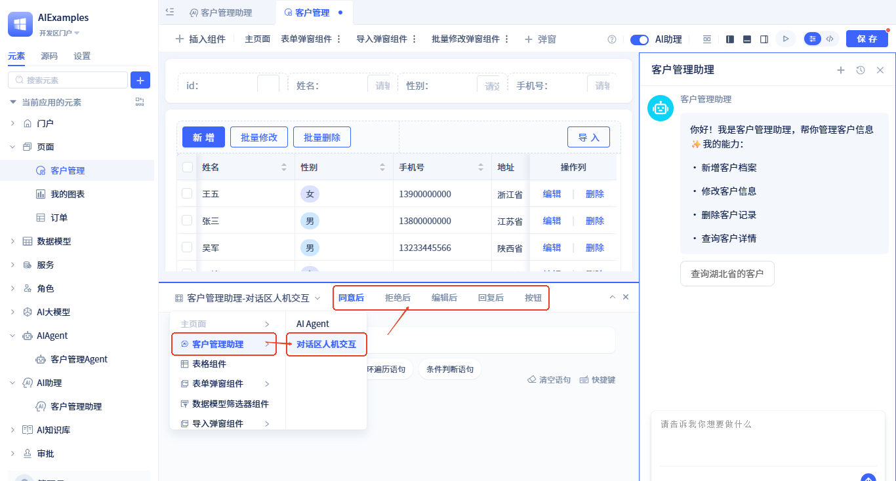

# 在组件化页面中使用AI助理
在组件化页面中使用[AI助理](../ai-assistant)后，会在页面右侧显示一个AI对话框。同时页面可以订阅[AI助理事件](../ai-assistant/ai-assistant-event)。以此实现页面及AI之间的交互，用户与AI之间的协同。 

## 开启AI助理
操作步骤如下：


打开页面编辑器顶部`AI助理`开关，选择一个AI助理即可。

## AI助理配置

开启AI助理后会在页面编辑器右侧显示AI助理配置框，有以下配置项：
- **AI助理**：可切换页面中使用的AI助理
- **欢迎语与开场白**：设置个性化的[欢迎语与开场白](../ai-assistant/welcome-message-and-opening)
- **输入参数**：如果使用的助理设置了[自定义输入参数](../ai-assistant/ai-assistant-input-output#input-parameters)，则需为这些参数赋值。
- **输出运行过程日志**：可自定义助理运行时输出的[运行过程日志](../ai-assistant/ai-assistant-input-output#message-output)内容。


## AI助理事件订阅

### 订阅节点运行事件 {#subscribe-node-running-events}
助理中的节点开启[可触发工作区事件](../ai-assistant/ai-assistant-event#node-running-events)后，会有两个事件: **到达节点时**、**节点完成后**。页面订阅方式如下：


在事件处理逻辑中，可使用事件输出的参数：


### 订阅工具调用事件 {#subscribe-call-tool-events}

助理中的AI Agent节点开启[工具调用事件](../ai-assistant/ai-assistant-event#agent-call-tool-events)后，会有两个事件: **工具调用前**、**工具调用后**。页面订阅方式如下：


目前，可视化工具中无法使用[工具调用事件的输出参数](../ai-assistant/ai-assistant-event#agent-call-tool-events)，需要开发者在源码模式中通过写代码使用。使用方式如下：
```javascript
this.subscribeEvent("AI:aiagents.ClientManagementagent.callTool.preEvent", async ({ data}) => {
    // AI: AI助理事件固定前缀；aiagents.ClientManagementagent: 助理中的节点ID；callTool.preEvent: 工具调用前事件，callTool.postEvent: 工具调用后事件
    // data该工具事件携带的参数
    if(data.toolName.value === "services.ASvc.func1"){
        //TODO：如果工具名称是xxxx， do something 
    }
});
```

### 订阅对话区人机交互节点事件 {#subscribe-chat-area-human-events}
页面中可以订阅[对话区人机交互节点事件](../ai-assistant/ai-assistant-event#chat-area-human-machine-interaction-events)。
订阅方式如下：



### 订阅工作区人机交互节点事件 {#subscribe-workspace-human-events}
页面中可以订阅[工作区人机交互节点事件](../ai-assistant/ai-assistant-event#workspace-human-machine-interaction-events)。
订阅方式如下：


## 页面中发送AI消息 {#send-ai-message}

在页面中使用AI助理后，页面上会有一个**发送AI消息**的函数。调用方式如下：


函数参数请见[发送AI消息函数](../ai-assistant/ai-assistant-api-integration#send-ai-message)


## 直接调用AI助理 {#call-ai-assistant}

同时，页面也支持在不开启AI助理时直接调用AI助理。AI助理提供了一个**运行**方法，可直接调用，调用方式如下：


服务/模型的函数逻辑中也可以通过该方式调用。