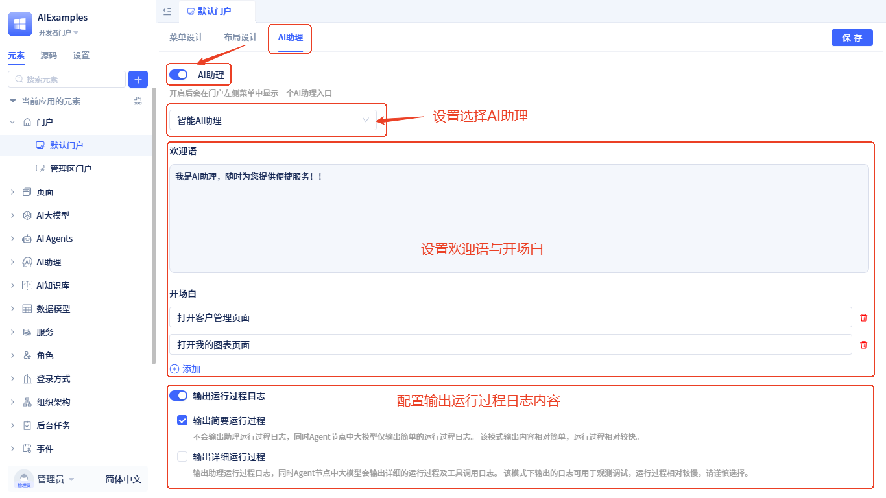
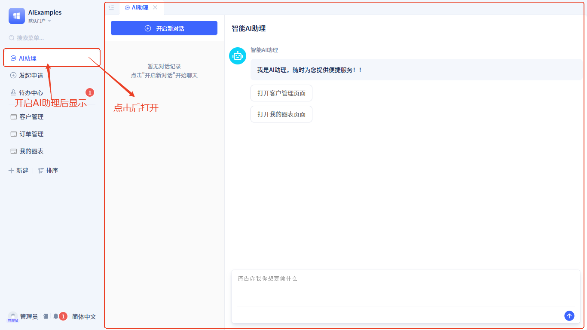
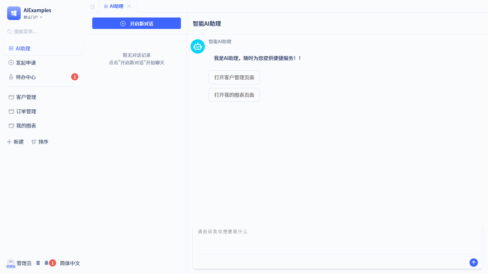

# 在常规门户中使用AI助理

## 配置AI助理 {#configuring-ai-assistant}

在常规门户的可视化开发界面中，切换到 **AI助理** 选项卡，进入AI助理配置界面：

开启AI助理开关后，需要配置以下参数：
- **AI助理**：从已有的[AI助理](../ai-assistant)中选择一个
- **欢迎语与开场白**：自定义[欢迎语与开场白](../ai-assistant/welcome-message-and-opening)内容
- **输出运行时日志**：配置助手执行过程中[运行时日志](../ai-assistant/ai-assistant-input-output#message-output)的输出内容

## 运行时效果 {#runtime-effects}

在门户中启用AI助理后，导航栏会显示"AI助理"功能入口：

AI助理界面采用左右分栏布局：左侧显示历史[聊天记录](../ai-assistant/ai-chat-history)，右侧为助手对话区域。

## 功能亮点 {#feature-highlights}

JitAi框架实现了AI助理与门户页面的深度集成。前面的示例简单演示了使用AI助理打开功能页面。在实际场景中，门户中的AI助理通常是子系统级别的，其功能能力完全由开发者自定义。