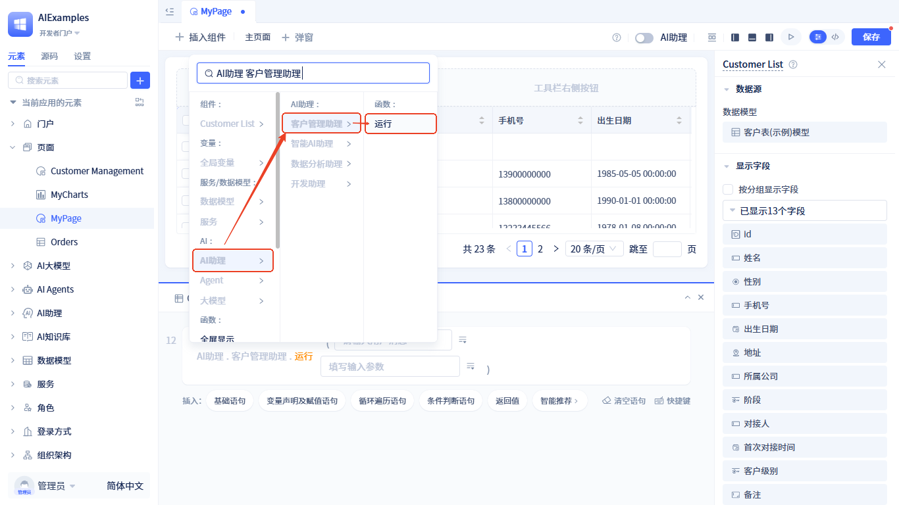
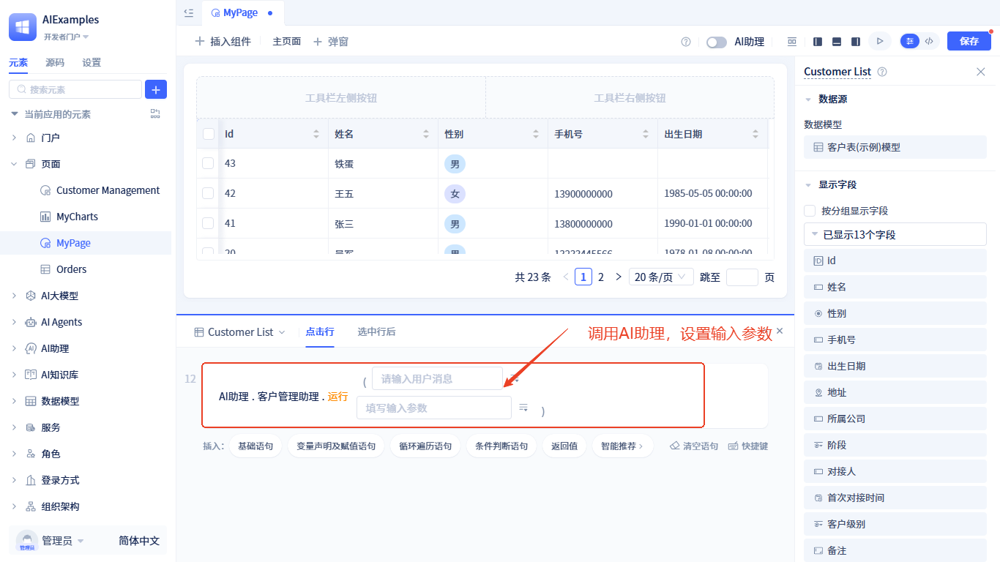
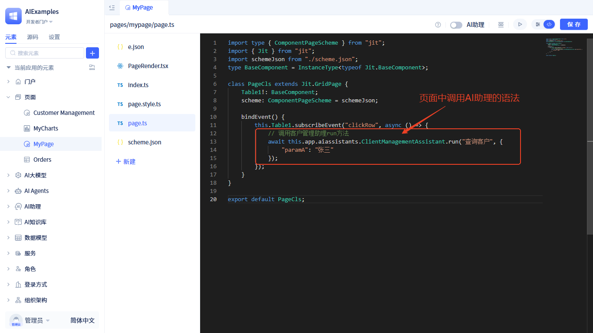
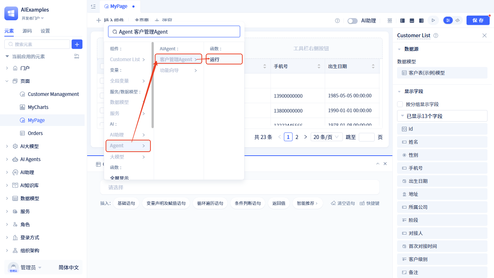
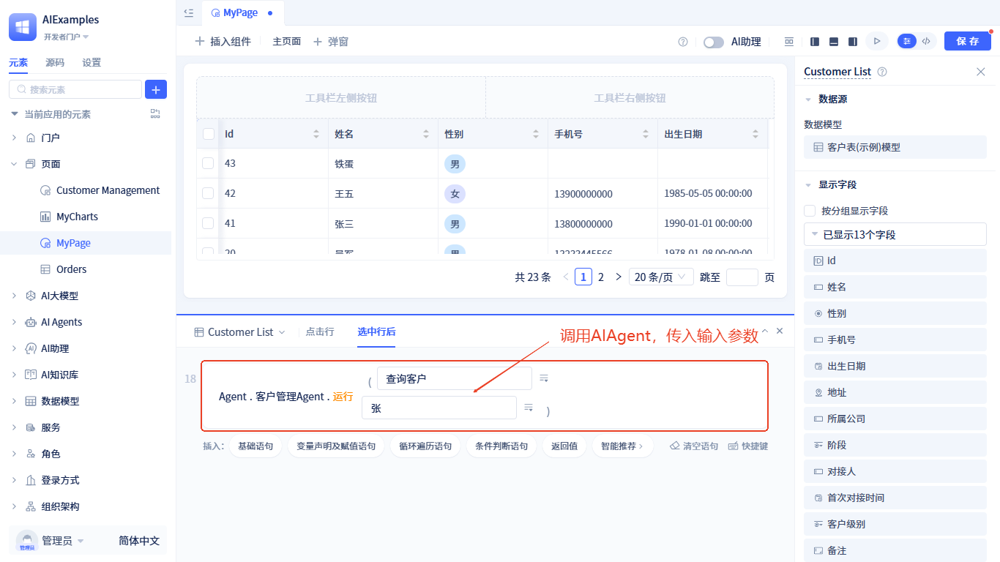
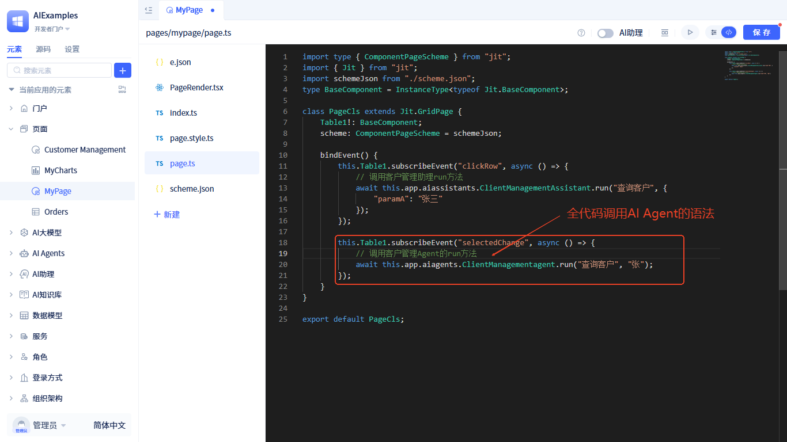
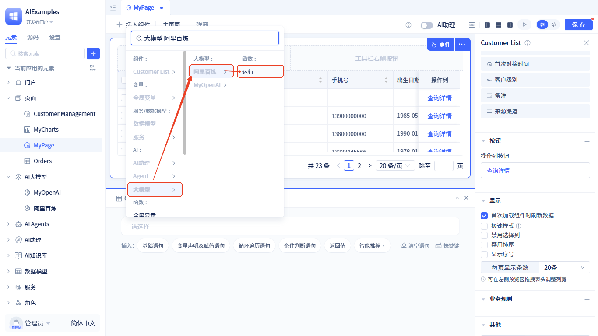
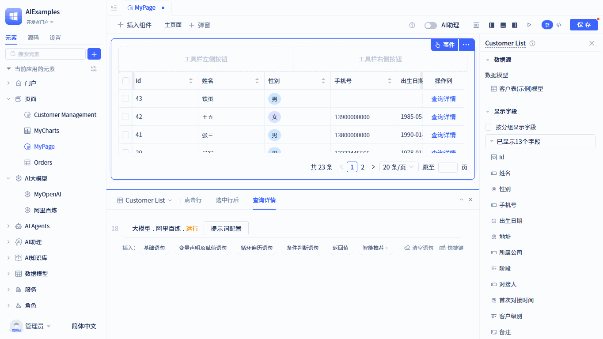
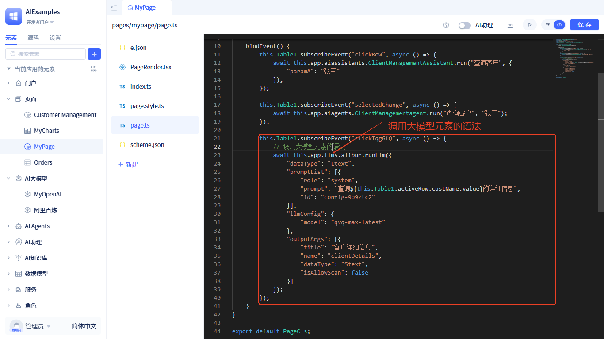

# 在页面中使用AI元素

## 在页面中使用AI助理 {#using-in-pages}

[AI助理元素](../ai-assistant)提供了一个**运行**函数，页面中可直接调用该函数。有两种调用方式：**可视化调用**和**全代码调用**。

### 可视化调用 {#visual-calling}

在语句中选择`AI助理` → 你要调用的助理 → `运行`，并传入[助理的输入参数](../ai-assistant/ai-assistant-input-output#input-parameters)。




### 全代码调用 {#full-code-calling}
还可以通过全代码方式调用，在页面中的调用语法如下：

```javascript
// this.app.{AI助理元素ID}.run(param1)
this.app.aiassistants.ClientManagementAssistant.run("查询客户", {"paramA": "张三"});
```



## 在页面中使用AI Agent {#using-ai-agent-in-pages}
[AI Agent元素](../ai-agent)提供了一个**运行**函数，页面中可直接调用该函数。有两种调用方式：**可视化调用**和**全代码调用**。

### 可视化调用 {#visual-calling-agent}

在语句中选择`Agent` → 你要调用的Agent → `运行`，并传入[AI Agent的输入参数](../ai-agent/agent-input-output#configure-input-variables)。




### 全代码调用 {#full-code-calling-agent}
还可以通过全代码方式调用，在页面中的调用语法如下：

```javascript
// this.app.{AI Agent元素ID}.run(param1, param2)
this.app.aiagents.ClientManagementAgent.run("查询客户", "张三");
```



## 在页面中使用大模型 {#using-large-language-models-in-pages}
[大模型元素](../ai-llm)提供了一个**运行**函数，页面中可直接调用该函数。有两种调用方式：**可视化调用**和**全代码调用**。

### 可视化调用 {#visual-calling-llm}

在语句中选择`大模型` → 你要调用的大模型 → `运行`。



然后设置[输入参数](../ai-llm/llm-input-output#call-llm-input)：调用的模型、提示词及输出格式。



### 全代码调用 {#full-code-calling-llm}
还可以通过全代码方式调用，在页面中的调用语法如下：

```javascript
// this.app.{大模型元素ID}.runLlm(param1, param2)
this.app.llms.alibur.runLlm({
    "dataType": "Ltext",
    "promptList": [{  // 提示词
        "role": "system",
        "prompt": `查询${this.Table1.activeRow.custName.value}的详细信息`,
        "id": "config-9o9ztc2"
    }],
    "llmConfig": { // 大模型配置
        "model": "qvq-max-latest"
    },
    "outputArgs": [{ // 输出格式
        "title": "客户详细信息",
        "name": "clientDetails",
        "dataType": "Stext",
        "isAllowScan": false
    }]
});
```

