# 布局组件

## 弹窗组件 {#popup-components}

弹窗组件作为 web 应用开发中最常用的布局组件。主要用于展示临时信息或新建、编辑数据等。

JitAI 的弹窗不仅支持弹窗，也支持侧滑弹窗。还可以选择是在当前页面内弹出，还是进行全屏弹出。另外还有一些常规配置，比如支持配置弹窗大小、点击遮罩区关闭弹窗、支持编写弹窗打开后和关闭后事件逻辑。

### 弹窗组件配置 {#popup-components-configuration}

在弹窗组件中，我们可以配置弹窗的预设大小、弹窗的打开方式、弹窗的遮罩样式、弹窗的关闭方式、弹窗的按钮、弹窗的打开和关闭事件逻辑。

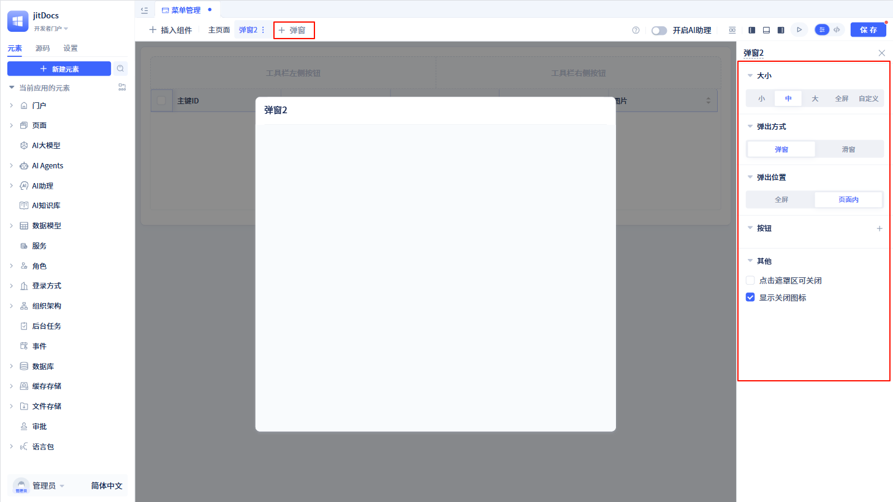
点击页面上的`+ 弹窗`按钮，进入弹窗组件的配置页面。默认情况下，弹窗的预设大小为`中`，弹窗的打开方式默认为`中间弹出`，弹窗的弹出位置默认为`当前页面`，弹窗的打开和关闭事件逻辑默认为空。

### 弹窗交互设计 {#popup-components-interaction-design}

弹窗组件默认拥有`打开后`和`关闭后`两个事件，用户可以为这两个事件编写逻辑。`打开后`事件在弹窗打开后执行，`关闭后`事件在弹窗关闭后执行。
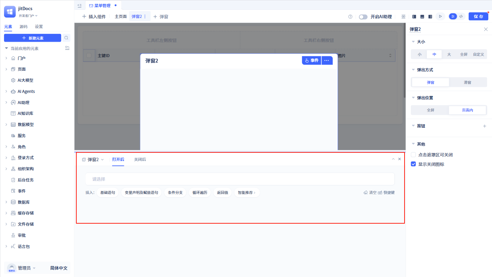

另外，弹窗组件还有`打开`和`关闭`两个函数，用户可以通过调用这两个函数来打开和关闭弹窗。
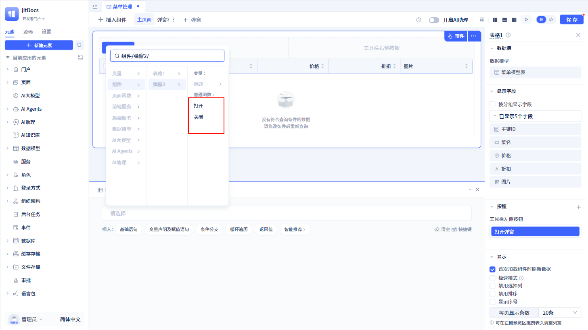

## 标签页组件 {#tab-components}

标签页组件用于在页面中展示多个标签，并切换标签以显示不同的内容。

### 标签页组件配置 {#tab-components-configuration}

在标签页组件中，我们可以配置每个标签页的标题，标签的位置、大小、风格等。

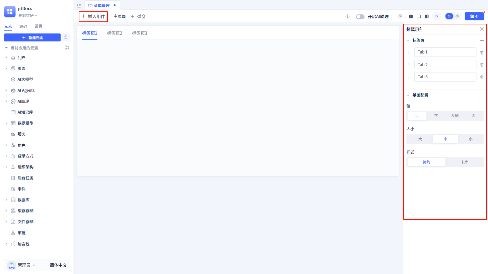
点击页面上的`+ 插入组件`，将“标签页”组件拖拽到页面中。默认情况下，组件内有三个标签，标签的位置为`顶部`，标签的大小为`中`，标签页的风格为`简约`。

### 标签页交互设计 {#tab-components-interaction-design}

标签页组件的每个标签都有点击事件，点击标签后，会触发标签的点击事件逻辑。
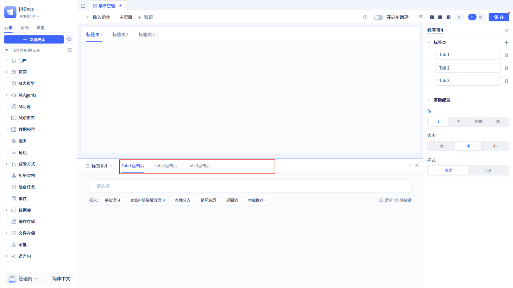

另外，标签页组件还有`打开指定标签`和`设定显示标签页`两个函数，用户可以通过调用这两个函数来打开指定标签页，并设定显示的标签页。
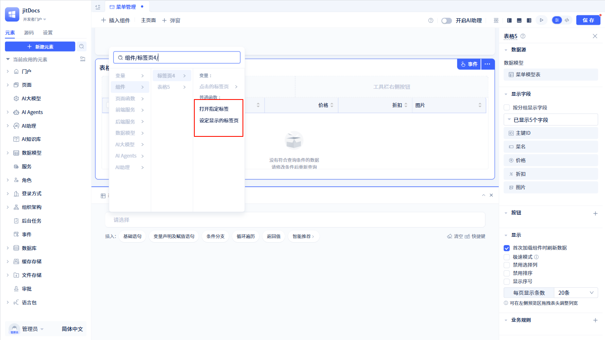

## 折叠面板组件 {#collapse-components}

折叠面板组件用于在页面中展示多个面板，并折叠或展开面板以显示不同的内容。

### 折叠面板组件配置 {#collapse-components-configuration}

在折叠面板组件中，我们可以配置每个面板的标题、背景色，折叠面板的样式、手风琴模式等。

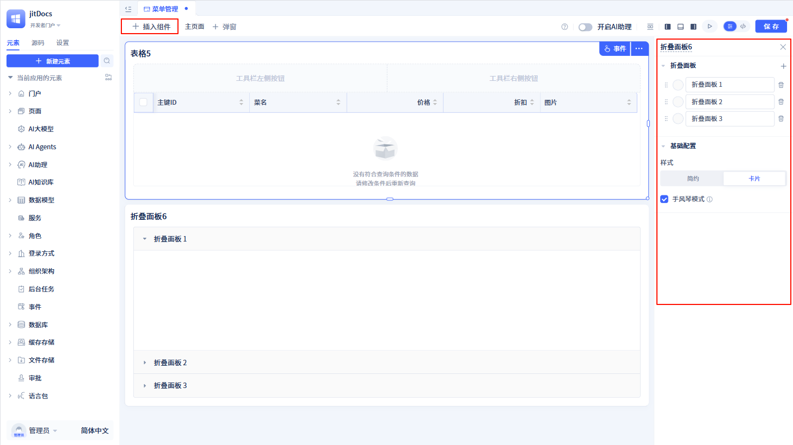
点击页面上的`+ 插入组件`，将“折叠面板”组件拖拽到页面中。默认情况下，组件内有三个面板，面板的背景色为`#fafafa`，折叠面板的样式为`卡片`，且默认展示为手风琴模式。

### 折叠面板交互设计 {#collapse-components-interaction-design}

折叠面板组件的每个面板都有点击事件，点击面板后，会触发面板的点击事件逻辑。
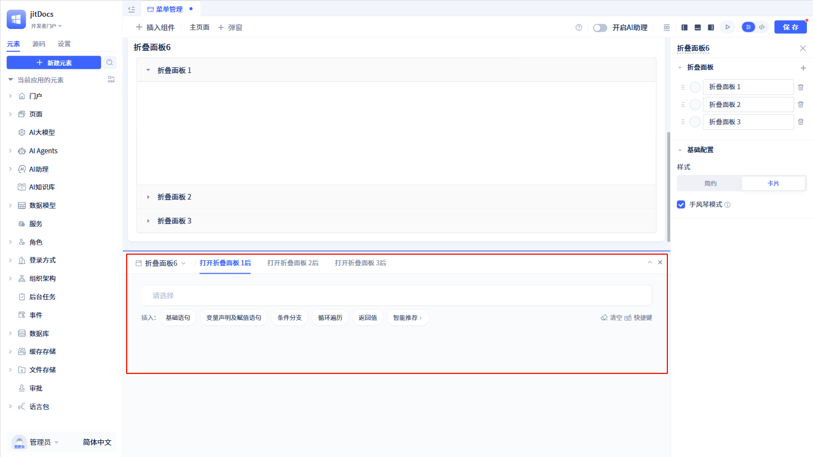

另外，折叠面板组件还有`刷新`和`打开指定面板`两个函数，用户可以通过调用这两个函数来刷新指定面板，并打开指定面板。
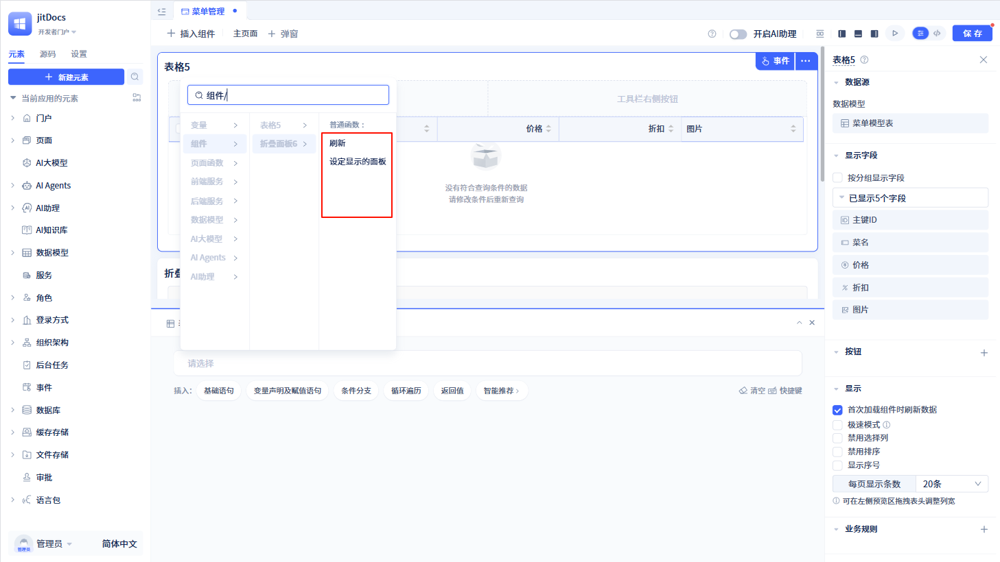

## 子页面组件 {#subpage-components}

当某一个页面需要在其他页面中展示，可以使用子页面组件。将需要展示的页面作为子页面，将子页面组件添加到父页面中，并配置子页面组件的加载目标页面。

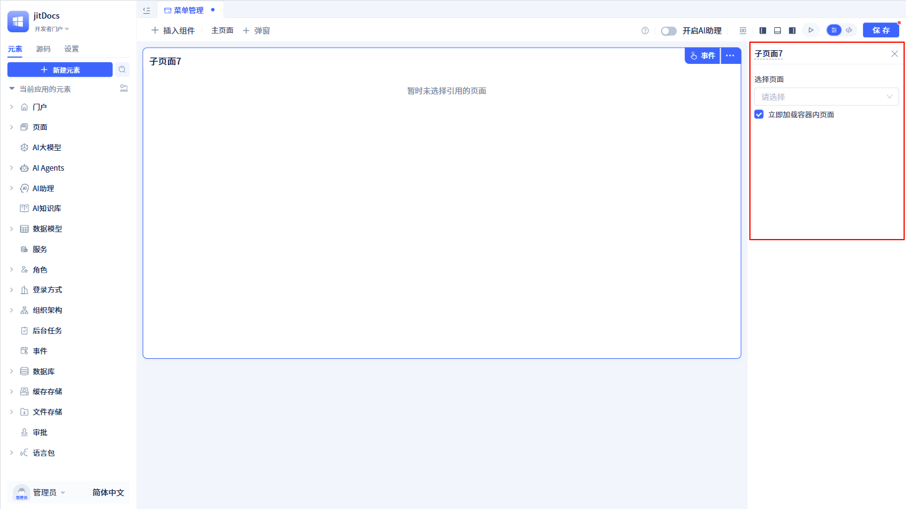
点击页面上的`+ 插入组件`，将“子页面”组件拖拽到页面中。默认情况下，子页面组件的加载目标页面为空，即子页面组件内没有页面。在右侧配置区选择页面，即可将页面作为子页面在当前页面中展示。

子页面组件默认启用`立即加载容器内页面`，即子页面组件在添加到父页面后，会立即加载子页面的内容。当然，也可以禁用`立即加载容器内页面`，并通过子页面提供的`启用`函数，手动加载子页面。
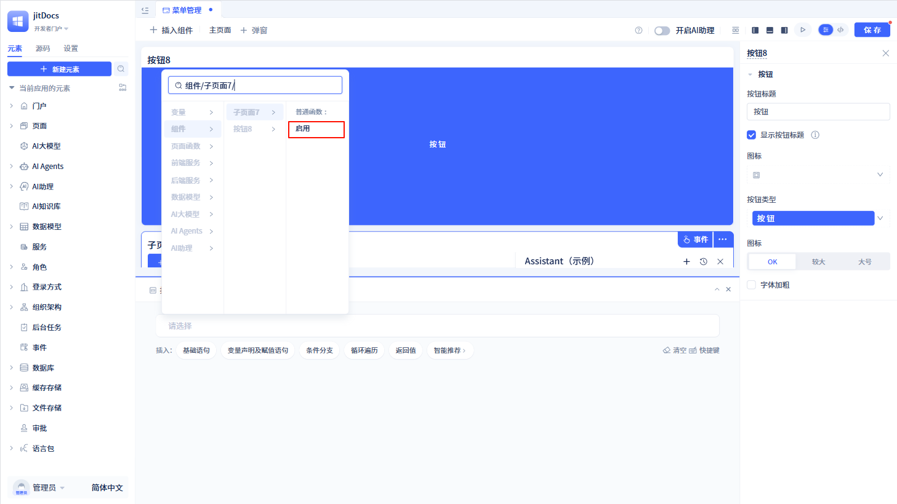
