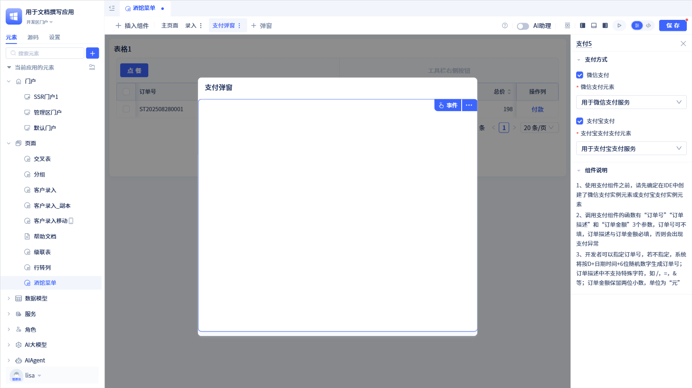
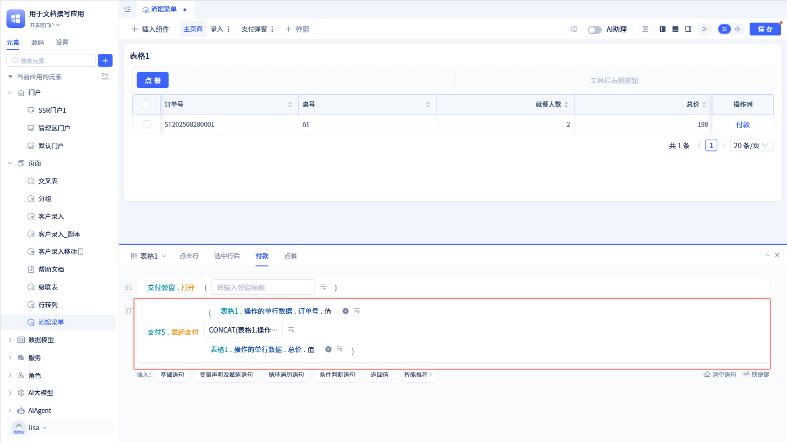
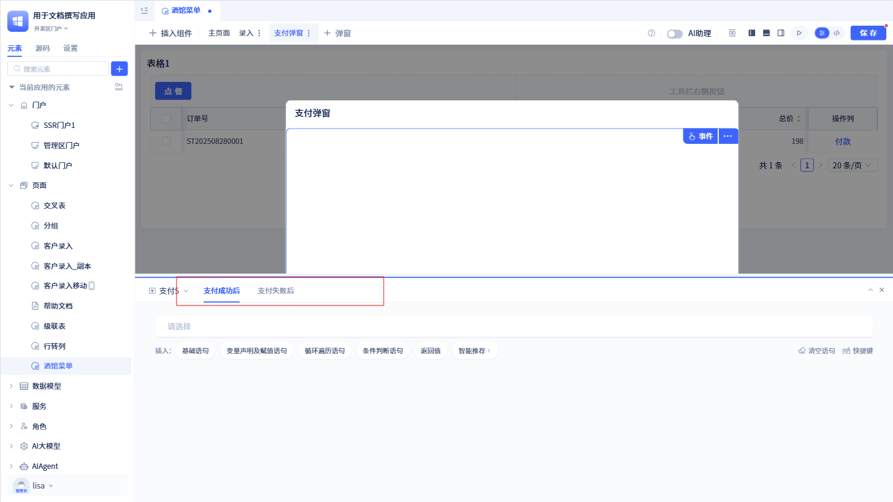
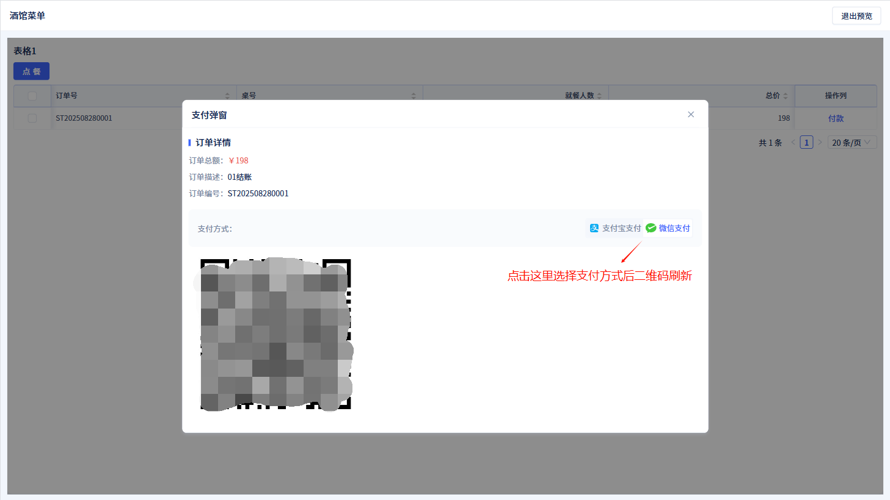

# 支付组件
支付组件是基于统一的支付接口实现多平台支付功能的操作性组件。它负责订单创建、支付流程管理和状态监控，支持支付宝和微信支付平台，提供完整的支付生命周期管理。

## 支付组件的创建 {#payment-component-creation}

在页面可视化编辑器中点击“插入组件”，将“支付”组件拖拽到页面中。然后在右侧配置面板中配置支付组件参数。

:::warning 注意
创建支付组件时，需要提前创建好支付服务元素，具体请参考[支付服务](../third-party-integration/payment-service)。

使用支付组件前，需要调用支付组件的函数。
:::

## 发起支付函数 {#initiate-payment-function}
支付组件提供了“发起支付”函数，用于发起支付。

该函数接收三个参数：订单号、订单描述和订单金额。其中，订单号可以不填，但订单描述和订单金额必填，否则会出现支付异常。

在它的上级组件的事件配置中需要配置调用该函数的逻辑。例如，表格和支付组件配合使用，那么需要在表格的事件逻辑中进行配置。

## 事件逻辑 {#event-logic}
支付组件提供了支付成功后和支付失败后事件，用于处理支付成功和失败后的逻辑。

在支付组件的事件逻辑中，进行配置相关逻辑即可。例如，支付成功后打印小票等事件逻辑。

## 组件使用 {#component-usage}
在可视化编辑器中创建好支付组件，并配置了相关事件后，就可以在页面中发起支付了。

在使用区中，点击表格的“付款”按钮，会触发支付组件的支付逻辑，并弹出支付页面。在支付页面中选择支付方式后会刷新支付二维码，当用户扫码支付后会触发支付组件的支付成功后或支付失败后的事件逻辑。
