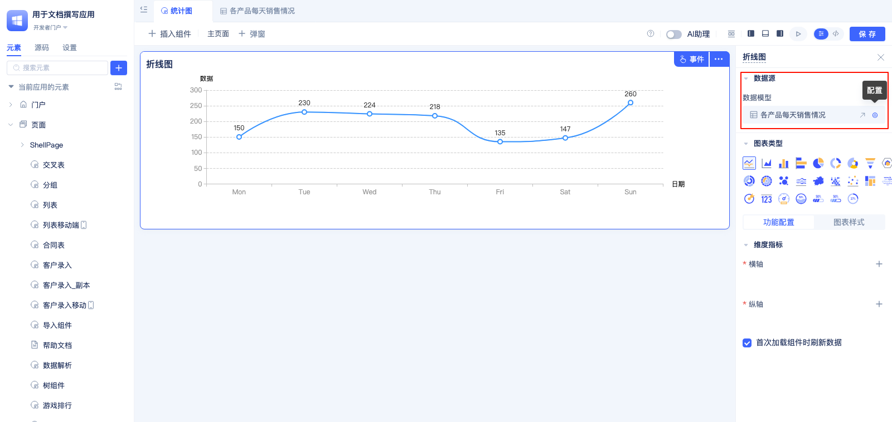
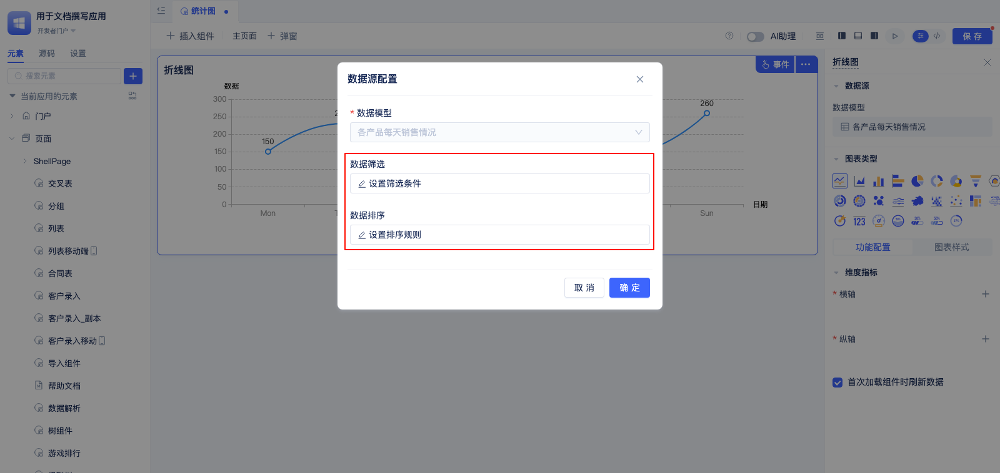
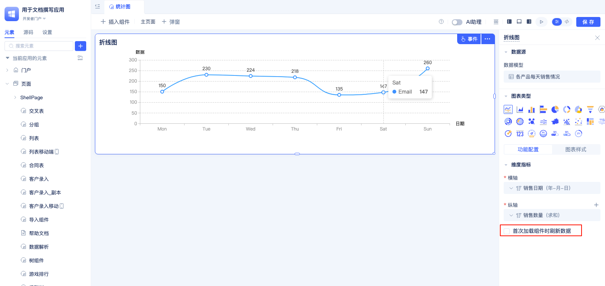
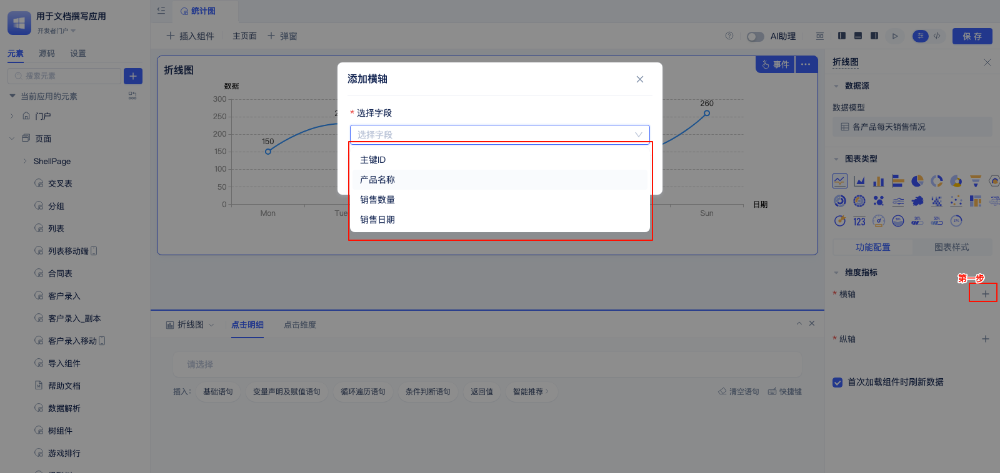
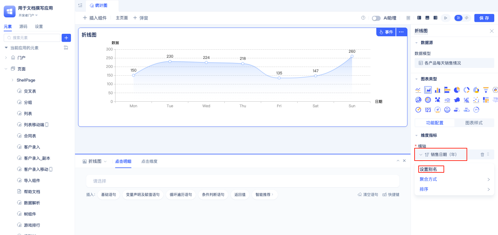
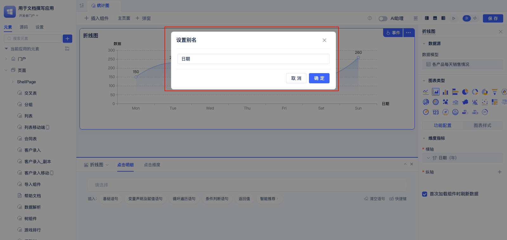
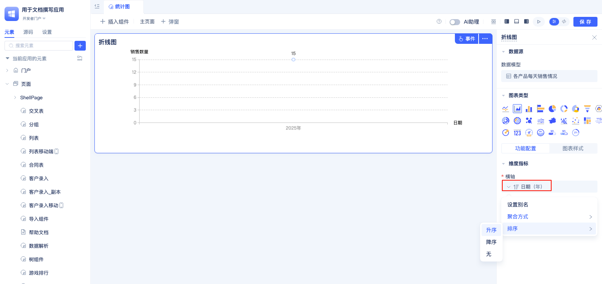
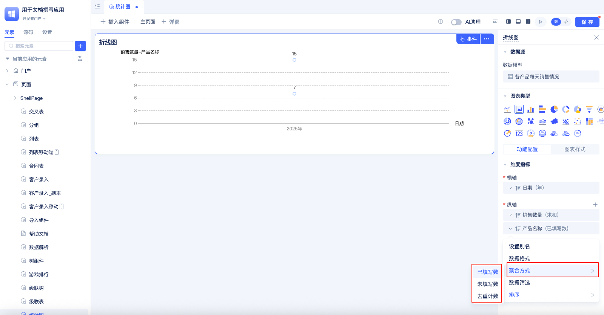
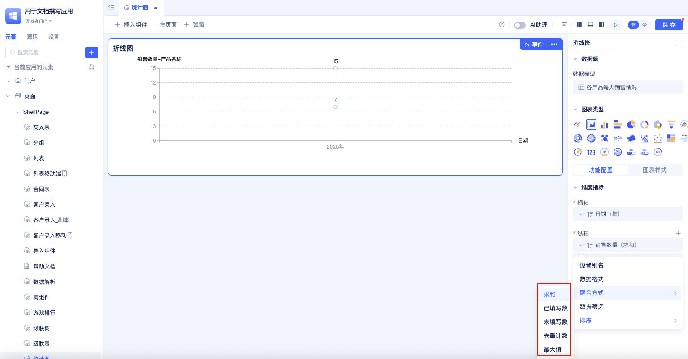
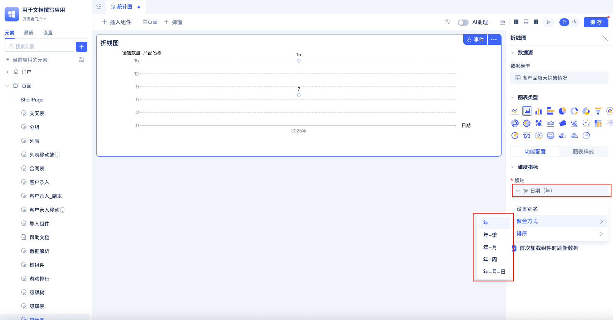

# 统计图

统计图组件是一个基于ECharts的数据可视化组件，支持多种图表类型，如柱状图、折线图、饼图、漏斗图等。该组件可以连接数据模型，自动将数据转换为图表展示，同时提供丰富的样式配置选项。

## 统计图表通用配置

不同的统计图，除了一些这些统计图所特有的配置项，还具有公共配置项，比如数据源，纵轴，横轴，图例等配置项。

### 数据源配置

数据源是统计图表的数据来源，在统计图配置区，可以设置数据源的筛选条件还排序条件。

鼠标放到数据表模型名称上，在点击最右侧的`配置`图标。

在弹出框中配置数据筛选条件和数据排序条件。

### 首次加载时刷新数据

组件首次加载完是否刷新数据，默认勾选本配置项。当页面需要在其他组件加载完再更新统计图的数据时，可不勾选本配置项。

### 配置维度指标

统计图组件支持配置维度指标，不同的统计图具有不同的维度指标，但是维度指标的配置方式是一样的。

点击指标名称右侧的`+`, 在弹出框中选择维度指标的字段。

### 配置维度指标的别名

维度指标默认使用选中的字段名作为维度指标名，开发者可以自定义维度名以提高图表的可读性和专业性。

点击指标名，然后点击下拉框中的`设置别名`，弹出修改别名的对话框。

在弹出的对话框中填写指标别名后点`确定`按钮。

### 修改维度指标的排序

统计图组件中，添加完指标后默认排序方式是升序，开发者自己设置指标的排序方式。

点击指标名称，鼠标悬停在下拉框的`排序`上，在二级弹框中选择排序方式，当前支持“升序”，“降序”，“无”。

### 修改维度指标的聚合方式

统计图组件的维度指标支持多种聚合方式，文本类型支持“已填写数”，“未填写数“，”去重计数“，默认使用已填写数：

数字类型支持”求和“，”已填写数“，”未填写数“，”去重计数“，”最大值“，默认使用”求和“：

日期类型的聚合方式支持”年“，”年-季“，”年-月“，”年-周“，”年-月-日“，默认使用”年“：

点击维度指标名称，在弹出的下拉菜单中点击`聚合方式`选项，系统会展开二级菜单，从中选择具体的聚合方式。

### 图例配置

*   显示图例并配置图例在图表中的位置

### 图表导出功能

*   启用或禁用图表的导出图片功能

*   设置导出图表图片的水平内边距和垂直内边距

### 事件处理

*   编写统计图数据明细和维度的点击事件函数逻辑

## 坐标轴与数值配置

### 坐标轴标题配置

*   设置横纵轴标题的文字大小以及颜色

### 坐标轴刻度配置

*   设置横纵轴刻度的内外位置

*   设置横纵轴刻度上文字标签的显隐/内外位置/宽度/倾斜角度

### 数据筛选配置

*   设置纵轴的数据筛选条件

*   配置数值维度对应的数据筛选条件

### 显示样式配置

*   设置统计图的线条是否以平滑模式显示

*   设置数值的显示格式

### 数值维度配置

*   配置数值维度的排序规则

*   添加公式计算的指标值作为数值维度

### 时间维度聚合

*   使用日期时间字段作为维度名称时设置按年/季度/月/周/日聚合

## 折线图与面积图

**侧重特性：**

*   选择模型字段作为折线图横轴维度并设置别名和排序规则

*   选择对特定模型字段进行聚合计算并作为折线图纵轴数值（求和、最大最小、平均、计数）

*   添加多个纵轴维度并拖动调整展示顺序

*   设置面积图面积区域的背景渐变色与透明度

## 柱状图与条形图
**侧重特性：**

*   设置条形的粗细宽度

*   设置柱形的粗细宽度

## 饼图系列
**侧重特性：**

*   设置饼图的半径大小

*   配置一个模型字段作为各个扇形部分的名称并设置别名和排序规则

*   启用或禁用扇形上的文字标签

*   选择对某个模型字段的值进行聚合计算并作为扇形的角度大小（求和、最大最小、平均、计数）

## 漏斗图
**侧重特性：**

*   配置一个模型字段作为漏斗层并设置别名和排序规则

*   选择对某个模型字段的值进行聚合计算并作为漏斗层的大小（求和、最大最小、平均、计数）

*   设置漏斗底部样式为平底或尖底

*   设置漏斗斜率为平滑或真实斜率

## 雷达图
**侧重特性：**

*   配置一个模型字段作为外圈的名称

*   选择若干个字段的值进行聚合计算作为雷达图的纵轴数值（求和、最大最小、平均、计数）

## 旭日图
**侧重特性：**

*   选择多个字段作为旭日图每一层的扇形名称并设置别名和顺序

*   选择对某个模型字段的值进行聚合计算并作为扇形的角度大小（求和、最大最小、平均、计数）

## 气泡图
**侧重特性：**

*   选择一个模型字段作为气泡名称并设置别名和排序规则

*   选择对某个模型字段的值进行聚合计算并作为气泡的大小（求和、最大最小、平均、计数）

## 河流图
**侧重特性：**

*   选择模型的日期时间字段作为河流图的横轴维度并设置排序规则

*   选择若干个模型字段的值进行聚合计算作为在河流图中的宽度大小

## 地图图表
**侧重特性：**

*   选择一个地址类型的模型字段作为中国地图的区域指标并配置聚合粒度（省/市/区）

*   选择对一个模型字段进行聚合计算并作为对应区域的数值

## 日历热力图
**侧重特性：**

*   选择模型的日期时间字段作为日历热力图的时间维度

*   选择一个模型字段的值进行聚合计算作为日历中每一部分的数值大小

## 散点图
**侧重特性：**

*   选择一个模型字段作为散点图的横轴维度并配置别名和排序规则

*   选择对一个模型字段进行聚合计算并作为对应点上的数值

## 矩形树图
**侧重特性：**

*   选择多个模型字段作为矩形树图的区块名称并设置好顺序和别名

*   选择对一个模型字段进行聚合计算并作为对应矩形区域的面积和数值

## 字符云图
**侧重特性：**

*   选择一个模型字段作为字符云图中显示的字符

*   选择对一个模型字段进行聚合计算并作为对应字符的大小

## 单值图
**侧重特性：**

*   选择一个模型字段作为指标名称并设置别名

*   设置对选中模型字段进行聚合计算并作为指标值显示

*   设置指标名和指标值的文字大小和颜色

*   配置指标值在不同条件下的样式（文字大小和样色）

*   配置指标名称和指标值的水平对齐方式（左中右）

*   配置单值图数据单位的字体大小颜色

## 多值图
**侧重特性：**

*   选择若干个模型字段作为指标名称并设置别名和排序

*   设置对每个选中模型字段进行聚合计算并作为指标值显示

*   设置指标名和指标值的文字大小和颜色

*   配置指标值在不同条件下的样式（文字大小和样色）

*   配置多个指标的展示布局列数（1到4列）

*   配置指标名称和指标值的相对位置（上下左右）

*   配置多值图数据单位的字体大小颜色

## 仪表盘图
**侧重特性：**

*   选择对一个模型字段进行聚合计算并作为仪表盘上的指标名称和指示数值

*   设置仪表盘的半径大小

## 水球图
**侧重特性：**

*   选择对一个模型字段进行聚合计算并作为水球图上的指示数值

*   设置水球图的半径大小

## 进度条图表
**侧重特性：**

*   选择对一个模型字段进行聚合计算并作为进度条上的指示数值
