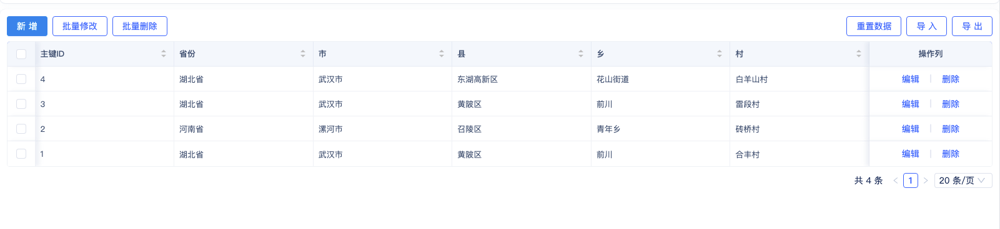

# 树组件
## 树形组件

*   分别选择一个模型字段作为树形组件的1/2/3/4/5级字段（至少要有两级）

*   启用或禁用默认展开第一个节点

树形组件为最常用的树组件，可用于展示多级数据，树形组件默认只展示第一级数据，点击`>`图标后，会查询下一级数据：

<!-- 
 -->

本示例的树形组件数据如下图，可以看出树形组件的层级字段为同一个数据表模型的不同字段。

### 创建树形组件

在[页面编辑器](../门户与页面开发/组件化页面开发.md#可视化页面编辑器)中拖入树形组件后，在预览区会显示配置出错，这是因为`基础配置`中的层级字段配置不全的原因。当开发者选择完层级字段后，就会按照配置正确的渲染出树形组件。

 

### 配置层级字段

鼠标点击`一级字段`下的`请选择`，在下拉框中选择一级字段。然后按照同样的操作配置其他层级的字段。树形组件要求最少配置两级字段。最多可配置5级。

使用效果：

### 树形组件首次加载组件时刷新数据

本配置项是指在页面上树形组件加载完毕后，是否立即调用接口获取数据，默认情况下会勾选本选项。当需要其他组件加载完再加载树形时，可以不勾选本选项。下面是点击按钮后手动加载树形组件数据的示例：

使用效果：

### 默认展开第一个节点

在默认情况下，树形组件渲染后所有节点都是闭合状态，勾选本选项后，会在组件渲染完后默认展开第一个节点，并展示第一个节点的下级节点：

### 点击节点后事件

当用户点击树的每一层的节点后，都会触发本事件，在本事件中可以更新其他组件的数据。一个比较常见的场景是，用树形组件展示层级关系，用表格展示详细数据，当点击树形组件后，更新表格中的数据。在这种情况下，表格和树形组件是同一个数据模型：

 

配置步骤如下：

1. 在树形组件的事件配置区的`点击节点后`事件编辑区，点击`请选择`,在弹框中选择`表格`的`刷新`方法。
2. 点击`设置筛选条件`右边的`设置`按钮（看起来像三条横线），然后选择变量值。
3. 点击`请选择`，在弹窗中选择树形的`节点的筛选条件`的`值`。
 
使用效果如下图：

*   编写树形节点被点击时的事件逻辑

## 级联树

级联树组件与树形组件类似，也用来展示具有层级关系的数据。与树形组件不同的是使用的数据结构不同，如下图所示，数据模型中需要有一个自关联字段。

*   选择一个关联自身的关联数据字段作为级联树的上级节点

*   设置级联树的单选和多选模式

*   编写级联树的节点点击后事件逻辑以及选中节点后事件逻辑

*   禁用或启用首次加载级联树时刷新数据
