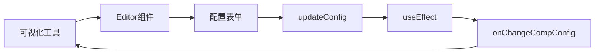

# 为UI组件Type元素开发可视化编辑器
import Tabs from '@theme/Tabs';
import TabItem from '@theme/TabItem';

当我们完成了[扩展自己的UI组件Type元素](./add-frontend-components)后，组件虽然可以在页面中使用，但配置参数需要手动修改`scheme.json`文件，这对不擅长编码的业务专家来说并不友好。

本文将介绍如何为计数器组件开发可视化配置编辑器，实现在JitAi开发工具中像官方组件一样的图形化配置体验。

## 效果预览
开发完成后，在可视化开发工具中选中计数器组件时，右侧属性面板将显示友好的配置界面：


## 编辑器架构
| 元素层次 | fullName | 主要职责 |
|---------|----------|----------|
| **编辑器元素** | `components.CounterType.Editor` | type指向`editors.React`，为CounterType提供可视化配置界面 |
| **目标组件** | `components.CounterType` | 被编辑的目标组件，已在前面章节完成 |

### 编辑器目录结构
```shell title="在CounterType下新增Editor子目录"
components/
└── CounterType/
    ├── e.json                          # 组件声明文件
    ├── index.ts                        # 组件PC端入口
    ├── index.mobile.ts                 # 组件移动端入口
    ├── CounterComponent.ts             # 组件业务逻辑
    ├── render/                         # 组件渲染层
    │   ├── pc/
    │   └── mobile/
    └── Editor/                         # 编辑器目录（新增）
        ├── e.json                      # 编辑器元素定义文件
        ├── index.ts                    # 编辑器入口文件
        └── Editor.tsx                  # 编辑器实现文件
```

## 操作指南
### 创建编辑器目录
在CounterType目录下创建Editor子目录：

```bash
# 在CounterType目录下执行
mkdir -p Editor
```

### 实现编辑器文件
<Tabs>
  <TabItem value="config" label="元素定义文件">

**创建编辑器元素定义文件** `components/CounterType/Editor/e.json`：

:::tip 编辑器也是元素
在JitAi中，编辑器本身也是一个元素，拥有自己的`e.json`定义文件。
:::

```json title="components/CounterType/Editor/e.json"
{
    "title": "计数器组件编辑器",          
    "type":"editors.React",             
    "tag": "config",                    
    "targetType": "components.CounterType",   
    "frontBundleEntry": "index.ts"
}
```

**编辑器元素配置说明：**

<ul>
<li><code>title</code>: 编辑器元素显示名称</li>
<li><code>type</code>: 固定为<code>editors.React</code>，表示React编辑器元素</li>
<li><code>tag</code>: 固定为<code>config</code>，表示配置编辑器</li>
<li><code>targetType</code>: 目标组件的fullName</li>
<li><code>frontBundleEntry</code>: 编辑器入口文件</li>
</ul>

  </TabItem>
  <TabItem value="entry" label="入口文件">

**创建编辑器入口文件** `components/CounterType/Editor/index.ts`：

```typescript title="components/CounterType/Editor/index.ts"
import CounterEditor from "./Editor";
export const Editor = CounterEditor;
```

:::important 编辑器导出规范
编辑器必须导出名为`Editor`的组件，这是JitAi工具识别编辑器的固定约定。
:::

  </TabItem>
  <TabItem value="editor" label="编辑器实现">

**创建编辑器主体文件** `components/CounterType/Editor/Editor.tsx`：

```tsx title="components/CounterType/Editor/Editor.tsx"
import type { FC } from 'react';
import type { CompEditorProps } from 'components/common/types';
import { useState, useEffect, useRef } from 'react';
import { Form, InputNumber } from 'antd';

const CounterEditor: FC<CompEditorProps> = (props) => {
  const { onChangeCompConfig } = props;
  const didMountRef = useRef(false); // 防止初始化时触发回调

  // 1. 管理组件配置状态
  const [compConfig, setCompConfig] = useState(props.compConfig);

  // 2. 配置更新函数
  const updateConfig = (updates: Record<string, any>) => {
    const newConfig = {
      ...compConfig,
      config: {
        ...compConfig.config,
        ...updates,
      },
    };
    setCompConfig(newConfig);
  };

  // 3. 配置变化时通知父组件（跳过初始化）
  useEffect(() => {
    if (!didMountRef.current) {
      didMountRef.current = true;
      return; // 跳过组件初始化时的回调
    }
    onChangeCompConfig?.(compConfig);
  }, [compConfig, onChangeCompConfig]);

  // 4. 渲染配置界面
  return (
    <div style={{ padding: '16px' }}>
      <Form layout="vertical">
        <Form.Item label="初始值">
          <InputNumber
            value={compConfig.config?.initialValue || 0}
            onChange={(value) => updateConfig({ initialValue: value || 0 })}
            placeholder="请输入计数器初始值"
          />
        </Form.Item>
      </Form>
    </div>
  );
};

export default CounterEditor;
```

  </TabItem>
</Tabs>

## 编辑器工作原理
### 数据流转机制


1. **配置接收**: Editor组件通过`props.compConfig`接收当前组件配置
2. **状态管理**: 使用`useState`在编辑器内部管理配置状态  
3. **配置更新**: `updateConfig`函数合并更新配置对象
4. **变化监听**: `useEffect`监听配置变化
5. **回调通知**: 通过`onChangeCompConfig`回调通知工具配置已更改

### 核心接口规范
#### CompEditorProps接口
:::info JitAi提供的接口
`CompEditorProps`是由JitAi IDEApp提供的标准接口，开发者可直接从`components/common/types`导入使用，无需自己定义。
:::

```typescript
// 从JitAi导入，无需自己定义
import type { CompEditorProps } from 'components/common/types';

interface CompEditorProps {
  compConfig: {
    name: string;           // 组件实例名称
    title: string;          // 组件显示标题  
    showTitle: boolean;     // 是否显示标题
    config: {               // 组件自定义配置
      initialValue?: number;
      // 其他配置项...
    };
    // 其他系统配置...
  };
  onChangeCompConfig?: (newConfig: any) => void;  // 配置变化回调
}
```

#### 配置更新最佳实践
```typescript
// ✅ 正确的配置更新方式
const updateConfig = (updates: Record<string, any>) => {
  const newConfig = {
    ...compConfig,                    // 保留原有配置
    config: {
      ...compConfig.config,           // 保留原有config
      ...updates,                     // 合并新的配置
    },
  };
  setCompConfig(newConfig);
};

// ❌ 错误的配置更新方式
const updateConfig = (updates: Record<string, any>) => {
  setCompConfig({ config: updates }); // 这会丢失其他配置
};
```

## 测试
### 使编辑器生效
1. **清理缓存**：删除应用目录中的`dist`目录  
2. **重启服务**：重启桌面端
3. **触发打包**：访问应用页面，系统自动重新打包

### 验证编辑器功能
1. **打开页面编辑器**：在JitAi开发工具中打开包含计数器组件的页面
2. **选中组件**：点击页面中的计数器组件
3. **查看属性面板**：右侧属性面板应显示"初始值"配置项
4. **修改配置**：尝试修改初始值，观察组件是否实时更新
5. **保存验证**：保存页面后重新打开，确认配置已持久化

### 常见问题排查
- **编辑器不显示**：检查`e.json`中`targetType`是否正确指向组件
- **配置无法保存**：确认`onChangeCompConfig`回调是否正确调用
- **初始化出错**：检查`didMountRef`是否正确避免初始回调

## 进阶扩展
如需为计数器组件添加更多配置选项，只需在编辑器中增加对应的表单控件：

```tsx
<Form layout="vertical">
  <Form.Item label="初始值">
    <InputNumber
      value={compConfig.config?.initialValue || 0}
      onChange={(value) => updateConfig({ initialValue: value || 0 })}
    />
  </Form.Item>
  
  <Form.Item label="步长">
    <InputNumber
      value={compConfig.config?.step || 1}
      min={1}
      onChange={(value) => updateConfig({ step: value || 1 })}
    />
  </Form.Item>
  
  <Form.Item label="最大值">
    <InputNumber
      value={compConfig.config?.max}
      onChange={(value) => updateConfig({ max: value })}
    />
  </Form.Item>
</Form>
```

支持的Antd组件：`InputNumber`、`Input`、`Switch`、`Select`、`DatePicker`等。

## 总结
为前端组件开发可视化编辑器的**核心步骤**：

1. **创建Editor目录** + 配置编辑器元素定义文件`e.json`（`type: "editors.React"`）
2. **实现Editor组件**：接收`CompEditorProps` + 渲染配置表单  
3. **正确导出**：导出名为`Editor`的组件
4. **配置同步**：通过`onChangeCompConfig`回调更新配置

**关键要点**：
- 导出名`Editor`不可更改
- `CompEditorProps`由JitAi提供，直接导入使用
- 必须正确合并更新配置对象
- 使用`didMountRef`避免初始化时的无效回调