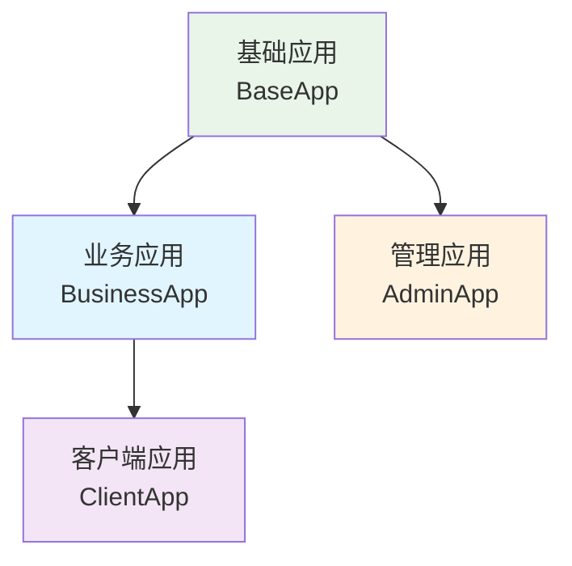
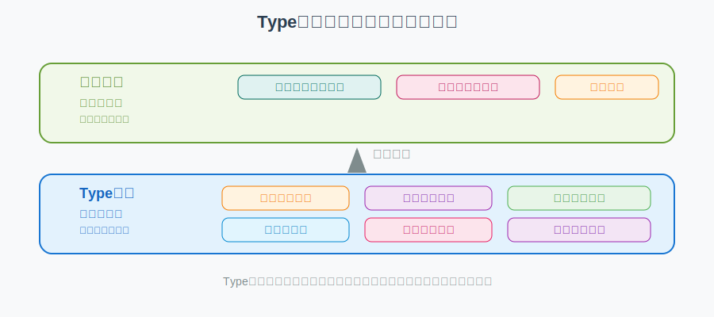
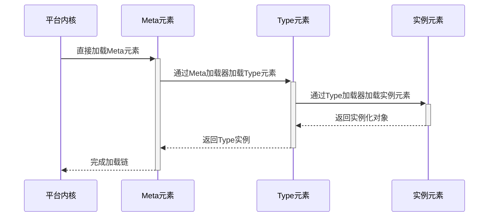
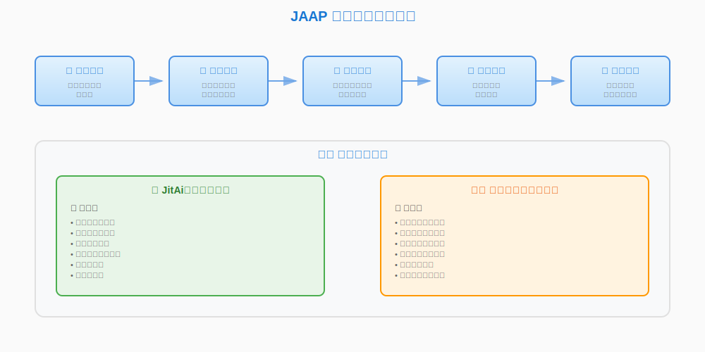

# JAAP（JitAi Application Protocol）
操作系统的出现是计算机发展史的一个重要转折点，它通过硬件抽象让程序员得以专注算法逻辑，将CPU架构、内存管理、进程管理、设备驱动等复杂度转移到了操作系统内部。如今，现代应用开发已经从单一程序的编写，演变为多种技术栈的复杂集成，使开发者不能专注于业务逻辑的实现。

我们需要在操作系统之上并延续其理念，对应用开发这件事进行复杂性抽象，让业务专家能够最大限度地专注于上层业务逻辑的编排。

**JAAP（JitAi Ai Application Protocol）** 作为统一架构语言，从结构定义和过程驱动层面实现了上述复杂性抽象，定义了应用系统的构建标准和模块化架构，而应用运行平台负责JAAP应用的解释执行。JAAP由 **应用规范** 和 **元素规范** 两部分组成，共同构建了一个完整的应用开发和运行体系。

## 🏗️ 应用规范
应用是实现特定业务功能的相关元素集合，每个应用对应一个独立的文件夹结构。应用通过标准化的目录结构和配置文件实现模块化管理和继承复用。

### 应用部署路径
应用遵循标准化的部署路径规则：

```
运行环境目录/组织ID/应用ID/应用版本
```

**示例路径**：`home/environs/JRE_MWcVmUZjEq/wanyun/MyApp/1_0_0`

### 应用目录结构
```plaintext title="标准应用目录结构"
MyApp/                     # 应用根目录
├── app.json               # 应用配置清单
├── requirements.txt       # Python 依赖声明
│
├── appData/               # 应用数据存储
├── dist/                  # 编译构建产物
├── commons/               # 公共代码库
├── test/                  # 测试用例集
│
├── 📁 数据层元素
│   ├── models/            # 数据模型元素
│   ├── databases/         # 数据库连接元素
│   ├── caches/           # 缓存服务元素
│   └── storages/         # 存储服务元素
│
├── 📁 业务层元素
│   ├── services/         # 业务服务元素
│   ├── workflows/        # 工作流程元素
│   ├── tasks/           # 任务调度元素
│   └── events/          # 事件处理元素
│
├── 📁 展示层元素
│   ├── pages/           # 页面元素
│   ├── components/      # UI组件元素
│   ├── shells/         # 应用门户元素
│   └── themes/         # 主题样式元素
│
├── 📁 权限控制元素
│   ├── roles/          # 角色权限元素
│   ├── auths/         # 认证服务元素
│   ├── apiAuths/      # API认证元素
│   ├── corps/         # 企业组织元素
│   └── interceptors/  # 请求拦截器元素
│
├── 📁 集成服务元素
│   ├── externalAPIs/  # 外部API集成元素
│   └── messages/      # 消息通信元素
```

### 应用配置清单
`app.json` 是应用的核心配置文件，定义应用的基本信息和运行参数：

```json title="app.json 配置示例"
{
  "appId": "orgId.appName",           // 应用唯一标识符
  "name": "appName",                  // 应用内部名称
  "title": "Application Title",       // 应用显示标题
  "version": "1.0.0",                // 应用版本号
  "orgId": "orgId",                  // 所属组织ID
  "icon": "icon_identifier",         // 应用图标标识
  "theme": "#3d65fd",               // 应用主题色
  "encrypted": 0,                   // 加密标识 (0:否 1:是)
  
  "extends": [                      // 应用继承配置
    {
      "appId": "wanyun.BaseApp",
      "version": "1.0.0"
    }
  ],
  
  "settings": {                     // 应用运行设置
    "defaultElement": {
      "defaultCache": "caches.Default",
      "defaultDatabase": "databases.Default", 
      "defaultShell": "shells.Main",
      "defaultStorage": "storages.Default"
    }
  }
}
```

### 构建产物目录
`dist/` 目录存储应用的编译构建产物：

| 文件类型 | 描述 | 命名规范 |
|---------|------|----------|
| **元素包** | 加密后的元素文件 | `element.pkg` |
| **应用清单** | 应用结构描述文件 | `app.jit` |

:::info 构建产物说明
- **目录结构**：与源码目录保持一致
- **文件格式**：元素文件经过加密处理
- **清单文件**：`app.jit` 基于 `app.json` 自动生成，包含编译时信息以及实际的元素构成，用于运行时加载
:::

### 应用继承机制
JitAi 应用支持多级继承，子应用通过 `extends` 配置继承父应用的元素和配置，实现代码复用和功能扩展。



**继承特性**：
- **元素重写**：子应用可重写父应用的同名元素
- **配置覆盖**：子应用配置优先级高于父应用
- **增量开发**：基于父应用进行功能扩展

## 🧩 元素规范
JitAi 采用三层元素架构设计，实现了高度的可扩展性和复用性。其中Type元素和实例元素都支持完整的生命周期管理机制：



### 元素层级定义
#### 🏗️ Meta 元素（元类元素）
**核心特征**：
- `type` 字段为空，直接由平台内核加载
- 作为元素族类的根节点
- 实现 Type 元素的加载器机制

**技术约束**：
- 后端：必须使用 **Python** 开发
- 前端：必须使用 **TypeScript/JavaScript** 开发

**职责范围**：Type 元素加载器实现

#### 🔧 Type 元素（类型元素）
**核心特征**：
- `type` 字段指向 Meta 元素或其他 Type 元素
- 封装技术领域的完整基础设施
- 提供标准化接口和配置参数
- 实现实例元素加载器
- 提供可视化配置器
- 负责实例元素的加载和管理
- 支持生命周期管理（onCreate、onUpdate、onDelete等）

**实现模式**：
| 模式类型 | 描述 | 适用场景 |
|---------|------|----------|
| **继承模式** | 作为父类提供基础实现 | 需要代码继承的场景 |
| **模板模式** | 封装技术实现，开放配置参数 | 配置驱动的场景 |

**职责范围**：技术实现、实例元素加载器与可视化配置器、生命周期管理

#### 🏢 Instance 元素（实例元素）
**核心特征**：
- `type` 字段必须指向 Type 元素
- 仅包含业务相关配置和轻量逻辑
- 通过 Type 元素提供的可视化配置器生成
- 通过 Type 元素的 loader 进行加载
- 支持生命周期管理（onLoad、onCalled、onAppExit等）

**职责范围**：业务配置与应用逻辑、生命周期事件处理

### 元素加载机制


### 元素目录规范 {#element-directory-specification} 
每个元素遵循统一的目录结构和文件命名规范：

```plaintext title="标准元素目录结构"
element-name/
├── e.json              # 元素定义清单
├── config.json         # 运行时配置
├── loader.py           # 元素加载器 (非实例元素)
├── lifecycle.py        # 生命周期管理
├── xxx.py              # 元素逻辑实现 (例如Model元素的model.py、Service元素的service.py)
```

#### 前后端复合元素目录结构
对于同时包含前后端代码的复合元素，使用 `frontend` 和 `backend` 子目录进行代码分离：

```plaintext title="复合元素目录结构"
element-name/
├── e.json              # 元素定义清单
├── frontend/           # 前端代码目录
│   ├── index.ts        # 前端入口文件
│   └── config.json     # 运行时配置
├── backend/            # 后端代码目录
│   ├── loader.py       # 元素加载器
│   ├── lifecycle.py    # 生命周期管理
│   └── xxx.py          # 后端业务逻辑
│   └── config.json     # 运行时配置
```

:::info 说明
- **目录分离**：前后端代码通过子目录物理分离
- **fullName 唯一性**：子目录不影响元素的 fullName，路径 `x/y/frontend` 和 `x/y/backend` 的元素 fullName 均为 `x.y`
- **入口配置**：在 `e.json` 中通过 `backendBundleEntry` 和 `frontBundleEntry` 分别指定前后端入口
- **加载机制**：前后端代码分别按各自的加载时机和规则进行加载
:::

```json title="复合元素 e.json 配置示例"
{
  "title": "用户界面组件",
  "type": "components.StandardType",
  "backendBundleEntry": "./backend",     // 指向 backend 子目录
  "frontBundleEntry": "./frontend/index.ts",      // 指向 frontend 子目录下的入口文件
  "frontMobileBundleEntry": "./frontend/mobile.ts" // 移动端入口文件
}
```

#### 核心文件详解
##### 📋 元素定义文件 (e.json)
定义元素的基本信息和元数据：

```json title="e.json 完整配置"
{
  // 基础信息
  "title": "用户数据模型",                    // 元素显示名称
  "type": "models.NormalType",              // 类型指向
  "icon": "user",                          // 元素图标
  "description": "提供用户信息管理功能",       // 功能描述
  "tag": "数据模型,用户管理",                // 分类标签
  
  // 入口配置
  "backendBundleEntry": ".",               // 后端入口
  "frontBundleEntry": "index.js",          // 前端入口
  "frontMobileBundleEntry": "mobile.js",   // 移动端入口
  
  // 加载配置
  "loadTime": "afterStartUp",              // 前端加载时机
  "backendLoadTime": "afterAppInit",       // 后端加载时机
  "cacheLevel": 0,                        // 缓存级别
  
  // 访问控制
  "accessModifier": "public",              // 访问修饰符
  
  // 功能接口
  "functionList": [                        // 对外接口定义
    {
      "name": "getUserById",
      "title": "根据ID获取用户",
      "async": true,
      "returnType": "JitDict",
      "ignoreSign": false,                // 是否忽略签名验证，默认false
      "loginRequired": 1,                 // 是否需要登录，默认1，0表示不需要登录，1表示需要登录
      "args": [
        {
          "name": "userId",
          "title": "用户ID", 
          "dataType": "Stext"
        }
      ]
    }
  ]
}
```

functionList是元素对外声明自身接口的唯一途径，是通过HTTP请求访问元素接口的前提、也是被AIAgent添加为工具的前提。

###### 加载时机控制
**前端元素加载时机**：

| 配置值 | 触发时机 | 适用场景 |
|-------|----------|----------|
| `startUp` | 应用启动前 | 底层 Meta/Type 元素 |
| `afterStartUp` | 应用启动后立即 | 核心预加载元素 |
| *未配置* | 按需加载 | 常规业务元素 |

**后端元素加载时机**：

| 配置值 | 触发时机 | 适用场景 |
|-------|----------|----------|
| `afterAppInit` | 应用初始化后 | 数据库、模型 Type 元素 |
| `beforeHandleRequest` | 请求处理前 | 请求拦截器元素 |
| *未配置* | 按需加载 | 一般业务元素 |

###### 访问权限控制
| 修饰符 | 权限范围 | 继承特性 | 使用场景 |
|-------|----------|----------|----------|
| `private` | 当前应用内 | 不可继承 | 内部服务元素 |
| `protected` | 继承链内 | 可继承，不可重写 | 核心业务逻辑 |
| `public` | 全局可访问 | 可继承可重写 | 通用业务元素 |

###### 缓存级别配置
| 级别 | 缓存范围 | 生命周期 | 适用场景 |
|------|----------|----------|----------|
| `0` | 进程级别 | 应用运行期间 | 全局共享数据 |
| `1` | 线程级别 | 单次请求期间 | 请求上下文数据 |

##### 🚀 元素加载器 (loader.py)
:::warning 重要提醒
实例元素无需实现 `loader.py`，由其 Type 元素负责加载
:::

```python title="标准加载器实现"
class Loader(object):
    """元素加载器基类"""
    
    def load(self):
        """
        执行元素加载逻辑
        
        Returns:
            object: 加载完成的元素实例
        """
        # self.nodes[0] 获取当前元素对象
        current_element = self.nodes[0]
        
        # 执行初始化逻辑
        self._initialize_element(current_element)
        
        return current_element
    
    def _initialize_element(self, element):
        """初始化元素资源和配置"""
        # 读取配置、初始化连接等
        pass
```

##### 🔄 生命周期管理 (lifecycle.py)
Type元素和实例元素都支持生命周期管理，生命周期函数根据元素类型分为不同的触发时机：

**实例元素生命周期函数**：

```python title="实例元素生命周期函数"
def onLoad():
    """元素加载完成后执行"""
    print("实例元素已加载")

def onCalled():
    """元素被调用时执行"""  
    print("实例元素被调用")

def onAppExit(exc_val=None, resData=None, **kwargs):
    """请求会话结束时执行"""
    if exc_val:
        print(f"请求异常结束: {exc_val}")
    else:
        print("请求正常结束")
```

**Type元素生命周期函数**：

```python title="Type元素生命周期函数"
def onCreate(fullName: str):
    """实例元素创建时调用"""
    print(f"创建实例: {fullName}")
    return {"status": "success"}

def onUpdate(fullName: str):
    """实例元素更新时调用"""
    print(f"更新实例: {fullName}")
    return {"status": "success"}

def onDelete(fullName: str):
    """实例元素删除时调用"""
    print(f"删除实例: {fullName}")
    return {"status": "success"}

def onException(fullName: str, title: str, exc: Exception):
    """异常处理时调用"""
    print(f"元素异常 [{fullName}]: {title} - {exc}")
    return {"status": "error", "message": str(exc)}
```

### 元素的业务配置文件
实例元素通过 `config.json` 提供运行时配置：

```json title="config.json 配置示例"
{
  "database": {
    "alias": "Default",
    "type": "sqlite", 
    "config": {
      "database": "appData/databases/Default/sqlite.db",
      "pool_size": 10,
      "max_overflow": 20
    }
  }
}
```

:::tip 配置说明
config.json 是实例元素的运行时配置文件，配置的格式内容完全由Type元素加载器的逻辑决定。
:::

### 元素的调用
#### 在业务逻辑中调用元素 {#call-elements-in-business-logic}
通过标准化 API 调用元素实例：

```python title="元素调用示例"
# 数据模型调用
user_model = app.getElement("models.User")
user_data = user_model.getById(user_id)

# 业务服务调用
auth_service = app.getElement("services.AuthService")
login_result = auth_service.authenticate(username, password)
```

#### 通过HTTP接口调用元素
除了标准的元素调用接口外，JAAP协议还支持通过HTTP协议直接调用元素实例，实现跨平台和跨语言的服务集成。

##### HTTP调用机制
在配置了functionList的前提下，任何元素只需实现 `requestHandle(self, request)` 函数，即可通过HTTP协议进行远程调用。该函数作为HTTP请求路由器，负责将外部请求转发到目标业务函数，开发者可以自定义路由转发逻辑。

```python title="HTTP调用处理器实现示例"
def requestHandle(self, request):
    """
    HTTP请求处理器
    
    Args:
        request: 平台增强的HTTP Request对象（继承自Flask HTTP Request）
        
    Returns:
        dict: 响应数据，将自动序列化为JSON返回
    """
    # 从请求路径中提取目标函数名称
    func = request.path.strip("/").split("/")[-1]
    
    # 获取请求参数（平台增强属性）
    argsDict = request.argsDict
    
    # 获取目标函数对象
    funcObj = getattr(self, func, None)
    if funcObj is None:
        raise AttributeError(f"Function '{func}' not found")
    
    # 调用目标函数
    return funcObj(**argsDict)
```

##### HTTP调用路径规范
HTTP调用遵循标准化的URL路径规范：

```
https://[运行环境入口域名]/api/[orgId]/[appId]/[elementPath]/[functionName]
```

**路径参数说明**：

| 参数 | 描述 | 示例 |
|------|------|------|
| `运行环境入口域名` | 应用部署的访问域名 | `app.example.com` |
| `orgId` | 组织标识符 | `wanyun` |
| `appId` | 应用标识符 | `MyApp` |
| `elementPath` | 元素路径（fullName中的`.`替换为`/`） | `services/UserService` |
| `functionName` | 目标函数名称 | `getUserById` |

**调用示例**：

```bash title="HTTP调用示例"
# 调用用户服务的getUserById函数
curl -X POST https://app.example.com/api/wanyun/MyApp/services/UserService/getUserById \
  -H "Content-Type: application/json" \
  -d '{"userId": "12345"}'
```

## 🚀 元素开发最佳实践
### 开发工作流


#### 开发步骤详解
##### 1. 📋 需求分析
**目标**：明确功能范围和要求
- **分析业务需求**：理解要解决的具体问题
- **确定功能边界**：明确元素的职责范围
- **评估技术可行性**：分析实现的技术难点
- **制定开发计划**：估算开发周期和资源需求

##### 2. 🎯 元素设计
**目标**：根据对需求的拆分，设计元素族类
- **分析需求拆分**：将复杂需求分解为具体功能模块
- **设计元素族类**：确定需要的Meta、Type、Instance元素结构
- **优先复用已有**：查找并复用现有的元素族类
- **确定架构层级**：明确元素在三层架构中的定位

##### 3. 📁 创建元素目录
**目标**：按元素规范实现各个文件
- **JitAi开发工具**：可视化配置界面，拖拽式创建
- **本地全代码开发**：支持手动创建标准目录结构，全代码开发时可以同时使用JitAi开发工具
- **初始化核心文件**：e.json、config.json、loader.py等
- **版本控制**：纳入Git版本管理

:::info 开发模式说明
- **JitAi开发工具模式**：支持可视化配置，即改即生效，零配置部署
- **本地全代码开发模式**：完全控制实现细节，适合复杂定制需求。参考[本地开发与调试](../../devguide/advanced-guide/local-development-and-debugging)，掌握本地开发与调试技巧。
:::

##### 4. 💻 实现元素逻辑
**目标**：开发业务逻辑以及生命周期
- **业务逻辑实现**：核心功能代码开发
- **生命周期配置**：onLoad、onCalled、onAppExit等事件处理
- **接口实现**：对外提供的API接口
- **错误处理**：异常情况的处理机制

### 质量检查清单
#### 📋 开发检查项
- [ ] **需求分析**：功能范围明确完整
- [ ] **元素设计**：架构层级合理，复用现有元素
- [ ] **目录结构**：符合 JAAP 规范
- [ ] **配置文件**：e.json 字段完整有效
- [ ] **业务逻辑**：核心功能实现正确
- [ ] **生命周期**：事件处理函数正确实现
- [ ] **接口定义**：functionList 配置准确
- [ ] **异常处理**：错误场景处理完整

#### 🔍 配置规范检查
- [ ] **敏感信息**：避免在配置中存储密钥
- [ ] **环境变量**：正确使用 variables 配置
- [ ] **缓存配置**：cacheLevel 设置合理
- [ ] **加载时机**：loadTime 配置适当
- [ ] **继承关系**：type 指向正确有效
- [ ] **访问控制**：权限修饰符设置合理

:::tip 开发建议
1. **遵循单一职责**：每个元素专注于特定功能领域
2. **合理使用继承**：充分利用 Type 元素的模板能力
3. **注重性能优化**：合理配置缓存和加载时机
4. **完善错误处理**：实现健壮的异常处理机制
5. **保持文档同步**：及时更新元素描述和接口文档
:::

---

通过遵循JAAP，开发者可以构建标准化、可扩展、易维护的 JitAi 应用系统。协议的分层设计和标准化接口确保了应用的高质量和长期演进能力。 

:::tip 进阶案例
当你已经掌握JAAP后，可以通过进阶案例加深理解：[扩展自己的元素族类](../../extguide/extend-element-family-classes)，学会自定义元素族类的实现。
:::