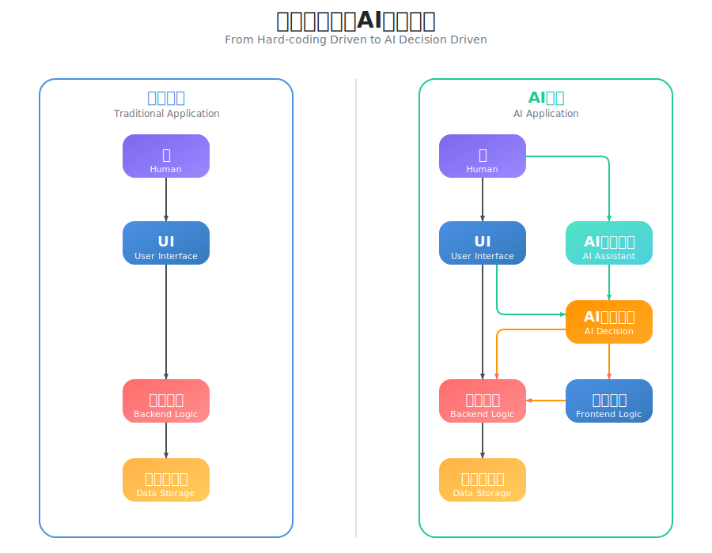
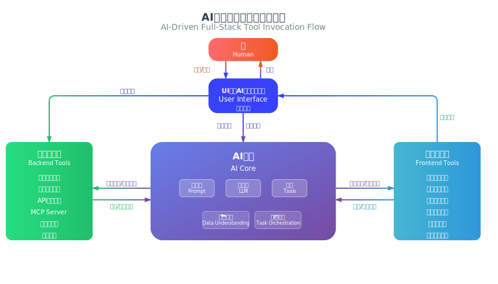
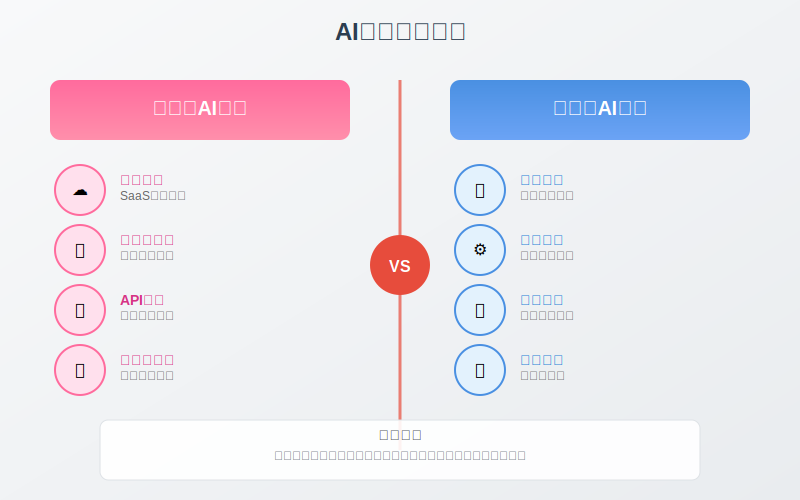

# AI原生的企业级应用开发范式
在汇编语言时代，开发者必须深度理解硬件细节，直接操作寄存器和内存地址，开发范式是"人适应机器的思维"。在高级语言时代，从FORTRAN到C语言，开发范式转向"让机器理解人的逻辑"，开发者可以用更接近人类思维的方式表达算法。在面向对象时代，Java、C++等语言引入了面向对象范式，开发方式从"过程导向"转为"对象导向"，软件架构从函数集合变为对象协作。在Web应用时代，从桌面软件到Web应用，开发范式从"单机程序"转为"分布式系统"，诞生了MVC、微服务等架构模式。

每一次范式转变都带来了效率的指数级提升，但同时也要求开发者学习和适应新的思维方式。如今，我们身处开发范式的又一次重大变革中——**AI应用开发范式**。

## AI应用开发范式
无论采用LangGraph、CrewAI还是其它任何开发框架构建AI应用，都无法逃离一个本质：**AI+人协同完成目标**。

### 人机交互到人智协同

与传统应用相比，AI应用中引入AI助理，系统交互模式从人机交互进化为人智协同。

### 硬编码驱动到AI决策驱动

在人机交互模式下，人类通过点击按钮、选择菜单等操作，触发预设的程序逻辑，系统被动响应完成用户请求处理。

在人智协同模式下，人类还可以和AI助理对话，由AI助理识别意图并完成对应业务逻辑的执行。但是，这并不意味着传统人机交互要被完全摒弃——在一些不需要智能决策的简单场景中，人的操作往往更快更直接，这正是人智协同的体现。

开发者在构建系统时，不再仅仅是开发一套操作界面和预设的固定逻辑，而是一个由AI助理增强的、能够覆盖前后端全栈的、在业务操作的各个环节中理解需求、智能决策、主动执行的助理应用。

### AI驱动的全栈工具调用流程

将AI视为整个系统的智能中枢，能够根据用户意图智能选择和动态组合前后端工具，实现全栈统一调用。**关键在于，AI调用的工具本质上就是传统应用中我们通过UI界面调用的功能模块**。用户既可以通过UI界面操作，也可以与AI对话，系统自动编排工具链路完成任务并提供反馈，真正实现从"人适应系统"到"系统理解人"的转变。

## 企业级AI应用特征
消费级AI应用追求通用性和易用性，而企业级AI应用则需要深度的业务集成和精细化管控。我们需要从架构设计、功能定制、权限管控、部署模式到数据安全等多个维度，构建与消费级AI应用截然不同的应用开发技术体系。

为了让AI应用能够高效处理企业级的数据和任务，AI应用要与传统软件系统模块深度集成，这种集成体现在"工具"层面，工具即软件模块，应具备以下特征：

### 模块自描述能力
软件模块必须能够向AI应用清晰描述自己的功能、参数和用法：

- **功能描述**：模块能够清晰表达自己的核心功能和业务价值
- **数据处理能力**：清晰描述模块能够处理哪些类型的数据和数据结构
- **任务执行范围**：明确说明模块能够完成哪些具体任务和业务场景
- **参数规范**：自动生成输入输出参数的详细说明和约束条件
- **调用示例**：提供标准化的调用接口和实际使用案例

### 模块热插拔可替换
AI应用对工具的使用是高度动态的，特别是在处理不同类型的数据和任务时，需要支持运行时的灵活调整：

- **动态需求**：AI应用能力迭代过程中对工具的需求不断变化
- **数据适配**：根据不同数据类型和格式，动态选择合适的处理工具
- **任务匹配**：根据任务复杂度和类型，动态加载匹配的执行模块
- **实时加载**：支持运行时动态加载新的工具模块
- **无缝替换**：支持在不停机的情况下替换和升级工具
- **组合编排**：支持多个工具模块的动态组合和编排

### 全栈模块工具化
突破传统后端服务调用的局限，实现前后端统一的工具调用能力，让AI应用能够完整处理数据和任务：

- **后端数据处理**：数据服务、业务逻辑、API接口等传统后端功能
- **前端任务交互**：UI组件、页面元素、用户交互等前端功能
- **全栈统一接口**：AI对前后端全栈元素的统一调用能力
- **数据任务协同**：前后端工具协同处理复杂的数据和任务场景
- **标准协议支持**：支持MCP（Model Context Protocol）等标准化工具协议

**[JAAP（Jit AI Application Protocol）](../reference/runtime-platform/JAAP)** 从结构定义和过程驱动两个维度，定义了AI原生的企业级应用架构，满足AI应用开发范式。

## AI产品组件
JitAI构建了四个核心AI产品组件，共同构成企业级AI应用开发的技术底座。

### AI大模型
企业级大模型服务网关，对接各个大模型服务厂商，提供统一的模型调用接口。

**核心能力**：
- 屏蔽不同大模型厂商的API差异
- 提供统一的调用标准和错误处理机制
- 支持业务层按需选择模型与参数
- 负载均衡与故障转移

> 📖 详细了解：[AI大模型](../devguide/ai-llm)

### AI知识库
基于RAG技术的企业知识管理系统，支持多种数据源的智能检索和知识增强。

**核心能力**：
- **RAG技术支持**：检索增强生成，提升AI回答的准确性和专业性
- **多格式兼容**：支持文档、数据库、API等多种知识源
- **实时更新**：知识库内容动态同步，保证信息时效性
- **语义检索**：基于向量数据库的智能语义匹配和检索

**应用场景**：
- 企业内部文档和制度的智能问答
- 产品手册和技术文档的自动检索
- 客户服务知识库的智能匹配
- 行业知识和最佳实践的智能推荐

> 📖 详细了解：[AI知识库](../devguide/knowledge-base)

### AIAgent
AI应用的核心执行引擎，负责工具编排、全链路状态跟踪和任务执行。

**核心能力**：
- **工具编排**：动态组合和调用各种业务工具和服务
- **全链路状态跟踪**：维护对话上下文、任务执行状态和数据流转状态
- **任务执行**：复杂业务逻辑的分解和执行
- **权限控制**：基于用户角色的工具访问权限管理

> 📖 详细了解：[AIAgent](../devguide/ai-agent)

### AI助理
AI应用与用户交互的统一界面，这是AI应用和用户之间的交互界面。

**核心能力**：
- **可视化编排**：通过可视化界面实现路由决策、AI Agent编排、人机交互设计
- **多Agent协同**：助理中可以编排多个Agent，实现Multi Agent协作
- **智能路由**：根据用户意图自动选择合适的Agent处理任务
- **函数调用与条件分支**：支持复杂的业务逻辑控制和多任务执行
- **一键集成**：以不同形态的入口集成到业务系统的各个角落

> 📖 详细了解：[AI助理](../devguide/ai-assistant)
