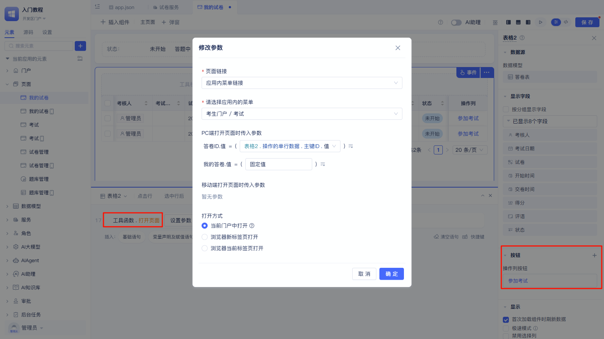
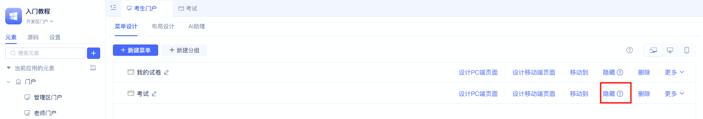

# 用全代码实现答卷页面

## 案例效果

<VideoPlayer relatePath="/docs/tutorial/code_effect.mp4" />

## 实现过程

### 创建门户

前面的题库、出卷、阅卷都是面向老师设计的功能。我们将「使用者门户」重命名为「老师门户」。

同时，创建一个新门户「考生门户」，用于考生答卷、看试卷成绩。 操作如下：

import VideoPlayer from '@site/src/components/VideoPlayer';

<VideoPlayer relatePath="/docs/tutorial/code_create_shell.mp4" />

阅读[门户导航设计](../../devguide/shell-and-page/portal-navigation-design)了解更多。

### 实现「答卷页面」

创建页面变量「试卷ID」，并允许通过Url传递值；

创建页面变量「试卷」，在页面加载后，通过试卷ID获取试卷详情存储到试卷变量。

<VideoPlayer relatePath="/docs/tutorial/code_page_var.mp4" />

然后拖入全代码组件，全代码实现考试页面。

<VideoPlayer relatePath="/docs/tutorial/code_component.mp4" />

阅读[全代码组件](../../devguide/using-functional-components-in-pages/full-code-components)了解更多。

也可以直接整个页面，都使用全代码实现。 阅读[全代码页面开发](../../devguide/shell-and-page/full-code-page-development)了解更多。

### 实现「我的试卷」页面

展示我的所有试卷，如果未开始，则点击「立即考试」，打开考试页面。

注意：在门户中隐藏「答卷」页面，仅允许通过「我的试卷」中点击跳转过去。

