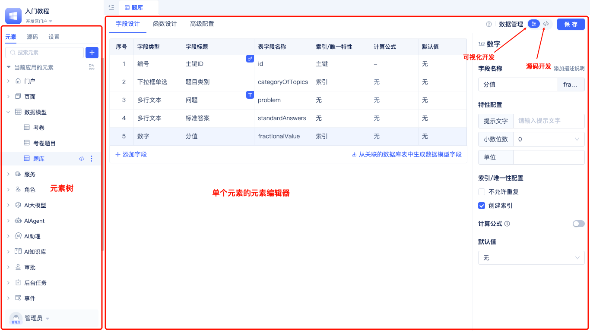
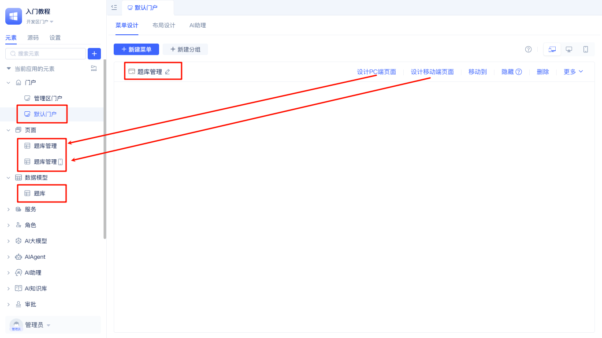
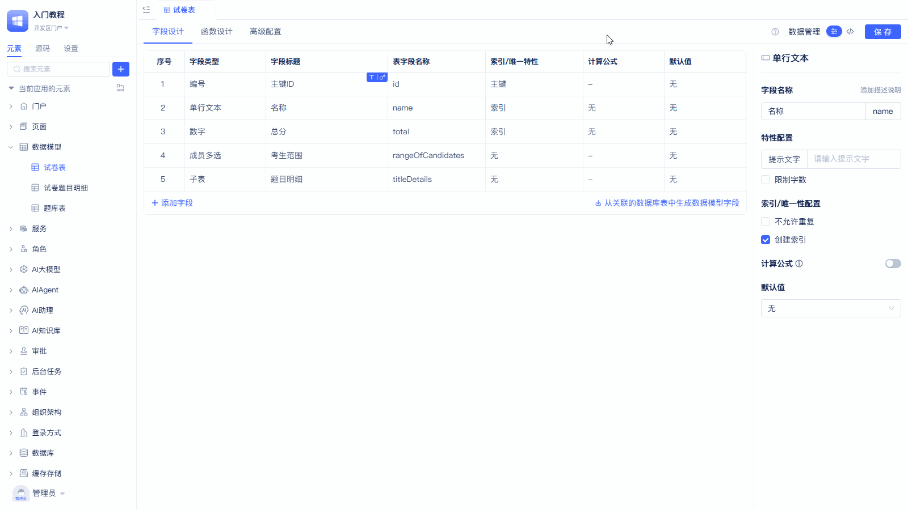
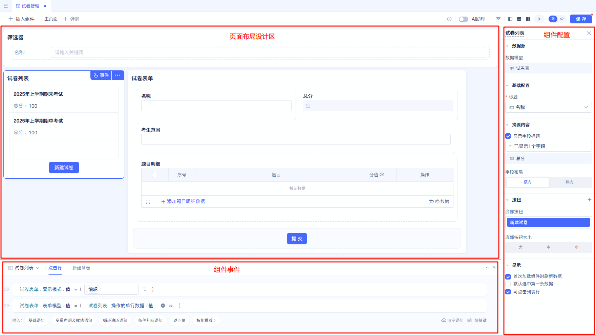
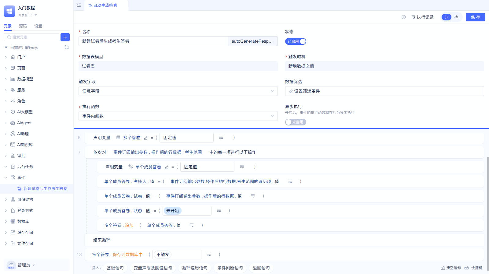

# 用专业模式搭建试卷管理

## 专业模式简介

专业模式指的是「开发者门户」。

Jit应用是由元素组成的，通过对元素的增删改实现应用的开发。元素，就是一个模块。元素修改，也就是对该元素模块的开发。

Jit应用层的元素模块

* 大部分是编排式的结构或者参数定义，可以通过可视化界面（元素编辑器）配置出来，
* 有少部分是编程式的处理过程逻辑编 写，可以用代码来编写，也可以用Jit提供的编程式的元素编辑器来可视化编程。

所以开发者门户就是展示元素树，以及每个元素的编辑器（包含可视化开发编辑器，和源码开发编辑器）

阅读[JitAi可视化开发工具](../../devguide/development-tool-and-publish-service/jitai-visual-development-tools)了解更多。

回顾上一步[用简易模式搭建题库管理](./easy_mode)，切换到专业模式后，可以在「开发者门户」中对应了：

* 使用者门户中菜单「题库管理」
* 「题库表」数据模型
* 「题库管理」PC端页面、移动端页面

这里先简单介绍下最核心、最基础的几个元素：

* 门户，是面向一个特定场景的一组页面的集合。例如：我们可以考生创建一个「考生门户」、为老师创建一个「老师门户」。点击门户中的菜单，会打开其配置的页面。阅读[门户导航设计](../../devguide/shell-and-page/portal-navigation-design)了解更多。
* 页面，即前端看到和操作的界面。
* 数据模型，类似于Excel表，且内置了增删改查的接口，方便页面直接读写数据。阅读[数据建模](../../devguide/data-modeling/data-table-model)了解更多。
* 服务，是面向一个特定业务场景的一组接口。当数据模型内置的增删改查接口满足不了需求时，就可以通过服务来扩展其他接口。阅读[创建服务元素](../../devguide/business-logic-development/creating-service-elements)了解更多。
* 后端事件，通过后端事件触发，实现多个模型业务之间的数据流转。例如：创建试卷后，为每个考生自动创建一份答卷。阅读[事件处理](../../devguide/business-logic-development/event-handling)了解更多。

## 案例效果

import VideoPlayer from '@site/src/components/VideoPlayer';

<VideoPlayer relatePath="/docs/tutorial/ide_mode_effect.mp4" />

## 实现过程

### 创建数据模型

首先分析业务场景，思考数据结构，确定数据模型。例如「试卷管理」其背后，需要2个数据模型来存储：试卷表、试卷题目明细表。

具体操作步骤如下所示：

<VideoPlayer relatePath="/docs/tutorial/ide_mode_create_table.mp4" />

注意：设置合理的数据标题，有利于通过「数据标题」定位到某一行数据。支持随时重新设置数据标题。

### 创建菜单和页面

现在使用一种更灵活的页面类型（常规页面）来创建「试卷管理」页面

#### 常规页面简介

页面由组件组成，可灵活调整组件布局，实现整体界面排版自由。
组件对接数据模型已经内置好对模型的数据读写，通过组件详情配置实现局部的定制自由。
组件之间可以配置组件事件、调用其他组件的函数，从而实现组件之间的交互联动自由。
阅读[组件化页面开发](../../devguide/shell-and-page/component-based-page-development)了解更多。

#### 实现组件之间的联动

<VideoPlayer relatePath="/docs/tutorial/ide_mode_page_design.mp4" />

#### 表单内部实现计算逻辑

<VideoPlayer relatePath="/docs/tutorial/ide_mode_page_form.mp4" />

也可以切换到源码模式直接写代码

<VideoPlayer relatePath="/docs/tutorial/ide_mode_code.mp4" />

### 通过服务函数实现算法出题

这里演示最简单的场景。同上，也支持源码模式去全代码实现更复杂的逻辑。

<VideoPlayer relatePath="/docs/tutorial/ide_mode_func.mp4" />

### 通过后端事件实现自动创建答卷

事件配置如下所示
